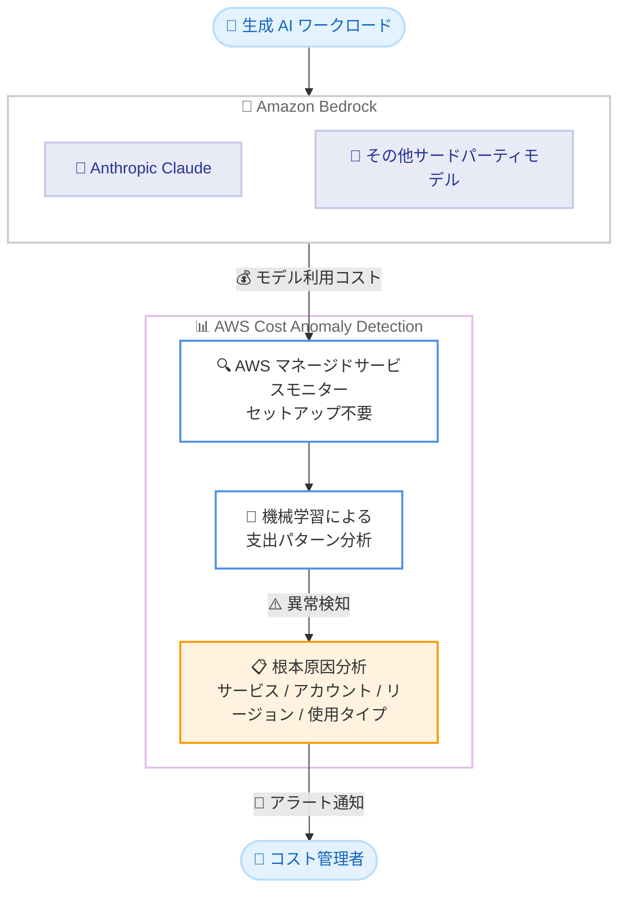

# AWS Cost Anomaly Detection - Amazon Bedrock サードパーティモデルのコスト異常検知サポート

**リリース日**: 2026 年 8 月 19 日
**サービス**: AWS Cost Anomaly Detection
**機能**: Amazon Bedrock 上のサードパーティ基盤モデルに対するコスト異常検知

📊 [このアップデートのインフォグラフィックを見る](https://takech9203.github.io/aws-news-summary/20260819-aws-cost-anomaly-detection-bedrock-3P.html)

## 概要

AWS Cost Anomaly Detection が、Amazon Bedrock 上で実行されるサードパーティ基盤モデル (Anthropic Claude などのプロバイダーホスト型モデル) の支出を監視できるようになりました。Cost Anomaly Detection は機械学習を使用して異常な支出を検出・通知するサービスであり、今回のリリースにより、その監視対象が Amazon Bedrock 上のサードパーティモデル利用にも拡張されます。

本番環境で生成 AI ワークロードを運用しているチームは、他の AWS コストと同様に、Amazon Bedrock のモデル支出に対する自動異常検知を利用できるようになります。追加のセットアップは不要で、既存の AWS マネージドサービスモニターを通じて、サードパーティモデルのコストが自動的に評価されます。

モデルへの支出が予期せず変化した場合、アラートとともに、AWS サービス、アカウント、リージョン、使用タイプごとに金額インパクト順でランク付けされた根本原因の内訳が提供されます。これにより、生成 AI のコスト変化を他の AWS 支出と同じ速さで把握し、対応できます。

**アップデート前の課題**

このアップデート以前は、Amazon Bedrock のサードパーティモデル支出の監視に以下の課題がありました。

- Amazon Bedrock 上のサードパーティモデル (Claude など) の支出は Cost Anomaly Detection の自動監視の対象外だった
- 生成 AI ワークロードのコスト急増を検知するには、予算アラートや手動でのコスト確認など別の仕組みが必要だった
- トークン使用量の増加やモデル切り替えによる想定外のコスト増を、事後のコスト確認で初めて把握するケースがあった

**アップデート後の改善**

今回のアップデートにより、以下が可能になりました。

- Amazon Bedrock 上のサードパーティモデル支出が、AWS マネージドサービスモニターで自動的に異常検知の対象になった
- 追加のセットアップなしで、生成 AI ワークロードのコスト異常アラートを受け取れるようになった
- 異常検知時に、AWS サービス、アカウント、リージョン、使用タイプごとの金額インパクト順の根本原因分析が提供されるようになった

## アーキテクチャ図



Amazon Bedrock 上のサードパーティモデル利用コストが AWS マネージドサービスモニターに自動的に取り込まれ、機械学習による異常検知と金額インパクト順の根本原因分析を経て、コスト管理者にアラートが通知される流れを示しています。

## サービスアップデートの詳細

### 主要機能

1. **サードパーティモデル支出の自動監視**
   - Amazon Bedrock 上の Anthropic Claude をはじめとするプロバイダーホスト型モデルの支出が監視対象に追加
   - 既存の AWS マネージドサービスモニターを通じて自動的に評価される
   - 追加のセットアップは不要 (No setup required)

2. **機械学習ベースの異常検知**
   - 過去の支出パターンを機械学習で学習し、異常な支出変化を検出
   - モデル支出が予期せず変化した場合にアラートを送信
   - 他の AWS サービスのコスト異常検知と同じ仕組みで一元的に監視

3. **金額インパクト順の根本原因分析**
   - 異常検知時に、根本原因の内訳を金額インパクト順にランク付けして提供
   - AWS サービス、アカウント、リージョン、使用タイプの軸で分析
   - 生成 AI のコスト変化を他の AWS 支出と同じ速度で把握・対応可能

## 技術仕様

### 監視対象と提供内容

| 項目 | 詳細 |
|------|------|
| 監視対象 | Amazon Bedrock 上のサードパーティ基盤モデルの支出 (Anthropic Claude などのプロバイダーホスト型モデル) |
| 監視方法 | AWS マネージドサービスモニター (自動評価、セットアップ不要) |
| 検知方式 | 機械学習による支出パターン分析 |
| 分析軸 | AWS サービス、アカウント、リージョン、使用タイプ |
| 分析結果 | 金額インパクト順にランク付けされた根本原因の内訳 |
| 通知 | 異常検知時のアラート (既存のアラートサブスクリプション設定に従う) |

## 設定方法

### 前提条件

1. AWS アカウントで AWS Cost Anomaly Detection が有効化されていること (Cost Explorer 有効化アカウントでは AWS サービスモニターが自動作成される)
2. Amazon Bedrock でサードパーティモデルを利用していること
3. アラート通知を受け取る場合は、アラートサブスクリプション (E メール、Amazon SNS など) が設定されていること

### 手順

#### ステップ1: 既存のモニターを確認する

```bash
aws ce get-anomaly-monitors
```

現在設定されているコスト異常検知モニターの一覧を取得します。`DIMENSIONAL` タイプで `SERVICE` ディメンションのモニター (AWS サービスモニター) が存在すれば、Amazon Bedrock のサードパーティモデル支出は自動的に監視対象に含まれます。追加設定は不要です。

#### ステップ2: 検出された異常を確認する

```bash
aws ce get-anomalies \
  --date-interval StartDate=2026-08-01,EndDate=2026-08-19
```

指定した期間に検出されたコスト異常の一覧を取得します。各異常には、根本原因 (サービス、アカウント、リージョン、使用タイプ) と金額インパクトが含まれるため、Amazon Bedrock 関連の異常を特定できます。

#### ステップ3: アラートサブスクリプションを確認・設定する

```bash
aws ce get-anomaly-subscriptions
```

異常検知時の通知設定を確認します。通知先が未設定の場合は、マネジメントコンソールの [Billing and Cost Management] - [Cost Anomaly Detection] からアラートサブスクリプションを作成し、通知頻度 (個別アラート、日次サマリー、週次サマリー) と通知先を設定します。

## メリット

### ビジネス面

- **生成 AI コストの可視性向上**: 本番環境の生成 AI ワークロードの支出異常を自動検知でき、想定外のコスト増を早期に把握できる
- **対応スピードの向上**: 金額インパクト順の根本原因分析により、どのアカウント・リージョン・使用タイプが原因かを即座に特定し、迅速に対応できる
- **追加コストなしの導入**: セットアップ不要で既存のモニターに自動適用されるため、導入・運用の負担がない

### 技術面

- **一元的なコスト監視**: Amazon Bedrock のモデル支出を他の AWS サービスと同じ Cost Anomaly Detection の仕組みで一元管理できる
- **機械学習による精度**: 静的なしきい値ではなく、支出パターンを学習した機械学習モデルによる検知のため、季節性や成長トレンドを考慮した異常検知が可能
- **セットアップ不要**: AWS マネージドサービスモニターに自動的に組み込まれるため、追加の設定作業やインフラ変更が不要

## デメリット・制約事項

### 制限事項

- AWS GovCloud および中国リージョンでは利用できない
- 監視対象は AWS マネージドサービスモニターを通じた評価であり、異常検知には過去の支出パターンの学習期間が必要

### 考慮すべき点

- 異常検知は事後的な仕組みであるため、コストの上限を強制するものではない (ハードリミットが必要な場合は別途対策が必要)
- 新規に Amazon Bedrock の利用を開始した直後は支出履歴が少ないため、検知精度が安定するまで時間がかかる可能性がある
- アラートを受け取るには、アラートサブスクリプションの設定 (通知先、しきい値) を適切に行う必要がある

## ユースケース

### ユースケース1: 本番生成 AI アプリケーションのコスト急増検知

**シナリオ**: Claude を利用したチャットアプリケーションを本番運用しており、ユーザー数の急増やプロンプトの肥大化により、トークン消費が想定を超えて増加した。

**実装例**:
```text
1. AWS サービスモニター (自動作成済み) が Bedrock のサードパーティモデル支出を継続監視
2. 支出が過去のパターンから逸脱すると異常として検知
3. アラートで通知を受け、根本原因分析でリージョン・使用タイプを確認
4. プロンプト最適化やキャッシュ導入などの対策を実施
```

**効果**: 月末の請求で初めて気づくのではなく、支出変化の発生後すみやかに異常を把握し、コスト最適化のアクションを取れる。

### ユースケース2: マルチアカウント環境での生成 AI コストガバナンス

**シナリオ**: AWS Organizations 配下の複数アカウントで各開発チームが Amazon Bedrock を利用しており、組織全体で生成 AI コストを統制したい。

**実装例**:
```text
1. 管理アカウント (または委任アカウント) で Cost Anomaly Detection を利用
2. 組織全体の Bedrock サードパーティモデル支出を自動監視
3. 異常検知時に、根本原因分析でどのアカウントが原因かを特定
4. 該当チームに通知し、利用状況の確認・是正を依頼
```

**効果**: アカウントごとに個別の監視を構築することなく、組織横断で生成 AI コストの異常をアカウント単位まで特定できる。

### ユースケース3: モデル切り替え・新機能リリース時のコスト影響監視

**シナリオ**: 利用するモデルをより高性能なモデルに切り替えた、または新しい AI 機能をリリースした際に、コストへの影響を監視したい。

**実装例**:
```text
1. モデル切り替えや新機能リリースを実施
2. Cost Anomaly Detection が支出パターンの変化を自動評価
3. 想定を超えるコスト増があればアラートで検知
4. 使用タイプ別の内訳から、入出力トークン単価の影響などを分析
```

**効果**: リリース後のコスト影響を自動監視でき、想定外のコスト構造の変化を早期に発見できる。

## 料金

AWS Cost Anomaly Detection は追加料金なしで利用できます。今回のアップデートによる Amazon Bedrock サードパーティモデル支出の監視についても、追加のセットアップや費用は不要です。

なお、アラート通知に Amazon SNS を使用する場合は、Amazon SNS の標準料金が適用されます。

## 利用可能リージョン

AWS GovCloud (US) および中国リージョンを除く、すべての AWS 商用リージョンで利用可能です。

## 関連サービス・機能

- **Amazon Bedrock**: 監視対象となるサードパーティ基盤モデル (Anthropic Claude など) を提供するフルマネージド生成 AI サービス
- **AWS Cost Explorer**: コストの詳細分析に使用。異常検知後の深掘り調査に活用できる
- **AWS Budgets**: 予算ベースのしきい値アラート。Cost Anomaly Detection の機械学習ベース検知と補完関係にある
- **Amazon SNS**: 異常検知アラートの通知先として利用可能。Slack や Chatbot 連携にも活用できる

## 参考リンク

- 📊 [インフォグラフィック](https://takech9203.github.io/aws-news-summary/20260819-aws-cost-anomaly-detection-bedrock-3P.html)
- [公式発表 (What's New)](https://aws.amazon.com/about-aws/whats-new/2026/08/aws-cost-anomaly-detection-bedrock-3P/)
- [ドキュメント: Detecting unusual spend with AWS Cost Anomaly Detection](https://docs.aws.amazon.com/cost-management/latest/userguide/manage-ad.html)
- [AWS Cost Anomaly Detection 製品ページ](https://aws.amazon.com/aws-cost-management/aws-cost-anomaly-detection/)

## まとめ

AWS Cost Anomaly Detection が Amazon Bedrock 上のサードパーティ基盤モデルの支出監視に対応し、生成 AI ワークロードのコスト異常をセットアップ不要で自動検知できるようになりました。本番環境で Amazon Bedrock を利用しているチームは、既存のモニターで自動的に監視が始まるため、アラートサブスクリプションの通知先としきい値が適切に設定されているかを確認することを推奨します。
