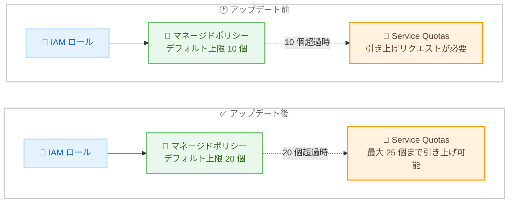

# AWS IAM - ロールあたりのマネージドポリシーのデフォルトクォータを 20 個に引き上げ

**リリース日**: 2026 年 8 月 19 日
**サービス**: AWS Identity and Access Management (IAM)
**機能**: ロールあたりに添付可能なマネージドポリシー数のデフォルトクォータ引き上げ

📊 [このアップデートのインフォグラフィックを見る](https://takech9203.github.io/aws-news-summary/20260819-aws-iam-quota-increase.html)

## 概要

AWS Identity and Access Management (IAM) において、1 つの IAM ロールに添付できるマネージドポリシーのデフォルトクォータが、従来の 10 個から 20 個に引き上げられました。この変更はアカウント内のすべての IAM ロールに自動的に適用され、ユーザー側での対応は一切不要です。

この引き上げにより、権限を目的別のポリシーに分離するという IAM のベストプラクティスに従う場合や、追加のマネージドポリシーの添付を必要とする AWS パートナー製品を導入する場合に、Service Quotas への引き上げリクエストを行う必要性が減少します。20 個を超えるポリシーが必要な場合は、Service Quotas を通じて最大 25 個までクォータ引き上げをリクエストできます。

権限管理を細かく分割して運用している組織や、複数のサードパーティ製品を統合している環境では、クォータ上限への到達がロール設計上の制約となっていました。今回のアップデートは、そのような環境での運用負荷を軽減する改善です。

**アップデート前の課題**

このアップデート以前は、以下の課題や制限がありました。

- 以前はロールあたりのマネージドポリシー数のデフォルトクォータが 10 個であり、ポリシーを目的別に分離するベストプラクティスに従うと上限に到達しやすかった
- 以前は追加のマネージドポリシー添付を必要とする AWS パートナー製品の導入時に、クォータ上限が障害となることがあった
- 以前は 10 個を超えるポリシーを添付するために、Service Quotas での引き上げリクエストと承認待ちが必要だった

**アップデート後の改善**

今回のアップデートにより、以下が可能になりました。

- デフォルトで 1 ロールあたり 20 個までマネージドポリシーを添付できるようになった
- 既存および新規のすべての IAM ロールに自動適用されるため、設定変更や申請作業が不要になった
- 20 個を超える場合も、Service Quotas 経由で最大 25 個まで引き上げをリクエストできる

## アーキテクチャ図



アップデート前後のクォータ構成の比較です。デフォルト上限が 10 個から 20 個に倍増し、Service Quotas 経由の引き上げ上限も最大 25 個となりました。

## サービスアップデートの詳細

### 主要機能

1. **デフォルトクォータの引き上げ**
   - 1 つの IAM ロールに添付できるマネージドポリシーの数が、デフォルトで 10 個から 20 個に引き上げ
   - AWS マネージドポリシーとカスタマーマネージドポリシーの両方が対象
   - 既存のロールと新規作成するロールの両方に適用

2. **自動適用**
   - アカウント内のすべての IAM ロールに自動的に適用
   - ユーザー側での設定変更、申請、オプトインは不要

3. **さらなる引き上げオプション**
   - 20 個を超えるポリシーが必要な場合は、Service Quotas を通じて引き上げをリクエスト可能
   - 引き上げ後の上限は最大 25 個

## 技術仕様

### クォータの変更内容

| 項目 | アップデート前 | アップデート後 |
|------|----------------|----------------|
| ロールあたりのマネージドポリシー数 (デフォルト) | 10 個 | 20 個 |
| Service Quotas による引き上げ上限 | 20 個 | 25 個 |
| 適用対象 | - | すべての既存・新規 IAM ロール |
| ユーザー側の対応 | - | 不要 (自動適用) |

### クォータの確認方法

```bash
# 現在のクォータ値を確認 (Service Quotas API)
aws service-quotas get-service-quota \
  --service-code iam \
  --quota-code L-0DA4ABF3
```

Service Quotas API を使用して、「Managed policies per role」のクォータ値を確認するコマンドの例です。IAM のクォータはグローバルであるため、リージョンは us-east-1 を指定して実行します。

## 設定方法

### 前提条件

1. AWS アカウントを保有していること
2. IAM ロールおよびポリシーを操作する権限があること
3. 25 個までの引き上げを行う場合は、Service Quotas へのアクセス権限があること

### 手順

#### ステップ 1: 現在のポリシー添付状況の確認

```bash
# ロールに添付されているマネージドポリシーの一覧を確認
aws iam list-attached-role-policies \
  --role-name MyExampleRole
```

指定したロールに現在添付されているマネージドポリシーの一覧を取得するコマンドです。添付数が新しいデフォルト上限 (20 個) に対してどの程度かを確認できます。

#### ステップ 2: 追加ポリシーの添付

```bash
# マネージドポリシーをロールに添付
aws iam attach-role-policy \
  --role-name MyExampleRole \
  --policy-arn arn:aws:iam::123456789012:policy/MyPurposeSpecificPolicy
```

マネージドポリシーをロールに添付するコマンドです。今回のアップデートにより、デフォルトで 20 個まで添付できます。

#### ステップ 3: 20 個を超える場合のクォータ引き上げリクエスト

```bash
# Service Quotas で引き上げをリクエスト (最大 25 個)
aws service-quotas request-service-quota-increase \
  --service-code iam \
  --quota-code L-0DA4ABF3 \
  --desired-value 25
```

20 個を超えるポリシーが必要な場合に、Service Quotas を通じて最大 25 個までの引き上げをリクエストするコマンドです。

## メリット

### ビジネス面

- **運用負荷の軽減**: クォータ引き上げリクエストの申請・承認待ちが不要になり、権限設計の変更を迅速に実施できる
- **パートナー製品導入の円滑化**: 追加のマネージドポリシー添付を必要とする AWS パートナー製品を、クォータを気にせず導入しやすくなる
- **追加コストなし**: クォータ引き上げは自動適用であり、追加料金は発生しない

### 技術面

- **ベストプラクティスの実践が容易に**: 権限を目的別のポリシーに分離する設計を、デフォルトクォータの範囲内で実現しやすくなる
- **ポリシーの再利用性向上**: 大きな単一ポリシーに統合する代わりに、細分化されたポリシーを複数のロールで再利用する設計を採用しやすくなる
- **既存環境への影響なし**: 自動適用のため、既存のロールやポリシーに変更を加える必要がない

## デメリット・制約事項

### 制限事項

- クォータ引き上げの対象はマネージドポリシーの添付数であり、ポリシー自体のサイズ制限 (マネージドポリシーは 6,144 文字) は変更されない
- Service Quotas による引き上げ後の上限は最大 25 個であり、それを超える添付はできない
- ロールが引き受け可能なセッションポリシーなど、その他の IAM クォータは今回の変更の対象外

### 考慮すべき点

- 添付可能なポリシー数が増えても、最小権限の原則に従い、不要な権限を付与しない設計を維持することが重要
- ポリシー数の増加により権限の全体像が把握しにくくなる場合は、IAM Access Analyzer などで権限の可視化・検証を行うことを推奨
- 25 個でも不足する場合は、ポリシーの統合やインラインポリシーの活用など、権限設計の見直しが必要

## ユースケース

### ユースケース 1: 目的別ポリシー分離によるガバナンス強化

**シナリオ**: 大規模組織で、データアクセス、ログ出力、監視、暗号化キー利用など、目的ごとにポリシーを分離して管理したい。従来はデフォルト上限 10 個が制約となり、ポリシーを統合せざるを得なかった。

**実装例**:
```bash
# 目的別に分離したポリシーを順次添付
aws iam attach-role-policy --role-name AppServerRole \
  --policy-arn arn:aws:iam::123456789012:policy/S3DataAccessPolicy
aws iam attach-role-policy --role-name AppServerRole \
  --policy-arn arn:aws:iam::123456789012:policy/CloudWatchLogsPolicy
aws iam attach-role-policy --role-name AppServerRole \
  --policy-arn arn:aws:iam::123456789012:policy/KmsDecryptPolicy
```

**効果**: 目的別ポリシーの分離により、権限の見通しが良くなり、変更時の影響範囲を最小化できる。デフォルトで 20 個まで添付できるため、クォータ引き上げの申請が不要。

### ユースケース 2: AWS パートナー製品の導入

**シナリオ**: セキュリティ監視やコスト管理などの複数の AWS パートナー製品を導入しており、各製品が専用のマネージドポリシーの添付を必要とする。既存の業務用ポリシーと合わせるとデフォルト上限 10 個を超過していた。

**実装例**:
```bash
# パートナー製品が必要とするポリシーを既存ロールへ追加
aws iam attach-role-policy --role-name IntegrationRole \
  --policy-arn arn:aws:iam::123456789012:policy/PartnerProductMonitoringPolicy
```

**効果**: クォータ引き上げリクエストなしでパートナー製品を導入でき、導入リードタイムを短縮できる。

### ユースケース 3: 共通ポリシーの再利用による管理標準化

**シナリオ**: 組織全体で共通のベースラインポリシー (監査ログ、タグ強制、リージョン制限など) を全ロールに添付しつつ、ロール固有のポリシーも複数添付したい。

**実装例**:
```bash
# 組織共通のベースラインポリシーとロール固有ポリシーを併用
aws iam attach-role-policy --role-name ProjectRole \
  --policy-arn arn:aws:iam::123456789012:policy/OrgBaselinePolicy
aws iam attach-role-policy --role-name ProjectRole \
  --policy-arn arn:aws:iam::123456789012:policy/ProjectSpecificPolicy
```

**効果**: 共通ポリシーの一元管理とロール固有権限の柔軟な付与を両立でき、権限管理の標準化と保守性が向上する。

## 料金

AWS IAM は無料で利用できるサービスであり、今回のクォータ引き上げに伴う追加料金は発生しません。Service Quotas によるクォータ引き上げリクエストにも料金はかかりません。

## 利用可能リージョン

以下のリージョンで利用可能です。

- すべての商用 AWS リージョン
- AWS GovCloud (US)
- 中国リージョン

## 関連サービス・機能

- **AWS Service Quotas**: 20 個を超えるポリシーが必要な場合に、最大 25 個までの引き上げをリクエストするために使用
- **IAM Access Analyzer**: 添付ポリシー数の増加に伴う権限の可視化・検証に活用でき、最小権限の実現を支援
- **AWS Organizations (SCP)**: マネージドポリシーと組み合わせて、組織全体の権限ガードレールを構成

## 参考リンク

- 📊 [インフォグラフィック](https://takech9203.github.io/aws-news-summary/20260819-aws-iam-quota-increase.html)
- [公式発表 (What's New)](https://aws.amazon.com/about-aws/whats-new/2026/08/aws-iam-quota-increase/)
- [IAM および AWS STS のクォータ (IAM ユーザーガイド)](https://docs.aws.amazon.com/IAM/latest/UserGuide/reference_iam-quotas.html)
- [クォータ引き上げリクエストの手順 (Service Quotas ユーザーガイド)](https://docs.aws.amazon.com/servicequotas/latest/userguide/request-quota-increase.html)
- [AWS IAM 製品ページ](https://aws.amazon.com/iam/)

## まとめ

IAM ロールに添付できるマネージドポリシーのデフォルトクォータが 10 個から 20 個に倍増し、すべてのロールに自動適用されました。権限を目的別に分離するベストプラクティスの実践や、パートナー製品の導入がクォータ制約なしで行いやすくなります。ポリシー数の上限を理由に権限を統合していた場合は、目的別ポリシーへの分離を検討することを推奨します。
