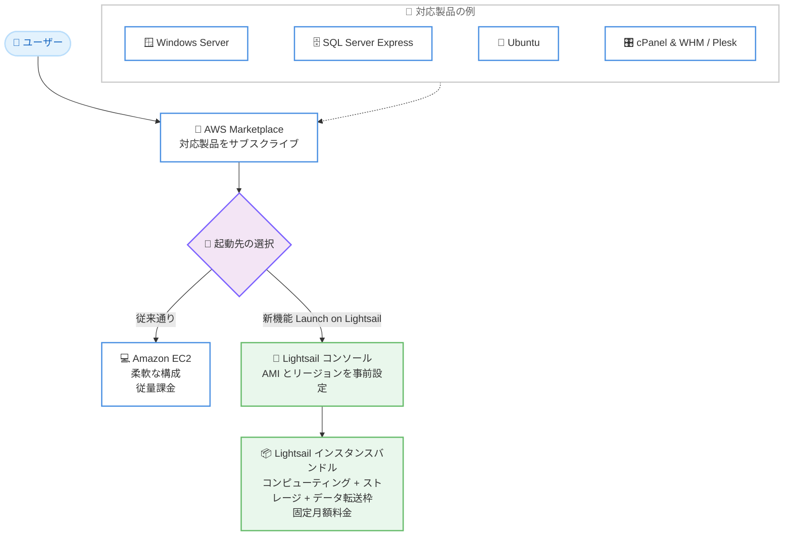

# AWS Marketplace - Amazon Lightsail への AMI 起動サポート

**リリース日**: 2026 年 8 月 19 日
**サービス**: AWS Marketplace / Amazon Lightsail
**機能**: AWS Marketplace AMI の Amazon Lightsail への起動サポート

📊 [このアップデートのインフォグラフィックを見る](https://takech9203.github.io/aws-news-summary/20260819-aws-marketplace-launch-ami-amazon-lightsail.html)

## 概要

AWS Marketplace は、対象となる Amazon マシンイメージ (AMI) を Amazon Lightsail 上で起動するサポートを発表しました。シンプルで予測可能な料金と、簡素化されたインスタンス作成体験を求めるお客様は、対象の AWS Marketplace AMI を数クリックで Amazon Lightsail にデプロイできるようになります。

Lightsail のインスタンスバンドルには、コンピューティング、ストレージ、十分なデータ転送枠が固定月額料金で含まれています。また、Lightsail はマネージドデータベース、コンテナ、ロードバランサーなども提供しており、アプリケーションの成長に合わせたスケールが容易です。

対応する AWS Marketplace 製品 (Microsoft Windows Server、Microsoft SQL Server Express、Ubuntu、cPanel & WHM、Plesk など) をサブスクライブする際、従来の Amazon EC2 に加えて Amazon Lightsail を選択できるようになりました。Lightsail を選択すると、選択した AMI とリージョンが事前設定された状態で Lightsail コンソールに遷移し、予測可能な月額料金で数クリックでデプロイできます。

**アップデート前の課題**

- 以前は AWS Marketplace の AMI 製品は Amazon EC2 でのみ起動でき、Lightsail ユーザーは Marketplace 製品を直接利用できなかった
- Lightsail のシンプルな固定料金モデルを好む小規模ユーザーや初心者が、cPanel & WHM や Plesk などの商用ソフトウェアを使うには、EC2 のインスタンスタイプ、EBS、データ転送料金など複雑な料金体系を理解する必要があった
- Marketplace 製品のデプロイには、VPC、セキュリティグループ、キーペアなど EC2 特有の設定作業が必要だった

**アップデート後の改善**

- 対象の AWS Marketplace AMI を Lightsail 上で数クリックでデプロイできるようになった
- コンピューティング、ストレージ、データ転送枠を含む固定月額料金で Marketplace 製品を利用でき、コストの予測が容易になった
- サブスクライブ時に「Launch on Lightsail」を選択すると、AMI とリージョンが事前設定された Lightsail コンソールに遷移し、セットアップの手間が大幅に削減された

## アーキテクチャ図



AWS Marketplace で対応製品をサブスクライブする際に、従来の Amazon EC2 に加えて Amazon Lightsail を起動先として選択できるようになり、AMI とリージョンが事前設定された Lightsail コンソールから固定月額料金でデプロイできる流れを示しています。

## サービスアップデートの詳細

### 主要機能

1. **「Launch on Lightsail」デプロイオプション**
   - AWS Marketplace の対象製品のサブスクライブ時に、起動先として Amazon EC2 に加えて Amazon Lightsail を選択可能
   - Lightsail を選択すると、選択した AMI とリージョンが事前設定された状態で Lightsail コンソールに遷移
   - 数クリックでインスタンスの作成が完了し、デプロイまでの手順が大幅に簡素化

2. **対応製品**
   - Microsoft Windows Server
   - Microsoft SQL Server Express
   - Ubuntu
   - cPanel & WHM
   - Plesk
   - 上記を含む、対象として認定された AWS Marketplace AMI 製品

3. **Lightsail の固定料金モデルとの統合**
   - Lightsail インスタンスバンドルは、コンピューティング、ストレージ、十分なデータ転送枠を固定月額料金で提供
   - Marketplace 製品を予測可能なコストで運用可能
   - マネージドデータベース、コンテナ、ロードバランサーなど Lightsail の他機能と組み合わせてスケール可能

## 技術仕様

### EC2 起動と Lightsail 起動の比較

| 項目 | Amazon EC2 | Amazon Lightsail |
|------|------------|------------------|
| 料金モデル | 従量課金 (インスタンス、EBS、データ転送が個別課金) | 固定月額料金のバンドル |
| ネットワーク設定 | VPC、サブネット、セキュリティグループの設定が必要 | 簡素化されたネットワーク設定 |
| インスタンス作成 | AMI 選択、インスタンスタイプ、各種設定を個別に指定 | AMI とリージョンが事前設定された状態で数クリック |
| 拡張性 | 幅広いインスタンスタイプと構成オプション | マネージドデータベース、コンテナ、ロードバランサーなどで拡張 |
| 主な対象ユーザー | 詳細な構成管理が必要なワークロード | シンプルさとコスト予測性を重視するユーザー |

## 設定方法

### 前提条件

1. AWS アカウントを保有していること
2. デプロイ先のリージョンで Amazon Lightsail が利用可能であること
3. 利用したい製品が「Launch on Lightsail」対応製品であること

### 手順

#### ステップ 1: AWS Marketplace で対応製品を検索

[AWS Marketplace](https://aws.amazon.com/marketplace) にアクセスし、Windows Server、Ubuntu、cPanel & WHM、Plesk などの対応製品を検索します。

#### ステップ 2: 製品をサブスクライブし、Lightsail を選択

製品ページからサブスクライブを実行します。起動オプションとして Amazon EC2 に加えて Amazon Lightsail が表示されるため、Lightsail を選択します。

#### ステップ 3: Lightsail コンソールでインスタンスを作成

Lightsail コンソールに遷移すると、選択した AMI とリージョンが事前設定されています。インスタンスプラン (バンドル) を選択し、インスタンス名を指定して作成します。

```bash
# 作成後のインスタンス確認 (AWS CLI)
aws lightsail get-instances --region ap-northeast-1
```

AWS CLI の `get-instances` コマンドで、作成した Lightsail インスタンスの状態、IP アドレス、バンドル情報を確認できます。

## メリット

### ビジネス面

- **コストの予測可能性**: コンピューティング、ストレージ、データ転送枠を含む固定月額料金により、月々のコストを事前に把握可能
- **商用ソフトウェアの導入障壁の低減**: cPanel & WHM や Plesk などの商用製品を、複雑な料金計算なしに小規模から導入可能
- **スモールスタートの促進**: Web ホスティング事業者や小規模ビジネスが、最小限の学習コストで Marketplace 製品を活用可能

### 技術面

- **デプロイの簡素化**: AMI とリージョンが事前設定された状態で Lightsail コンソールに遷移し、数クリックでデプロイが完了
- **運用負荷の軽減**: VPC やセキュリティグループなどの詳細設定が不要で、Lightsail の簡素化された管理画面で運用可能
- **成長に応じた拡張**: Lightsail のマネージドデータベース、コンテナ、ロードバランサーと組み合わせてアプリケーションをスケール可能

## デメリット・制約事項

### 制限事項

- 対応するのは AWS Marketplace の「対象 (eligible)」製品のみで、すべての AMI 製品が Lightsail で起動できるわけではない
- 利用可能なリージョンは Lightsail が提供されているリージョンに限定される
- Lightsail のインスタンスバンドルは EC2 と比較して構成の選択肢が限られる

### 考慮すべき点

- 大規模なワークロードや詳細なネットワーク制御が必要な場合は、引き続き EC2 での起動が適している
- ソフトウェアライセンス料金はバンドル料金とは別に発生する場合があるため、各製品の料金体系を確認する必要がある
- 将来的に EC2 への移行が必要になる場合の移行パスを事前に検討しておくことが望ましい

## ユースケース

### ユースケース 1: cPanel & WHM による Web ホスティング環境の構築

**シナリオ**: 小規模な Web 制作会社が、複数の顧客サイトを管理するためのホスティング環境を低コストかつ予測可能な料金で構築したい。

**実装例**:
```
1. AWS Marketplace で cPanel & WHM を検索してサブスクライブ
2. 起動オプションで Amazon Lightsail を選択
3. 事前設定された Lightsail コンソールでバンドルを選択して作成
4. 静的 IP をアタッチし、DNS ゾーンを設定して運用開始
```

**効果**: EC2 の複雑な設定や従量課金の変動を気にせず、固定月額料金で商用ホスティングパネルを運用できる。

### ユースケース 2: Windows Server 環境のスモールスタート

**シナリオ**: 中小企業が社内アプリケーション用の Windows Server 環境を、最小限の管理負荷で立ち上げたい。

**実装例**:
```
1. AWS Marketplace で Microsoft Windows Server をサブスクライブ
2. Launch on Lightsail オプションを選択
3. 必要なスペックのバンドルを選択してインスタンスを作成
4. RDP でアクセスしてアプリケーションをセットアップ
```

**効果**: ライセンス込みの Windows 環境を数クリックで構築でき、月額コストが明確なため予算管理が容易になる。

### ユースケース 3: SQL Server Express を使った開発・検証環境

**シナリオ**: 開発チームが SQL Server Express を使った検証環境を短時間で用意し、検証終了後は破棄したい。

**実装例**:
```
1. AWS Marketplace で Microsoft SQL Server Express をサブスクライブ
2. Lightsail を起動先として選択し、検証用リージョンでインスタンスを作成
3. 検証完了後はインスタンスを削除してコストを停止
```

**効果**: 検証環境の構築と破棄のサイクルを高速化し、固定料金により検証コストの見積もりが容易になる。

## 料金

Amazon Lightsail のインスタンスバンドルは、コンピューティング、ストレージ、データ転送枠を含む固定月額料金で提供されます。AWS Marketplace 製品のソフトウェア料金は製品ごとに異なり、バンドル料金に加えて課金される場合があります。

- Lightsail バンドル料金の詳細は [Amazon Lightsail 料金ページ](https://aws.amazon.com/lightsail/pricing/) を参照
- 各 Marketplace 製品のソフトウェア料金は、AWS Marketplace の製品ページを参照

## 利用可能リージョン

「Launch on Lightsail」デプロイオプションは、Amazon Lightsail が利用可能なすべての AWS リージョン (東京リージョンを含む) の対象製品で利用できます。詳細は [Lightsail のリージョンとアベイラビリティーゾーン](https://docs.aws.amazon.com/lightsail/latest/userguide/understanding-regions-and-availability-zones-in-amazon-lightsail.html) を参照してください。

## 関連サービス・機能

- **Amazon EC2**: 従来からの AWS Marketplace AMI の起動先。詳細な構成管理が必要な場合に選択
- **Amazon Lightsail マネージドデータベース**: Lightsail 上のアプリケーションと組み合わせて利用できるマネージド MySQL / PostgreSQL
- **Amazon Lightsail ロードバランサー / コンテナ**: アプリケーションの成長に応じたスケールアウトに利用可能
- **AWS Marketplace**: サードパーティー製ソフトウェアやライセンス込み AMI を提供するカタログサービス

## 参考リンク

- 📊 [インフォグラフィック](https://takech9203.github.io/aws-news-summary/20260819-aws-marketplace-launch-ami-amazon-lightsail.html)
- [公式発表 (What's New)](https://aws.amazon.com/about-aws/whats-new/2026/08/aws-marketplace-launch-ami-amazon-lightsail)
- [AWS Marketplace](https://aws.amazon.com/marketplace)
- [Amazon Lightsail 製品ページ](https://aws.amazon.com/lightsail/)
- [Amazon Lightsail 料金ページ](https://aws.amazon.com/lightsail/pricing/)

## まとめ

本アップデートにより、AWS Marketplace の対象 AMI 製品を Amazon Lightsail 上で数クリック・固定月額料金でデプロイできるようになりました。シンプルさとコスト予測性を重視する小規模ユーザーや、cPanel & WHM / Plesk などの商用ソフトウェアを手軽に使いたいユーザーにとって導入障壁が大きく下がります。まずは AWS Marketplace で対応製品を確認し、小規模ワークロードでの活用を検討することを推奨します。
