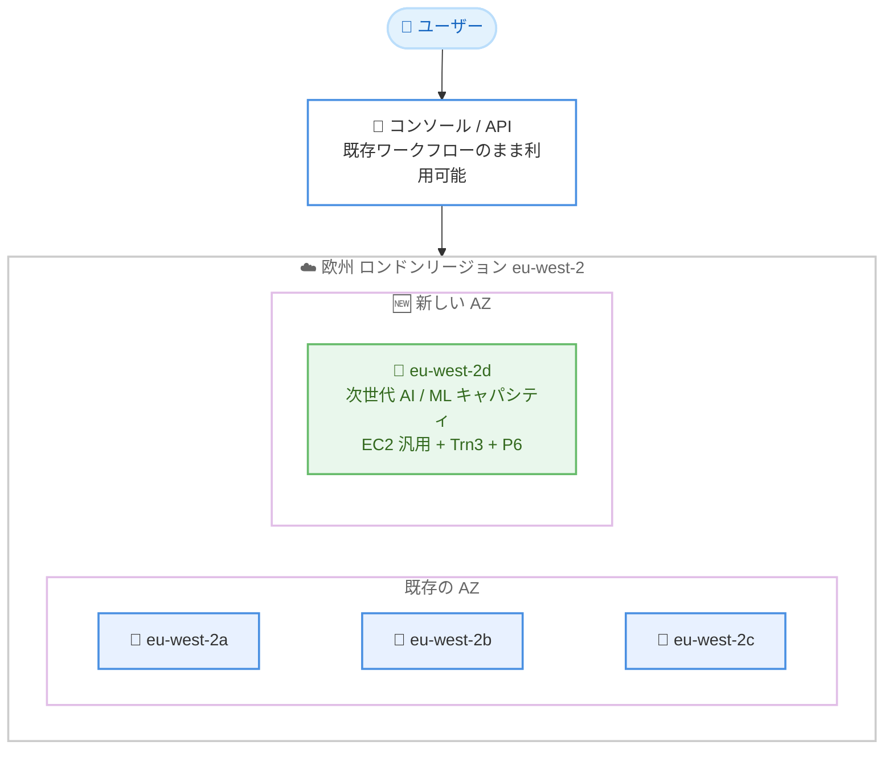

# AWS グローバルインフラストラクチャ - 欧州 (ロンドン) リージョンに新しいアベイラビリティーゾーンを追加

**リリース日**: 2026 年 8 月 19 日
**サービス**: AWS グローバルインフラストラクチャ (Amazon EC2 ほか)
**機能**: 欧州 (ロンドン) リージョン (eu-west-2) における 4 つ目のアベイラビリティーゾーン (eu-west-2d) の追加

📊 [このアップデートのインフォグラフィックを見る](https://takech9203.github.io/aws-news-summary/20260819-aws-new-availability-zone-europe.html)

## 概要

AWS は、欧州 (ロンドン) リージョン (eu-west-2) に 4 つ目のアベイラビリティーゾーン (AZ) となる eu-west-2d を追加したことを発表しました。これにより、ロンドンリージョンは合計 4 つの AZ で構成されることになり、より高い耐障害性と拡張性を備えたアーキテクチャを英国内で構築できるようになります。

新しい AZ の大きな特徴は、次世代の AI / ML 向けキャパシティを提供する点です。Amazon EC2 の汎用インスタンスに加えて、Trn3 (AWS Trainium ベース) や P6 などのアクセラレーテッドインスタンスが利用可能となり、AI / ML チームは最新のアクセラレーテッドインスタンスによるモデルのトレーニングと推論をロンドンリージョン内で完結して実行できます。データレジデンシー要件を持つ英国のお客様にとって、特に価値のある拡張です。

新しい AZ は、AWS マネジメントコンソール、API、既存のワークフローからそのまま利用でき、ツールの変更は不要です。料金はロンドンリージョンの標準料金が適用されます。

**アップデート前の課題**

これまでのロンドンリージョンには、以下のような課題や制約がありました。

- ロンドンリージョンは 3 つの AZ で構成されており、AZ 分散の選択肢が限られていた
- 最新世代のアクセラレーテッドインスタンスによる AI / ML ワークロードを英国内で実行するためのキャパシティに制約があった
- データレジデンシー要件により英国内での処理が必須の場合、大規模なモデルトレーニングや推論のキャパシティ確保が課題となるケースがあった

**アップデート後の改善**

今回のアップデートにより、以下が可能になりました。

- 4 つの AZ を利用した、より高い障害分離とフォールトトレランスを備えたアーキテクチャの構築
- Trn3 や P6 などの次世代アクセラレーテッドインスタンスを含む AI / ML 向けキャパシティの英国内での利用
- モデルのトレーニングから推論までをロンドンリージョン内で完結できるため、データレジデンシー要件への対応が容易に
- ツール変更不要で、既存のコンソール、API、ワークフローからそのまま新 AZ を利用可能

## アーキテクチャ図



ロンドンリージョンは既存の 3 AZ に eu-west-2d が加わり 4 AZ 構成になりました。新 AZ は次世代 AI / ML 向けキャパシティを備え、既存のコンソールや API からそのまま利用できます。

## サービスアップデートの詳細

### 主要機能

1. **4 つ目のアベイラビリティーゾーン eu-west-2d の追加**
   - ロンドンリージョン (eu-west-2) が 3 AZ から 4 AZ 構成に拡張
   - 各 AZ は独立した電源、冷却、物理セキュリティを備え、低レイテンシーの冗長ネットワークで相互接続
   - AZ 間でアプリケーションを分散配置することで、障害分離と高可用性をさらに強化可能

2. **次世代 AI / ML キャパシティの提供**
   - Amazon EC2 の汎用コンピューティングに加え、Trn3 (AWS Trainium ベース) や P6 などのアクセラレーテッドインスタンスを提供
   - 最新のアクセラレーテッドインスタンスによるモデルトレーニングと推論をロンドンリージョン内で完結して実行可能
   - 英国内のデータレジデンシー要件を満たしながら生成 AI ワークロードを展開可能

3. **既存ワークフローからのシームレスな利用**
   - AWS マネジメントコンソール、API、既存のワークフローからツール変更なしで利用可能
   - 料金はロンドンリージョンの標準料金が適用され、追加コストなし

## 技術仕様

### 新しいアベイラビリティーゾーンの概要

| 項目 | 詳細 |
|------|------|
| リージョン | 欧州 (ロンドン) / eu-west-2 |
| 新 AZ | eu-west-2d (リージョン内 4 つ目の AZ) |
| 提供キャパシティ | EC2 汎用コンピューティング、Trn3、P6 などのアクセラレーテッドインスタンス |
| 利用方法 | AWS マネジメントコンソール、API、既存のワークフロー (変更不要) |
| 料金 | ロンドンリージョンの標準料金 |

### AZ 名と AZ ID に関する注意

AZ 名 (例: eu-west-2d) はアカウントごとに物理的な AZ へのマッピングが異なる場合があります。アカウント間で AZ を正確に特定するには AZ ID (例: euw2-az4) を使用してください。

## 設定方法

### 前提条件

1. AWS アカウントを保有していること
2. 欧州 (ロンドン) リージョン (eu-west-2) が有効化されていること (デフォルトで有効)
3. AWS CLI を利用する場合は認証情報が設定済みであること

### 手順

#### ステップ 1: 利用可能な AZ を確認する

```bash
aws ec2 describe-availability-zones \
  --region eu-west-2 \
  --query "AvailabilityZones[].{Name:ZoneName,Id:ZoneId,State:State}" \
  --output table
```

ロンドンリージョンで利用可能な AZ の一覧を表示します。AZ 名、AZ ID、状態を確認し、新しい AZ がアカウントで利用可能であることを確認します。

#### ステップ 2: 新しい AZ でインスタンスタイプの提供状況を確認する

```bash
aws ec2 describe-instance-type-offerings \
  --region eu-west-2 \
  --location-type availability-zone \
  --filters "Name=location,Values=eu-west-2d" \
  --query "InstanceTypeOfferings[].InstanceType" \
  --output table
```

新しい AZ (eu-west-2d) で提供されているインスタンスタイプの一覧を表示します。利用したいインスタンスタイプ (Trn3、P6 など) が提供されているかを確認します。

#### ステップ 3: 新しい AZ にサブネットを作成する

```bash
aws ec2 create-subnet \
  --region eu-west-2 \
  --vpc-id vpc-xxxxxxxxxxxxxxxxx \
  --cidr-block 10.0.4.0/24 \
  --availability-zone eu-west-2d
```

既存の VPC に新しい AZ 用のサブネットを作成します。作成後、Auto Scaling グループやロードバランサーの対象サブネットに追加することで、4 AZ 構成への分散配置が可能になります。

## メリット

### ビジネス面

- **データレジデンシー対応**: AI / ML のトレーニングと推論を英国内で完結でき、英国のデータレジデンシーやコンプライアンス要件に対応しやすくなる
- **事業継続性の向上**: 4 AZ 構成により、AZ 障害時の影響を受けにくい高可用性アーキテクチャを構築できる
- **追加コストなし**: ロンドンリージョンの標準料金がそのまま適用され、新たな料金体系の考慮が不要

### 技術面

- **障害分離の強化**: AZ の選択肢が増えることで、ワークロードの分散配置とフォールトトレランスの設計自由度が向上
- **AI / ML キャパシティの拡大**: Trn3 や P6 などの次世代アクセラレーテッドインスタンスをロンドンリージョンで利用可能
- **移行作業不要**: 既存のコンソール、API、IaC ツールからそのまま新 AZ を利用でき、ツールの変更が不要

## デメリット・制約事項

### 制限事項

- すべてのインスタンスタイプやサービスが新 AZ で即座に提供されるとは限らないため、事前に提供状況の確認が必要
- AZ 名と物理 AZ のマッピングはアカウントごとに異なるため、複数アカウント環境では AZ ID での確認が必要

### 考慮すべき点

- 既存の 3 AZ 前提で設計されたサブネット構成、Auto Scaling グループ、ロードバランサーを 4 AZ 構成へ拡張するには、サブネット追加などの設定変更が必要
- VPC の CIDR 設計によっては、新 AZ 用サブネットの追加に十分な IP アドレス空間があるかの確認が必要
- AZ 間のデータ転送料金は従来どおり発生するため、AZ をまたぐ通信量の多いワークロードではコストへの影響を考慮する

## ユースケース

### ユースケース 1: 英国内で完結する生成 AI モデルのトレーニングと推論

**シナリオ**: 英国の金融機関が、顧客データを英国外に持ち出さずに生成 AI モデルのファインチューニングと推論を行いたい。

**実装例**:
```bash
# ロンドンリージョンの新 AZ で Trn3 インスタンスのキャパシティを確認し、
# トレーニングジョブを英国内で実行
aws ec2 describe-instance-type-offerings \
  --region eu-west-2 \
  --location-type availability-zone \
  --filters "Name=location,Values=eu-west-2d" "Name=instance-type,Values=trn3*"
```

**効果**: データレジデンシー要件を満たしながら、最新のアクセラレーテッドインスタンスで AI / ML ワークロードを実行できる。

### ユースケース 2: 4 AZ 構成による高可用性 Web アプリケーション

**シナリオ**: ミッションクリティカルな Web アプリケーションを運用しており、AZ 障害時の可用性をさらに高めたい。

**実装例**:
```bash
# 新 AZ にサブネットを追加し、Auto Scaling グループの対象に含める
aws autoscaling update-auto-scaling-group \
  --auto-scaling-group-name my-asg \
  --vpc-zone-identifier "subnet-aaa,subnet-bbb,subnet-ccc,subnet-ddd"
```

**効果**: 1 つの AZ に障害が発生しても残り 3 AZ でキャパシティを維持でき、AZ 障害時の縮退幅が 1/3 から 1/4 に低減される。

### ユースケース 3: キャパシティ確保の柔軟性向上

**シナリオ**: 特定のインスタンスタイプのキャパシティ不足 (InsufficientInstanceCapacity) が発生した際の代替 AZ を増やしたい。

**実装例**:
```bash
# 複数 AZ を対象とした EC2 フリートで、キャパシティのある AZ から起動
aws ec2 create-fleet \
  --launch-template-configs file://launch-template-config.json \
  --target-capacity-specification "TotalTargetCapacity=10,DefaultTargetCapacityType=spot"
```

**効果**: 起動先 AZ の選択肢が増えることで、スポットインスタンスの中断リスク低減やオンデマンドキャパシティ確保の成功率向上が期待できる。

## 料金

新しいアベイラビリティーゾーンの利用に追加料金はありません。ロンドンリージョン (eu-west-2) の標準料金がそのまま適用されます。

- EC2 インスタンス、EBS、データ転送などは既存の eu-west-2 の料金体系に準拠
- AZ 間のデータ転送料金は従来どおり適用される点に注意

## 利用可能リージョン

- 欧州 (ロンドン) リージョン (eu-west-2) — 新 AZ の追加により 4 AZ 構成

## 関連サービス・機能

- **Amazon EC2**: 新 AZ で汎用インスタンスおよび Trn3、P6 などのアクセラレーテッドインスタンスを提供
- **AWS Trainium (Trn3 インスタンス)**: 大規模モデルのトレーニングと推論向けの AWS 独自 AI アクセラレーター
- **Amazon VPC**: 新 AZ へのサブネット追加により 4 AZ 構成のネットワークを構築
- **Elastic Load Balancing / Auto Scaling**: 4 AZ にまたがる負荷分散とスケーリングで可用性を強化

## 参考リンク

- 📊 [インフォグラフィック](https://takech9203.github.io/aws-news-summary/20260819-aws-new-availability-zone-europe.html)
- [公式発表 (What's New)](https://aws.amazon.com/about-aws/whats-new/2026/08/aws-new-availability-zone-europe/)
- [AWS グローバルインフラストラクチャ](https://aws.amazon.com/about-aws/global-infrastructure/)
- [リージョン別のサービス提供状況](https://aws.amazon.com/about-aws/global-infrastructure/regional-product-services/)
- [Amazon EC2 Trn3 インスタンス](https://aws.amazon.com/ai/machine-learning/trainium/)

## まとめ

欧州 (ロンドン) リージョンに 4 つ目の AZ (eu-west-2d) が追加され、次世代の AI / ML 向けキャパシティ (Trn3、P6) が英国内で利用可能になりました。データレジデンシー要件を持つ英国のお客様や、可用性をさらに高めたいお客様にとって重要な拡張です。ロンドンリージョンを利用中の場合は、新 AZ でのインスタンス提供状況を確認し、サブネット追加による 4 AZ 構成への拡張を検討することを推奨します。
