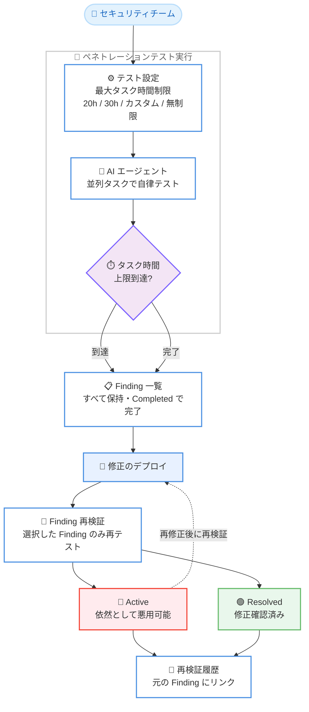

# AWS Security Agent - 予算コントロールと Finding 再検証のサポート

**リリース日**: 2026 年 8 月 19 日
**サービス**: AWS Security Agent (AWS Continuum の一部)
**機能**: 最大タスク時間制限による予算コントロール、Finding 再検証 (Revalidation)

📊 [このアップデートのインフォグラフィックを見る](https://takech9203.github.io/aws-news-summary/20260819-aws-security-agent.html)

## 概要

AWS Security Agent (現在は AWS Continuum の一部) は、AI エージェントが Web アプリケーションの脆弱性を自律的にテストするオンデマンドのペネトレーションテストサービスであり、並列実行されるテストタスク全体で消費された累積タスク時間に基づいて課金されます。今回のアップデートでは、「予算コントロール (最大タスク時間制限)」と「Finding 再検証 (Revalidation)」という 2 つの新機能が追加されました。

1 つ目の予算コントロールでは、任意のペネトレーションテストに対して最大タスク時間の上限を設定できます。プリセット値 (例: 20 時間、30 時間)、カスタム値、または無制限から選択でき、上限に達するとテストは正常に停止し、それまでに発見されたすべての Finding が保持されます。課金は実際に使用されたタスク時間のみに基づくため、上限を高く設定してもテストが追加時間を必要としない限りコストは増加しません。

2 つ目の Finding 再検証では、修正をデプロイした後、ペネトレーションテスト全体を再実行することなく個々の Finding だけを再テストできます。完了したテスト実行から 1 つ以上の Finding を選択すると、AWS Security Agent はライブアプリケーションに対して該当する Finding のみを再テストし、Active (依然として悪用可能) または Resolved (修正確認済み) の明確なステータスを、元の Finding にリンクされた再検証履歴とともに返します。セキュリティチームや DevSecOps エンジニアにとって、コスト管理と修復確認の両面で運用効率が大きく向上するアップデートです。

**アップデート前の課題**

このアップデート以前は、テストコストの管理と修復確認に組み込みの仕組みがありませんでした。

- テストコストに上限を設定する組み込みの方法がなく、大規模なアプリケーションではタスク時間の消費 (= コスト) を事前に制御できなかった
- 脆弱性を修正した後、その修正が有効かどうかを確認するには、ペネトレーションテスト全体を再実行する必要があった
- テスト全体の再実行は時間とタスク時間 (コスト) を余分に消費し、修復サイクルの高速化を妨げていた

**アップデート後の改善**

今回のアップデートにより、コストと修復確認のワークフローが大幅に改善されました。

- 最大タスク時間制限により、テストごとにコストの上限を設定できるようになった (最小 20 時間)
- 上限到達時もテストは正常に停止し、それまでの Finding はすべて保持され、実行は Completed ステータスで完了する
- 修正デプロイ後に特定の Finding のみを再検証できるようになり、フルテストの再実行が不要になった
- 再検証結果は Active / Resolved のステータスで返され、元の Finding にリンクされた再検証履歴で修復状況を時系列で追跡できるようになった

## アーキテクチャ図



最大タスク時間制限付きのペネトレーションテストから Finding の修正・再検証までのワークフローを示しています。再検証は独立したジョブとして実行され、選択した Finding のみを対象に Active / Resolved を判定します。

## サービスアップデートの詳細

### 主要機能

1. **予算コントロール (最大タスク時間制限)**
   - ペネトレーションテスト作成時に「Max task hours」セクションで上限を設定可能
   - プリセット値 (20 時間、30 時間など)、カスタム値 (最小 20 時間)、または「No limit」から選択
   - タスク時間はエージェントがテストに費やす累積作業時間であり、並列タスクの時間も含むため、実際の経過時間 (wall-clock time) とは異なる
   - タスク時間は課金単位でもあるため、上限設定がそのままコスト上限として機能する
   - 上限到達時はテストが正常に停止し、発見済みの Finding をすべて保持したまま Completed ステータスで完了

2. **Finding 再検証 (Revalidation)**
   - 完了したペネトレーションテスト実行から 1 つ以上の Finding を選択して再検証を実行
   - エージェントはアプリケーションに認証し、選択された Finding の検証ステップのみを再実行 (新しい脆弱性の探索や他の部分のテストは行わない)
   - 結果は Active (脆弱性を再現できた = 依然として悪用可能) または Resolved (再現できなかった = 修正確認) の 2 種類
   - 再検証は独立したジョブとして実行され、元の Finding は変更されない
   - 実行履歴には「Revalidation」タイプとして表示され、フルテストと区別できる

3. **再検証履歴のトレーサビリティ**
   - 再検証ジョブから「Original finding」で元の Finding を参照可能
   - Finding 側から「Revalidation jobs」で過去の再検証の実施履歴と結果を一覧可能
   - 修復の試行から解決までの経緯を時系列で追跡できる

## 技術仕様

### 最大タスク時間制限の仕様

| 項目 | 詳細 |
|------|------|
| 設定対象 | 任意のペネトレーションテスト |
| 選択肢 | プリセット値 (例: 20 / 30 時間)、カスタム値、無制限 |
| 最小値 | 20 時間 |
| タスク時間の定義 | 並列タスクを含むエージェントの累積作業時間 (経過時間とは異なる) |
| 上限到達時の動作 | テストを正常に停止し、発見済み Finding を保持。ステータスは Completed |
| 課金 | 実際に使用したタスク時間のみに課金。上限を高くしてもコストは増えない |

### Finding 再検証の仕様

| 項目 | 詳細 |
|------|------|
| 前提条件 | 少なくとも 1 つの Finding を持つ完了済みペネトレーションテスト、対象 Agent Space へのアクセス、現在の認証設定で到達可能なターゲットアプリケーション |
| 対象 | 完了したテスト実行から選択した 1 つ以上の Finding |
| テスト範囲 | 選択した Finding の検証ステップのみ (新規脆弱性の探索は行わない) |
| 結果ステータス | Active (再現可能 = 未解決) / Resolved (再現不可 = 修正確認) |
| 実行タイプ | Revalidation として実行履歴に記録され、フルテストと区別される |
| 履歴 | 元の Finding と再検証ジョブが相互にリンクされる |

### API 変更履歴

| 日付 | サービス | 変更内容 |
|------|----------|----------|
| 2026/08/13 | [securityagent](https://awsapichanges.com/archive/changes/db5022-securityagent.html) | 11 updated api methods - ペネトレーションテストとコードレビューへの最大タスク時間の予算上限設定、および新しい REVALIDATION ジョブタイプによる報告済み Finding の再検証のサポートを追加 |

## 設定方法

### 前提条件

1. AWS Security Agent Web アプリケーションへのアクセス権があること
2. 検証済みドメインが少なくとも 1 つ存在すること (ペネトレーションテストの対象は検証済みドメインのみ)
3. AWS Security Agent 用の適切な権限を持つ IAM ロールが設定されていること
4. (再検証の場合) 少なくとも 1 つの Finding を持つ完了済みペネトレーションテストと、対象 Agent Space へのアクセス権があること

### 手順

#### ステップ 1: 最大タスク時間制限を設定してペネトレーションテストを作成

1. AWS Security Agent Web アプリケーションにログイン
2. **Penetration tests** セクションから **Create a penetration test** を選択
3. テスト名、対象ドメイン、スコープ、IAM ロールなどを設定
4. **Max task hours** セクションで上限を選択
   - プリセット値 (**20** または **30** 時間など) を選択
   - **No limit** を選択すると制限なしで完了まで実行
   - **Custom** を選択して独自の値を入力 (最小 20 時間)
5. **Create and execute** を選択してテストを開始

大規模なアプリケーションや網羅的な結果を得たい場合は、30 時間以上などの高めの上限を設定することが推奨されています。課金は実際に使用したタスク時間のみのため、高い上限を設定してもテストが追加時間を必要としない限りコストは増加しません。

#### ステップ 2: 修正デプロイ後に Finding を再検証

1. 修正を元のテスト対象と同じ環境にデプロイ (再検証は同じターゲットを再テストするため、修正が反映されていることが正確な結果の前提)
2. AWS Security Agent Web アプリケーションで、対象の Finding を含むペネトレーションテスト実行を開く
3. Finding パネルで **Multiselect findings for revalidation** を選択
4. 再検証したい Finding のチェックボックスを選択
5. **Revalidate findings** を選択して再検証を実行

#### ステップ 3: 再検証結果の確認と履歴の追跡

1. 再検証ジョブの結果で各 Finding のステータス (Active / Resolved) を確認
2. Active の場合は追加の修復を行い、Resolved になるまで再検証を繰り返す
3. 再検証ジョブから **Original finding**、Finding から **Revalidation jobs** をたどり、修復の経緯を確認

アプリケーションに広範な変更を加えた場合は、個別の Finding の再検証ではなくフルのペネトレーションテストの実行が推奨されています。

## メリット

### ビジネス面

- **コストの予見性向上**: タスク時間 = 課金単位に上限を設定できるため、ペネトレーションテストの費用を事前にコントロールでき、予算超過のリスクを排除できる
- **修復サイクルの高速化**: フルテストの再実行を待たずに修正の有効性を確認できるため、脆弱性の修復からクローズまでのリードタイムが短縮される
- **監査対応の強化**: 元の Finding にリンクされた再検証履歴により、脆弱性の発見から解決までの証跡を提示できる

### 技術面

- **Graceful な停止動作**: 上限到達時も発見済み Finding が失われず Completed として完了するため、部分的な結果でも有効活用できる
- **フォーカスした再テスト**: 再検証は選択した Finding の検証ステップのみを再実行するため、フルテストより高速かつ低コスト
- **元の Finding の不変性**: 再検証は独立ジョブとして実行され元の Finding を変更しないため、テスト結果の履歴が保全される

## デメリット・制約事項

### 制限事項

- 最大タスク時間制限の最小値は 20 時間であり、それより小さい上限は設定できない
- 再検証は選択した Finding のみを再テストし、新しい脆弱性の発見や他の箇所のテストは行わない
- 再検証には、完了済みテストの認証設定で到達可能なターゲットアプリケーションが必要
- What's New では利用可能リージョンが明記されていない

### 考慮すべき点

- タスク時間は並列タスクを含む累積作業時間であり、実際の経過時間とは異なるため、上限設定時はこの違いを理解しておく必要がある
- 上限を低く設定しすぎるとテストが途中で停止し、カバレッジが不完全になる可能性がある (課金は実使用分のみのため、高めの上限設定が推奨されている)
- 再検証の結果を正確にするには、修正が元のテスト対象と同じ環境にデプロイ済みである必要がある
- アプリケーションに広範な変更を加えた場合は、個別再検証ではなくフルテストの再実行が適切

## ユースケース

### ユースケース 1: 予算上限付きの定期ペネトレーションテスト

**シナリオ**: セキュリティチームが四半期ごとに本番 Web アプリケーションのペネトレーションテストを実施しているが、部門予算の制約からテストごとのコスト上限を保証する必要がある。

**実装例**:
```
1. ペネトレーションテスト作成時に Max task hours でプリセットの 30 時間を選択
2. Create and execute でテストを開始
3. 上限到達時は Completed となり、発見済み Finding をレビュー
4. カバレッジが不足していれば、次回のテストで上限を引き上げて再実行
```

**効果**: テストあたりのコスト上限が保証され、予算計画が立てやすくなる。上限到達時も Finding は保持されるため、部分的な結果からでも修復作業を開始できる。

### ユースケース 2: 修正デプロイ後の迅速な修復確認

**シナリオ**: DevSecOps エンジニアがペネトレーションテストで検出された SQL インジェクションの Finding を修正し、修正版をデプロイした。フルテストを再実行せずに修正の有効性を確認したい。

**実装例**:
```
1. 修正をテスト対象環境にデプロイ
2. 完了済みテスト実行を開き、Multiselect findings for revalidation を選択
3. 該当する Finding を選択して Revalidate findings を実行
4. 結果が Resolved であれば修復完了、Active であれば追加修正して再検証
```

**効果**: フルテストの再実行に比べて大幅に短い時間とコストで修正を検証でき、修復サイクルが高速化する。

### ユースケース 3: 修復状況の継続的なトラッキングと報告

**シナリオ**: セキュリティ管理者が、検出された複数の脆弱性について修復の進捗を経営層や監査人に報告する必要がある。

**実装例**:
```
1. 各修復試行の後に該当 Finding の再検証を実行
2. Finding の Revalidation jobs で再検証の履歴と結果を確認
3. Active から Resolved への遷移を修復完了のエビデンスとして報告資料に反映
```

**効果**: 元の Finding にリンクされた再検証履歴により、脆弱性ごとの修復経緯を客観的なエビデンスとして提示できる。

## 料金

AWS Security Agent のペネトレーションテストは、並列テストタスク全体で消費された累積タスク時間に基づいて課金されます。今回のアップデートにより、最大タスク時間制限を設定することでテストあたりのコスト上限を制御できるようになりました。

- 課金は実際に使用されたタスク時間のみに基づく
- 上限を高く設定しても、テストが追加時間を必要としない限りコストは増加しない
- 具体的な単価は AWS Security Agent の料金ページを参照

## 利用可能リージョン

What's New では利用可能リージョンは明記されていません。最新のリージョン情報は AWS Security Agent の公式ドキュメントおよびコンソールで確認してください。

## 関連サービス・機能

- **AWS Continuum**: AWS Security Agent が属する AI エージェントサービス群。AWS Security Agent は AWS Continuum の一部として提供される
- **AWS IAM**: ペネトレーションテスト実行時のリソースアクセスに Agent Space ベースの権限モデルと IAM ロールを使用
- **Amazon CloudWatch Logs**: テスト実行の詳細ログ (リクエスト、レスポンス、発見された脆弱性) を保存。未指定の場合は `/aws/securityagent` プレフィックスのロググループが自動作成される
- **AWS Secrets Manager / Systems Manager Parameter Store**: テスト対象アプリケーションの認証情報を安全に参照するための推奨オプション
- **Amazon VPC**: 非公開アプリケーションをテストする場合に、テスト実行環境として VPC、サブネット、セキュリティグループを設定可能

## 参考リンク

- 📊 [インフォグラフィック](https://takech9203.github.io/aws-news-summary/20260819-aws-security-agent.html)
- [公式発表 (What's New)](https://aws.amazon.com/about-aws/whats-new/2026/08/aws-security-agent/)
- [ドキュメント: Revalidate penetration test findings](https://docs.aws.amazon.com/securityagent/latest/userguide/revalidate-findings.html)
- [ドキュメント: Create a penetration test (Set a maximum task-hours limit)](https://docs.aws.amazon.com/securityagent/latest/userguide/perform-penetration-test.html#_set_a_maximum_task_hours_limit)
- [API 変更履歴 (awsapichanges.com)](https://awsapichanges.com/archive/changes/db5022-securityagent.html)

## まとめ

AWS Security Agent の予算コントロールと Finding 再検証は、AI エージェントによるペネトレーションテストを本番運用に組み込むうえで重要な「コストの予見性」と「修復確認の効率化」という 2 つの課題を解決するアップデートです。タスク時間の上限設定により予算超過のリスクなくテストを実行でき、再検証により修復サイクルを大幅に短縮できます。AWS Security Agent を利用中、または導入を検討しているチームは、まず既存テストへの最大タスク時間制限の設定と、修正デプロイ後の再検証ワークフローの組み込みから始めることを推奨します。
