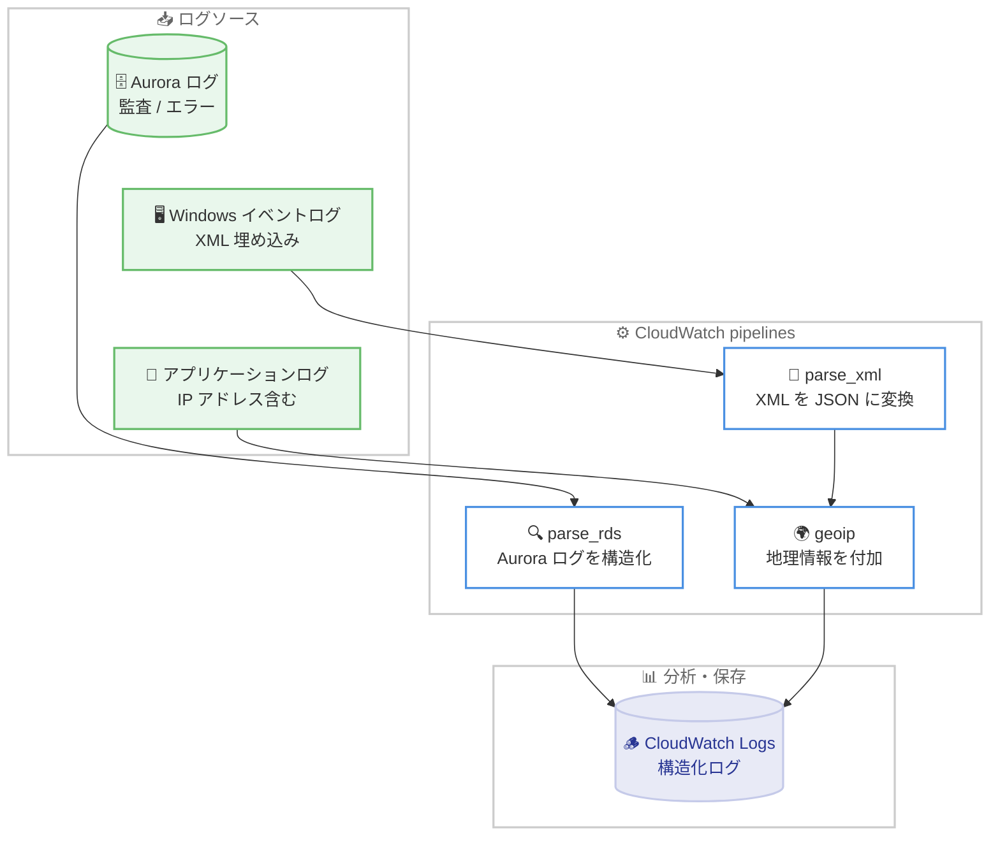

# Amazon CloudWatch - CloudWatch pipelines が GeoIP、RDS、XML プロセッサを追加

**リリース日**: 2026 年 8 月 19 日
**サービス**: Amazon CloudWatch
**機能**: CloudWatch pipelines の GeoIP エンリッチメント、Amazon RDS ログパーサー、XML パーサープロセッサ

📊 [このアップデートのインフォグラフィックを見る](https://takech9203.github.io/aws-news-summary/20260819-cloudwatch-geoip-rds-xml.html)

## 概要

Amazon CloudWatch pipelines に、ログデータをインジェスト時に解析・エンリッチする 3 つの新しいプロセッサが追加されました。追加されたのは、Aurora の監査ログやエラーログを構造化フィールドに解析する Amazon RDS ログパーサー、XML 文字列を含むフィールドを JSON に変換する XML パーサー、IP アドレスフィールドに都市・国・座標などの地理情報を付加する GeoIP エンリッチメントプロセッサです。

CloudWatch pipelines は、インフラストラクチャの管理なしでテレメトリのインジェスト、変換、ルーティングを行うフルマネージドサービスです。今回の新プロセッサにより、データベースログのコンプライアンス分析、Windows イベントログなどに埋め込まれた XML ペイロードの構造化、セキュリティ調査における IP アドレスの位置情報解決といった処理を、追加のカスタム処理なしにパイプライン内で完結できます。各プロセッサは単独でも、1 つのパイプライン内で組み合わせても使用できます。

**アップデート前の課題**

ログソースが生成するデータは、再処理なしではすぐにクエリできない形式であることが多く、以下の課題がありました。

- Aurora のログはデータベースエンジン固有の形式で届くため、監査やトラブルシューティングの前に独自の解析処理が必要だった
- アプリケーションログや Windows イベントログに埋め込まれた XML は非構造化文字列のままで、フィールド単位のクエリができなかった
- ログ内の IP アドレスには位置情報のコンテキストがなく、地理情報の付加には Lambda 関数や外部の GeoIP データベースを使ったカスタム処理が必要だった

**アップデート後の改善**

今回のアップデートにより、インジェスト時に以下の処理がマネージドに実行できるようになりました。

- `parse_rds` プロセッサにより、Aurora の監査ログ・エラーログをクエリ可能な構造化フィールドに自動解析できるようになった
- `parse_xml` プロセッサにより、フィールド内の XML 文字列を JSON に変換し、属性や子要素をフィールドとして扱えるようになった
- `geoip` プロセッサにより、MaxMind データベースを使用して IP アドレスから都市、国、座標、ASN などの地理情報を自動付加できるようになった

## アーキテクチャ図



各ログソースからのデータが CloudWatch pipelines の新プロセッサで解析・エンリッチされ、構造化された状態で CloudWatch Logs に保存される流れを示しています。XML パーサーと GeoIP プロセッサは 1 つのパイプライン内で組み合わせて使用できます。

## サービスアップデートの詳細

### 主要機能

1. **Amazon RDS ログパーサー (parse_rds)**
   - Amazon RDS Aurora のログデータを構造化フィールドに解析する
   - パイプラインの `data_source_name` が `amazon_rds` の場合にのみ使用可能で、パイプラインの `data_source_type` に一致する解析ロジックが自動的に適用される
   - 追加パラメータなしの `parse_rds: {}` というシンプルな設定で利用できる

2. **XML パーサー (parse_xml)**
   - 指定したフィールド内の XML 文字列を JSON 形式に変換する
   - プライマリパーサーが生成したフィールドに対して動作するため、パイプライン内でプライマリパーサーの後に配置する
   - 1 つのパイプラインに最大 5 個まで追加でき、`when` パラメータによる条件付き実行にも対応する
   - XML の属性と子要素の両方が JSON のフィールドとして展開される

3. **GeoIP エンリッチメントプロセッサ (geoip)**
   - MaxMind データベースを使用して、IP アドレス (IPv4 / IPv6) を地理情報に解決する
   - 都市名、国名、国コード、大陸、緯度・経度、郵便番号、タイムゾーン、ネットワーク CIDR、ASN、ASN 組織名など最大 12 種類のフィールドから必要なものを選択して付加できる
   - 1 つのプロセッサで最大 10 個の IP フィールドを対象にでき、送信元 IP と宛先 IP を同時にエンリッチ可能

## 技術仕様

### 各プロセッサの仕様

| 項目 | parse_rds | parse_xml | geoip |
|------|-----------|-----------|-------|
| カテゴリ | パーサー | パーサー | エンリッチメント |
| 対象 | Aurora 監査 / エラーログ | XML 文字列を含むフィールド | IPv4 / IPv6 アドレスフィールド |
| パイプライン内の上限 | プライマリパーサーとして 1 個 | 最大 5 個 | エントリ最大 10 個 |
| 条件付き実行 (`when`) | 非対応 | 対応 | 対応 (プロセッサ / エントリ両レベル) |
| 前提 | `data_source_name` が `amazon_rds` | プライマリパーサーの後に配置 | 有効な IP アドレスフィールド |

### GeoIP で付加できるフィールド

| フィールド | 内容 |
|------------|------|
| `continent_code` / `continent_name` | 大陸コード / 大陸名 |
| `country_name` / `country_iso_code` | 国名 / ISO 3166-1 alpha-2 国コード |
| `city_name` / `postal_code` | 都市名 / 郵便番号 |
| `time_zone` | IANA タイムゾーン名 |
| `latitude` / `longitude` | 緯度 / 経度 |
| `network` | IP アドレスが属するネットワークの CIDR |
| `asn` / `asn_organization` | 自律システム番号 / ASN の組織名 |

### 設定例: XML パーサーと GeoIP の組み合わせ

```yaml
processor:
  - parse_json:
      source: "@message"
  - parse_xml:
      source: "body"
      destination: "parsed_xml"
  - geoip:
      entries:
        - source: "src_ip"
          target: "src_geo"
          include_fields:
            - "city_name"
            - "country_name"
            - "country_iso_code"
            - "latitude"
            - "longitude"
            - "asn"
            - "asn_organization"
          when: '.src_ip != "127.0.0.1"'
```

JSON ログの `body` フィールド内の XML を構造化した後、送信元 IP アドレスに地理情報を付加する設定例です。`when` 条件によりループバックアドレスをエンリッチ対象から除外しています。

## 設定方法

### 前提条件

1. CloudWatch pipelines が利用可能なリージョンでパイプラインを作成できること
2. `parse_rds` を使用する場合、パイプラインのデータソースが Amazon RDS (Aurora ログ) であること
3. パイプラインの作成・更新に必要な IAM 権限を持っていること

### 手順

#### ステップ 1: パイプラインのプロセッサ設定を定義する

```yaml
processor:
  - parse_rds: {}
```

Aurora ログをデータソースとするパイプラインに RDS ログパーサーを追加する最小構成です。パイプラインの `data_source_type` に応じた解析ロジックが自動適用されます。

#### ステップ 2: パイプラインを作成または更新する

```bash
# AWS Management Console、AWS CLI、AWS SDK のいずれかで
# パイプラインにプロセッサを追加する
# 例: コンソールの CloudWatch > Pipelines からプロセッサを選択して構成
```

新しいプロセッサは AWS Management Console、AWS CLI、AWS SDK から既存または新規のパイプラインに追加できます。ログパイプラインは最大 20 個のプロセッサを定義順に順次適用します。

#### ステップ 3: 変換結果を確認する

パイプラインがログイベントを処理すると、変換メタデータが各ログエントリに自動付与されます。パイプライン作成時に「Keep original log」オプションを有効にすると、元のログと変換後のログをいつでも比較できます。なお、不正な形式の XML はパイプラインを失敗させず、元の `@message` を保持したままイベントに `@pipeline.processing.status = "error"` が設定されます。

## メリット

### ビジネス面

- **コンプライアンス対応の迅速化**: Aurora 監査ログが最初から構造化された状態で保存されるため、コンプライアンスレポートの作成や監査対応にかかる時間を短縮できる
- **運用コストの削減**: ログの再処理やカスタムの解析基盤 (Lambda 関数、外部 GeoIP データベースなど) の構築・保守が不要になる
- **セキュリティ調査の高度化**: 不審なアクセスの発信地域を即座に特定でき、インシデント対応の初動を早められる

### 技術面

- **インジェスト時の変換**: クエリ実行時ではなくインジェスト時にデータを構造化するため、保存後すぐにフィールド単位の検索・集計が可能
- **フルマネージド**: MaxMind データベースの管理や更新を含め、変換処理のインフラストラクチャを AWS が管理する
- **柔軟な組み合わせ**: 3 つのプロセッサは単独でも、既存のパーサー・トランスフォーマーと組み合わせても使用でき、`when` 条件式による細かい制御も可能 (parse_xml / geoip)

## デメリット・制約事項

### 制限事項

- `parse_rds` プロセッサはパイプラインの `data_source_name` が `amazon_rds` の場合にのみ使用でき、条件付き実行 (`when`) には対応しない
- `parse_xml` プロセッサは 1 つのパイプラインに最大 5 個までで、XML のネストは最大 25 レベルまでサポートされる
- `geoip` プロセッサのエントリは最大 10 個、`include_fields` は 1 個以上 12 個以下で指定する必要がある
- ログパイプラインあたりのプロセッサ数は最大 20 個

### 考慮すべき点

- プロセッサ自体は追加料金なしだが、CloudWatch のログインジェストおよびストレージ料金は通常どおり適用される
- GeoIP の位置情報は MaxMind データベースに基づくため、IP アドレスによっては解決できない、または精度に差が出る場合がある
- エンリッチメントによりログイベントのサイズが増加し、インジェスト・ストレージ量に影響する可能性がある

## ユースケース

### ユースケース 1: Aurora 監査ログによるコンプライアンスレポート

**シナリオ**: 金融系システムで Aurora MySQL の監査ログを保存しており、監査人から特定ユーザーのデータベース操作履歴の提出を求められている。

**実装例**:
```yaml
processor:
  - parse_rds: {}
```

**効果**: 監査ログがユーザー名、操作種別などの構造化フィールドに解析された状態で保存されるため、CloudWatch Logs Insights でフィールドを指定したクエリを直接実行でき、レポート作成が大幅に効率化される。

### ユースケース 2: Windows イベントログのセキュリティ分析

**シナリオ**: Windows サーバー群のイベントログを収集しているが、詳細情報が XML ペイロードとして埋め込まれており、ログオン失敗の分析に手間がかかっている。

**実装例**:
```yaml
processor:
  - parse_json:
      source: "@message"
  - parse_xml:
      source: "event_data"
      destination: "parsed_event"
  - geoip:
      entries:
        - source: "parsed_event.IpAddress"
          target: "src_geo"
          include_fields:
            - "country_name"
            - "country_iso_code"
            - "city_name"
```

**効果**: XML ペイロードが JSON に構造化され、さらに送信元 IP が国・都市に解決されるため、通常と異なる地域からのログオン試行を即座に検出できる。

### ユースケース 3: Web アクセスログの地理的トラフィック分析

**シナリオ**: グローバル展開する Web サービスで、アクセス元の地域分布を把握してコンテンツ配信やキャパシティ計画に活用したい。

**実装例**:
```yaml
processor:
  - parse_json:
      source: "@message"
  - geoip:
      entries:
        - source: "client_ip"
          target: "client_geo"
          include_fields:
            - "country_iso_code"
            - "city_name"
            - "latitude"
            - "longitude"
            - "asn_organization"
```

**効果**: アクセスログに国・都市・座標・ISP 情報が付加され、地域別のトラフィック集計やダッシュボードでの可視化が追加の処理なしで実現できる。

## 料金

新しいプロセッサの利用に追加料金はかかりません。標準の CloudWatch のログインジェストおよびストレージ料金が適用されます。

詳細は [Amazon CloudWatch 料金ページ](https://aws.amazon.com/cloudwatch/pricing/) を参照してください。

## 利用可能リージョン

CloudWatch pipelines が一般提供されているすべての AWS リージョンで利用可能です。

## 関連サービス・機能

- **Amazon CloudWatch Logs**: パイプラインで構造化されたログの保存先。Logs Insights による構造化フィールドのクエリと組み合わせて活用できる
- **Amazon Aurora / Amazon RDS**: `parse_rds` プロセッサの解析対象となる監査ログ・エラーログの生成元
- **CloudWatch Logs ルックアップテーブル**: `lookup` プロセッサと組み合わせることで、GeoIP による地理情報に加えて独自の資産情報などによるエンリッチメントも可能

## 参考リンク

- 📊 [インフォグラフィック](https://takech9203.github.io/aws-news-summary/20260819-cloudwatch-geoip-rds-xml.html)
- [公式発表 (What's New)](https://aws.amazon.com/about-aws/whats-new/2026/08/cloudwatch-geoip-rds-xml/)
- [ドキュメント: CloudWatch pipelines processors](https://docs.aws.amazon.com/AmazonCloudWatch/latest/monitoring/pipeline-processors.html)
- [ドキュメント: Parser processors](https://docs.aws.amazon.com/AmazonCloudWatch/latest/monitoring/parser-processors.html)
- [ドキュメント: Transformation processors](https://docs.aws.amazon.com/AmazonCloudWatch/latest/monitoring/transformation-processors.html)
- [料金ページ](https://aws.amazon.com/cloudwatch/pricing/)

## まとめ

CloudWatch pipelines への GeoIP、RDS、XML プロセッサの追加により、これまでカスタム処理が必要だったログの構造化とエンリッチメントがインジェスト時にマネージドに実行できるようになりました。Aurora ログの監査分析、XML を含むログのセキュリティ分析、IP アドレスベースの地理的分析を行っている場合は、既存のパイプラインへの新プロセッサの追加を検討することをお勧めします。
