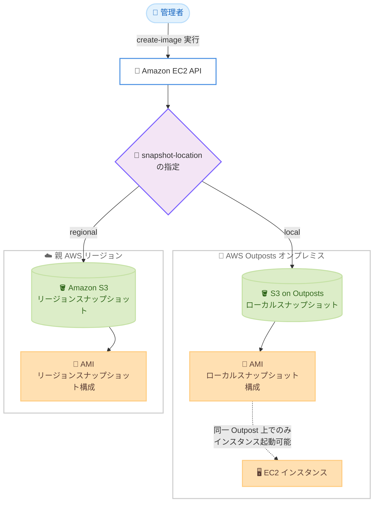

# Amazon EC2 - AWS Outposts 上のインスタンスからローカルスナップショットを使用した AMI 作成

**リリース日**: 2026 年 8 月 19 日
**サービス**: Amazon EC2 / AWS Outposts / Amazon EBS
**機能**: Outposts 上のインスタンスからのローカルスナップショットによる AMI 作成

📊 [このアップデートのインフォグラフィックを見る](https://takech9203.github.io/aws-news-summary/20260819-ec2-create-image-local-snapshot-outpost.html)

## 概要

Amazon EC2 は、AWS Outposts 上で稼働するインスタンスから、ローカルスナップショットを使用した Amazon マシンイメージ (AMI) の作成をサポートしました。この機能により、AMI のバックアップとなるスナップショットを Outpost 自体に直接保存できるようになり、データレジデンシー要件を満たしながら AMI を作成することが容易になります。

AMI 作成時に、バックアップとなるスナップショットの保存先として、Outpost 自体または親 AWS リージョンのいずれかを選択できます。データをローカルに保持する場合、EC2 はインスタンスの配置場所から対象の Outpost を自動的に判別するため、Outpost ARN を手動で指定する必要はありません。これにより、データレジデンシー要件を確保しながら、Outposts 上のインスタンスに対する既存のバックアップおよびライフサイクルワークフローに AMI 作成を統合できます。

このアップデートは、データ主権やデータレジデンシー要件が厳しい国や地域で Outposts を利用しているユーザー、およびオンプレミス環境でのバックアップワークフローを標準化したいユーザーに特に有用です。

**アップデート前の課題**

- 以前は、Outposts 上のインスタンスから直接 AMI を作成する際に、ローカルスナップショットを保存先として選択できなかった
- ローカルスナップショットで構成された AMI を作成するには、まずボリュームごとにローカルスナップショットを個別に作成し、`register-image` コマンドで AMI として登録する必要があった
- インスタンス単位のバックアップワークフローにおいて、スナップショットデータが親リージョンに保存されるため、データレジデンシー要件を満たすことが困難だった

**アップデート後の改善**

- `create-image` の実行時に `--snapshot-location` パラメータで保存先 (`local` または `regional`) を指定するだけで、Outposts 上のインスタンスから直接 AMI を作成できるようになった
- ローカル保存を選択した場合、EC2 がインスタンスの配置場所から対象の Outpost を自動判別するため、Outpost ARN の手動指定が不要になった
- AMI 作成を既存のバックアップ・ライフサイクルワークフローに統合しつつ、スナップショットデータを Outpost 内 (オンプレミス) に保持できるようになった

## アーキテクチャ図



Outposts 上のインスタンスから `create-image` を実行する際、`--snapshot-location` パラメータでスナップショットの保存先を Outpost ローカルまたは親リージョンから選択できます。ローカルを選択した場合、スナップショットデータは S3 on Outposts に保存され、オンプレミスから外に出ません。

## サービスアップデートの詳細

### 主要機能

1. **インスタンスからの直接 AMI 作成におけるローカルスナップショット対応**
   - ローカルスナップショットをサポートする Outpost 上のインスタンスから、直接 AMI を作成できる
   - AMI のバックアップとなるスナップショットを、インスタンスと同じ Outpost 上または親リージョンのいずれかに保存できる
   - 従来のようにボリュームごとにスナップショットを作成して `register-image` で登録する手順が不要になる

2. **`--snapshot-location` パラメータによる保存先制御**
   - `local`: インスタンスと同じ Outpost 上にスナップショットを保存
   - `regional`: Outpost の親リージョンにスナップショットを保存
   - ローカルスナップショットをサポートする Outpost 上のインスタンスが対象の場合、このパラメータは必須 (省略すると `InvalidParameterValue` エラーが発生)

3. **対象 Outpost の自動判別**
   - `local` を指定した場合、EC2 はインスタンスの配置場所から対象の Outpost を自動的に判別する
   - Outpost ARN を手動で指定する必要がなく、運用の自動化やスクリプト化が容易になる

## 技術仕様

### ローカルスナップショットの主な仕様

| 項目 | 詳細 |
|------|------|
| 保存先 | S3 on Outposts (Outpost に S3 on Outposts のプロビジョニングが必要) |
| スナップショット方式 | 増分バックアップ (前回スナップショット以降に変更されたブロックのみ保存) |
| 暗号化 | デフォルトで暗号化 (暗号化されていないローカルスナップショットは非サポート) |
| メタデータ | スナップショットのメタデータは親リージョンに保存 (スナップショットデータ自体は含まない) |
| リージョン接続 | ローカルスナップショットの作成・使用・削除には Outpost と親リージョン間の接続が必要 |
| 容量解放 | スナップショット削除後、S3 ストレージ容量は 72 時間以内に解放 |
| AMI の利用範囲 | ローカルスナップショットで構成された AMI は、同一 Outpost 上でのみインスタンス起動が可能 |

### `--snapshot-location` パラメータ

| 値 | 動作 |
|------|------|
| `local` | インスタンスと同じ Outpost 上にバックアップスナップショットを保存 |
| `regional` | Outpost の親リージョンにバックアップスナップショットを保存 |

### データレジデンシー強制のための IAM ポリシー例

以下のポリシーは、指定した Outpost 上のボリュームおよびインスタンスからリージョンへのスナップショット作成を拒否し、ローカルスナップショットのみを許可します。

```json
{
    "Version": "2012-10-17",
    "Statement": [
        {
            "Effect": "Deny",
            "Action": [
                "ec2:CreateSnapshot",
                "ec2:CreateSnapshots"
            ],
            "Resource": "arn:aws:ec2:us-east-1::snapshot/*",
            "Condition": {
                "StringEquals": {
                    "ec2:SourceOutpostArn": "arn:aws:outposts:us-east-1:123456789012:outpost/op-1234567890abcdef0"
                },
                "Null": {
                    "ec2:OutpostArn": "true"
                }
            }
        },
        {
            "Effect": "Allow",
            "Action": [
                "ec2:CreateSnapshot",
                "ec2:CreateSnapshots"
            ],
            "Resource": "*"
        }
    ]
}
```

## 設定方法

### 前提条件

1. AWS Outposts が導入済みで、親リージョンとの接続が確立されていること
2. Outpost に S3 on Outposts がプロビジョニングされていること (ローカルスナップショットの保存に必要)
3. 対象の EC2 インスタンスが、ローカルスナップショットをサポートする Outpost 上で稼働していること
4. AMI 作成に必要な IAM 権限 (`ec2:CreateImage` など) が付与されていること

### 手順

#### ステップ 1: ローカルスナップショットを使用した AMI の作成

```bash
aws ec2 create-image \
    --instance-id i-1234567890abcdef0 \
    --name "My Outpost image" \
    --snapshot-location local
```

Outposts 上のインスタンスから AMI を作成し、バックアップスナップショットをインスタンスと同じ Outpost 上に保存します。対象の Outpost は EC2 がインスタンスの配置場所から自動的に判別するため、Outpost ARN の指定は不要です。

#### ステップ 2: 親リージョンにスナップショットを保存する AMI の作成

```bash
aws ec2 create-image \
    --instance-id i-1234567890abcdef0 \
    --name "My Regional image" \
    --snapshot-location regional
```

Outposts 上のインスタンスから AMI を作成し、バックアップスナップショットを Outpost の親リージョンに保存します。リージョン側の AMI として管理したい場合に使用します。

#### ステップ 3: 作成した AMI の確認

```bash
aws ec2 describe-images \
    --owners self \
    --filters "Name=name,Values=My Outpost image"
```

作成した AMI の詳細を確認します。ローカルスナップショットで構成された AMI は、同一 Outpost 上でのみインスタンスの起動に使用できる点に注意してください。

## メリット

### ビジネス面

- **データレジデンシー要件への対応**: AMI のバックアップスナップショットが Outpost (オンプレミス) 内に保持されるため、データを国内や自社敷地内に留める必要がある規制業種でも AMI ベースのバックアップ運用が可能になる
- **運用コストの削減**: ボリュームごとのスナップショット作成と AMI 登録という複数ステップの手作業が単一コマンドに集約され、運用負荷とヒューマンエラーのリスクが低減する
- **帯域の有効活用**: スナップショットデータがリージョンへ転送されないため、帯域が制約された環境でもサービスリンクの帯域消費を抑制できる

### 技術面

- **ワークフロー統合の容易さ**: 既存のバックアップ・ライフサイクルワークフローに AMI 作成を組み込みやすくなり、インスタンス単位の一貫性のあるイメージ管理が実現する
- **Outpost の自動判別**: Outpost ARN の手動指定が不要になり、複数の Outposts を運用する環境でもスクリプトの汎用性が向上する
- **IAM によるレジデンシー強制**: IAM ポリシーの条件キー (`ec2:SourceOutpostArn`、`ec2:OutpostArn`) と組み合わせることで、スナップショットデータがリージョンへ保存されることを組織的に防止できる

## デメリット・制約事項

### 制限事項

- Outpost に S3 on Outposts がプロビジョニングされている必要がある
- ローカルスナップショットで構成された AMI は、同一 Outpost 上でのみインスタンスを起動できる (リージョンや他の Outpost では使用不可)
- ローカルスナップショットや AMI を Outpost からリージョンへコピーすること、Outpost 間でコピーすることはできない
- ローカルスナップショットで構成された AMI は、スポットインスタンスおよびスポットフリートの起動には使用できない
- 複数の Outposts にまたがるバックアップスナップショットを含む AMI は作成できない
- 高速スナップショット復元 (Fast Snapshot Restore)、EBS ダイレクト API、スナップショット共有はローカルスナップショットでは非サポート

### 考慮すべき点

- ローカルスナップショットをサポートする Outpost 上のインスタンスでは `--snapshot-location` パラメータが必須であり、省略すると `InvalidParameterValue` エラーが発生するため、既存の自動化スクリプトの改修が必要になる場合がある
- Outpost と親リージョン間の接続が失われている間は、ローカルスナップショットの作成・使用・削除ができない
- 削除したスナップショットの S3 ストレージ容量は解放までに最大 72 時間かかるため、CloudWatch アラームによる容量監視が推奨される
- 最新のスナップショットが Outpost 上に保存されている場合、以降のスナップショットも同じ Outpost に保存する必要がある (保存先の混在に関するルールに注意)

## ユースケース

### ユースケース 1: 規制業種におけるデータレジデンシー準拠のイメージ管理

**シナリオ**: 金融機関や公共機関が、データを自社データセンター内に保持する規制要件のもとで、Outposts 上の業務システムのゴールデンイメージを管理する。

**実装例**:
```bash
# パッチ適用済みインスタンスからローカル AMI を作成
aws ec2 create-image \
    --instance-id i-0abc123def456789a \
    --name "golden-image-$(date +%Y%m%d)" \
    --snapshot-location local \
    --tag-specifications 'ResourceType=image,Tags=[{Key=Environment,Value=Production}]'
```

**効果**: スナップショットデータがオンプレミスから外に出ることなく、パッチ適用済みのゴールデンイメージを定期的に作成・管理でき、監査要件にも対応しやすくなる。

### ユースケース 2: Outposts 上のインスタンスの定期バックアップ

**シナリオ**: 帯域が制約された遠隔拠点の Outposts 上で稼働するアプリケーションサーバーについて、インスタンス全体の復旧ポイントを定期的に取得する。

**実装例**:
```bash
# 再起動なしで AMI を作成し、ローカルに保存
aws ec2 create-image \
    --instance-id i-0abc123def456789a \
    --name "backup-app-server-$(date +%Y%m%d-%H%M)" \
    --snapshot-location local \
    --no-reboot
```

**効果**: リージョンへのデータ転送を発生させずにインスタンス単位のバックアップを取得でき、サービスリンクの帯域を他のワークロードのために温存できる。障害時は同一 Outpost 上で AMI からインスタンスを再作成して迅速に復旧できる。

### ユースケース 3: Auto Scaling と組み合わせたローカル AMI の活用

**シナリオ**: Outposts 上で稼働する Web アプリケーションについて、ローカルスナップショットで構成された AMI を使用して、同一 Outpost 内の Auto Scaling グループを構成する。

**実装例**:
```bash
# ローカル AMI を使用した起動テンプレートを作成
aws ec2 create-launch-template \
    --launch-template-name outpost-web-app \
    --launch-template-data '{
        "ImageId": "ami-0abc123def456789a",
        "InstanceType": "m5.xlarge"
    }'
```

**効果**: ローカルスナップショットで構成された AMI から、同一 Outpost 上のサブネットで Auto Scaling グループを起動できる。Auto Scaling グループのサービスリンクロールに、スナップショットの暗号化に使用した KMS キーへのアクセス権限が必要な点に注意する。

## 料金

この機能自体に追加料金はありません。関連するコスト要素は以下のとおりです。

- **ローカルスナップショットのストレージ**: Outpost 上の S3 on Outposts の容量を消費する。S3 on Outposts の容量は Outpost の構成として事前にプロビジョニングされ、Outposts の料金に含まれる
- **リージョン保存のスナップショット**: `regional` を指定した場合、親リージョンの Amazon EBS スナップショット料金 (Amazon S3 への保存) が適用される

詳細は [AWS Outposts の料金ページ](https://aws.amazon.com/outposts/rack/pricing/) および [Amazon EBS の料金ページ](https://aws.amazon.com/ebs/pricing/) を参照してください。

## 利用可能リージョン

AWS Outposts がローカルスナップショットストレージをサポートするすべての AWS リージョンで利用可能です。

## 関連サービス・機能

- **AWS Outposts**: AWS のインフラストラクチャとサービスをオンプレミスで利用できるフルマネージドサービス。本機能の前提となる実行環境
- **Amazon EBS ローカルスナップショット**: Outpost 上のボリュームのスナップショットを S3 on Outposts にローカル保存する機能。本アップデートにより AMI 作成 (`create-image`) からも利用可能になった
- **Amazon S3 on Outposts**: Outpost 上でオブジェクトストレージを提供するサービス。ローカルスナップショットの保存先として必須
- **Amazon Data Lifecycle Manager**: Outpost 上のボリュームやインスタンスのスナップショット作成・保持・削除を自動化するサービス。ローカルスナップショットのライフサイクル管理に利用可能
- **AWS Identity and Access Management (IAM)**: 条件キーを使用したポリシーにより、スナップショットのデータレジデンシーを強制できる

## 参考リンク

- 📊 [インフォグラフィック](https://takech9203.github.io/aws-news-summary/20260819-ec2-create-image-local-snapshot-outpost.html)
- [公式発表 (What's New)](https://aws.amazon.com/about-aws/whats-new/2026/08/ec2-create-image-local-snapshot-outpost)
- [ドキュメント: Amazon EBS local snapshots on Outposts](https://docs.aws.amazon.com/ebs/latest/userguide/snapshots-outposts.html)
- [ドキュメント: create-image (AWS CLI)](https://docs.aws.amazon.com/cli/latest/reference/ec2/create-image.html)
- [料金ページ: AWS Outposts](https://aws.amazon.com/outposts/rack/pricing/)

## まとめ

このアップデートにより、AWS Outposts 上のインスタンスから単一の操作で、スナップショットを Outpost 内に保持した AMI を作成できるようになりました。データレジデンシー要件のある環境で Outposts を運用しているユーザーは、`create-image` の `--snapshot-location` パラメータを既存のバックアップワークフローに組み込むことを推奨します。あわせて、ローカルスナップショット対応の Outpost では本パラメータが必須となるため、既存の自動化スクリプトへの影響を確認してください。
