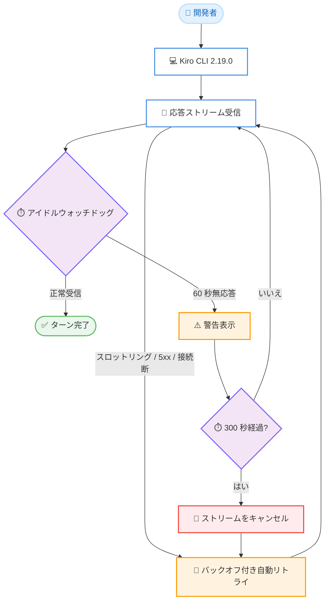

# Kiro - Spec Review Mouse Support, AI Session Titles, and Automatic Stream Recovery

**リリース日**: 2026年8月19日
**サービス**: Kiro (AWS が提供する AI 搭載 IDE / CLI)
**機能**: Kiro CLI 2.19.0 - スペックレビューのマウス操作対応、AI 生成セッションタイトル、ストリーム自動復旧

📊 [このアップデートのインフォグラフィックを見る](https://takech9203.github.io/aws-news-summary/20260819-kiro-changelog-2026-08-19.html)

## 概要

Kiro CLI 2.19.0 がリリースされ、スペックレビュー画面のマウス操作対応、V3 セッションピッカーへの AI 生成タイトル表示、およびストリーム / ネットワーク障害からの自動復旧機能が追加されました。ユーザーインターフェースの利便性向上と、長時間セッションの信頼性強化を両立するアップデートです。

特に注目すべきは自動復旧機能です。ストリームアイドルウォッチドッグ、バックオフ付き自動リトライ、60 分のストリーミングタイムアウトの組み合わせにより、接続断やスロットリングが発生してもターンがハングしたり途中終了したりしなくなりました。長時間の応答を扱うエージェントワークフローや、不安定なネットワーク環境で作業する開発者にとって重要な改善です。

**アップデート前の課題**

このアップデート以前には、以下の課題がありました。

- スペックレビュー画面はキーボード操作のみで、ドキュメントのスクロールやカーソル移動にマウスを使用できなかった
- セッション再開ピッカーには類似したセッションが並び、目的のセッションを見分けることが難しかった
- 応答ストリームが停止 (ストール) した場合、ターンがハングしたまま待ち続ける必要があった
- スロットリングや 5xx エラー、接続断が発生すると、ターンがそのまま終了してしまうことがあった
- 長時間のストリーミング応答が途中で切断されることがあった

**アップデート後の改善**

今回のアップデートにより、以下が可能になりました。

- スペックレビュー画面でマウスによるスクロールとクリックでのカーソル位置指定が可能になった (`m` キーでオン / オフ切り替え)
- セッション再開ピッカーに最初のプロンプトを要約した短い AI 生成タイトルが表示され、類似セッションの識別が容易になった
- アイドルウォッチドッグが 60 秒の無応答で警告し、300 秒でキャンセルすることで、ハングが自動的に検出されるようになった
- スロットリング、5xx エラー、接続断がバックオフ付きで自動リトライされるようになった
- ストリーミング応答にデフォルト 60 分のタイムアウトが設定され、長い応答が途中で切断されなくなった

## アーキテクチャ図



ストリーム自動復旧のフローを示しています。アイドルウォッチドッグが無応答を検出して警告 / キャンセルし、スロットリングや接続断などの一時的な障害はバックオフ付きで自動的にリトライされるため、ターンがハングしたまま放置されることがなくなります。

## サービスアップデートの詳細

### 主要機能

1. **スペックレビュー画面のマウス操作対応**
   - スペックレビュー画面でマウススクロールによるドキュメントのナビゲーションが可能になった
   - クリックでカーソル位置を指定できるようになった
   - `m` キーでマウス操作のオン / オフを切り替え可能
   - 2026 年 8 月 14 日のリリースで追加されたスペックレビュー画面 (Ctrl+X でフェーズドキュメントを確認し、行コメントをステージングする機能) の操作性を強化するアップデート

2. **AI 生成セッションタイトル (V3)**
   - セッション再開ピッカーに、最初のプロンプトを要約した短い AI 生成タイトルが表示される
   - `kiro-cli chat --resume-picker` または `/chat resume` でセッションに戻る際に、類似セッションを容易に見分けられる
   - V3 モードで利用可能

3. **ストリーム / ネットワーク障害からの自動復旧**
   - **アイドルウォッチドッグ**: 応答ストリームが 60 秒間無応答の場合に警告を表示し、300 秒でキャンセルする
   - **自動リトライ**: スロットリング、5xx エラー、接続断をバックオフ付きで自動的にリトライする
   - **ストリーミングタイムアウト**: デフォルトで 60 分のタイムアウトが設定され、長時間の応答が途中で切断されない
   - `api.streamIdleSoftTimeout`、`api.streamIdleHardTimeout`、`api.timeout` の各設定でチューニング可能

## 技術仕様

### ストリーム復旧関連の設定項目

| 設定項目 | デフォルト動作 | 説明 |
|------|------|------|
| `api.streamIdleSoftTimeout` | 60 秒 | 無応答時に警告を表示するまでの時間 |
| `api.streamIdleHardTimeout` | 300 秒 | 無応答時にストリームをキャンセルするまでの時間 |
| `api.timeout` | 60 分 | ストリーミング応答全体のタイムアウト |

### 自動リトライの対象

| 障害の種類 | 動作 |
|------|------|
| スロットリング | バックオフ付きで自動リトライ |
| 5xx エラー | バックオフ付きで自動リトライ |
| 接続断 | バックオフ付きで自動リトライ |
| ストリームのストール | ウォッチドッグが警告 / キャンセル後にリトライ |

## 設定方法

### 前提条件

1. Kiro CLI がインストールされていること
2. Kiro CLI をバージョン 2.19.0 以降にアップデートしていること
3. AI 生成セッションタイトルの利用には V3 モード (`kiro-cli --v3`) が必要

### 手順

#### ステップ1: Kiro CLI のアップデート

```bash
kiro-cli update
```

Kiro CLI を最新バージョン (2.19.0 以降) にアップデートします。

#### ステップ2: スペックレビューでのマウス操作

```bash
# スペック実行中、フェーズチェックポイントで Ctrl+X を押してレビュー画面を開く
# マウススクロールでドキュメントを移動し、クリックでカーソルを配置
# m キーでマウス操作のオン / オフを切り替え
```

スペックレビュー画面でマウス操作を使用します。ターミナルのテキスト選択を使いたい場合は `m` キーでマウス操作を一時的に無効化できます。

#### ステップ3: AI 生成タイトル付きセッションピッカーの利用

```bash
# セッションピッカーを起動して過去のセッションを確認
kiro-cli chat --resume-picker

# またはチャット内から
/chat resume
```

セッションピッカーを開くと、各セッションに最初のプロンプトを要約した AI 生成タイトルが表示され、目的のセッションを素早く選択できます。

#### ステップ4: ストリームタイムアウトのチューニング (任意)

必要に応じて `api.streamIdleSoftTimeout`、`api.streamIdleHardTimeout`、`api.timeout` の設定値を調整します。デフォルト値のままでも自動復旧は有効です。

## メリット

### ビジネス面

- **作業中断の削減**: 接続断やスロットリングでターンが失われなくなり、エージェント作業のやり直しコストが減少する
- **長時間タスクの信頼性向上**: 60 分のストリーミングタイムアウトにより、大規模なコード生成など長い応答を要するタスクを安心して実行できる
- **セッション管理の効率化**: AI 生成タイトルにより目的のセッションへ素早く復帰でき、コンテキストスイッチの時間を短縮できる

### 技術面

- **自動障害検出**: アイドルウォッチドッグにより、ストールしたストリームが自動的に検出・キャンセルされ、手動での中断操作が不要になる
- **バックオフ付きリトライ**: 一時的な障害 (スロットリング、5xx、接続断) がユーザーの介入なしに透過的に回復される
- **チューニング可能**: タイムアウト値を設定で調整でき、ネットワーク環境やワークロードに合わせた最適化が可能

## デメリット・制約事項

### 制限事項

- AI 生成セッションタイトルは V3 モード (`kiro-cli --v3`) で利用可能な機能である
- マウス操作はスペックレビュー画面が対象であり、`m` キーによる切り替えが必要な場面がある (ターミナルのネイティブなテキスト選択と併用する場合など)
- 自動リトライは一時的な障害が対象であり、認証エラーなど恒久的な障害は回復できない

### 考慮すべき点

- アイドルウォッチドッグのデフォルト値 (警告 60 秒 / キャンセル 300 秒) は、応答が極端に遅い環境では調整が必要になる場合がある
- CLI のアップデートが必要なため、チームで利用している場合はバージョンを揃えることが望ましい

## ユースケース

### ユースケース1: 不安定なネットワーク環境での開発

**シナリオ**: モバイル回線や共有 Wi-Fi など、接続が不安定な環境で Kiro CLI を使用してコーディングタスクを実行する。

**実装例**:
```bash
# 通常どおりチャットを開始するだけで自動復旧が有効
kiro-cli chat
```

**効果**: 一時的な接続断が発生しても、バックオフ付き自動リトライによりターンが継続され、作業のやり直しが不要になる。

### ユースケース2: 複数の類似セッションの並行管理

**シナリオ**: 同じリポジトリで複数の機能開発やバグ修正のセッションを並行して進めており、後から特定のセッションに戻りたい。

**実装例**:
```bash
# AI 生成タイトル付きのセッションピッカーで目的のセッションを選択
kiro-cli chat --resume-picker
```

**効果**: 各セッションの最初のプロンプトを要約したタイトルが表示されるため、類似セッションの中から目的のものを即座に識別して再開できる。

### ユースケース3: スペックドキュメントの効率的なレビュー

**シナリオ**: スペック駆動開発のフェーズチェックポイントで、長い要件ドキュメントをレビューして修正コメントを付ける。

**実装例**:
```bash
# フェーズチェックポイントで Ctrl+X を押してレビュー画面を開く
# マウススクロールで長いドキュメントを素早く移動
# クリックでコメント対象の行にカーソルを配置し、行コメントをステージング
```

**効果**: キーボードのみの操作と比べて長いドキュメントのナビゲーションが高速になり、レビューと修正依頼のサイクルが効率化される。

## 料金

このアップデートによる追加料金はありません。Kiro の既存のサブスクリプションプラン (Free、Pro 以上) の範囲内で利用できます。

## 利用可能リージョン

グローバル (Kiro はグローバルに提供されるサービスです)

## 関連サービス・機能

- **Kiro スペック駆動開発**: 今回マウス対応したスペックレビュー画面は、2026 年 8 月 14 日の CLI 2.18.1 で追加されたスペックレビュー機能 (Ctrl+X によるフェーズドキュメントの確認と行コメントのステージング) の強化である
- **Kiro CLI V3 モード**: AI 生成セッションタイトルは V3 セッションピッカーの機能として提供される
- **Kiro Cloud Sessions**: セッションピッカーにはローカルセッションとクラウドセッションが一緒に表示されるため、AI 生成タイトルはクラウドセッションの識別にも役立つ

## 参考リンク

- 📊 [インフォグラフィック](https://takech9203.github.io/aws-news-summary/20260819-kiro-changelog-2026-08-19.html)
- [Kiro Changelog (公式発表)](https://kiro.dev/changelog/)
- [Kiro 公式サイト](https://kiro.dev/)
- [Kiro ドキュメント](https://kiro.dev/docs/)
- [Kiro 料金ページ](https://kiro.dev/pricing/)

## まとめ

Kiro CLI 2.19.0 は、スペックレビューのマウス操作対応と AI 生成セッションタイトルで日々の操作性を高めつつ、アイドルウォッチドッグ・自動リトライ・60 分ストリーミングタイムアウトによってエージェントセッションの信頼性を大きく向上させるアップデートです。特に長時間のタスクや不安定なネットワーク環境で Kiro CLI を利用しているユーザーは、`kiro-cli update` で早めにアップデートすることを推奨します。
