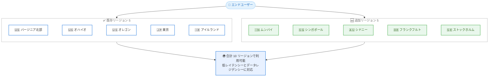

# AWS Lambda - MicroVMs の 5 リージョン追加展開

**リリース日**: 2026 年 8 月 19 日
**サービス**: AWS Lambda
**機能**: AWS Lambda MicroVMs のリージョン拡大 (5 リージョン追加、合計 10 リージョン)

📊 [このアップデートのインフォグラフィックを見る](https://takech9203.github.io/aws-news-summary/20260819-lambda-microvms-5-additional-regions.html)

## 概要

AWS Lambda MicroVMs が新たに 5 つの AWS リージョンで利用可能になりました。追加されたのは、アジアパシフィック (ムンバイ)、アジアパシフィック (シンガポール)、アジアパシフィック (シドニー)、欧州 (フランクフルト)、欧州 (ストックホルム) の 5 リージョンで、利用可能リージョンは合計 10 リージョンに拡大しました。

Lambda MicroVMs は、ユーザーや AI が生成したコードを実行するためのサーバーレスコンピューティングプリミティブで、VM レベルの分離、ほぼ瞬時の起動・再開速度、および状態保持を同時に提供します。仮想化インフラストラクチャを管理することなく、また「分離」「速度」「状態保持」のいずれかを犠牲にすることなく、ユーザーやジョブごとに分離されたコンピューティング環境を割り当てられます。AI コーディングアシスタント、インタラクティブな開発環境、脆弱性スキャナーなどのアプリケーション構築に適しています。

今回のリージョン拡大により、アジアパシフィックおよび欧州のユーザーに近い場所で MicroVMs を実行できるようになり、レイテンシー要件やデータレジデンシー (データ所在地) 要件を満たしやすくなりました。

**アップデート前の課題**

2026 年 6 月の一般提供開始時点では、利用可能リージョンが限定されていました。

- 利用可能リージョンは米国東部 (バージニア北部・オハイオ)、米国西部 (オレゴン)、アジアパシフィック (東京)、欧州 (アイルランド) の 5 リージョンのみだった
- インド、東南アジア、オセアニアのエンドユーザー向けには、東京または米国リージョンを利用する必要があり、レイテンシーが増加していた
- ドイツや北欧などのデータレジデンシー要件を持つワークロードでは、アイルランド以外の欧州リージョンで MicroVMs を利用できなかった

**アップデート後の改善**

今回のアップデートにより、以下が可能になりました。

- ムンバイ、シンガポール、シドニー、フランクフルト、ストックホルムの 5 リージョンで MicroVMs を起動できるようになった
- エンドユーザーに近いリージョンで実行することで、インタラクティブなコーディング環境や AI サンドボックスの応答レイテンシーを削減できるようになった
- 欧州 (フランクフルト・ストックホルム) やアジアパシフィック各国のデータレジデンシー要件に対応した構成を選択できるようになった

## アーキテクチャ図



上図は、既存の 5 リージョンに加えて新たに 5 リージョンが追加され、合計 10 リージョンで Lambda MicroVMs が利用可能になったことを示しています。

## サービスアップデートの詳細

### 主要機能

1. **5 リージョンへの追加展開**
   - アジアパシフィック (ムンバイ)、アジアパシフィック (シンガポール)、アジアパシフィック (シドニー)、欧州 (フランクフルト)、欧州 (ストックホルム) で新たに利用可能
   - 既存の 5 リージョンと合わせて合計 10 リージョンに拡大
   - エンドユーザーに近いリージョンでの実行により、レイテンシー要件とデータレジデンシー要件に対応

2. **MicroVMs のコア機能 (全リージョン共通)**
   - Dockerfile から MicroVM イメージを作成し、そのイメージから MicroVM を起動
   - 各 MicroVM に専用の HTTPS URL が割り当てられ、HTTP/2、gRPC、WebSockets をサポート
   - Firecracker 仮想化技術に基づく VM レベルの分離と、スナップショットによるほぼ瞬時の起動・再開

3. **多様な利用手段**
   - Lambda コンソール、AWS CloudFormation、AWS CDK から利用可能
   - Agent Toolkit for AWS を使用したエージェント型開発ツールからも利用可能

## 技術仕様

### リージョン展開の状況

| 区分 | リージョン |
|------|------|
| 既存リージョン (2026 年 6 月 GA 時) | 米国東部 (バージニア北部)、米国東部 (オハイオ)、米国西部 (オレゴン)、アジアパシフィック (東京)、欧州 (アイルランド) |
| 追加リージョン (今回) | アジアパシフィック (ムンバイ)、アジアパシフィック (シンガポール)、アジアパシフィック (シドニー)、欧州 (フランクフルト)、欧州 (ストックホルム) |
| 合計 | 10 リージョン |

### MicroVMs の主な仕様 (参考)

| 項目 | 詳細 |
|------|------|
| 分離モデル | Firecracker ベースの VM レベル分離 (専用カーネル・メモリ空間・ディスク) |
| 状態保持 | メモリとディスクの状態を最大 8 時間保持し、suspend / resume が可能 |
| ネットワーク | 専用 HTTPS URL、HTTP/2、gRPC、WebSockets 対応、JWE ベース認証 |
| スケーリング | 設定したベースラインの最大 4 倍まで垂直スケール |
| イメージ作成 | Dockerfile から MicroVM イメージを作成 |

## 設定方法

### 前提条件

1. 新規追加リージョンを含む、MicroVMs が利用可能なリージョンの AWS アカウント
2. コードと Dockerfile を格納する Amazon S3 バケット
3. イメージビルド用および MicroVM 実行用の IAM ロール

### 手順

#### ステップ1: 利用するリージョンを選択

```bash
export AWS_REGION=ap-southeast-1
```

新たに追加されたリージョン (例: シンガポール `ap-southeast-1`、ムンバイ `ap-south-1`、シドニー `ap-southeast-2`、フランクフルト `eu-central-1`、ストックホルム `eu-north-1`) を AWS CLI のデフォルトリージョンとして設定します。

#### ステップ2: MicroVM イメージを作成

```bash
aws lambda-microvms create-microvm-image \
  --code-artifact uri=<path/to/s3/artifact.zip> \
  --name <VM_image_name> \
  --base-image-arn <base image ARN> \
  --build-role-arn <IAM role ARN>
```

選択したリージョンの S3 アーティファクト (コードと Dockerfile) から MicroVM イメージを作成します。Lambda が Dockerfile を実行してアプリケーションを初期化し、スナップショットを取得します。

#### ステップ3: MicroVM を起動

```bash
aws lambda-microvms run-microvm \
  --image-identifier <MicroVM image ARN> \
  --execution-role-arn <IAM role ARN>
```

作成したイメージから MicroVM を起動します。専用の HTTPS エンドポイント URL が返却され、エンドユーザーに近いリージョンで低レイテンシーにアクセスできます。

## メリット

### ビジネス面

- **レイテンシーの削減**: インド、東南アジア、オセアニア、欧州のエンドユーザーに近いリージョンで実行することで、インタラクティブな体験の応答性が向上する
- **データレジデンシー要件への対応**: フランクフルトやストックホルムなど、データ所在地の要件があるワークロードでも MicroVMs を採用できる
- **市場展開の拡大**: 対象地域のユーザー向けに AI コーディングアシスタントや開発環境サービスを提供しやすくなる

### 技術面

- **既存機能をそのまま利用可能**: VM レベルの分離、スナップショットによる高速起動・再開、状態保持などのコア機能を追加リージョンでも同様に利用できる
- **マルチリージョン構成の柔軟性向上**: 10 リージョンに拡大したことで、リージョン間での冗長構成やユーザー分散配置の選択肢が増える
- **ツールチェーンの共通化**: CloudFormation、CDK、Agent Toolkit for AWS など既存のデプロイ手段をそのまま新リージョンでも利用できる

## デメリット・制約事項

### 制限事項

- 利用可能リージョンは 10 リージョンであり、すべての商用リージョンで利用できるわけではない
- 大阪リージョンなど、上記以外のリージョンではまだ利用できない

### 考慮すべき点

- 最新のリージョン対応状況は AWS Capabilities by Region ページで確認することが推奨されている
- リージョンごとに料金が異なる場合があるため、利用予定リージョンの料金を AWS Lambda 料金ページで確認する

## ユースケース

### ユースケース1: 東南アジア・インド向け AI コーディングアシスタント

**シナリオ**: インドや東南アジアのユーザー向けに AI コーディングアシスタントを提供しており、AI が生成したコードの実行サンドボックスをユーザーの近くに配置してレイテンシーを削減したい。

**実装例**:
```
ムンバイまたはシンガポールリージョンで MicroVM イメージを作成
-> ユーザーのセッション開始時に run-microvm でサンドボックスを起動
-> 専用 HTTPS エンドポイント経由で低レイテンシーにコード実行
```

**効果**: エンドユーザーに近いリージョンでの実行により応答時間が短縮され、インタラクティブな開発体験が向上する。

### ユースケース2: 欧州のデータレジデンシー要件に対応した開発環境

**シナリオ**: ドイツの企業向け SaaS 型開発環境で、コードや実行データを EU 域内、特にドイツ国内に保持する必要がある。

**実装例**:
```
フランクフルトリージョンで MicroVMs を構成
-> ユーザーごとに分離された MicroVM を起動し、状態をリージョン内で保持
-> アイドル時は suspend してコストを削減
```

**効果**: データレジデンシー要件を満たしながら、VM レベルで分離された開発環境をユーザーごとに提供できる。

### ユースケース3: オセアニア向け脆弱性スキャンプラットフォーム

**シナリオ**: オーストラリアの顧客向けにマルチテナントの脆弱性スキャンサービスを提供しており、スキャンジョブを顧客に近いリージョンで分離実行したい。

**実装例**:
```
シドニーリージョンでスキャンジョブ専用の MicroVM を起動
-> 分離環境内でスキャンツールを実行
-> 結果取得後に MicroVM を終了
```

**効果**: ジョブごとの分離を担保しつつ、リージョン内での実行によりスキャン対象へのネットワーク遅延を抑えられる。

## 料金

Lambda MicroVMs の料金は、コンピューティング (ベースラインとピーク使用量に基づく秒単位課金)、スナップショット操作とストレージ、データ転送の 3 つの要素で構成されます。一時停止中の MicroVM にはコンピューティング料金が発生しません。追加リージョンでの具体的な料金は AWS Lambda の料金ページを参照してください。

## 利用可能リージョン

今回の拡大により、AWS Lambda MicroVMs は以下の 10 リージョンで利用可能です。

**既存リージョン:**

- 米国東部 (バージニア北部)
- 米国東部 (オハイオ)
- 米国西部 (オレゴン)
- アジアパシフィック (東京)
- 欧州 (アイルランド)

**追加リージョン (今回):**

- アジアパシフィック (ムンバイ)
- アジアパシフィック (シンガポール)
- アジアパシフィック (シドニー)
- 欧州 (フランクフルト)
- 欧州 (ストックホルム)

最新の対応状況は AWS Capabilities by Region ページで確認できます。

## 関連サービス・機能

- **AWS Lambda Functions**: イベント駆動型・リクエスト/レスポンス型のワークロードに適した従来の Lambda 実行モデル。MicroVMs とは相互補完的に使い分ける
- **Firecracker**: MicroVMs の基盤となる軽量仮想化技術
- **AWS CloudFormation / AWS CDK**: MicroVMs をコードとして管理・デプロイする手段
- **Agent Toolkit for AWS**: エージェント型開発ツールから MicroVMs を利用するためのツールキット

## 参考リンク

- 📊 [インフォグラフィック](https://takech9203.github.io/aws-news-summary/20260819-lambda-microvms-5-additional-regions.html)
- [公式発表 (What's New)](https://aws.amazon.com/about-aws/whats-new/2026/08/lambda-microvms-5-additional-regions)
- [AWS Blog (GA 発表時)](https://aws.amazon.com/blogs/aws/run-isolated-sandboxes-with-full-lifecycle-control-aws-lambda-introduces-microvms)
- [Lambda MicroVMs 製品ページ](https://aws.amazon.com/lambda/lambda-microvms/)
- [ドキュメント (開発者ガイド)](https://docs.aws.amazon.com/lambda/latest/dg/lambda-microvms-guide.html)
- [料金ページ](https://aws.amazon.com/lambda/pricing/)
- [Agent Toolkit for AWS (GitHub)](https://github.com/aws/agent-toolkit-for-aws)

## まとめ

AWS Lambda MicroVMs がムンバイ、シンガポール、シドニー、フランクフルト、ストックホルムの 5 リージョンに拡大し、合計 10 リージョンで利用可能になりました。アジアパシフィックや欧州のエンドユーザー向けに AI サンドボックスやインタラクティブな開発環境を提供している場合は、ユーザーに近い追加リージョンへの展開を検討し、レイテンシー削減とデータレジデンシー要件への対応を進めることをお勧めします。
