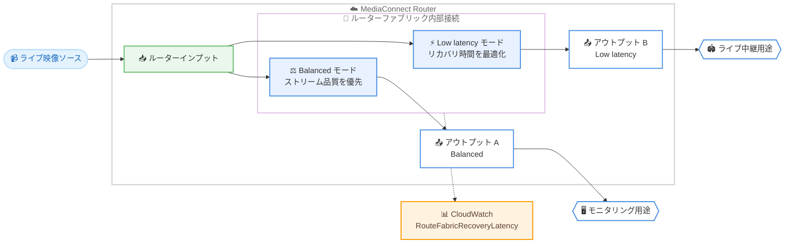

# AWS Elemental MediaConnect - Router の設定可能なリカバリレイテンシーモード

**リリース日**: 2026 年 8 月 19 日
**サービス**: AWS Elemental MediaConnect
**機能**: MediaConnect Router configurable recovery latency modes

📊 [このアップデートのインフォグラフィックを見る](https://takech9203.github.io/aws-news-summary/20260819-mediaconnect-router-latency-modes.html)

## 概要

AWS Elemental MediaConnect Router で、ルーター内部のインプットとアウトプット間の接続レイテンシー (リカバリレイテンシー) を設定できるようになりました。今回のアップデートにより、ルーターファブリック内部のリカバリレイテンシーモードとして「Balanced (バランス)」と「Low latency (低レイテンシー)」の 2 つのモードをルーターアウトプットごとに選択できます。

MediaConnect Router は、ライブ映像のインプットとアウトプットを動的にルーティングするクラウドベースの映像ルーティングサービスです。これまで、ルーター内部の伝送プロトコルのレイテンシーはサービス側で自動的に設定されており、ユーザーが変更することはできませんでした。今回のアップデートにより、ストリーム品質を優先するか、エンドツーエンドのレイテンシーを優先するかをワークフローの要件に応じて選択できるようになります。

放送事業者やライブイベント配信事業者など、リモートプロダクション (REMI) やスポーツ中継のようにレイテンシーが重要なワークフローを運用するユーザーに特に有用なアップデートです。

**アップデート前の課題**

このアップデート以前は、ルーター内部のレイテンシー制御に以下の制約がありました。

- ルーターのインプットとアウトプット間の内部接続レイテンシーはサービスが自動設定し、ユーザーは変更できなかった
- レイテンシーに敏感なワークフローでも、内部接続のリカバリ時間を短縮する手段がなかった
- ルートごとに設定されているリカバリレイテンシーの値を確認する手段がなかった

**アップデート後の改善**

今回のアップデートにより、以下が可能になりました。

- ルーターアウトプットごとにリカバリレイテンシーモード (Balanced / Low latency) を選択可能になった
- 低レイテンシーモードにより、レイテンシーに敏感なワークフローで内部接続のリカバリ時間を最適化できるようになった
- 1 つのインプットから複数のアウトプットへ配信する際、アウトプットごとに異なるレイテンシー要件を設定できるようになった
- 新しい CloudWatch メトリクス `RouteFabricRecoveryLatency` により、各ルートに設定されたリカバリレイテンシーを監視できるようになった

## アーキテクチャ図



1 つのルーターインプットから複数のアウトプットへ配信する際、アウトプットごとに異なるリカバリレイテンシーモードを設定できます。設定値は CloudWatch メトリクスで監視できます。

## サービスアップデートの詳細

### 主要機能

1. **アウトプット単位のリカバリレイテンシーモード設定**
   - ルーターファブリック (インプットとアウトプット間の内部接続) のリカバリレイテンシーモードを、ルーターアウトプットごとに設定可能
   - アウトプット単位の設定であるため、1 つのインプットを異なるレイテンシー要件を持つ複数のアウトプットへ同時に配信できる
   - MediaConnect API、AWS Management Console、AWS CLI から設定・確認が可能

2. **2 つのレイテンシーモード**
   - **Balanced (デフォルト)**: 従来の動作を維持し、ストリーム品質を優先するモード。一般的なユースケースに適する
   - **Low latency**: レイテンシーに敏感なワークフロー向けに、内部接続のリカバリ時間を最適化するモード。ネットワーク状態が悪い場合はストリーム品質が低下する可能性がある

3. **新しい CloudWatch メトリクス**
   - `RouteFabricRecoveryLatency` メトリクスが追加され、各ルートに設定されているリカバリレイテンシーを確認可能
   - レイテンシー設定の監視や運用状況の可視化に活用できる

## 技術仕様

### リカバリレイテンシーモードの比較

| 項目 | Balanced | Low latency |
|------|----------|-------------|
| API 上の値 | `BALANCED` | `LOW_LATENCY` |
| デフォルト | はい | いいえ |
| 最適化の対象 | ストリーム品質 | 内部接続のリカバリ時間 (レイテンシー) |
| 想定ユースケース | 一般的な配信ワークフロー | レイテンシーに敏感なワークフロー |
| 注意点 | 従来と同じ動作 | ネットワーク状態が悪い場合にストリーム品質が低下する可能性 |
| 設定単位 | ルーターアウトプットごと | ルーターアウトプットごと |

### API変更履歴

| 日付 | サービス | 変更内容 |
|------|----------|----------|
| 2026/08/12 | [AWS MediaConnect](https://awsapichanges.com/archive/changes/144a68-mediaconnect.html) | 4 updated api methods - `CreateRouterOutput`、`UpdateRouterOutput`、`GetRouterOutput`、`BatchGetRouterOutput` に `FabricConfiguration.RecoveryLatencyMode` (`BALANCED` / `LOW_LATENCY`) が追加 |

### API パラメータ例

`CreateRouterOutput` および `UpdateRouterOutput` で、`FabricConfiguration` パラメータを指定します。

```json
{
  "FabricConfiguration": {
    "RecoveryLatencyMode": "LOW_LATENCY"
  }
}
```

## 設定方法

### 前提条件

1. AWS アカウントで MediaConnect Router が利用可能であること
2. ルーターネットワークインターフェイスが作成済みであること
3. ルーターアウトプットを作成または更新する IAM 権限があること

### 手順

#### ステップ1: リカバリレイテンシーモードを指定してルーターアウトプットを作成

```bash
aws mediaconnect create-router-output \
  --name "LiveEvent-LowLatency-Output" \
  --tier OUTPUT_100 \
  --maximum-bitrate 80000000 \
  --routing-scope REGIONAL \
  --region-name ap-northeast-1 \
  --fabric-configuration '{"RecoveryLatencyMode": "LOW_LATENCY"}' \
  --configuration '{
    "Standard": {
      "NetworkInterfaceArn": "arn:aws:mediaconnect:ap-northeast-1:123456789012:networkinterface:example",
      "Protocol": "SRT_LISTENER",
      "ProtocolConfiguration": {
        "SrtListener": {
          "Port": 5000,
          "MinimumLatencyMilliseconds": 200
        }
      }
    }
  }'
```

`FabricConfiguration` の `RecoveryLatencyMode` に `LOW_LATENCY` を指定して、低レイテンシーモードのルーターアウトプットを作成します。コンソールの場合は、ルーターアウトプット作成画面の「Router fabric configuration」セクションで「Recovery latency mode」を選択します。

#### ステップ2: 既存のルーターアウトプットのモードを変更

```bash
aws mediaconnect update-router-output \
  --arn "arn:aws:mediaconnect:ap-northeast-1:123456789012:routeroutput:example" \
  --fabric-configuration '{"RecoveryLatencyMode": "BALANCED"}'
```

`UpdateRouterOutput` API で既存アウトプットのリカバリレイテンシーモードを変更します。この例では Balanced モードに戻しています。

#### ステップ3: 設定値の確認と監視

```bash
# 設定されたモードの確認
aws mediaconnect get-router-output \
  --arn "arn:aws:mediaconnect:ap-northeast-1:123456789012:routeroutput:example" \
  --query "RouterOutput.FabricConfiguration"

# CloudWatch メトリクスで各ルートのリカバリレイテンシーを確認
aws cloudwatch get-metric-statistics \
  --namespace AWS/MediaConnect \
  --metric-name RouteFabricRecoveryLatency \
  --dimensions Name=RouterOutputArn,Value="arn:aws:mediaconnect:ap-northeast-1:123456789012:routeroutput:example" \
  --start-time 2026-08-19T00:00:00Z \
  --end-time 2026-08-19T23:59:59Z \
  --period 300 \
  --statistics Average
```

`GetRouterOutput` API で現在の `FabricConfiguration` を確認し、CloudWatch メトリクス `RouteFabricRecoveryLatency` で各ルートに設定されているリカバリレイテンシーを監視します。

## メリット

### ビジネス面

- **ワークフロー要件への柔軟な対応**: スポーツ中継やリモートプロダクションなど、低レイテンシーが求められる配信と、品質を優先する配信を同一のルーターで使い分けられる
- **インフラの共通化**: 1 つのインプットから要件の異なる複数の配信先へ同時配信できるため、用途別にインフラを分ける必要がなく、コストと運用負荷を抑えられる
- **追加コストなしの機能強化**: 既存の MediaConnect Router の料金体系の範囲内で利用できる設定オプションの追加であり、新たな料金は発表されていない

### 技術面

- **アウトプット単位の細かな制御**: レイテンシーモードはアウトプットごとに独立して設定できるため、配信先ごとに最適なトレードオフを選択できる
- **可観測性の向上**: 新メトリクス `RouteFabricRecoveryLatency` により、これまで見えなかった内部接続のリカバリレイテンシー設定を CloudWatch で監視できる
- **既存環境への影響なし**: デフォルトは従来動作の Balanced モードのため、既存のワークフローに影響を与えずに導入できる

## デメリット・制約事項

### 制限事項

- 低レイテンシーモードは、ネットワーク状態が悪い場合にストリーム品質が低下する可能性がある
- リカバリレイテンシーモードはルーターアウトプット側の設定であり、ルーターインプット側では設定できない
- 本設定はルーターファブリック内部の接続に対するものであり、SRT や RIST などの外部プロトコルのレイテンシー設定 (Minimum latency、Recovery latency) とは別に管理される

### 考慮すべき点

- エンドツーエンドのレイテンシーは、外部プロトコルのレイテンシー設定とファブリック内部のレイテンシーの組み合わせで決まるため、全体設計の中でモードを選択する必要がある
- 低レイテンシーモードを採用する場合は、`RouteFabricRecoveryLatency` メトリクスやストリーム品質の監視を組み合わせ、品質低下がないかを確認することが推奨される

## ユースケース

### ユースケース1: スポーツ中継のリモートプロダクション

**シナリオ**: 競技会場からの映像を放送局の制作拠点へ伝送し、リアルタイムでスイッチングや実況を行うリモートプロダクション (REMI) ワークフロー。制作側とのやり取りにはできる限り低い遅延が求められる。

**実装例**:
```bash
aws mediaconnect create-router-output \
  --name "REMI-Production-Output" \
  --tier OUTPUT_100 \
  --maximum-bitrate 100000000 \
  --fabric-configuration '{"RecoveryLatencyMode": "LOW_LATENCY"}' \
  --configuration '{"MediaLiveInput": {"MediaLiveInputArn": "arn:aws:medialive:ap-northeast-1:123456789012:input:example", "MediaLivePipelineId": "PIPELINE_0", "DestinationTransitEncryption": {"EncryptionKeyType": "AUTOMATIC"}}}'
```

**効果**: ルーターファブリック内部のリカバリ時間が最適化され、会場と制作拠点間のエンドツーエンド遅延を低減できる。

### ユースケース2: 同一ソースの多用途配信

**シナリオ**: 1 つのライブ映像ソースを、低遅延が必要なライブ配信用アウトプットと、品質を優先するアーカイブ・確認用アウトプットの両方へ同時に配信したい。

**実装例**:
```bash
# ライブ配信用 (低レイテンシー優先)
aws mediaconnect create-router-output \
  --name "Live-Distribution" \
  --fabric-configuration '{"RecoveryLatencyMode": "LOW_LATENCY"}' \
  --tier OUTPUT_50 --maximum-bitrate 50000000 ...

# アーカイブ用 (品質優先)
aws mediaconnect create-router-output \
  --name "Archive-Recording" \
  --fabric-configuration '{"RecoveryLatencyMode": "BALANCED"}' \
  --tier OUTPUT_50 --maximum-bitrate 50000000 ...
```

**効果**: モードがアウトプット単位で設定できるため、単一のルーターインプットから要件の異なる複数の配信を同時に実現でき、インフラを重複させる必要がない。

### ユースケース3: レイテンシー設定の可視化と運用監視

**シナリオ**: 多数のルートを運用する放送事業者が、各ルートのリカバリレイテンシー設定を一元的に監視し、意図しない設定のルートを検出したい。

**実装例**:
```bash
aws cloudwatch put-metric-alarm \
  --alarm-name "HighFabricRecoveryLatency" \
  --namespace AWS/MediaConnect \
  --metric-name RouteFabricRecoveryLatency \
  --dimensions Name=RouterOutputArn,Value="arn:aws:mediaconnect:ap-northeast-1:123456789012:routeroutput:example" \
  --statistic Average --period 300 --evaluation-periods 1 \
  --threshold 500 --comparison-operator GreaterThanThreshold \
  --alarm-actions "arn:aws:sns:ap-northeast-1:123456789012:ops-alerts"
```

**効果**: 各ルートのリカバリレイテンシーをメトリクスとして監視し、低レイテンシーが必要なルートで想定外の値が設定されている場合にアラートで検知できる。

## 料金

今回のアップデートに伴う追加料金は発表されていません。MediaConnect Router は、アクティブなルーター I/O に対して選択したティア (OUTPUT_100 / OUTPUT_50 / OUTPUT_20 など) に応じた時間単位の料金が発生します。クロスリージョンルーティングやパブリックインターネットへのエグレスには追加の料金がかかります。

詳細は [MediaConnect 料金ページ](https://aws.amazon.com/mediaconnect/pricing/) を参照してください。

## 利用可能リージョン

MediaConnect Router が現在デプロイされているすべてのリージョンで利用可能です。

## 関連サービス・機能

- **AWS Elemental MediaLive**: ルーターアウトプットを MediaLive インプットへ直接接続でき、ライブエンコーディングワークフローと統合できる
- **AWS Elemental MediaConnect Flow**: ルーター I/O を MediaConnect フローと統合し、既存のフローベースの伝送ワークフローと組み合わせられる
- **Amazon CloudWatch**: 新メトリクス `RouteFabricRecoveryLatency` を含むルーターのメトリクスを監視し、アラームやダッシュボードを構成できる

## 参考リンク

- 📊 [インフォグラフィック](https://takech9203.github.io/aws-news-summary/20260819-mediaconnect-router-latency-modes.html)
- [公式発表 (What's New)](https://aws.amazon.com/about-aws/whats-new/2026/08/mediaconnect-router-latency-modes/)
- [ドキュメント: Creating a router I/O in MediaConnect](https://docs.aws.amazon.com/mediaconnect/latest/ug/creating-router-io.html)
- [API リファレンス: CreateRouterOutput](https://docs.aws.amazon.com/mediaconnect/latest/api/API_CreateRouterOutput.html)
- [API 変更履歴 (awsapichanges.com)](https://awsapichanges.com/archive/changes/144a68-mediaconnect.html)
- [料金ページ](https://aws.amazon.com/mediaconnect/pricing/)

## まとめ

MediaConnect Router のルーターファブリック内部のリカバリレイテンシーが、アウトプット単位で Balanced / Low latency の 2 モードから選択可能になりました。デフォルトは従来動作の Balanced モードのため既存環境への影響はなく、リモートプロダクションやスポーツ中継などレイテンシーに敏感なワークフローを運用している場合は、対象アウトプットでの Low latency モードの検証と、新メトリクス `RouteFabricRecoveryLatency` による監視の導入を推奨します。
