# AWS Storage Gateway - Tape Gateway / Volume Gateway 向け FIPS 準拠プライベート接続のサポート

**リリース日**: 2026 年 8 月 19 日
**サービス**: AWS Storage Gateway
**機能**: Tape Gateway および Volume Gateway における AWS PrivateLink 経由の FIPS 140-3 検証済みエンドポイントのサポート

📊 [このアップデートのインフォグラフィックを見る](https://takech9203.github.io/aws-news-summary/20260819-storage-gateway-fips-privatelink.html)

## 概要

AWS Storage Gateway が、Tape Gateway および Volume Gateway 向けに AWS PrivateLink 経由の FIPS 140-3 検証済みエンドポイントをサポートしました。これまで FIPS エンドポイントはパブリックインターネット経由でのみ利用可能でしたが、今回のアップデートにより、FIPS 検証済み暗号化を使用する通信を AWS のプライベートネットワーク内に閉じたまま行えるようになります。

FIPS (Federal Information Processing Standards) 140-3 は、米国政府が定める暗号モジュールのセキュリティ要件であり、政府機関や金融、医療などの規制対象ワークロードで準拠が求められることがあります。今回のアップデートは、こうしたコンプライアンス要件と「インターネットに通信を出さない」というネットワークセキュリティ要件の両方を同時に満たす必要がある組織にとって重要な改善です。

利用方法はシンプルで、VPC 内に Storage Gateway 用の FIPS インターフェイス VPC エンドポイントを作成し、ゲートウェイのアクティベーション時に FIPS VPC エンドポイントオプションを選択するだけです。なお、FIPS PrivateLink エンドポイントでのアクティベーションには、ゲートウェイソフトウェアバージョン 3.2.7 以降が必要です。

**アップデート前の課題**

- FIPS 検証済みエンドポイントを使用する場合、通信はパブリックインターネット経由に限定されていた
- FIPS 準拠とプライベート接続の両方が求められる規制対象ワークロードでは、要件を同時に満たす構成が困難だった
- インターネット経由の通信を許可しない厳格なネットワークポリシーを持つ組織では、Tape Gateway / Volume Gateway での FIPS エンドポイント利用が事実上選択できなかった

**アップデート後の改善**

- Tape Gateway および Volume Gateway が、インターフェイス VPC エンドポイント経由で FIPS 140-3 検証済みエンドポイントに接続可能になった
- FIPS 検証済み暗号化を利用した通信を AWS プライベートネットワーク内に閉じられるようになった
- 規制対象ワークロードにおける Storage Gateway の利用が容易になった

## アーキテクチャ図

```mermaid
flowchart TD
    subgraph OnPrem["🏢 オンプレミス"]
        GW["📦 Storage Gateway アプライアンス<br/>Tape Gateway / Volume Gateway<br/>バージョン 3.2.7 以降"]
    end

    subgraph AWS["☁️ AWS"]
        subgraph VPC["🔒 お客様の VPC"]
            VPCE["🔌 FIPS インターフェイス<br/>VPC エンドポイント"]
        end
        SGW["⚙️ Storage Gateway サービス<br/>FIPS 140-3 検証済みエンドポイント"]
        S3[("🪣 Amazon S3 / Glacier")]
        EBS[("📋 Amazon EBS スナップショット")]
    end

    Internet{{"🌐 パブリックインターネット"}}

    GW -.->|従来: FIPS はパブリック経由のみ| Internet
    Internet -.-> SGW
    GW -->|新機能: Direct Connect / VPN 経由| VPCE
    VPCE -->|AWS PrivateLink| SGW
    SGW --> S3
    SGW --> EBS

    classDef onprem fill:#E3F2FD,stroke:#BBDEFB,stroke-width:2px,color:#1565C0
    classDef cloud fill:none,stroke:#CCCCCC,stroke-width:2px,color:#666666
    classDef vpc fill:none,stroke:#E1BEE7,stroke-width:2px,color:#666666
    classDef endpoint fill:#E9F7EC,stroke:#66BB6A,stroke-width:2px,color:#33691E
    classDef service fill:#FFE0B2,stroke:#FFCC80,stroke-width:2px,color:#5D4037
    classDef storage fill:#DCEDC8,stroke:#C5E1A5,stroke-width:2px,color:#33691E
    classDef legacy fill:#FFF3E0,stroke:#FF9800,stroke-width:2px,color:#5D4037

    class OnPrem onprem
    class AWS cloud
    class VPC vpc
    class VPCE endpoint
    class SGW service
    class S3,EBS storage
    class Internet legacy
```



従来は FIPS エンドポイントへの通信がパブリックインターネット経由に限定されていましたが (点線)、今回のアップデートにより、VPC 内の FIPS インターフェイスエンドポイントを経由して AWS プライベートネットワーク内で完結する接続 (実線) が可能になりました。

## サービスアップデートの詳細

### 主要機能

1. **FIPS 140-3 検証済みエンドポイントの PrivateLink 対応**
   - Tape Gateway および Volume Gateway が対象
   - FIPS 検証済み暗号化を使用した通信を、パブリックインターネットを経由せずに AWS プライベートネットワーク内で完結できる
   - 従来の「FIPS エンドポイント = パブリック経由のみ」という制約を解消

2. **シンプルなセットアップ**
   - VPC 内に Storage Gateway 用の FIPS インターフェイスエンドポイントを作成
   - ゲートウェイのアクティベーション時に FIPS VPC エンドポイントオプションを選択
   - 以降、ゲートウェイは FIPS 検証済みエンドポイントに対してプライベートネットワーク経由で接続

3. **規制対象ワークロードへの適合**
   - FIPS 準拠が必須の政府機関・公共部門ワークロードで、プライベート接続要件と両立可能
   - GovCloud (US) リージョンを含む FIPS エンドポイント提供リージョンで利用可能

## 技術仕様

### 要件と対応範囲

| 項目 | 詳細 |
|------|------|
| 対象ゲートウェイタイプ | Tape Gateway、Volume Gateway |
| FIPS 標準 | FIPS 140-3 検証済みエンドポイント |
| 接続方式 | AWS PrivateLink (インターフェイス VPC エンドポイント) |
| 必要なゲートウェイソフトウェアバージョン | 3.2.7 以降 |
| アクティベーション時の設定 | FIPS VPC エンドポイントオプションを選択 |
| リージョン制約 | VPC エンドポイントはゲートウェイをアクティベートするリージョンと同一リージョンに作成する必要がある |

## 設定方法

### 前提条件

1. ゲートウェイソフトウェアバージョン 3.2.7 以降の Storage Gateway アプライアンス (Tape Gateway または Volume Gateway)
2. FIPS エンドポイントを提供するリージョンの VPC
3. オンプレミス環境から VPC への接続 (AWS Direct Connect または VPN など)

### 手順

#### ステップ 1: Storage Gateway 用の FIPS インターフェイス VPC エンドポイントを作成

```bash
aws ec2 create-vpc-endpoint \
  --vpc-id vpc-0123456789abcdef0 \
  --vpc-endpoint-type Interface \
  --service-name com.amazonaws.us-east-1.storagegateway-fips \
  --subnet-ids subnet-0123456789abcdef0 \
  --security-group-ids sg-0123456789abcdef0 \
  --region us-east-1
```

VPC 内に Storage Gateway の FIPS サービス名を指定したインターフェイス VPC エンドポイントを作成します。セキュリティグループでは、ゲートウェイアプライアンスからの必要なポートの通信を許可しておきます。

#### ステップ 2: VPC エンドポイント ID の確認

```bash
aws ec2 describe-vpc-endpoints \
  --filters "Name=service-name,Values=com.amazonaws.us-east-1.storagegateway-fips" \
  --query "VpcEndpoints[].VpcEndpointId" \
  --region us-east-1
```

作成した FIPS VPC エンドポイントの ID を取得します。この ID はゲートウェイのアクティベーション時に指定します。

#### ステップ 3: ゲートウェイのアクティベーション

Storage Gateway コンソールでゲートウェイを作成し、「AWS への接続」設定で FIPS VPC エンドポイントオプションを選択して、ステップ 2 で確認した VPC エンドポイント ID を指定します。アクティベーション完了後、ゲートウェイは FIPS 検証済みエンドポイントに対してプライベートネットワーク経由で通信します。

## メリット

### ビジネス面

- **コンプライアンス対応の簡素化**: FIPS 140-3 準拠とプライベート接続という 2 つの要件を単一の構成で満たせるため、規制対象ワークロードの監査対応が容易になる
- **公共部門での採用促進**: 政府機関や関連組織が求める厳格なセキュリティ基準を満たしつつ、テープバックアップのクラウド移行や iSCSI ボリュームのクラウド連携を推進できる
- **既存資産の活用**: 既存の Direct Connect / VPN 接続を活かして、追加のインターネット向け経路を設けずに導入できる

### 技術面

- **攻撃面の縮小**: 通信がパブリックインターネットを経由しないため、ネットワークレベルの露出を最小化できる
- **FIPS 検証済み暗号化の維持**: プライベート接続でも FIPS 140-3 検証済みの暗号化モジュールによる通信が保証される
- **シンプルな移行**: アクティベーション時のオプション選択のみで利用でき、アプリケーション側の変更は不要

## デメリット・制約事項

### 制限事項

- ゲートウェイソフトウェアバージョン 3.2.7 以降が必要 (古いバージョンのゲートウェイはアップデートが必要)
- 利用可能リージョンは Storage Gateway が FIPS エンドポイントを提供する 8 リージョンに限定される
- VPC エンドポイントはゲートウェイをアクティベートするリージョンと同一リージョンに作成する必要がある

### 考慮すべき点

- インターフェイス VPC エンドポイントには AWS PrivateLink の時間課金およびデータ処理料金が発生する
- オンプレミスから VPC への到達経路 (Direct Connect / VPN) の帯域とレイテンシーが、バックアップ / リストアの性能に影響する
- 既存のパブリック FIPS エンドポイントで稼働中のゲートウェイを切り替える場合は、アクティベーション設定の見直しが必要になるため、事前の計画が推奨される

## ユースケース

### ユースケース 1: 政府機関のテープバックアップのクラウド移行

**シナリオ**: FIPS 140-3 準拠が必須で、かつバックアップデータをインターネットに流すことが禁止されている政府関連機関が、物理テープライブラリを Tape Gateway による Virtual Tape Library に置き換える。

**実装例**:
```
1. GovCloud (US-West) の VPC に Storage Gateway 用 FIPS インターフェイスエンドポイントを作成
2. オンプレミスに Tape Gateway (バージョン 3.2.7 以降) をデプロイ
3. アクティベーション時に FIPS VPC エンドポイントを指定
4. バックアップソフトウェアから仮想テープへ書き込み、S3 / Glacier にアーカイブ
```

**効果**: FIPS 準拠とプライベート接続の両要件を満たしながら、物理テープの運用コストと保管リスクを削減できる。

### ユースケース 2: 金融機関の iSCSI ボリュームのオフサイト保護

**シナリオ**: 厳格なネットワークセキュリティポリシーを持つ金融機関が、オンプレミスの業務システムのブロックストレージを Volume Gateway で AWS に複製し、EBS スナップショットとして保護する。

**実装例**:
```
1. Direct Connect で接続された VPC に FIPS インターフェイスエンドポイントを作成
2. Volume Gateway をキャッシュ型ボリュームでアクティベート (FIPS VPC エンドポイントを選択)
3. 業務サーバーから iSCSI でボリュームをマウント
4. 定期スナップショットで EBS スナップショットとして保護
```

**効果**: インターネットを経由しない FIPS 検証済み暗号化通信により、社内セキュリティ基準を満たしたままオフサイトデータ保護を実現できる。

### ユースケース 3: 既存 PrivateLink 構成の FIPS 対応強化

**シナリオ**: すでに標準の VPC エンドポイント経由で Tape Gateway を運用している医療系企業が、新たなコンプライアンス要件により FIPS 140-3 検証済みエンドポイントの利用が必要になった。

**実装例**:
```
1. 同一リージョンに Storage Gateway 用の FIPS インターフェイスエンドポイントを追加作成
2. ゲートウェイソフトウェアを 3.2.7 以降にアップデート
3. 新規ゲートウェイを FIPS VPC エンドポイントでアクティベートし、ワークロードを移行
```

**効果**: ネットワーク構成の大幅な変更なしに、FIPS 準拠要件へ対応できる。

## 料金

今回のアップデート自体に追加料金はありません。Storage Gateway の標準料金 (ゲートウェイあたりの料金、ストレージ料金) に加えて、インターフェイス VPC エンドポイントを使用するため AWS PrivateLink の料金 (エンドポイントの時間課金およびデータ処理料金) が適用されます。詳細は各サービスの料金ページを参照してください。

## 利用可能リージョン

Storage Gateway が FIPS エンドポイントを提供する以下の 8 リージョンで利用可能です。

- 米国東部 (バージニア北部)
- 米国東部 (オハイオ)
- 米国西部 (北カリフォルニア)
- 米国西部 (オレゴン)
- カナダ (中部)
- カナダ西部 (カルガリー)
- AWS GovCloud (US-East)
- AWS GovCloud (US-West)

## 関連サービス・機能

- **AWS PrivateLink**: VPC とサポート対象の AWS サービス間をプライベートに接続する基盤技術。今回の FIPS エンドポイント接続に使用される
- **Amazon S3 / S3 Glacier**: Tape Gateway の仮想テープの保存先。アーカイブ用途では Glacier ストレージクラスを利用
- **Amazon EBS**: Volume Gateway のボリュームスナップショットの保存先。EBS ボリュームとして EC2 にリストア可能
- **AWS Direct Connect / AWS Site-to-Site VPN**: オンプレミスから VPC への到達経路として利用し、エンドツーエンドのプライベート接続を構成

## 参考リンク

- 📊 [インフォグラフィック](https://takech9203.github.io/aws-news-summary/20260819-storage-gateway-fips-privatelink.html)
- [公式発表 (What's New)](https://aws.amazon.com/about-aws/whats-new/2026/08/storage-gateway-fips-privatelink/)
- [AWS Storage Gateway 製品ページ](https://aws.amazon.com/storagegateway/)
- [AWS Storage Gateway ドキュメント](https://docs.aws.amazon.com/storagegateway/)
- [VPC 内でのゲートウェイのアクティベート (ユーザーガイド)](https://docs.aws.amazon.com/filegateway/latest/files3/gateway-private-link.html)

## まとめ

Tape Gateway と Volume Gateway で FIPS 140-3 検証済みエンドポイントを AWS PrivateLink 経由で利用できるようになり、FIPS 準拠とプライベート接続の両方が必要な規制対象ワークロードでの Storage Gateway 採用が大幅に容易になりました。該当する要件を持つ組織は、ゲートウェイソフトウェアを 3.2.7 以降にアップデートし、FIPS インターフェイス VPC エンドポイントを使用したアクティベーションを検討することを推奨します。
