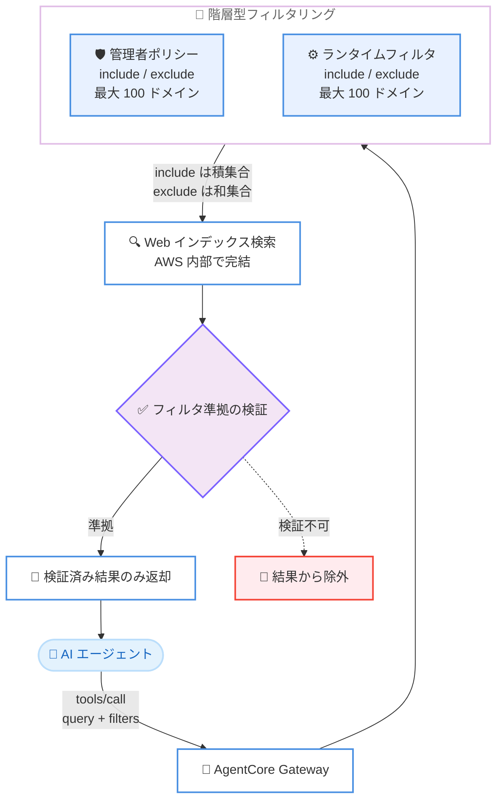

# Amazon Bedrock AgentCore - Web Search のドメイン・公開日フィルタリングとリージョン拡大

**リリース日**: 2026 年 8 月 19 日
**サービス**: Amazon Bedrock AgentCore
**機能**: Web Search Tool のランタイムドメインフィルタリング、公開日フィルタリング、欧州・アジアパシフィックへのリージョン拡大

📊 [このアップデートのインフォグラフィックを見る](https://takech9203.github.io/aws-news-summary/20260819-web-search-amazon-bedrock.html)

## 概要

Amazon Bedrock AgentCore の Web Search Tool が、ドメインフィルタリングと公開日フィルタリングをサポートしました。エージェントはリクエストごとに、どの Web ソースをどの期間の範囲で検索するかを制御できるようになります。本機能は Web Search コネクタバージョン 1.2.0 の一部として提供され、すべてのフィルタリングはサーバーサイドで実行されるため、外部のオーケストレーションや後処理は不要です。

ランタイムドメインフィルタリングでは、`tools/call` の呼び出しごとに include (許可リスト) と exclude (拒否リスト) のドメインリストを渡すことで、管理者による再設定なしに検索対象を信頼できるソースに絞り込んだり、不要なドメインをブロックしたりできます。公開日フィルタリングでは、ISO-8601 形式の UTC 日時で from と to の範囲 (両端を含む) を指定し、検索結果を特定の期間内に公開されたコンテンツのみに制限できます。管理者向けにはゲートウェイレベルの許可リストサポートが追加され、ドメイン数の上限もリストあたり最大 100 ドメインに拡大されました。

あわせて、Web Search Tool の提供リージョンが既存の米国東部 (バージニア北部) (us-east-1) に加えて、欧州 (アイルランド) (eu-west-1) とアジアパシフィック (東京) (ap-northeast-1) に拡大されました。規制業界、リサーチワークフロー、情報ソースと鮮度の厳格な管理が求められるアプリケーションに適した機能強化です。

**アップデート前の課題**

- ドメイン制限は管理者による事前設定に依存しており、リクエスト単位で検索対象ドメインを動的に変更するには管理者の再設定が必要だった
- 検索結果の公開日を制限する手段がなく、「今週の情報のみ」といった鮮度要件を満たすには、クライアント側での後処理が必要だった
- マルチテナント環境でテナントごとに異なるソースポリシーを適用するには、テナントごとに個別のゲートウェイターゲットを作成する必要があった
- Web Search Tool は米国東部 (バージニア北部) のみで提供されており、欧州やアジアパシフィックのワークロードからの利用ではレイテンシやデータ近接性の面で課題があった

**アップデート後の改善**

- `tools/call` の呼び出しごとに include / exclude のドメインリストを渡し、リクエスト単位で検索対象を動的に制御できるようになった
- `publishedDateFilter` により、公開日の範囲を指定して鮮度の保証された結果のみを取得できるようになった
- 管理者ポリシーとランタイムフィルタを組み合わせた階層型フィルタリングモデルにより、企業ガバナンスを強制しつつ呼び出しごとの柔軟な絞り込みが可能になった
- ドメインリストの上限がリストあたり最大 100 ドメインに拡大された
- 欧州 (アイルランド) とアジアパシフィック (東京) のリージョンエンドポイントから低レイテンシで利用できるようになった

## アーキテクチャ図



エージェントが `tools/call` でクエリとフィルタを送信すると、Gateway がランタイムフィルタと管理者レベルのポリシーをマージし、フィルタリングされたクエリを Web インデックスに対して実行します。フィルタ条件への準拠が検証できた結果のみがエージェントに返却され、すべての処理はサーバーサイドで完結します。

## サービスアップデートの詳細

### 主要機能

1. **ランタイムドメインフィルタリング**
   - `tools/call` の呼び出しごとに `filters.domainFilter.include` (許可リスト) と `filters.domainFilter.exclude` (拒否リスト) を指定可能
   - include に指定したドメインの結果のみが返却され、exclude に指定したドメインの結果は抑制される
   - 各リストは独立してカウントされ、それぞれ最大 100 ドメインまで指定可能
   - 管理者による再設定なしに、リクエスト単位で検索対象を動的に制御できる

2. **公開日フィルタリング**
   - `filters.publishedDateFilter.from` (最古の公開日、その日を含む) と `filters.publishedDateFilter.to` (最新の公開日、その日を含む) を ISO-8601 形式の UTC で指定
   - 検索結果を指定した期間内に公開されたコンテンツのみに制限し、鮮度の保証された結果を取得できる
   - 両フィルタともオプションであり、省略した場合は従来どおりインデックス内のすべてのコンテンツが対象となる

3. **階層型フィルタリングモデル (管理者 + ランタイム)**
   - ランタイムフィルタは管理者が設定したスコープを「狭める」ことはできるが「広げる」ことはできない設計
   - include (許可リスト) のマージ: 管理者リストとランタイムリストの積集合。両方に含まれるドメインのみが検索対象
   - exclude (拒否リスト) のマージ: 管理者リストとランタイムリストの和集合。いずれかでブロックされたドメインはブロックされる
   - 管理者向けに、コネクタリソース作成時のゲートウェイレベル許可リストサポートが新たに追加された

4. **フィルタ準拠動作 (Precision over Recall)**
   - フィルタが有効な場合、フィルタ条件に対して検証できない結果は返却されずに除外される
   - ドメインフィルタが有効な場合、認識可能なドメインを持たない結果は除外される
   - 日付フィルタが有効な場合、公開日を認識できない結果は除外される
   - 結果件数は減る可能性があるが、返却されるすべての結果はフィルタ条件を満たすことが保証される

5. **リージョン拡大**
   - 欧州 (アイルランド) (eu-west-1) とアジアパシフィック (東京) (ap-northeast-1) で新たに利用可能
   - 既存の米国東部 (バージニア北部) (us-east-1) に加わり、合計 3 リージョンで提供
   - 欧州・アジアパシフィックのワークロードから低レイテンシでアクセスでき、データ近接性要件を持つ組織に EU 内のエントリポイントを提供

## 技術仕様

### フィルタの入力スキーマ

| フィールド | 説明 |
|------|------|
| `filters.domainFilter.include` | 指定したドメインの結果のみを返却 (最大 100 ドメイン) |
| `filters.domainFilter.exclude` | 指定したドメインの結果を抑制 (最大 100 ドメイン) |
| `filters.publishedDateFilter.from` | 最古の公開日時 (ISO-8601 UTC、その時点を含む) |
| `filters.publishedDateFilter.to` | 最新の公開日時 (ISO-8601 UTC、その時点を含む) |

### フィルタのマージロジック

| フィルタ種別 | マージ方法 | 例 |
|------|------|------|
| include (許可リスト) | 積集合 | 管理者が `[a.com, b.com, c.com]`、ランタイムが `[b.com, c.com, d.com]` の場合、`b.com` と `c.com` のみ検索対象。`d.com` は管理者リストにないため暗黙的に除外 |
| exclude (拒否リスト) | 和集合 | 管理者が `[x.com]`、ランタイムが `[y.com]` の場合、両方ともブロック |

### バージョンと互換性

| 項目 | 詳細 |
|------|------|
| コネクタバージョン | 1.2.0 (マイナーリリース、破壊的変更なし) |
| 後方互換性 | `filters` オブジェクトはオプションの追加フィールドであり、既存の API 呼び出しは従来どおり動作 |
| SDK サポート | AWS SDK (Python、JavaScript/TypeScript、Java、.NET、Go、Ruby、PHP)、AWS CLI、AgentCore CLI |
| コンソールサポート | AgentCore Web Search ターゲットのコネクタ設定 UI で include / exclude ドメインリストの入力に対応 |
| アーキテクチャ | ゼロエグレス (検索クエリは AWS 内部で完結し、サードパーティの検索エンジンに送信されない) |

### 必要な IAM 権限

| 対象 | 必要な権限 |
|------|------|
| 呼び出し元のエージェント / アプリケーション | ゲートウェイ ARN に対する `bedrock-agentcore:InvokeGateway` |
| Gateway のサービスロール | `bedrock-agentcore:InvokeWebSearch` |

## 設定方法

### 前提条件

1. コネクタバージョン 1.2.0 以降に固定された Web Search ターゲットを持つ Amazon Bedrock AgentCore Gateway
2. IAM 権限の設定 (呼び出し元に `bedrock-agentcore:InvokeGateway`、Gateway サービスロールに `bedrock-agentcore:InvokeWebSearch`)
3. 最新の AWS SDK (Python、JavaScript、Java、.NET、Go、Ruby、PHP のいずれか)

### 手順

#### ステップ 1: バージョン 1.2.0 の Web Search ターゲットを作成

```python
import boto3

gateway_client = boto3.client("bedrock-agentcore-control", region_name="us-east-1")

# 管理者レベルのドメインフィルタリングを設定した
# バージョン 1.2.0 固定の Web Search ターゲットを作成
target = gateway_client.create_gateway_target(
    gatewayIdentifier="your-gateway-id",
    name="web-search-filtered",
    targetConfiguration={
        "mcp": {
            "connector": {
                "source": {"connectorId": "web-search", "version": "1.2.0"},
                "configurations": [
                    {
                        "name": "WebSearch",
                        "parameterValues": {
                            "domainFilter": {
                                "include": [
                                    "approved-wire-1.com",
                                    "approved-wire-2.com",
                                    "sec.gov",
                                    "investor.gov",
                                ],
                                "exclude": ["unreliable-source.net"],
                            }
                        },
                    }
                ],
            }
        }
    },
    credentialProviderConfigurations=[
        {"credentialProviderType": "GATEWAY_IAM_ROLE"}
    ],
)

print(f"Target ID: {target['targetId']}")
print(f"Status: {target['status']}")
```

AWS SDK for Python (Boto3) を使用して、コネクタバージョン 1.2.0 に固定した Web Search ターゲットを作成し、管理者レベルの include / exclude ドメインポリシーを設定しています。既存のバージョン 1.1.0 のターゲットがある場合は、`UpdateGatewayTarget` でバージョン 1.2.0 に更新することもできます。

#### ステップ 2: ランタイムフィルタを指定して呼び出し

```json
{
  "jsonrpc": "2.0",
  "id": "1",
  "method": "tools/call",
  "params": {
    "name": "WebSearch",
    "arguments": {
      "query": "latest SEC enforcement actions 2026",
      "filters": {
        "domainFilter": {
          "include": ["sec.gov"],
          "exclude": []
        },
        "publishedDateFilter": {
          "from": "2026-07-01T00:00:00Z",
          "to": "2026-08-04T23:59:59Z"
        }
      }
    }
  }
}
```

MCP の `tools/call` ペイロードで、検索クエリとともにランタイムフィルタを指定しています。この例では `sec.gov` のみを検索対象とし、公開日を 2026 年 7 月 1 日から 8 月 4 日までに制限しています。ランタイムの include リストは管理者リストとの積集合が取られるため、`sec.gov` が両方に含まれている場合のみ検索されます。なお、`tools/call` で指定するツール名は `tools/list` で検出される `<ターゲット名>___WebSearch` 形式の名前を使用します。

#### ステップ 3: 動的な日付ウィンドウの適用

```python
import json
from datetime import datetime, timedelta, timezone

# 過去 7 日間のウィンドウを計算
now = datetime.now(timezone.utc)
seven_days_ago = now - timedelta(days=7)

stock_update_request = json.dumps({
    "jsonrpc": "2.0",
    "id": "req-002",
    "method": "tools/call",
    "params": {
        "name": "WebSearch",
        "arguments": {
            "query": "semiconductor stocks latest developments",
            "maxResults": 15,
            "filters": {
                "publishedDateFilter": {
                    "from": seven_days_ago.strftime("%Y-%m-%dT%H:%M:%SZ"),
                    "to": now.strftime("%Y-%m-%dT%H:%M:%SZ")
                }
            }
        }
    }
})
```

実行時に過去 7 日間の日付ウィンドウを計算し、`publishedDateFilter` に設定してリクエストを構築しています。これにより、検索結果は常に直近 7 日間に公開されたコンテンツのみに制限されます。

## メリット

### ビジネス面

- **コンプライアンスの強化**: 規制業界 (金融、ヘルスケア、政府機関など) において、エージェントが参照する情報ソースを承認済みドメインのみに API レベルで強制でき、監査対応の負担を軽減できる
- **マルチテナント運用の効率化**: テナントごとに個別のゲートウェイターゲットを作成せずに、1 つのターゲットでテナント固有のソースポリシーをランタイムに適用できる
- **データ近接性要件への対応**: EU 内のエントリポイントが提供され、大西洋を越えたトラフィックルーティングなしにグラウンディングされたエージェントを構築できる

### 技術面

- **サーバーサイド強制**: フィルタリングはすべてサーバーサイドで実行され、クライアント側のフィルタリングループ、後処理、追加のラウンドトリップが不要
- **階層型ガバナンス**: ランタイムフィルタは管理者ポリシーを狭めることしかできないため、モデルの挙動に依存せず企業ポリシーが常に強制される
- **ゼロエグレスアーキテクチャ**: 検索クエリは AWS インフラストラクチャ内で完結し、サードパーティの検索エンジンへ送信されないため、コンプライアンスレビューの対象範囲を削減できる
- **低レイテンシ**: 東京リージョンを含む 3 リージョンから、ワークロードに近いリージョンエンドポイントを利用可能

## デメリット・制約事項

### 制限事項

- ドメインリストは 4 種類 (管理者 include、管理者 exclude、ランタイム include、ランタイム exclude) それぞれ最大 100 エントリまで
- ランタイムフィルタで管理者が許可していないドメインを検索したり、管理者が拒否したドメインのブロックを解除したりすることはできない (暗黙的に除外され、エラーにはならない)
- フィルタ有効時は Precision (適合率) 優先の動作となり、ドメインや公開日を検証できない結果は除外されるため、結果件数が減少する可能性がある
- 利用可能リージョンは us-east-1、eu-west-1、ap-northeast-1 の 3 リージョンに限定される

### 考慮すべき点

- ランタイムフィルタを利用するには、Web Search ターゲットをコネクタバージョン 1.2.0 以降に固定 (作成または `UpdateGatewayTarget` で更新) する必要がある
- システムプロンプトでモデルにフィルタ指定を指示する方式はハードな強制にはならない。確実な強制にはターゲットレベルの管理者 include リスト、または `tools/call` ペイロードへの直接指定を使用する
- ランタイム include リストは管理者リストとの積集合になるため、管理者リストの設計がランタイムの柔軟性の上限を決定する

## ユースケース

### ユースケース 1: 規制対応リサーチアシスタント (製薬業界)

**シナリオ**: 製薬企業の薬事部門向けリサーチアシスタントで、社内ポリシーによりすべての回答は FDA、NIH、ClinicalTrials.gov のみを引用する必要がある。健康系ブログからの引用は監査で問題となるコンプライアンス違反にあたる。

**実装例**:
```json
{
  "name": "WebSearch",
  "arguments": {
    "query": "FDA drug approval process 2026 guidance",
    "maxResults": 10,
    "filters": {
      "domainFilter": {
        "include": ["fda.gov", "nih.gov", "clinicaltrials.gov"]
      }
    }
  }
}
```

**効果**: すべての検索結果が承認済みの規制ソースに限定される。クエリに対して他サイトの記事が上位にランクされていても、モデルのコンテキストウィンドウに入ることはない。

### ユースケース 2: 鮮度保証付きの株式情報エージェント

**シナリオ**: トレーディングデスクで稼働する株式アップデート生成エージェントで、「半導体株の最新動向は?」という質問に対して前四半期の古い分析記事を参照してしまうと、トレーダーの判断を誤らせるリスクがある。すべての結果を過去 7 日以内のものに限定したい。

**実装例**:
```json
{
  "name": "WebSearch",
  "arguments": {
    "query": "semiconductor stocks latest developments",
    "maxResults": 15,
    "filters": {
      "publishedDateFilter": {
        "from": "2026-08-12T00:00:00Z",
        "to": "2026-08-19T23:59:59Z"
      }
    }
  }
}
```

**効果**: 過去 7 日間に公開されたコンテンツのみが返却され、公開日を検証できない結果は除外される。古い分析記事がモデルに到達することがなくなる。

### ユースケース 3: テナント別ソースポリシーを持つ SaaS プラットフォーム

**シナリオ**: ヘルスケア、法務、金融サービスの顧客にリサーチエージェントを提供する SaaS プラットフォームで、各テナントは契約上合意されたソースポリシーを持つ。200 以上のテナントに対して個別のゲートウェイターゲットを作成するのは現実的ではない。

**実装例**:
```python
# テナントごとのドメインポリシー (設定データベースから取得)
TENANT_POLICIES = {
    "tenant-healthcare": {
        "include": ["pubmed.ncbi.nlm.nih.gov", "who.int", "cdc.gov"],
        "exclude": ["example-consumer-health-site.com"],
    },
    "tenant-legal": {
        "include": ["law.cornell.edu", "supremecourt.gov", "uscourts.gov"],
        "exclude": [],
    },
    "tenant-finance": {
        "include": ["sec.gov", "federalreserve.gov"],
        "exclude": ["example-social-forum-site.com"],
    },
}
# リクエスト時にテナント ID に応じたポリシーを
# filters.domainFilter としてランタイムに適用する
```

**効果**: 1 つのゲートウェイターゲットで 200 テナントにサービスを提供しつつ、各テナント固有のソースポリシーを呼び出し時に動的に強制できる。共有インフラストラクチャ上でもテナント間のポリシー分離が保たれる。

## 料金

Amazon Bedrock AgentCore は従量課金制であり、Web Search Tool の利用には AgentCore の料金体系が適用されます。今回のフィルタリング機能は Web Search コネクタのマイナーバージョンアップとして提供され、追加料金に関する発表はありません。最新の料金詳細は [Amazon Bedrock AgentCore 料金ページ](https://aws.amazon.com/bedrock/agentcore/pricing/) を参照してください。

## 利用可能リージョン

Web Search Tool のランタイムドメイン・公開日フィルタリングは、以下の 3 リージョンで利用可能です。

- 米国東部 (バージニア北部) (us-east-1) - 既存
- 欧州 (アイルランド) (eu-west-1) - 新規
- アジアパシフィック (東京) (ap-northeast-1) - 新規

## 関連サービス・機能

- **Amazon Bedrock AgentCore Gateway**: Web Search Tool の提供基盤。MCP (Model Context Protocol) 互換のマネージドエンドポイントとしてエージェントとツールを接続する
- **AWS IAM**: `bedrock-agentcore:InvokeGateway` および `bedrock-agentcore:InvokeWebSearch` 権限による IAM ネイティブな認証・認可
- **Strands Agents SDK**: MCP クライアント経由で Web Search Tool を利用するエージェントの構築に活用できるオープンソースのエージェントフレームワーク
- **Amazon Bedrock AgentCore Memory / Runtime**: エージェントの本番運用に必要なメモリ管理や実行基盤を提供する AgentCore の関連機能

## 参考リンク

- 📊 [インフォグラフィック](https://takech9203.github.io/aws-news-summary/20260819-web-search-amazon-bedrock.html)
- [公式発表 (What's New)](https://aws.amazon.com/about-aws/whats-new/2026/08/web-search-amazon-bedrock/)
- [AWS Blog: Domain and publish date filters for Web Search on AgentCore](https://aws.amazon.com/blogs/machine-learning/domain-and-publish-date-filters-for-web-search-on-agentcore/)
- [ドキュメント: Web Search Tool (Amazon Bedrock AgentCore Developer Guide)](https://docs.aws.amazon.com/bedrock-agentcore/latest/devguide/gateway-target-connector-web-search-tool.html)
- [ドキュメント: ドメインフィルタリングの設定](https://docs.aws.amazon.com/bedrock-agentcore/latest/devguide/gateway-target-connector-web-search-tool.html#gateway-target-connector-web-search-tool-domain-filtering)
- [ドキュメント: 入力スキーマリファレンス](https://docs.aws.amazon.com/bedrock-agentcore/latest/devguide/gateway-target-connector-web-search-tool.html#gateway-target-connector-web-search-tool-input-schema)
- [料金ページ](https://aws.amazon.com/bedrock/agentcore/pricing/)

## まとめ

Web Search Tool のランタイムドメイン・公開日フィルタリングにより、AgentCore 上のエージェントは呼び出し単位で情報ソースと鮮度を精密に制御できるようになり、規制業界やマルチテナント環境でのポリシー準拠エージェントの構築が大幅に容易になりました。東京リージョンでの提供開始により、日本のワークロードからも低レイテンシで利用できます。既存の Web Search ターゲットを利用している場合は、コネクタバージョン 1.2.0 への更新と、管理者レベルの許可リスト設計から着手することを推奨します。
