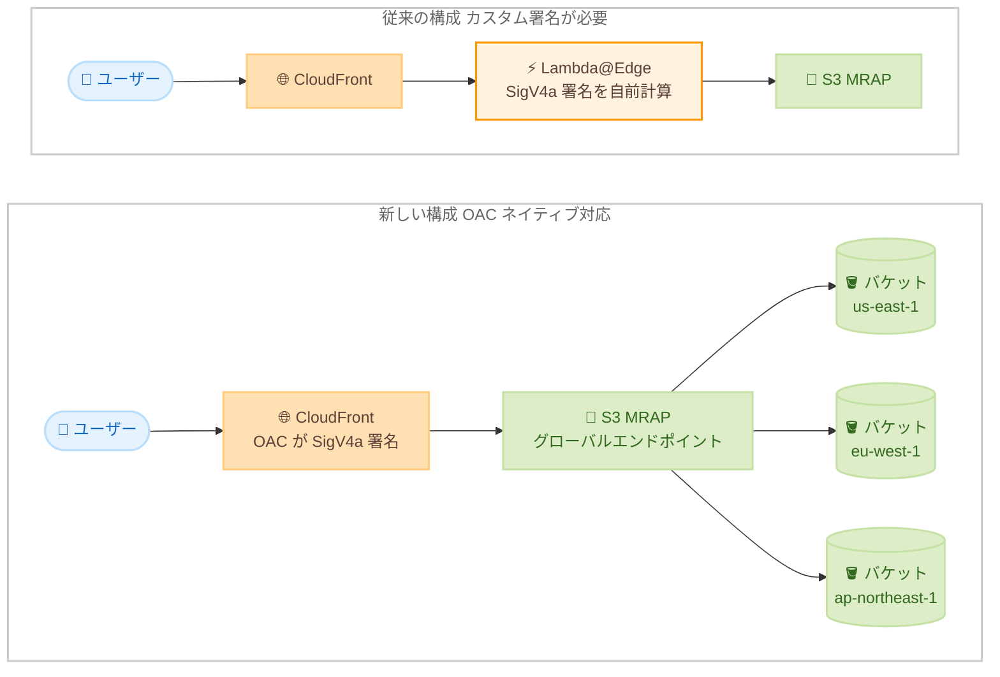

# Amazon CloudFront - S3 Multi-Region Access Points 向け Origin Access Control (OAC) サポート

**リリース日**: 2026 年 8 月 20 日
**サービス**: Amazon CloudFront / Amazon S3
**機能**: Origin Access Control (OAC) for Amazon S3 Multi-Region Access Points

📊 [このアップデートのインフォグラフィックを見る](https://takech9203.github.io/aws-news-summary/20260820-amazon-cloudfront-oac-s3-mrap.html)

## 概要

Amazon CloudFront が、Amazon S3 Multi-Region Access Points (MRAP) をオリジンとする場合の Origin Access Control (OAC) のネイティブサポートを発表しました。これにより、指定した CloudFront ディストリビューションのみが MRAP エンドポイントにアクセスできるように制限し、オリジンへの直接アクセスを防止できます。

S3 MRAP は、複数リージョンにレプリケートされたバケットへのリクエストを、ネットワークレイテンシーに基づいて最も近いリージョンへルーティングする単一のグローバルエンドポイントを提供します。CloudFront と組み合わせることで、キャッシュミス時に最寄りのリージョンからコンテンツを取得でき、グローバルに分散したユーザーへの配信パフォーマンスと耐障害性が向上します。

今回のアップデートにより、CloudFront が MRAP オリジンへのリクエストに対して Asymmetric Signature Version 4 (SigV4a) 署名をネイティブに実行するようになり、これまで必要だった Lambda@Edge によるカスタム署名処理が不要になりました。マルチリージョン構成で静的コンテンツを配信するすべてのユーザーにとって、セキュリティと運用性の両面で価値のあるアップデートです。

**アップデート前の課題**

- 以前は CloudFront から S3 MRAP オリジンへのアクセスを制限するために、Lambda@Edge のカスタム関数で SigV4a の Authorization ヘッダーを自前で計算・付与する必要があった
- カスタム署名ロジックの実装・保守が必要で、運用負荷とエラーのリスクが高かった
- Lambda@Edge の実行コストと追加レイテンシーが発生していた
- 標準の S3 バケットオリジンで利用できる OAC と同等のシンプルなアクセス制限を MRAP では利用できなかった

**アップデート後の改善**

- CloudFront が MRAP オリジンへのリクエストを SigV4a でネイティブに署名するため、カスタムの Lambda@Edge 関数が不要になった
- MRAP ポリシーとバケットポリシーで CloudFront サービスプリンシパルを許可するだけで、特定のディストリビューションのみにアクセスを制限できるようになった
- CloudFront コンソール、SDK、CLI、CloudFormation から OAC を有効化するだけで設定が完了するようになった
- SSE-KMS で暗号化されたオブジェクトの配信にも対応した

## アーキテクチャ図



従来は Lambda@Edge で SigV4a 署名を自前計算する必要がありましたが、今回のアップデートにより CloudFront の OAC がネイティブに署名を行い、最寄りのリージョンのバケットへ安全にルーティングされます。

## サービスアップデートの詳細

### 主要機能

1. **SigV4a によるネイティブ署名**
   - CloudFront が S3 MRAP オリジンへのリクエストを Asymmetric Signature Version 4 (SigV4a) で自動的に署名
   - SigV4a はマルチリージョンエンドポイントに対応した署名方式で、MRAP のグローバルエンドポイントへのリクエスト認証に必要
   - OAC 作成時に `SigningProtocol: sigv4a` を指定することで有効化

2. **ディストリビューション単位のアクセス制限**
   - MRAP ポリシーの `Condition` 要素で `aws:SourceArn` を指定し、特定の CloudFront ディストリビューションからのアクセスのみを許可
   - CloudFront サービスプリンシパル (`cloudfront.amazonaws.com`) を使用したポリシーベースの制御
   - オリジンへの直接アクセスを防ぎ、CloudFront 経由のみの配信を強制可能

3. **SSE-KMS 暗号化オブジェクトへの対応**
   - AWS KMS による サーバーサイド暗号化 (SSE-KMS) されたオブジェクトの配信をサポート
   - 各リージョンの KMS キーポリシーに CloudFront への許可ステートメントを追加することで利用可能

4. **既存の管理ツールとの統合**
   - CloudFront コンソール、SDK、AWS CLI、CloudFormation から設定可能
   - 標準の S3 バケットオリジン向け OAC と同じ署名動作オプション (`always`、`never`、`no-override`) を利用可能

## 技術仕様

### OAC 設定パラメータ

| 項目 | 詳細 |
|------|------|
| SigningProtocol | `sigv4a` (MRAP オリジンの場合) |
| SigningBehavior | `always` (推奨)、`never`、`no-override` |
| OriginAccessControlOriginType | `s3` |
| オリジンドメイン形式 | `{MRAP エイリアス}.accesspoint.s3-global.amazonaws.com` |
| 対応管理ツール | コンソール、SDK、CLI、CloudFormation |

### MRAP ポリシー例

```json
{
    "Version": "2012-10-17",
    "Statement": [
        {
            "Sid": "AllowCloudFrontOACAccess",
            "Effect": "Allow",
            "Principal": {
                "Service": "cloudfront.amazonaws.com"
            },
            "Action": "s3:GetObject",
            "Resource": "arn:aws:s3::111122223333:accesspoint/MyMRAPAlias.mrap/object/*",
            "Condition": {
                "StringEquals": {
                    "aws:SourceArn": "arn:aws:cloudfront::111122223333:distribution/EDFDVBD6EXAMPLE"
                }
            }
        }
    ]
}
```

MRAP ポリシーに加えて、MRAP に関連付けられた**すべての**基盤バケットにも CloudFront への許可 (または MRAP へのアクセス委任) を設定するバケットポリシーが必要です。

## 設定方法

### 前提条件

1. S3 Multi-Region Access Point が作成済みで、複数リージョンのバケットが関連付けられていること
2. CloudFront ディストリビューションのオリジンドメインが MRAP のホスト名形式 (`{MRAP エイリアス}.accesspoint.s3-global.amazonaws.com`) であること
3. MRAP に関連付けられたすべてのバケットが、デフォルトで有効なリージョンにあること (オプトインリージョンは非対応)

### 手順

#### ステップ 1: OAC の作成

```bash
aws cloudfront create-origin-access-control \
    --origin-access-control-config '{
        "Name": "my-s3-mrap-oac",
        "Description": "OAC for S3 Multi-Region Access Point",
        "SigningProtocol": "sigv4a",
        "SigningBehavior": "always",
        "OriginAccessControlOriginType": "s3"
    }'
```

SigV4a 署名プロトコルを使用する OAC を作成します。`SigningBehavior` を `always` に設定することで、CloudFront はオリジンへのすべてのリクエストに署名を付与します。コンソールの場合は、オリジンタイプで **S3** を選択し、**Use SigV4a signing protocol** オプションを有効にします。

#### ステップ 2: ディストリビューションのオリジンに OAC を関連付け

CloudFront コンソールで対象ディストリビューションの **Origins** タブを開き、S3 MRAP オリジンを編集して **Origin access control settings** を選択し、作成した OAC を指定して保存します。設定がエッジロケーションに反映されると、CloudFront はオリジンへのすべてのリクエストに署名を行います。

#### ステップ 3: MRAP ポリシーとバケットポリシーの更新

MRAP ポリシーに CloudFront サービスプリンシパルへの許可を追加し (上記のポリシー例を参照)、さらに MRAP に関連付けられた各バケットに以下のいずれかのポリシーを設定します。

- **オプション 1**: 各バケットで CloudFront サービスプリンシパルに `s3:GetObject` を許可する (バケットへの直接アクセスも必要な場合)
- **オプション 2**: `s3:DataAccessPointArn` 条件を使用して、バケットへのアクセスを MRAP に完全に委任する (推奨、アクセス管理を MRAP ポリシーに一元化)

SSE-KMS を使用している場合は、各リージョンの KMS キーポリシーに CloudFront への `kms:Decrypt` などの許可を追加します。

## メリット

### ビジネス面

- **運用コストの削減**: Lambda@Edge のカスタム署名関数が不要になり、実装・保守の工数と実行コストを削減できる
- **グローバル配信品質の向上**: キャッシュミス時に最寄りのリージョンからコンテンツを取得するため、世界中のユーザーへの応答性が向上する
- **追加費用なし**: 本機能自体に追加料金は発生しない

### 技術面

- **セキュリティの強化**: MRAP エンドポイントへのアクセスを特定の CloudFront ディストリビューションのみに制限し、オリジンへの直接アクセスを防止できる
- **構成のシンプル化**: カスタムコードを排除し、標準の S3 オリジンと同様の宣言的な OAC 設定に統一できる
- **耐障害性の向上**: MRAP のリージョン間ルーティングにより、単一リージョン障害時にも他リージョンのバケットから配信を継続できる

## デメリット・制約事項

### 制限事項

- オプトインリージョンのバケットを含む MRAP では OAC を利用できない。オプトインリージョンのバケットへルーティングされたリクエストは失敗するため、すべてのバケットがデフォルト有効リージョンにある必要がある
- SigV4a OAC を使用するオリジンでは、Lambda@Edge のオリジンリクエストトリガーを併用できない (オリジングループ経由のアクセスを含む)
- CloudFront の中国リージョンでは利用できない

### 考慮すべき点

- MRAP に関連付けられた**すべての**バケットにポリシー設定が必要。設定漏れのバケットにルーティングされたリクエストは拒否される
- SSE-KMS を使用する場合、基盤バケットが存在する各リージョンの KMS キーポリシーに CloudFront への許可を追加する必要がある
- MRAP 自体にはデータルーティング料金などの標準料金が発生するため、単一リージョンの S3 オリジンと比較してコストを評価する必要がある

## ユースケース

### ユースケース 1: グローバル向け静的コンテンツ配信の高速化

**シナリオ**: 世界各地のユーザーに画像や動画などの静的コンテンツを配信しており、キャッシュミス時のオリジンフェッチのレイテンシーを削減したい。

**実装例**:
```
1. us-east-1、eu-west-1、ap-northeast-1 にバケットを作成し、S3 レプリケーションを設定
2. 3 バケットを関連付けた MRAP を作成
3. CloudFront オリジンに MRAP エイリアスのグローバルエンドポイントを指定
4. SigV4a の OAC を作成してオリジンに関連付け
5. MRAP ポリシーと各バケットポリシーで CloudFront のみを許可
```

**効果**: キャッシュミス時にエッジロケーションから最寄りのリージョンのバケットへフェッチされ、オリジンレイテンシーが短縮される。オリジンへの直接アクセスも防止できる。

### ユースケース 2: Lambda@Edge カスタム署名からの移行

**シナリオ**: 既存の CloudFront + S3 MRAP 構成で、Lambda@Edge により SigV4a 署名を自前実装しており、保守負荷とコストを削減したい。

**実装例**:
```
1. SigV4a の OAC を作成し、MRAP オリジンに関連付け
2. MRAP ポリシーとバケットポリシーを OAC 用に更新
3. 動作確認後、署名用の Lambda@Edge オリジンリクエストトリガーを削除
   (SigV4a OAC とオリジンリクエストトリガーは併用不可のため削除が必須)
```

**効果**: カスタム署名コードの保守が不要になり、Lambda@Edge の実行コストと追加レイテンシーを削減できる。

### ユースケース 3: マルチリージョン構成での可用性向上

**シナリオ**: ミッションクリティカルなコンテンツ配信で、単一リージョンの障害時にも配信を継続できる構成をセキュアに実現したい。

**実装例**:
```
1. 複数リージョンにレプリケートされたバケットで MRAP を構成
2. CloudFront + OAC で MRAP をオリジンとして配信
3. 各バケットにはオプション 2 のポリシーで MRAP にアクセスを委任し、
   アクセス制御を MRAP ポリシーに一元化
```

**効果**: リージョン障害時には MRAP が他リージョンのバケットへ自動的にルーティングし、配信を継続できる。アクセス管理も MRAP ポリシーに集約され運用がシンプルになる。

## 料金

本機能の利用に追加料金は発生しません。CloudFront のデータ転送・リクエスト料金、および S3 Multi-Region Access Points の標準料金 (データルーティング料金など) が通常どおり適用されます。

## 利用可能リージョン

CloudFront の中国リージョンを除く、全世界で利用可能です。なお、MRAP に関連付けるバケットはデフォルトで有効なリージョンにある必要があります (オプトインリージョンは非対応)。

## 関連サービス・機能

- **Amazon S3 Multi-Region Access Points**: 複数リージョンのバケットへのリクエストをレイテンシーに基づいてルーティングするグローバルエンドポイント。本アップデートのオリジンとなる機能
- **Origin Access Control (OAC)**: CloudFront からオリジンへのアクセスを署名付きリクエストで制限する仕組み。標準の S3 バケット、Lambda 関数 URL、MediaStore などに対応しており、今回 MRAP が追加された
- **AWS KMS**: SSE-KMS で暗号化されたオブジェクトを配信する場合、各リージョンのキーポリシーで CloudFront への許可が必要
- **Lambda@Edge**: 従来は SigV4a 署名の実装に使用されていたが、本アップデートで署名用途では不要になった

## 参考リンク

- 📊 [インフォグラフィック](https://takech9203.github.io/aws-news-summary/20260820-amazon-cloudfront-oac-s3-mrap.html)
- [公式発表 (What's New)](https://aws.amazon.com/about-aws/whats-new/2026/08/amazon-cloudfront-oac-s3-mrap)
- [ドキュメント: Restrict access to an Amazon S3 Multi-Region Access Point origin](https://docs.aws.amazon.com/AmazonCloudFront/latest/DeveloperGuide/private-content-restricting-access-to-s3-mrap.html)
- [ドキュメント: Creating Multi-Region Access Points](https://docs.aws.amazon.com/AmazonS3/latest/userguide/CreatingMultiRegionAccessPoints.html)
- [料金ページ: Amazon CloudFront](https://aws.amazon.com/cloudfront/pricing/)

## まとめ

CloudFront の OAC が S3 Multi-Region Access Points にネイティブ対応したことで、Lambda@Edge による SigV4a 署名の自前実装が不要になり、マルチリージョン配信のセキュリティ確保が大幅にシンプルになりました。既に Lambda@Edge で署名を実装している場合は OAC への移行を、グローバル配信の高速化・高可用化を検討している場合は CloudFront + MRAP + OAC 構成の採用を推奨します。移行時は、すべての基盤バケットへのポリシー設定と、オプトインリージョンおよび Lambda@Edge オリジンリクエストトリガーの制約に注意してください。
