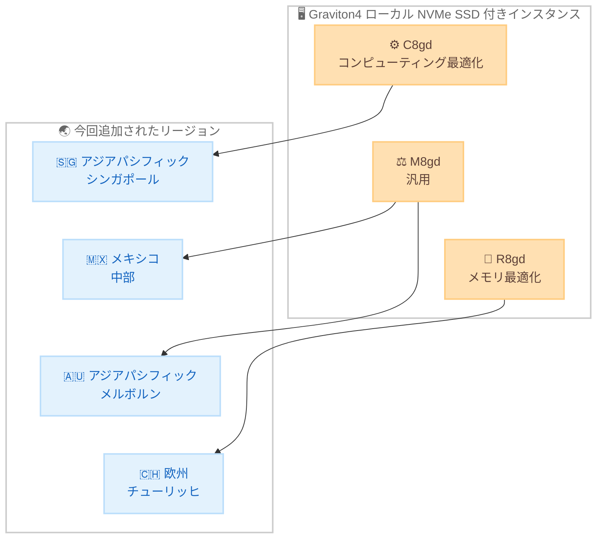

# Amazon EC2 - C8gd / M8gd / R8gd インスタンスの利用可能リージョン拡大

**リリース日**: 2026 年 8 月 20 日
**サービス**: Amazon EC2
**機能**: AWS Graviton4 搭載ローカル NVMe SSD ストレージ付きインスタンス (C8gd / M8gd / R8gd) のリージョン拡大

📊 [このアップデートのインフォグラフィックを見る](https://takech9203.github.io/aws-news-summary/20260820-amazon-ec2-c8gd-m8gd.html)

## 概要

AWS Graviton4 プロセッサを搭載し、ローカル NVMe ベース SSD ストレージを備えた Amazon EC2 C8gd、M8gd、R8gd インスタンスが、新たに追加のリージョンで利用可能になりました。今回の拡大では、C8gd がアジアパシフィック (シンガポール)、M8gd がメキシコ (中部) とアジアパシフィック (メルボルン)、R8gd が欧州 (チューリッヒ) の各リージョンで利用できるようになります。

これらのインスタンスは AWS Nitro System 上に構築されており、Graviton3 ベースの前世代インスタンス (C7gd / M7gd / R7gd) と比較して最大 30% 高いコンピューティング性能を発揮します。最大 11.4 TB のローカル NVMe ベース SSD ブロックレベルストレージを備え、I/O 集約型のデータベースワークロードで最大 40% 高い性能、I/O 集約型のリアルタイムデータ分析で最大 20% 高速なクエリ結果を実現します。

高速かつ低レイテンシーなローカルストレージを必要とするデータベース、リアルタイム分析、キャッシュなどのワークロードを上記リージョンで運用しているユーザーは、Graviton4 の価格性能上の利点をローカルストレージ付きインスタンスで享受できるようになります。

**アップデート前の課題**

今回の対象リージョンでは、以前は以下の制約がありました。

- シンガポール、メキシコ (中部)、メルボルン、チューリッヒの各リージョンでは、ローカル NVMe SSD 付きの Graviton4 インスタンス (該当ファミリー) を利用できなかった
- ローカルストレージが必要なワークロードでは、前世代の Graviton3 ベースインスタンス (C7gd / M7gd / R7gd など) を使い続ける必要があった
- データレジデンシーや低レイテンシー要件により当該リージョンから移動できないワークロードは、Graviton4 の性能向上の恩恵を受けられなかった

**アップデート後の改善**

今回のアップデートにより、以下が可能になりました。

- 上記 4 リージョンで C8gd / M8gd / R8gd インスタンスを起動し、Graviton3 世代比で最大 30% 高いコンピューティング性能を利用できるようになった
- 最大 11.4 TB のローカル NVMe SSD により、I/O 集約型データベースで最大 40%、リアルタイムデータ分析のクエリで最大 20% の性能向上を各リージョン内で実現できるようになった
- リージョン要件のあるワークロードでも、インスタンス世代の更新によるコスト効率と性能の改善を進められるようになった

## アーキテクチャ図



各インスタンスファミリーと今回新たに利用可能になったリージョンの対応関係を示しています。

## サービスアップデートの詳細

### 主要機能

1. **リージョン拡大の内容**
   - C8gd: アジアパシフィック (シンガポール) リージョンで利用可能に
   - M8gd: メキシコ (中部) およびアジアパシフィック (メルボルン) リージョンで利用可能に
   - R8gd: 欧州 (チューリッヒ) リージョンで利用可能に

2. **AWS Graviton4 による性能向上**
   - Graviton3 ベースのインスタンスと比較して最大 30% 高いコンピューティング性能
   - I/O 集約型データベースワークロードで最大 40% 高い性能
   - I/O 集約型リアルタイムデータ分析で最大 20% 高速なクエリ結果

3. **ローカル NVMe SSD ストレージ**
   - 最大 11.4 TB のローカル NVMe ベース SSD ブロックレベルストレージを搭載
   - AWS Nitro System 上に構築され、高速・低レイテンシーなローカルストレージアクセスを提供
   - ストレージがインスタンスの物理ホストに直接接続されるため、一時データ処理やキャッシュに最適

4. **柔軟なサイズとネットワーク構成**
   - 各ファミリーとも 12 種類のインスタンスサイズを提供
   - 最大 50 Gbps のネットワーク帯域幅、最大 40 Gbps の Amazon EBS 帯域幅
   - EC2 インスタンス帯域幅重み付け設定により、ネットワークと EBS の帯域幅配分を 25% 調整可能
   - EFA (Elastic Fabric Adapter) を 24xlarge、48xlarge、metal-24xl、metal-48xl サイズでサポート

## 技術仕様

### インスタンスファミリーの概要

| 項目 | 詳細 |
|------|------|
| プロセッサ | AWS Graviton4 (Arm ベース) |
| ローカルストレージ | 最大 11.4 TB の NVMe ベース SSD |
| インスタンスサイズ | 各ファミリー 12 サイズ (metal-24xl、metal-48xl を含む) |
| ネットワーク帯域幅 | 最大 50 Gbps |
| Amazon EBS 帯域幅 | 最大 40 Gbps |
| 帯域幅の柔軟性 | インスタンス帯域幅重み付けにより 25% の配分調整が可能 |
| EFA サポート | 24xlarge / 48xlarge / metal-24xl / metal-48xl |
| 基盤 | AWS Nitro System |

### ファミリー別の想定ワークロード

| ファミリー | タイプ | 主な用途 |
|-----------|--------|----------|
| C8gd | コンピューティング最適化 | 高性能ウェブサーバー、バッチ処理、分散分析、広告配信、動画エンコーディング、ゲームサーバー |
| M8gd | 汎用 | アプリケーションサーバー、マイクロサービス、エンタープライズアプリケーション、中小規模データベース |
| R8gd | メモリ最適化 | インメモリデータベース、リアルタイムビッグデータ分析、大規模インメモリキャッシュ、科学計算 |

## 設定方法

### 前提条件

1. 対象リージョン (シンガポール、メキシコ中部、メルボルン、チューリッヒ) が AWS アカウントで有効化されていること
2. Arm64 (aarch64) アーキテクチャに対応した AMI を使用すること
3. 既存の x86 ワークロードを移行する場合は、アプリケーションの Arm 対応状況を確認すること

### 手順

#### ステップ 1: 対象リージョンでのインスタンスタイプ提供状況の確認

```bash
aws ec2 describe-instance-type-offerings \
  --region ap-southeast-1 \
  --filters "Name=instance-type,Values=c8gd.*" \
  --query "InstanceTypeOfferings[].InstanceType" \
  --output table
```

シンガポールリージョンで利用可能な C8gd インスタンスサイズの一覧を取得します。M8gd はメキシコ中部 (mx-central-1) やメルボルン (ap-southeast-4)、R8gd はチューリッヒ (eu-central-2) に対して同様に確認します。

#### ステップ 2: Arm64 対応 AMI の確認

```bash
aws ec2 describe-images \
  --region ap-southeast-1 \
  --owners amazon \
  --filters "Name=architecture,Values=arm64" \
            "Name=name,Values=al2023-ami-2023*" \
  --query "sort_by(Images, &CreationDate)[-1].{ImageId:ImageId,Name:Name}"
```

Graviton4 インスタンスで使用できる最新の Arm64 版 Amazon Linux 2023 AMI を検索します。

#### ステップ 3: インスタンスの起動とローカル NVMe ストレージの利用

```bash
aws ec2 run-instances \
  --region ap-southeast-1 \
  --instance-type c8gd.xlarge \
  --image-id ami-xxxxxxxxxxxxxxxxx \
  --key-name my-key-pair \
  --subnet-id subnet-xxxxxxxx
```

C8gd インスタンスを起動します。ローカル NVMe SSD はインスタンスストアボリュームとして提供されるため、起動後に OS 上でファイルシステムを作成してマウントします。インスタンスストアのデータはインスタンスの停止・終了時に失われる点に注意してください。

## メリット

### ビジネス面

- **価格性能の改善**: Graviton3 世代比で最大 30% の性能向上により、同じワークロードをより少ないインスタンス数またはより小さいサイズで処理でき、コスト最適化につながる
- **データレジデンシー要件への対応**: シンガポール、メキシコ、オーストラリア、スイスといったデータ所在地要件が厳しい国・地域で、最新世代インスタンスを利用可能になった
- **エンドユーザー体験の向上**: ユーザーに近いリージョンで高性能インスタンスを実行することで、レイテンシーを抑えたサービス提供が可能

### 技術面

- **I/O 性能の向上**: ローカル NVMe SSD により、I/O 集約型データベースで最大 40%、リアルタイム分析クエリで最大 20% の性能向上を実現
- **帯域幅の柔軟な配分**: インスタンス帯域幅重み付け設定により、ワークロード特性に応じてネットワークと EBS の帯域幅配分を 25% 調整可能
- **大規模分散処理への対応**: 大型サイズでの EFA サポートにより、ノード間通信のレイテンシーが重要な分散ワークロードにも対応

## デメリット・制約事項

### 制限事項

- ローカル NVMe SSD はインスタンスストアであり、インスタンスの停止・休止・終了時にデータが失われるため、永続化が必要なデータには Amazon EBS や Amazon S3 との併用が必要
- Arm64 アーキテクチャのため、x86 専用のバイナリやライブラリに依存するアプリケーションはそのままでは動作せず、再ビルドや移行作業が必要
- EFA は 24xlarge、48xlarge、metal-24xl、metal-48xl の大型サイズに限定される

### 考慮すべき点

- 今回追加されたリージョンとインスタンスファミリーの組み合わせは限定的 (C8gd はシンガポールのみ、R8gd はチューリッヒのみなど) であるため、必要な組み合わせが提供されているか事前確認が必要
- x86 からの移行では、AWS Graviton Fast Start プログラムや Porting Advisor for Graviton を活用した互換性評価を推奨
- リージョンごとにインスタンス料金が異なるため、移行前に対象リージョンの料金を確認すること

## ユースケース

### ユースケース 1: シンガポールでの動画エンコーディング基盤の高速化

**シナリオ**: 東南アジア向けに動画配信サービスを提供しており、シンガポールリージョンでエンコーディング処理を実行している。一時ファイルの読み書きがボトルネックになっている。

**実装例**:
```bash
# C8gd インスタンスでローカル NVMe をエンコーディングの一時領域として使用
sudo mkfs -t xfs /dev/nvme1n1
sudo mkdir -p /scratch
sudo mount /dev/nvme1n1 /scratch
ffmpeg -i /scratch/input.mp4 -c:v libx264 /scratch/output.mp4
```

**効果**: ローカル NVMe SSD を一時領域として使用することで、エンコーディング処理の I/O ボトルネックを解消し、Graviton4 の性能向上と合わせてジョブ完了時間を短縮できる。

### ユースケース 2: チューリッヒでのインメモリデータベース運用

**シナリオ**: スイスの金融機関がデータ所在地要件により、チューリッヒリージョンでインメモリデータベースと大規模キャッシュを運用している。前世代インスタンスの性能とストレージ容量に制約を感じている。

**実装例**:
```bash
# R8gd インスタンスで NVMe をデータベースの高速ローカル領域として利用
aws ec2 run-instances \
  --region eu-central-2 \
  --instance-type r8gd.8xlarge \
  --image-id ami-xxxxxxxxxxxxxxxxx
```

**効果**: データをスイス国内に保持したまま、I/O 集約型データベースワークロードで最大 40% の性能向上を実現し、データレジデンシー要件と性能要件を両立できる。

### ユースケース 3: メキシコ・メルボルンでのマイクロサービス基盤の世代更新

**シナリオ**: メキシコ中部とメルボルンのリージョンで M7gd ベースのマイクロサービス基盤を運用しており、コスト効率の改善を検討している。

**実装例**:
```bash
# 起動テンプレートのインスタンスタイプを M8gd に更新
aws ec2 create-launch-template-version \
  --region ap-southeast-4 \
  --launch-template-id lt-xxxxxxxx \
  --source-version 1 \
  --launch-template-data '{"InstanceType":"m8gd.2xlarge"}'
```

**効果**: 同一の Arm64 AMI をそのまま利用して世代更新でき、最大 30% の性能向上によりインスタンス数の削減やレスポンス改善が期待できる。

## 料金

C8gd / M8gd / R8gd インスタンスは、オンデマンド、Savings Plans、スポットインスタンスなどの EC2 の標準的な購入オプションで利用できます。料金はリージョンおよびインスタンスサイズによって異なるため、詳細は [Amazon EC2 料金ページ](https://aws.amazon.com/ec2/pricing/) を参照してください。

ローカル NVMe SSD ストレージはインスタンス料金に含まれており、追加のストレージ料金は発生しません。

## 利用可能リージョン

今回のアップデートで追加されたリージョンは以下のとおりです。

| インスタンスファミリー | 追加リージョン |
|----------------------|----------------|
| C8gd | アジアパシフィック (シンガポール) |
| M8gd | メキシコ (中部)、アジアパシフィック (メルボルン) |
| R8gd | 欧州 (チューリッヒ) |

既存の提供リージョンを含む最新の対応状況は、各インスタンスタイプの詳細ページを参照してください。

## 関連サービス・機能

- **AWS Graviton4**: 本インスタンスファミリーに搭載される Arm ベースの AWS 設計プロセッサ。前世代比で大幅な価格性能向上を実現
- **AWS Nitro System**: 仮想化機能を専用ハードウェアにオフロードし、ホストリソースのほぼすべてをインスタンスに提供する基盤技術
- **Elastic Fabric Adapter (EFA)**: 大型サイズで利用可能な低レイテンシーネットワークインターフェイス。分散ワークロードのノード間通信を高速化
- **AWS Graviton Fast Start プログラム / Porting Advisor for Graviton**: x86 から Graviton への移行を支援するプログラムおよびツール

## 参考リンク

- 📊 [インフォグラフィック](https://takech9203.github.io/aws-news-summary/20260820-amazon-ec2-c8gd-m8gd.html)
- [公式発表 (What's New)](https://aws.amazon.com/about-aws/whats-new/2026/08/amazon-ec2-c8gd-m8gd/)
- [Amazon EC2 C8g / C8gd インスタンス](https://aws.amazon.com/ec2/instance-types/c8g/)
- [Amazon EC2 M8g / M8gd インスタンス](https://aws.amazon.com/ec2/instance-types/m8g/)
- [Amazon EC2 R8g / R8gd インスタンス](https://aws.amazon.com/ec2/instance-types/r8g/)
- [AWS Graviton プロセッサ](https://aws.amazon.com/ec2/graviton/)
- [Porting Advisor for Graviton (GitHub)](https://github.com/aws/porting-advisor-for-graviton)
- [Amazon EC2 料金ページ](https://aws.amazon.com/ec2/pricing/)

## まとめ

AWS Graviton4 とローカル NVMe SSD を組み合わせた C8gd / M8gd / R8gd インスタンスが、シンガポール、メキシコ (中部)、メルボルン、チューリッヒの各リージョンに拡大されました。これらのリージョンで I/O 集約型のデータベースやリアルタイム分析、キャッシュワークロードを運用している場合は、前世代からの移行による性能向上とコスト最適化を検討することを推奨します。x86 からの移行を検討する場合は、Porting Advisor for Graviton などの支援ツールを活用して互換性を評価してください。
