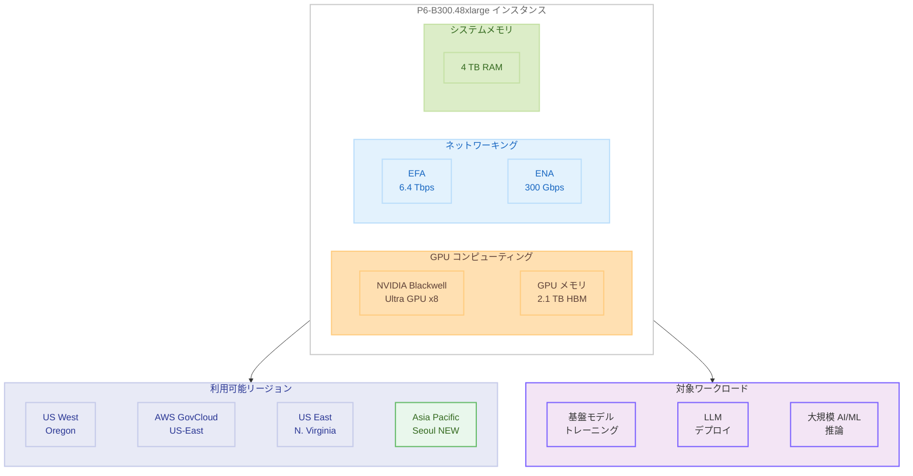

# Amazon EC2 P6-B300 インスタンス - Asia Pacific (Seoul) リージョンでの提供開始

**リリース日**: 2026 年 8 月 20 日
**サービス**: Amazon EC2
**機能**: P6-B300 インスタンスの Asia Pacific (Seoul) リージョン拡大

📊 [このアップデートのインフォグラフィックを見る](https://takech9203.github.io/aws-news-summary/20260820-amazon-ec2-p6-b300.html)

## 概要

Amazon EC2 P6-B300 インスタンスが Asia Pacific (Seoul) リージョンで利用可能になりました。P6-B300 インスタンスは、8 基の NVIDIA Blackwell Ultra GPU を搭載し、2.1 TB の高帯域幅 GPU メモリ、6.4 Tbps の EFA ネットワーキング、300 Gbps の専用 ENA スループット、4 TB のシステムメモリを提供する最上位クラスの GPU インスタンスです。

P6-B300 インスタンスは、前世代の P6-B200 インスタンスと比較して 2 倍のネットワーク帯域幅、1.5 倍の GPU メモリサイズ、1.5 倍の GPU TFLOPS (FP4、スパーシティなし) を実現します。これにより、数兆パラメータ規模の基盤モデル (FM) や大規模言語モデル (LLM) のトレーニングとデプロイに最適化されており、AI ワークロードにおいてより速いトレーニング時間とより多くのトークンスループットを提供します。

今回の Asia Pacific (Seoul) リージョンへの拡大により、P6-B300 インスタンスは US West (Oregon)、AWS GovCloud (US-East)、US East (N. Virginia) と合わせて 4 リージョンで利用可能となりました。アジア太平洋地域では初の提供リージョンとなり、韓国をはじめとするアジアの組織が低レイテンシーで最高性能の GPU コンピューティングにアクセスできるようになります。

**アップデート前の課題**

- P6-B300 インスタンスは米国の 3 リージョン (US West Oregon、AWS GovCloud US-East、US East N. Virginia) でのみ提供されており、アジア太平洋地域では利用できなかった
- アジアに拠点を持つ組織が P6-B300 を利用するには、米国リージョンへのデータ転送や高いネットワークレイテンシーを許容する必要があった
- データレジデンシー要件により国内でのデータ処理が求められる韓国の組織は、最新世代の Blackwell Ultra GPU を活用できなかった

**アップデート後の改善**

- Asia Pacific (Seoul) リージョンで P6-B300 インスタンスが利用可能になり、アジア太平洋地域のユーザーが低レイテンシーで最高性能の GPU コンピューティングにアクセスできるようになった
- 韓国国内にデータを保持したまま、数兆パラメータ規模の基盤モデルのトレーニングやデプロイが可能になった
- 米国 3 リージョンと合わせて 4 リージョン体制となり、グローバルでのワークロード分散配置や災害復旧の選択肢が広がった

## アーキテクチャ図



P6-B300 インスタンスのアーキテクチャ構成と利用可能リージョンを示しています。8 基の NVIDIA Blackwell Ultra GPU、2.1 TB の GPU メモリ、6.4 Tbps の EFA ネットワーキング、300 Gbps の ENA スループット、4 TB のシステムメモリを搭載し、今回の Asia Pacific (Seoul) 追加により 4 リージョンで利用可能です。

## サービスアップデートの詳細

### 主要機能

1. **NVIDIA Blackwell Ultra GPU**
   - 8 基の NVIDIA Blackwell Ultra GPU を搭載
   - FP4 (スパーシティなし) で P6-B200 比 1.5 倍の GPU TFLOPS を提供
   - 数兆パラメータ規模のモデルのトレーニングとデプロイに最適化

2. **大容量 GPU メモリ**
   - 2.1 TB の高帯域幅 GPU メモリ (HBM)
   - P6-B200 と比較して 1.5 倍の GPU メモリサイズ
   - 大規模モデルのメモリ内保持が可能で、モデル並列化の必要性を低減

3. **高速ネットワーキング**
   - 6.4 Tbps の Elastic Fabric Adapter (EFA) ネットワーキング
   - 300 Gbps の専用 Elastic Network Adapter (ENA) スループット
   - P6-B200 と比較して 2 倍のネットワーク帯域幅で分散トレーニングを加速

4. **アジア太平洋地域初の提供リージョン**
   - Asia Pacific (Seoul) はアジア太平洋地域で初めて P6-B300 が提供されるリージョン
   - 韓国およびアジア地域の組織が国内 / 近隣リージョンで最新 GPU を利用可能
   - データレジデンシー要件への対応と低レイテンシーアクセスを両立

## 技術仕様

### インスタンス仕様

| 項目 | P6-B300 | P6-B200 (参考) |
|------|---------|----------------|
| GPU | NVIDIA Blackwell Ultra x8 | NVIDIA Blackwell x8 |
| GPU メモリ | 2.1 TB HBM | 1.4 TB HBM |
| EFA ネットワーク帯域幅 | 6.4 Tbps | 3.2 Tbps |
| ENA スループット | 300 Gbps | 150 Gbps |
| システムメモリ | 4 TB | - |
| インスタンスサイズ | p6-b300.48xlarge | p6-b200.48xlarge |

### P6-B200 との性能比較

| 項目 | 向上率 |
|------|--------|
| ネットワーク帯域幅 | 2 倍 |
| GPU メモリサイズ | 1.5 倍 |
| GPU TFLOPS (FP4、スパーシティなし) | 1.5 倍 |

### インスタンスの起動

```bash
aws ec2 run-instances \
  --instance-type p6-b300.48xlarge \
  --image-id ami-xxxxxxxx \
  --region ap-northeast-2 \
  --key-name my-key-pair \
  --subnet-id subnet-xxxxxxxx \
  --security-group-ids sg-xxxxxxxx
```

## 設定方法

### 前提条件

1. Asia Pacific (Seoul) リージョンへのアクセス権限を持つ AWS アカウント
2. P6-B300 インスタンスのサービスクォータが承認済みであること
3. EFA を使用する場合は、EFA 対応の AMI とセキュリティグループの設定が必要
4. 適切な VPC とサブネットの構成

### 手順

#### ステップ 1: サービスクォータの確認と申請

```bash
aws service-quotas list-service-quotas \
  --service-code ec2 \
  --region ap-northeast-2 \
  --query "Quotas[?contains(QuotaName, 'P6')]"
```

Asia Pacific (Seoul) リージョンにおける P6 系インスタンスの vCPU クォータを確認します。不足している場合は、Service Quotas コンソールまたは CLI からクォータの引き上げをリクエストしてください。

#### ステップ 2: EFA 対応セキュリティグループの作成

```bash
aws ec2 create-security-group \
  --group-name p6-b300-efa-sg \
  --description "Security group for P6-B300 with EFA" \
  --vpc-id vpc-xxxxxxxx \
  --region ap-northeast-2

aws ec2 authorize-security-group-ingress \
  --group-id sg-xxxxxxxx \
  --protocol -1 \
  --source-group sg-xxxxxxxx \
  --region ap-northeast-2
```

EFA を使用するためにセキュリティグループを作成し、同じセキュリティグループ内のインスタンス間での全トラフィックを許可します。

#### ステップ 3: インスタンスの起動

```bash
aws ec2 run-instances \
  --instance-type p6-b300.48xlarge \
  --image-id ami-xxxxxxxx \
  --key-name my-key-pair \
  --network-interfaces "DeviceIndex=0,SubnetId=subnet-xxxxxxxx,Groups=sg-xxxxxxxx,InterfaceType=efa" \
  --region ap-northeast-2
```

EFA ネットワークインターフェースを指定してインスタンスを起動します。AMI は NVIDIA ドライバーと EFA ドライバーがプリインストールされた Deep Learning AMI の使用を推奨します。

## メリット

### ビジネス面

- **アジア太平洋地域からの低レイテンシーアクセス**: Asia Pacific (Seoul) リージョンでの提供により、韓国およびアジア地域の組織が低レイテンシーで最高性能の GPU コンピューティングにアクセス可能
- **データレジデンシー要件への対応**: 韓国国内にデータを保持したまま最新の Blackwell Ultra GPU で AI ワークロードを実行でき、規制やコンプライアンス要件を満たしやすくなる
- **リージョン選択の柔軟性**: 4 リージョンでの利用が可能となり、コスト、レイテンシー、コンプライアンス要件に応じた最適なリージョン選択が可能

### 技術面

- **大規模モデル対応**: 2.1 TB の GPU メモリにより、数兆パラメータ規模のモデルをメモリ内に保持してトレーニングおよび推論が可能
- **高速分散トレーニング**: 6.4 Tbps の EFA ネットワーキングにより、マルチノードトレーニングにおけるノード間通信のボトルネックを解消
- **高スループット推論**: 300 Gbps の専用 ENA スループットにより、大量の推論リクエストを低レイテンシーで処理可能

## デメリット・制約事項

### 制限事項

- インスタンスサイズは p6-b300.48xlarge のみで、より小さなサイズは提供されていない
- アジア太平洋地域では Asia Pacific (Seoul) のみの提供であり、東京リージョンなど他のアジアリージョンでは未提供
- GPU インスタンスのサービスクォータの引き上げが必要になる場合があり、承認まで時間がかかる可能性がある

### 考慮すべき点

- P6-B300 は最上位クラスのインスタンスタイプであるため、利用コストが高額になる。長期利用の場合は購入オプションの検討が必要
- NVIDIA Blackwell Ultra GPU のドライバーとソフトウェアスタック (CUDA、cuDNN、NCCL) の互換性を事前に確認する必要がある
- EFA を最大限に活用するには、クラスタープレースメントグループの設定や適切なネットワーク構成が不可欠

## ユースケース

### ユースケース 1: 韓国国内での大規模基盤モデルのトレーニング

**シナリオ**: 韓国の AI 企業が、韓国語に特化した数兆パラメータ規模の基盤モデルを国内リージョンでトレーニングする。学習データを国外に転送せず、データレジデンシー要件を満たす必要がある。

**実装例**:
```bash
# クラスタープレースメントグループの作成
aws ec2 create-placement-group \
  --group-name p6-b300-training-cluster \
  --strategy cluster \
  --region ap-northeast-2

# P6-B300 クラスターでの分散トレーニング起動
aws ec2 run-instances \
  --instance-type p6-b300.48xlarge \
  --count 8 \
  --image-id ami-deep-learning-base \
  --placement "GroupName=p6-b300-training-cluster" \
  --network-interfaces "DeviceIndex=0,SubnetId=subnet-xxx,Groups=sg-xxx,InterfaceType=efa" \
  --region ap-northeast-2
```

**効果**: 8 ノード x 8 GPU = 64 GPU で合計 16.8 TB の GPU メモリを活用し、数兆パラメータ規模のモデルを効率的にトレーニング可能。EFA 6.4 Tbps のノード間通信により、データ並列・モデル並列の双方で高いスケーリング効率を実現しつつ、データを韓国国内に保持できる。

### ユースケース 2: アジア太平洋地域向け LLM 推論サービング

**シナリオ**: 企業が大規模 LLM を本番環境にデプロイし、韓国および近隣アジア地域のエンドユーザーにリアルタイムの推論サービスを低レイテンシーで提供する。

**実装例**:
```bash
aws ec2 run-instances \
  --instance-type p6-b300.48xlarge \
  --image-id ami-deep-learning-inference \
  --network-interfaces "DeviceIndex=0,SubnetId=subnet-xxx,Groups=sg-xxx,InterfaceType=efa" \
  --region ap-northeast-2 \
  --tag-specifications "ResourceType=instance,Tags=[{Key=Purpose,Value=LLM-Inference}]"
```

**効果**: 2.1 TB の GPU メモリにより超大規模モデルを単一インスタンスにロードして推論を実行でき、300 Gbps の ENA スループットにより大量のリクエストを高スループットで処理可能。米国リージョンからの提供と比較してアジアのエンドユーザーへの応答レイテンシーを大幅に削減できる。

### ユースケース 3: 日米韓にまたがるグローバル AI プラットフォーム

**シナリオ**: グローバル企業が US West (Oregon)、US East (N. Virginia)、Asia Pacific (Seoul) の各リージョンで P6-B300 インスタンスを使用し、地理的な冗長性を持つ AI プラットフォームを構築する。

**効果**: 米国とアジアの複数リージョンにわたるワークロード分散により、リージョン障害時のフェイルオーバーやピーク時の負荷分散が可能になる。エンドユーザーの地理的位置に基づいたルーティングにより、グローバル全体でのレイテンシーを最適化できる。

## 料金

P6-B300 インスタンスの料金は、リージョンおよび購入オプションによって異なります。具体的な料金については、[Amazon EC2 料金ページ](https://aws.amazon.com/ec2/pricing/) を参照してください。

P6-B300 は最上位クラスの GPU インスタンスであるため、コスト最適化のために以下の購入オプションを検討することを推奨します。

| 購入オプション | 特徴 |
|---------------|------|
| オンデマンド | 初期費用なし、時間課金、短期ワークロードに適合 |
| Savings Plans | 1 年または 3 年のコミットメントによる割引 |
| Capacity Blocks for ML | 将来の GPU キャパシティを日時指定で確保 (対応状況は要確認) |

## 利用可能リージョン

P6-B300 インスタンス (p6-b300.48xlarge) は、以下の AWS リージョンで利用可能です。

- US West (Oregon) - us-west-2
- AWS GovCloud (US-East) - us-gov-east-1
- US East (N. Virginia) - us-east-1
- Asia Pacific (Seoul) - ap-northeast-2 **[NEW]**

## 関連サービス・機能

- **NVIDIA Blackwell Ultra GPU**: 最新世代の NVIDIA GPU アーキテクチャで、AI/ML ワークロードに最適化された高性能コンピューティングを提供
- **Elastic Fabric Adapter (EFA)**: HPC および ML アプリケーション向けの高スループット、低レイテンシーのネットワークインターフェース
- **Amazon EC2 P6-B200 インスタンス**: P6-B300 の前世代にあたる NVIDIA Blackwell GPU 搭載インスタンス
- **AWS ParallelCluster**: P6-B300 インスタンスを使用した HPC クラスターの構築と管理を簡素化するサービス
- **Amazon SageMaker**: ML モデルの構築、トレーニング、デプロイを支援するフルマネージドサービス

## 参考リンク

- 📊 [インフォグラフィック](https://takech9203.github.io/aws-news-summary/20260820-amazon-ec2-p6-b300.html)
- [公式発表 (What's New)](https://aws.amazon.com/about-aws/whats-new/2026/08/amazon-ec2-p6-b300/)
- [Amazon EC2 P6 インスタンス](https://aws.amazon.com/ec2/instance-types/p6/)
- [Amazon EC2 料金](https://aws.amazon.com/ec2/pricing/)
- [Elastic Fabric Adapter](https://aws.amazon.com/hpc/efa/)

## まとめ

Amazon EC2 P6-B300 インスタンスが Asia Pacific (Seoul) リージョンで利用可能になり、アジア太平洋地域で初めて提供されるリージョンとなりました。8 基の NVIDIA Blackwell Ultra GPU、2.1 TB の GPU メモリ、6.4 Tbps の EFA ネットワーキングを搭載した P6-B300 は、数兆パラメータ規模の基盤モデルのトレーニングやデプロイに最適です。韓国国内でのデータ処理が求められる組織や、アジアのエンドユーザーに低レイテンシーで AI サービスを提供したい組織は、Seoul リージョンでの P6-B300 利用を検討することを推奨します。
