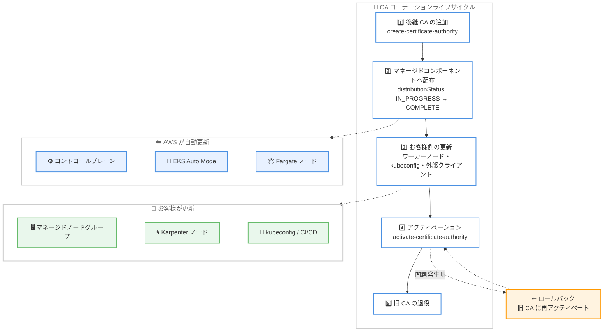

# Amazon EKS - 認証局 (CA) ローテーションの自動ライフサイクル管理サポート

**リリース日**: 2026年8月20日
**サービス**: Amazon Elastic Kubernetes Service (Amazon EKS)
**機能**: 証明書認証局 (CA) ローテーションと自動ライフサイクル管理

📊 [このアップデートのインフォグラフィックを見る](https://takech9203.github.io/aws-news-summary/20260820-amazon-eks-certificate-authority-ca-rotation-automated-lifecycle-management.html)

## 概要

Amazon EKS が、クラスターの認証局 (CA) をマネージドなライフサイクルと自動セーフガード付きでローテーションできる機能を発表しました。各 EKS クラスターは作成時に固有の CA を持ち、この CA が API サーバーの証明書に署名することで、コントロールプレーンコンポーネント、ワーカーノード、クライアントが Kubernetes API サーバーと暗号化された接続を確立できます。CA には有効期限があるため、期限切れ前にローテーションすることでクラスターの運用と接続性を維持する必要があります。

2018 年のサービス開始以降に作成された EKS クラスターの CA は有効期間が 10 年であり、初期に作成されたクラスターはローテーションが必要な時期に近づいています。今回の機能により、後継 CA の追加 (Append)、マネージドコンポーネントへの配布、アクティベーション、ロールバックまでの一連のプロセスが API、コンソール、通知によってサポートされ、お客様は計画的かつ安全に CA を更新できます。

本機能は、CA 失効前の事前通知、後継 CA の自動追加、自動アクティベーション、問題発生時のロールバックといった自動セーフガードを備えており、お客様が何も対応しない場合でもクラスターの可用性が維持されるよう設計されています。

**アップデート前の課題**

このアップデート以前は、EKS クラスターの CA 更新に関して以下の課題がありました。

- CA の有効期限を確認・管理するためのマネージドな仕組みがなく、期限切れに向けた計画的な対応が困難だった
- 後継 CA を段階的に配布し、既存の接続を維持しながら切り替えるセルフサービスの手段がなかった
- 切り替え後に問題が発生した場合に、以前の CA に戻すロールバック手段がなかった

**アップデート後の改善**

今回のアップデートにより、以下が可能になりました。

- AWS CLI、EKS API、AWS CloudFormation、AWS コンソールから後継 CA の追加とアクティベーションを自分のタイミングで実行できるようになった
- 現行 CA と後継 CA の両方を信頼する「デュアルトラスト期間」により、ワーカーノードやクライアントを段階的に更新できるようになった
- AWS Health、Cluster Insights、メールによる各段階の通知と、自動追加・自動アクティベーションのセーフガードにより、対応漏れによるクラスター停止リスクが低減された
- アクティベーション後に接続問題が見つかった場合、以前の CA に再アクティベートするロールバックが可能になった

## アーキテクチャ図



CA ローテーションは多段階のプロセスで、AWS がマネージドコンポーネントを自動更新し、お客様は自身が管理するワーカーノードと外部クライアントを更新する責任共有モデルで進行します。

## サービスアップデートの詳細

### 主要機能

1. **後継 CA のセルフサービス追加と自動追加**
   - クラスターがアクティブな状態であれば、AWS CLI、EKS API、コンソール、AWS CloudFormation などの IaC からいつでも後継 CA を追加できる
   - お客様が追加しない場合、CA 失効の 2 年前に AWS が自動的に後継 CA を追加する
   - 後継 CA の有効期間は 5 年

2. **マネージドコンポーネントへの自動配布**
   - 後継 CA 追加後、AWS がコントロールプレーン、EKS Auto Mode インスタンス、AWS Fargate ノードを両方の CA を信頼するよう自動更新する
   - EKS Capabilities のマネージドリソース (ACK、Argo CD、kro) も自動更新される
   - 配布の進捗は `distributionStatus` で追跡でき、配布完了 (`COMPLETE`) までアクティベーションは実行できない

3. **デュアルトラスト期間による段階的移行**
   - 現行 CA と後継 CA の両方が信頼される期間中、どちらの CA で署名された証明書も受け入れられる
   - お客様は自分のペースでワーカーノード、kubeconfig、CI/CD パイプライン、GitOps コントローラーを更新できる

4. **アクティベーションとロールバック**
   - 更新完了後、`activate-certificate-authority` で後継 CA に切り替えると、以降の証明書は後継 CA で署名される
   - 接続問題が見つかった場合、旧 CA の ID を指定して再アクティベートすることでロールバックできる (可否は `rollbackAvailable` フィールドで確認可能)
   - お客様がアクティベートしない場合、失効期限が近づくと AWS が自動的にアクティベートする

5. **段階的な通知**
   - AWS Health、Cluster Insights、メールで各段階の通知が届く
   - Amazon EventBridge と統合して独自の監視・アラートワークフローを構成することも可能

## 技術仕様

### CA ローテーションの通知タイムライン

| 通知 | タイミング | 内容 |
|------|-----------|------|
| CA 失効リマインダー | 失効の 2.5 年前 | CA の失効日を通知し、ローテーション計画を促す |
| 後継 CA 追加 | お客様または AWS による追加時 (自動追加は失効の 2 年前) | ローテーション開始。マネージドコンポーネントへの配布中 |
| アクティベーション警告 | 自動アクティベーションの 60 日前 | 未更新コンポーネントの更新を促す |
| 最終自動アクティベーション | 失効の 45 日前 | AWS が後継 CA をアクティベート。以降ロールバック不可 |

注: 2018 年から 2019 年に作成されたクラスターは、調整されたスケジュールで通知が送信されます。

### CA のステータスフィールド

| フィールド | 説明 |
|-----------|------|
| `signingStatus` | CA が証明書に署名中かどうか (`IN_USE` / `NOT_USED`) |
| `distributionStatus` | マネージドコンポーネントへの配布状況 (`IN_PROGRESS` / `COMPLETE` / `FAILED`) |
| `scheduledEvents` | 後継 CA に表示される `firstAutoActivation` と `finalAutoActivation` の予定日 |
| `rollbackAvailable` | ロールバック可否 |
| `notBefore` / `notAfter` | CA の有効期間 |

### 責任共有モデル

| 担当 | 対象 |
|------|------|
| AWS | ローテーションライフサイクル管理、コントロールプレーン、EKS Auto Mode インスタンス、Fargate ノード、EKS Capabilities の自動更新 |
| お客様 | マネージドノードグループ、Karpenter 管理ノード、セルフマネージドノード、ハイブリッドノードの置き換え、kubeconfig・CI/CD・GitOps コントローラーなど外部クライアントの信頼設定更新 |

## 設定方法

### 前提条件

1. EKS クラスターがアクティブな状態であること
2. AWS CLI が EKS の CA ローテーション API に対応したバージョンであること
3. ワーカーノードの置き換えに備え、重要ワークロードに PodDisruptionBudget を設定しておくこと

### 手順

#### ステップ1: 後継 CA の追加

```bash
aws eks create-certificate-authority --cluster-name my-cluster
```

クラスターに後継 CA を追加します。追加後、AWS がコントロールプレーン、EKS Auto Mode インスタンス、Fargate ノードへの配布を自動的に開始します。

#### ステップ2: CA の状態確認

```bash
aws eks list-certificate-authorities --cluster-name my-cluster
```

クラスターの CA 一覧と状態を確認します。現行 CA は `signingStatus: IN_USE`、後継 CA は `signingStatus: NOT_USED` と表示され、両方の `distributionStatus` が `COMPLETE` になるとデュアルトラスト期間に入ります。

```bash
aws eks describe-certificate-authority --certificate-authority-id <後継 CA の ID>
```

後継 CA の詳細を確認します。自動アクティベーション予定日 (`firstAutoActivation` / `finalAutoActivation`) や有効期限を確認できます。

#### ステップ3: クライアントとワーカーノードの更新

```bash
# kubeconfig の更新 (両方の CA を含むトラストバンドルを取得)
aws eks update-kubeconfig --name my-cluster

# マネージドノードグループのローリング置換
aws eks update-nodegroup-version --cluster-name my-cluster --nodegroup-name my-nodegroup
```

kubeconfig を更新して両方の CA を信頼するトラストバンドルを取得し、ノードグループのバージョン更新によりノードをローリング置換します。新しいノードは更新された CA 信頼設定で自動的に起動します。Karpenter 管理ノードはドリフト検知が有効であれば自動でサイクルされますが、中断バジェットの設定がアクティベーション期限に間に合うか事前に確認してください。

#### ステップ4: 後継 CA のアクティベーション

```bash
aws eks activate-certificate-authority --certificate-authority-id <後継 CA の ID>
```

すべてのノードとクライアントの更新完了を確認したうえで後継 CA をアクティベートします。以降、新しい証明書は後継 CA で署名されます。`kubectl get nodes` などで疎通を確認し、問題が見つかった場合は旧 CA の ID を指定して同じコマンドを実行することでロールバックできます。

## メリット

### ビジネス面

- **可用性リスクの低減**: CA 期限切れによるクラスター接続断という重大障害を、自動セーフガードと段階的な通知により未然に防止できる
- **計画的な運用**: 失効の 2.5 年前からの通知により、変更管理プロセスに沿った計画的なローテーションが可能
- **追加コストなし**: すべての商用リージョンで追加料金なしで利用できる

### 技術面

- **デュアルトラストによる無停止移行**: 両方の CA が同時に信頼される期間中に段階的な更新ができ、ダウンタイムを回避できる
- **セルフサービスのロールバック**: アクティベーション後の問題発生時に旧 CA へ戻せるため、切り替えの心理的・運用的ハードルが低い
- **IaC・自動化との統合**: AWS CLI、EKS API、CloudFormation に対応しており、複数クラスターのフリート管理をスクリプト化できる
- **EventBridge 統合**: CA ローテーションイベントを既存の監視・アラート基盤に組み込める

## デメリット・制約事項

### 制限事項

- 後継 CA の配布が完了 (`distributionStatus: COMPLETE`) するまでアクティベーションは実行できない
- 最終自動アクティベーション (CA 失効の 45 日前) 以降はロールバックできない
- お客様が追加した後継 CA は、CA 失効の 2 年前を過ぎると削除できなくなる (後継 CA の存在を保証するための保護)
- 2018 年から 2019 年に作成されたクラスターは、通知タイムラインが調整されたスケジュールになる

### 考慮すべき点

- マネージドノードグループ以外のワーカーノード (Karpenter、セルフマネージド、ハイブリッドノード) と外部クライアントの更新はお客様の責任であり、AWS は代行できない
- デュアルトラスト期間中の CA バンドルは約 2.8 KB (gzip 圧縮で約 1.9 KB) となるため、EC2 起動テンプレートのユーザーデータが 16 KB 上限に近い場合は圧縮を検討する必要がある
- Karpenter の中断バジェット設定によってはノード置き換えに長期間かかる場合があるため (例: 週 10% の設定で 50 ノードなら約 10 週間)、アクティベーション期限との整合性を事前に確認する必要がある
- CA 作成が失敗した場合 (`distributionStatus: FAILED`) は、`delete-certificate-authority` で削除して再作成する必要がある (AWS 起点の自動ローテーションでは AWS が自動的にクリーンアップ)

## ユースケース

### ユースケース1: 2018 年から 2019 年に作成した長期稼働クラスターの CA 更新

**シナリオ**: サービス開始初期に作成した本番 EKS クラスターの CA (有効期間 10 年) が失効時期に近づいており、無停止で CA を更新したい。

**実装例**:
```bash
# 後継 CA を追加し、配布状況を確認
aws eks create-certificate-authority --cluster-name prod-cluster
aws eks list-certificate-authorities --cluster-name prod-cluster

# デュアルトラスト期間中にノードとクライアントを更新
aws eks update-kubeconfig --name prod-cluster
aws eks update-nodegroup-version --cluster-name prod-cluster --nodegroup-name prod-ng

# 更新完了後にアクティベート
aws eks activate-certificate-authority --certificate-authority-id <後継 CA の ID>
```

**効果**: 自動タイムラインを待たず、メンテナンスウィンドウに合わせた計画的な CA ローテーションを無停止で実施できる。

### ユースケース2: GitOps 環境 (Argo CD) を含むクラスターの CA 更新

**シナリオ**: セルフホストの Argo CD が外部クラスターとして EKS に接続しており、CA 切り替え後も GitOps の同期を継続させたい。

**実装例**:
```bash
# デュアルトラスト期間中に CA バンドルを取得
aws eks describe-cluster --name prod-cluster \
  --query "cluster.certificateAuthority.data" --output text

# 取得した CA データで Argo CD のクラスターシークレットの caData を更新し、
# 同期が成功することを確認してからアクティベート
aws eks activate-certificate-authority --certificate-authority-id <後継 CA の ID>
```

**効果**: 外部クライアントの信頼設定をデュアルトラスト期間中に更新することで、アクティベーション後も GitOps パイプラインの接続を維持できる。

### ユースケース3: 複数クラスターのフリート全体でのローテーション管理

**シナリオ**: 数十のクラスターを運用しており、各クラスターの CA 失効時期とローテーション進捗を一元的に把握して対応したい。

**実装例**:
```bash
# 全クラスターの CA 状態をスクリプトで収集
for cluster in $(aws eks list-clusters --query "clusters[]" --output text); do
  echo "=== ${cluster} ==="
  aws eks list-certificate-authorities --cluster-name "${cluster}"
done
```

**効果**: フリート全体の CA 失効時期と `signingStatus` / `distributionStatus` を可視化し、優先度をつけた計画的なローテーションを実現できる。EventBridge と組み合わせれば通知の自動集約も可能。

## 料金

本機能は追加料金なしで利用できます。CA ローテーションの API 操作自体に費用は発生しません。

なお、ワーカーノードのローリング置換の過程で一時的にノード数が増える場合、その間の EC2 インスタンス費用は通常どおり発生します。

## 利用可能リージョン

すべての商用 AWS リージョンで利用可能です。

## 関連サービス・機能

- **EKS Auto Mode / AWS Fargate**: これらが管理するノードは AWS が後継 CA を自動的に信頼するよう更新するため、お客様の対応は不要
- **AWS Health / Cluster Insights**: CA ローテーションの各段階の通知が配信され、対応状況を確認できる
- **Amazon EventBridge**: CA ローテーションイベントを取り込み、既存の監視・アラートワークフローと統合できる
- **Karpenter**: ドリフト検知が有効な場合、ノードが自動的にサイクルされて後継 CA を信頼する構成で再作成される
- **AWS CloudFormation**: IaC として後継 CA の追加を管理できる

## 参考リンク

- 📊 [インフォグラフィック](https://takech9203.github.io/aws-news-summary/20260820-amazon-eks-certificate-authority-ca-rotation-automated-lifecycle-management.html)
- [公式発表 (What's New)](https://aws.amazon.com/about-aws/whats-new/2026/08/amazon-eks-certificate-authority-ca-rotation-automated-lifecycle-management)
- [AWS Blog: Deep dive into Amazon EKS certificate authority rotation](https://aws.amazon.com/blogs/containers/deep-dive-into-amazon-eks-certificate-authority-rotation/)
- [ドキュメント: Rotate the EKS cluster certificate authority (CA)](https://docs.aws.amazon.com/eks/latest/userguide/certificate-authority-rotation.html)

## まとめ

Amazon EKS の CA ローテーション機能は、2018 年から 2019 年に作成された初期クラスターの CA 失効が近づくなか、すべての EKS 利用者にとって重要なアップデートです。自動セーフガードによりクラスターの可用性は維持されますが、ワーカーノードと外部クライアントの更新はお客様の責任であるため、自動タイムラインを待たずに `list-certificate-authorities` で自クラスターの CA 失効時期を確認し、計画的なローテーションの準備を始めることを推奨します。
