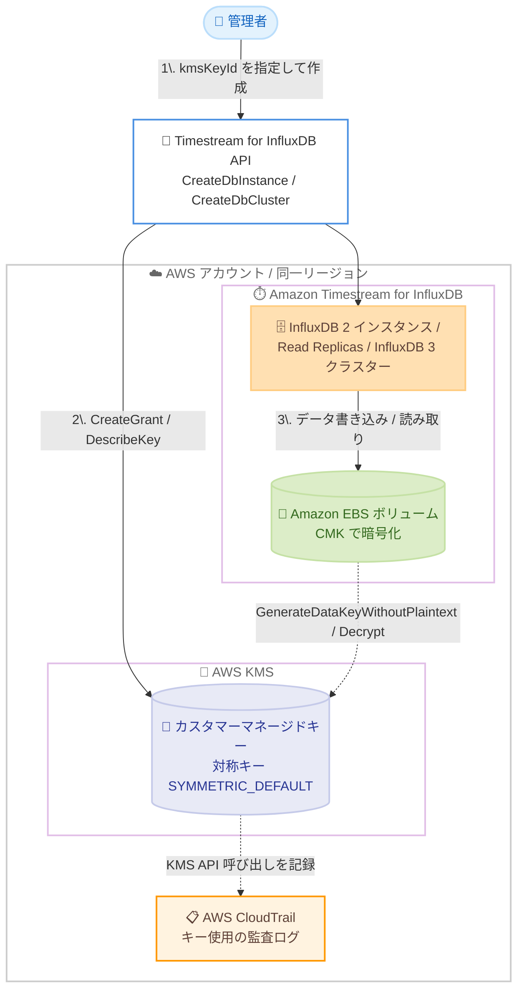

# Amazon Timestream for InfluxDB - カスタマーマネージドキー (CMK) サポート

**リリース日**: 2026 年 8 月 20 日
**サービス**: Amazon Timestream for InfluxDB
**機能**: AWS KMS カスタマーマネージドキーによる保存データの暗号化

📊 [このアップデートのインフォグラフィックを見る](https://takech9203.github.io/aws-news-summary/20260820-amazon-timestream-influxdb-cmk.html)

## 概要

Amazon Timestream for InfluxDB が、保存データ (data at rest) の暗号化に AWS Key Management Service (AWS KMS) のカスタマーマネージドキー (CMK) をサポートしました。対象は InfluxDB 2 データベースインスタンス、InfluxDB 2 Read Replicas、および InfluxDB 3 クラスターです。データベースリソースの作成時に対称 (symmetric) KMS キーを選択すると、Timestream for InfluxDB はそのキーを使用して基盤となるデータベースストレージ (Amazon EBS ボリューム) を暗号化します。

これまで Timestream for InfluxDB の保存データは AWS 所有キーによるデフォルト暗号化のみでしたが、今回のアップデートにより、キーの作成、ローテーション、無効化、アクセスポリシーの定義といった暗号化キーのライフサイクル全体をお客様自身で管理できるようになりました。金融、医療、公共分野など、暗号化キーの自己管理が求められる規制要件やコンプライアンス要件を持つ組織にとって重要な機能強化です。

CMK サポートは AWS Management Console、AWS CLI、Timestream for InfluxDB API から利用でき、Timestream for InfluxDB が利用可能なすべての AWS リージョンで提供されます。CMK の利用に対する Timestream for InfluxDB 側の追加料金はなく、標準の AWS KMS 料金のみが適用されます。

**アップデート前の課題**

- 以前は保存データの暗号化に AWS 所有キーしか使用できず、暗号化キーのライフサイクルをお客様側で管理できなかった
- 暗号化キーの使用状況を AWS CloudTrail で監査したり、キーポリシーで細かくアクセス制御したりすることができなかった
- 「自社管理のキーでデータを暗号化すること」を求めるコンプライアンス要件がある場合、Timestream for InfluxDB の採用が難しかった

**アップデート後の改善**

- リソース作成時に CMK を指定することで、お客様自身の KMS キーでデータベースストレージを暗号化できるようになった
- キーの作成、ローテーション、無効化、キーポリシーによるアクセス制御など、キーライフサイクルの完全な制御が可能になった
- CloudTrail によるキー使用状況の監査が可能になり、規制要件やコンプライアンス要件への対応が容易になった
- キーの無効化やグラント取り消しによって、データベースへのアクセスを即座に遮断する「キルスイッチ」的な運用も可能になった

## アーキテクチャ図



リソース作成時に指定した CMK に対して Timestream for InfluxDB がグラントを作成し、Amazon EBS ボリュームの暗号化にキーを使用します。KMS API 呼び出しはすべて CloudTrail に記録され、監査に利用できます。

## サービスアップデートの詳細

### 主要機能

1. **リソース作成時の CMK 指定**
   - InfluxDB 2 データベースインスタンス、InfluxDB 2 Read Replicas、InfluxDB 3 クラスターの作成時に、対称 AWS KMS キーを指定可能
   - 指定したキーでデータベースデータを格納する Amazon EBS ボリュームを暗号化
   - CMK を指定しない場合は、従来どおり AWS 所有キーによるデフォルト暗号化が適用される

2. **キーライフサイクルの完全な制御**
   - キーの作成、ローテーション、無効化、アクセスポリシーの定義をお客様自身で管理
   - キーポリシーの `kms:ViaService` 条件により、Timestream for InfluxDB サービス経由のみにキー使用を制限可能
   - マルチリージョンキーもサポート (プライマリまたはレプリカキーがデータベースと同一リージョンにあること)

3. **CloudTrail によるキー使用の監査**
   - CMK 使用時、Timestream for InfluxDB が行うすべての KMS API 呼び出しが CloudTrail に記録される
   - `invokedBy` フィールドに `timestream-influxdb.region.amazonaws.com` が記録され、サービスからの呼び出しを識別可能
   - `CreateGrant` (リソース作成時)、`GenerateDataKeyWithoutPlaintext` (EBS 暗号化ボリューム作成時)、`Decrypt` (暗号化ボリューム読み取り時) などのイベントを監視できる

4. **キー無効化・削除時の保護動作**
   - キーの無効化、削除、グラント取り消しを行うと、データベースは利用不可 (読み書き失敗) となる
   - キーの再有効化またはグラント復元により、データベースは自動的に回復して稼働状態に戻る
   - サービス管理バックアップ (EBS スナップショット) も同じ CMK で暗号化されるため、キーを完全削除するとバックアップも復元不可となる

## 技術仕様

### サポートされる KMS キーの要件

| 項目 | 詳細 |
|------|------|
| キータイプ | 対称 (SYMMETRIC_DEFAULT) |
| キー用途 | 暗号化および復号 |
| キーオリジン | AWS KMS (カスタマーマネージド) |
| キーのリージョン | データベースインスタンス / クラスターと同一の AWS リージョン |
| キーのアカウント | データベースリソースと同一の AWS アカウント |
| マルチリージョンキー | サポート (プライマリまたはレプリカキーが同一リージョンにあること) |
| 指定タイミング | リソース作成時のみ (作成後の変更は不可) |

### 対象リソースと暗号化範囲

| 項目 | 詳細 |
|------|------|
| 対象リソース | InfluxDB 2 DB インスタンス、InfluxDB 2 Read Replicas、InfluxDB 3 クラスター |
| 暗号化対象 | データベースデータを格納する Amazon EBS ボリューム |
| 暗号化対象外 | ルートボリューム (OS 領域) は引き続きサービス管理の暗号化を使用 |
| バックアップ | サービス管理バックアップ (EBS スナップショット) は同じ CMK で暗号化 |

### API 変更履歴

| 日付 | サービス | 変更内容 |
|------|----------|----------|
| 2026/08/03 | [Timestream InfluxDB](https://awsapichanges.com/archive/changes/9e1c25-timestream-influxdb.html) | 5 new 13 updated api methods - カスタマーマネージドバックアップの復元と、CMK による新規 DbInstance / DbCluster の暗号化サポートを追加 |

主な変更点は以下のとおりです。

- **新規 API (5 件)**: `CreateDbBackup`、`DeleteDbBackup`、`RestoreFromDbBackup`、`GetDbBackup`、`ListDbBackups` (バックアップ関連。`RestoreFromDbBackup` では復元先リソースの `kmsKeyId` を指定可能)
- **更新 API (13 件)**: `CreateDbInstance`、`CreateDbCluster` などに `kmsKeyId` パラメータが追加。`GetDbInstance`、`GetDbCluster` などのレスポンスに `kmsKeyId` フィールドが追加

### KMS キーポリシーの設定

CMK を使用してデータベースを作成する前に、キーポリシーに以下の 2 つのステートメントを追加する必要があります。1 つ目は呼び出し元ロールがサービス経由でグラントを作成することを許可し、2 つ目はキーの参照を許可します。

```json
{
    "Sid": "Allow Timestream InfluxDB to use the key for resource allocations",
    "Effect": "Allow",
    "Principal": {
        "AWS": "arn:aws:iam::account-id:role/caller-role"
    },
    "Action": "kms:CreateGrant",
    "Resource": "*",
    "Condition": {
        "StringEquals": {
            "kms:ViaService": "timestream-influxdb.region.amazonaws.com"
        },
        "ForAllValues:StringEquals": {
            "kms:GrantOperations": [
                "Decrypt",
                "Encrypt",
                "GenerateDataKey",
                "GenerateDataKeyWithoutPlaintext",
                "ReEncryptFrom",
                "ReEncryptTo",
                "CreateGrant",
                "DescribeKey"
            ]
        },
        "Bool": {
            "kms:GrantIsForAWSResource": "true"
        }
    }
}
```

```json
{
    "Sid": "Allow Timestream InfluxDB to describe the key for resource allocations",
    "Effect": "Allow",
    "Principal": {
        "AWS": "arn:aws:iam::account-id:role/caller-role"
    },
    "Action": "kms:DescribeKey",
    "Resource": "*",
    "Condition": {
        "StringEquals": {
            "kms:ViaService": "timestream-influxdb.region.amazonaws.com"
        }
    }
}
```

`kms:ViaService` 条件により、この権限は Timestream for InfluxDB サービス経由でのみ行使でき、`kms:GrantIsForAWSResource` により AWS リソースに対するグラント作成のみに制限されます。

## 設定方法

### 前提条件

1. データベースリソースと同一の AWS アカウント・リージョンに対称 KMS キー (カスタマーマネージド) が作成済みであること
2. キーポリシーに Timestream for InfluxDB 用のステートメント (`kms:CreateGrant`、`kms:DescribeKey`) が設定済みであること
3. データベース作成用の VPC サブネット、セキュリティグループが準備済みであること

### 手順

#### ステップ 1: KMS キーの作成とキーポリシーの設定

```bash
aws kms create-key \
    --description "Timestream for InfluxDB CMK" \
    --key-spec SYMMETRIC_DEFAULT \
    --key-usage ENCRYPT_DECRYPT
```

対称暗号化キーを作成します。作成後、前述のキーポリシーステートメントを `aws kms put-key-policy` で追加し、Timestream for InfluxDB がキーを使用できるようにします。

#### ステップ 2: CMK を指定してデータベースリソースを作成

```bash
# InfluxDB 2 インスタンスの場合
aws timestream-influxdb create-db-instance \
    --name my-influxdb-instance \
    --db-instance-type db.influx.medium \
    --db-storage-type InfluxIOIncludedT1 \
    --allocated-storage 100 \
    --vpc-subnet-ids subnet-0123456789abcdef0 subnet-0123456789abcdef1 \
    --vpc-security-group-ids sg-0123456789abcdef0 \
    --password MySecurePassword123! \
    --kms-key-id arn:aws:kms:us-east-1:123456789012:key/12345678-1234-1234-1234-123456789012
```

`--kms-key-id` パラメータに KMS キーの ARN を指定して DB インスタンスを作成します。InfluxDB 2 Read Replicas クラスターの場合は `create-db-cluster` に `--deployment-type MULTI_NODE_READ_REPLICAS` と `--kms-key-id` を指定します。コンソールの場合は、データベース作成画面の「暗号化」セクションで [カスタマーマネージドキー] を選択し、キーをドロップダウンから選択するか ARN を入力します。

#### ステップ 3: 暗号化キーの確認

```bash
aws timestream-influxdb get-db-instance \
    --db-instance-identifier my-influxdb-instance
```

`GetDbInstance` または `GetDbCluster` API のレスポンスに含まれる `kmsKeyId` フィールドで、使用中の CMK を確認します。`kmsKeyId` フィールドが存在しない場合は、デフォルトの AWS 所有キーが使用されていることを示します。

## メリット

### ビジネス面

- **コンプライアンス対応**: 暗号化キーの自己管理を求める規制要件 (金融、医療、公共分野など) に対応でき、Timestream for InfluxDB の採用範囲が広がる
- **監査対応の強化**: CloudTrail によるキー使用の完全な監査証跡により、セキュリティ監査や内部統制への対応が容易になる
- **追加コストなし**: Timestream for InfluxDB 側の追加料金は発生せず、標準の KMS 料金のみで CMK を利用できる

### 技術面

- **キーライフサイクルの完全な制御**: キーの作成、ローテーション、無効化、キーポリシーによるアクセス制御をお客様側で一元管理できる
- **アクセスの即時遮断**: キーの無効化やグラント取り消しにより、暗号化されたデータへのアクセスを即座に遮断でき、キー再有効化で自動回復する
- **バックアップとの一貫性**: サービス管理バックアップも同じ CMK で暗号化されるため、データ保護ポリシーを一貫して適用できる

## デメリット・制約事項

### 制限事項

- CMK はリソース作成時にのみ指定可能で、作成後にキーを変更することはできない
- KMS キーはデータベースリソースと同一の AWS リージョンおよびアカウントに存在する必要がある
- 対称暗号化キー (SYMMETRIC_DEFAULT) のみサポート (非対称キーは不可)
- ルートボリューム (OS 領域) は CMK では暗号化されず、引き続きサービス管理の暗号化が使用される

### 考慮すべき点

- 既存データベースを CMK 暗号化に移行するには、新規リソースを CMK 付きで作成し、`influx backup` / `influx restore` CLI コマンドでデータを移行した上で、アプリケーションの接続先を切り替える必要がある
- CMK を完全削除 (KMS の待機期間経過後) すると、暗号化されたデータとバックアップは永久に復元不可となるため、キー削除は慎重に行う必要がある
- キーを無効化するとデータベースが利用不可となり読み書きが失敗するため、キー運用とデータベース運用の連携体制が必要

## ユースケース

### ユースケース 1: 金融機関の IoT センサーデータ基盤

**シナリオ**: 金融機関のデータセンター設備監視で時系列データを収集しており、社内セキュリティ基準により「自社管理キーによる保存データ暗号化」と「キー使用の監査証跡」が必須となっている。

**実装例**:
```bash
aws timestream-influxdb create-db-cluster \
    --name facility-monitoring-cluster \
    --db-instance-type db.influx.large \
    --db-storage-type InfluxIOIncludedT1 \
    --allocated-storage 400 \
    --vpc-subnet-ids subnet-aaa subnet-bbb \
    --vpc-security-group-ids sg-ccc \
    --password <secure-password> \
    --deployment-type MULTI_NODE_READ_REPLICAS \
    --failover-mode NO_FAILOVER \
    --kms-key-id arn:aws:kms:ap-northeast-1:123456789012:key/xxxx
```

**効果**: 自社管理の CMK で Read Replicas クラスター全体を暗号化し、CloudTrail の監査ログと合わせて社内セキュリティ基準を満たした時系列データ基盤を構築できる。

### ユースケース 2: 既存データベースの CMK 移行

**シナリオ**: AWS 所有キーで運用中の InfluxDB 2 インスタンスを、コンプライアンス要件の変更に伴い CMK 暗号化へ移行したい。

**実装例**:
```bash
# 1. CMK 付きで新規インスタンスを作成
aws timestream-influxdb create-db-instance \
    --name my-influxdb-cmk \
    --kms-key-id arn:aws:kms:ap-northeast-1:123456789012:key/xxxx \
    ... (その他パラメータ)

# 2. 既存インスタンスからバックアップを取得し、新インスタンスへリストア
influx backup /path/to/backup --host https://<old-endpoint>:8086 --token <token>
influx restore /path/to/backup --host https://<new-endpoint>:8086 --token <token>
```

**効果**: 作成後のキー変更ができない制約のもとでも、`influx backup` / `influx restore` による計画的な移行で既存データを CMK 暗号化環境へ移せる。

### ユースケース 3: キー無効化によるデータアクセスの緊急遮断

**シナリオ**: セキュリティインシデントの疑いが発生した際、時系列データベースへのアクセスを即座に遮断したい。

**実装例**:
```bash
# キーを無効化してデータアクセスを遮断
aws kms disable-key --key-id arn:aws:kms:ap-northeast-1:123456789012:key/xxxx

# 調査完了後、キーを再有効化して自動回復
aws kms enable-key --key-id arn:aws:kms:ap-northeast-1:123456789012:key/xxxx
```

**効果**: キー無効化によりデータベースの読み書きを即時に停止でき、再有効化するとデータベースが自動的に回復するため、インシデント対応の初動を迅速化できる。

## 料金

CMK の利用に対する Amazon Timestream for InfluxDB 側の追加料金はありません。標準の AWS KMS 料金 (キーの保管料金と、サービスが実行する KMS API 呼び出しの料金) が適用されます。

### 料金例

| 使用量 | 月額料金 (概算) |
|--------|------------------|
| カスタマーマネージドキー 1 個 | 1 USD/月 |
| KMS API リクエスト | 20,000 リクエストの無料枠を超過した分に対して 0.03 USD/10,000 リクエストから |

詳細は [AWS KMS 料金ページ](https://aws.amazon.com/kms/pricing/) および [Amazon Timestream 料金ページ](https://aws.amazon.com/timestream/pricing/) を参照してください。

## 利用可能リージョン

Amazon Timestream for InfluxDB が利用可能なすべての AWS リージョンで利用できます。対象リージョンの一覧は [AWS General Reference の Timestream エンドポイント](https://docs.aws.amazon.com/general/latest/gr/timestream.html) を参照してください。

## 関連サービス・機能

- **AWS Key Management Service (AWS KMS)**: CMK の作成、ローテーション、キーポリシー管理を担う暗号化キー管理サービス。本アップデートの中核となる連携先
- **Amazon EBS**: Timestream for InfluxDB のデータベースストレージとして使用され、CMK による暗号化の実際の適用対象となるブロックストレージ
- **AWS CloudTrail**: Timestream for InfluxDB による KMS API 呼び出しを記録し、キー使用の監査を可能にするログサービス
- **Amazon RDS**: 同様に KMS CMK による保存データ暗号化をサポートするマネージドデータベースサービス。既に RDS で CMK 運用をしている場合、同様のキー管理プラクティスを適用できる

## 参考リンク

- 📊 [インフォグラフィック](https://takech9203.github.io/aws-news-summary/20260820-amazon-timestream-influxdb-cmk.html)
- [公式発表 (What's New)](https://aws.amazon.com/about-aws/whats-new/2026/08/amazon-timestream-influxdb-cmk/)
- [ドキュメント: Encrypting resources with customer managed keys (InfluxDB 2)](https://docs.aws.amazon.com/timestream/latest/developerguide/influxdb2-cmk-encryption.html)
- [ドキュメント: Encrypting resources with customer managed keys (InfluxDB 3)](https://docs.aws.amazon.com/timestream/latest/developerguide/influxdb3-cmk-encryption.html)
- [ドキュメント: Data protection in Timestream for InfluxDB](https://docs.aws.amazon.com/timestream/latest/developerguide/data-protection-for-influx-db.html)
- [API 変更詳細 (awsapichanges.com)](https://awsapichanges.com/archive/changes/9e1c25-timestream-influxdb.html)
- [料金ページ](https://aws.amazon.com/timestream/pricing/)

## まとめ

Amazon Timestream for InfluxDB の CMK サポートにより、時系列データベースの保存データ暗号化をお客様自身の KMS キーで制御できるようになり、規制要件やコンプライアンス要件を持つワークロードでの採用障壁が解消されました。キーは作成時にのみ指定可能で後から変更できないため、新規リソース作成時には CMK の要否を事前に検討し、必要な場合はキーポリシーの設定を含めた設計を行うことを推奨します。
