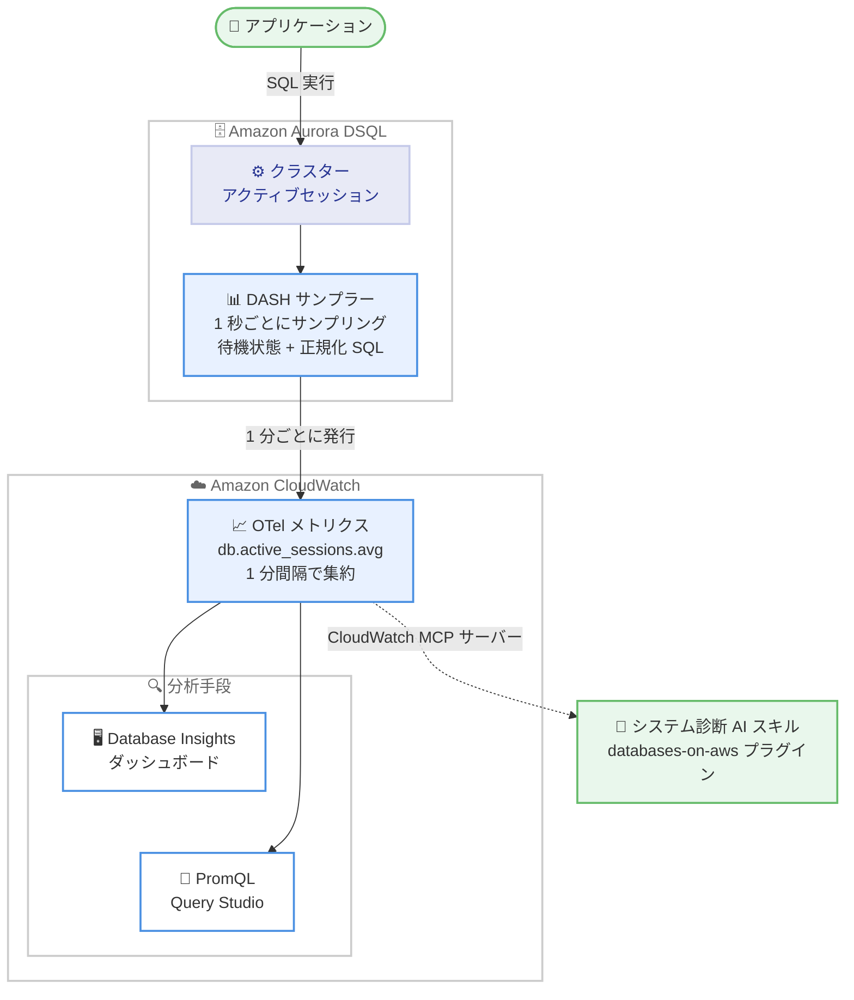

# Amazon Aurora DSQL - Amazon CloudWatch Database Insights サポート

**リリース日**: 2026 年 8 月 20 日
**サービス**: Amazon Aurora DSQL, Amazon CloudWatch
**機能**: CloudWatch Database Insights による Aurora DSQL のステートメント単位・クラスターレベルのパフォーマンスモニタリング

📊 [このアップデートのインフォグラフィックを見る](https://takech9203.github.io/aws-news-summary/20260820-aurora-dsql-cloudwatch-database-insights.html)

## 概要

Amazon Aurora DSQL が Amazon CloudWatch Database Insights に対応しました。新しいメトリクスにより、ステートメント単位・クラスターレベルのパフォーマンスモニタリングが可能になります。この機能は DSQL Active Session History (DASH) と呼ばれるサンプラーによって実現されており、クラスター上のすべてのアクティブセッションを 1 秒ごとにサンプリングし、各セッションの待機状態 (wait state) と正規化された SQL ステートメントを記録します。

収集されたデータは 1 分間隔で集約され、CloudWatch OpenTelemetry (OTel) メトリクス `db.active_sessions.avg` として公開されます。この Average Active Sessions (AAS) メトリクスは、CloudWatch Database Insights のダッシュボード、CloudWatch PromQL クエリ、そして Aurora DSQL システム診断 AI スキルの 3 つの方法で分析できます。パフォーマンス問題の診断や、最もリソースを消費するクエリの特定に活用できます。

DASH と Database Insights の Standard モードはすべての Aurora DSQL クラスターでデフォルトで有効化されており、追加コストなしで利用できます。セットアップ作業は不要です。

**アップデート前の課題**

Aurora DSQL のパフォーマンス分析には以下の課題がありました。

- クラスター内部でどのセッションが何に時間を費やしているかを可視化する標準的な手段がなく、パフォーマンス問題の原因調査が困難だった
- どの SQL ステートメントが最もリソースを消費しているかをステートメント単位で特定することができなかった
- Aurora DSQL は DPU (Distributed Processing Unit) ベースのオンデマンド課金であり、処理時間がコストに直結するにもかかわらず、時間の内訳を分析する手段が限られていた

**アップデート後の改善**

今回のアップデートにより以下が可能になりました。

- 全アクティブセッションの待機状態と正規化 SQL を 1 秒間隔でサンプリングした DASH データを、CloudWatch Database Insights の専用ダッシュボードでノーコードで分析できるようになった
- CloudWatch PromQL により `db.active_sessions.avg` メトリクスをプログラムから直接クエリでき、サードパーティのモニタリングツールとの統合や対話的な探索が可能になった
- Aurora DSQL システム診断 AI スキルにより、自然言語プロンプトで自動ヘルスチェックと診断レポート生成が可能になった
- デフォルト有効・追加コストなしのため、既存クラスターでも即座に利用を開始できる

## アーキテクチャ図



DASH がクラスター上の全アクティブセッションを 1 秒ごとにサンプリングし、1 分単位で集約した結果を CloudWatch OTel メトリクスとして発行します。データは Database Insights ダッシュボード、PromQL、AI スキルの 3 つの経路から分析できます。

## サービスアップデートの詳細

### 主要機能

1. **DSQL Active Session History (DASH)**
   - オープンなトランザクションを持つ全アクティブセッションを 1 秒ごとにサンプリング
   - 各サンプルは「待機イベント (セッションの状態)」と「実行中の SQL の先頭 256 文字」を記録
   - セッションは「CPU 使用中」「外部操作の待機中 (ストレージ読み取りやコミット確認など)」「トランザクション内アイドル (アプリケーションからの次のステートメント待ち)」のいずれかの状態として分類される
   - 1 分ごとに集約され、単一のメトリクス `db.active_sessions.avg` (AAS) として CloudWatch に発行される

2. **CloudWatch Database Insights の専用ダッシュボード**
   - Aurora DSQL 専用にキュレーションされたノーコード UI で、クラスターは自動的に Database Insights に表示される
   - DB Load チャートで待機イベント別の AAS を積み上げ表示し、クラスターの忙しさと時間の使われ方を同時に可視化
   - Slice By コントロールで「Wait Events」と「SQL Text」の表示を切り替え可能
   - DB Load Analysis セクションで Top Wait Events と Top SQL を AAS への寄与度順に表示

3. **PromQL によるプログラマティックアクセス**
   - CloudWatch Query Studio で `db.active_sessions.avg` メトリクスを PromQL で直接クエリ可能
   - 待機イベント別の負荷集計、Top SQL のランキング、ストレージ読み取り待機の多いステートメントの抽出などが可能
   - サードパーティモニタリングツールとの統合にも利用できる

4. **Aurora DSQL システム診断 AI スキル**
   - awslabs/agent-plugins リポジトリの databases-on-aws プラグインに含まれる AI ヘルスチェックエージェント
   - CloudWatch MCP サーバー経由で DASH データを分析し、複数の時間枠 (直近 1 時間、昨日の同時刻、先週の同時刻など、カスタマイズ可能) で待機イベント分布を比較
   - 問題のあるクエリを検出すると、追加プロンプトなしで SQL 単位の詳細診断ワークフローを自動実行し、解決策を提示
   - 「クラスターのパフォーマンスを確認して Markdown レポートを作成して」のような自然言語プロンプトで利用可能

## 技術仕様

### DASH メトリクスとディメンション

| 項目 | 詳細 |
|------|------|
| メトリクス名 | `db.active_sessions.avg` (単位: Count) |
| 意味 | サンプル期間中のアクティブセッションの平均数 (Average Active Sessions, AAS) |
| サンプリング間隔 | 1 秒 (セッション単位) |
| 発行間隔 | 1 分 (集約済み) |
| 形式 | CloudWatch OpenTelemetry (OTel) メトリクス |
| SQL 記録 | 実行中 SQL の先頭 256 文字 (リテラル値を除去して正規化) |
| 有効化 | 全クラスターでデフォルト有効 (セットアップ不要) |
| 追加コスト | なし (Database Insights Standard モード) |

主なディメンション (ラベル) は以下のとおりです。

| ディメンション | 説明 |
|------|------|
| `db.wait.class` | 待機イベントの分類 (例: `class:oncpu` は CPU 実行中、`class:io` は入出力待機) |
| `db.wait.event` | サンプリング時点の待機状態 |
| `db.session.state` | セッション状態 (active または idle in transaction) |
| `db.query.id` | 正規化 SQL テキストのフィンガープリント |
| `db.query.normalized_text` | 正規化された SQL テキスト (リテラル値を除去) |
| `aws.auroradsql.session.role.arn` | 接続時に引き受けた IAM ロールの ARN |
| `application.name` | 接続パラメータで明示的に設定した場合のみ含まれるアプリケーション名 |

### DASH 待機イベント

| 待機イベント | クラス | 説明 |
|------|------|------|
| `OnCpu` | oncpu | パース、プラン作成、式評価、結果処理などを CPU 上で実行中 |
| `ClientRead` | client | オープンなトランザクション内でアプリケーションからの次のステートメントを待機中。頻発する場合はアプリケーションのラウンドトリップ過多やトランザクションの長時間保持を示唆 |
| `ClientWrite` | client | 結果をアプリケーションにネットワーク送信中。大きな結果セットやネットワークレイテンシーを示唆 |
| `SequentialScanRead` | io | ストレージから連続したキー範囲を読み取り中 |
| `ScatteredBatchRead` | io | 非連続の複数キーを 1 回のストレージ呼び出しでバッチ読み取り中 |
| `SingleRead` | io | 単一タプルのポイントルックアップ (現行バージョンではバッチ読み取りにほぼ置き換え済み) |
| `UniqueConstraintCheck` | io | 一意キー制約の検証のためのストレージ読み取り |
| `FkExistenceCheck` | io | 外部キー参照先の行の存在確認のための読み取り |
| `StartTransaction` | io | 分散トランザクションの開始準備中 |
| `Commit` | io | コミットを開始し、コミットサービスからの応答を待機中 |
| `PgSleep` | timeout | アプリケーションが `pg_sleep()` を呼び出したことによるスリープ |

Aurora DSQL のクエリプロセッサはラッチ、データロック、プロセス間通信を回避する設計のため、待機イベントの種類は PostgreSQL (バージョン 18 で 273 種類) と比較して意図的に少なく保たれています。

## 設定方法

### 前提条件

1. Aurora DSQL クラスターが作成済みであること (DASH と Database Insights Standard モードはクラスター作成時にデフォルトで有効)
2. CloudWatch コンソールおよびメトリクスへのアクセス権限を持つ IAM プリンシパル
3. AI スキルを利用する場合は、対応する AI コーディングエージェントと databases-on-aws プラグインのインストール

### 手順

#### ステップ 1: Database Insights で DASH データを確認する

1. CloudWatch コンソールを開き、左ナビゲーションペインで [Database Insights] を選択
2. [Fleet Health] ビューの [Database resources] 一覧から対象の Aurora DSQL クラスターを選択
3. [DB Identifier] を選択して [Database Instance Dashboard] を開く
4. [DB Load] チャートで待機イベント別の AAS の推移を確認 (積み上げ表示の各色帯が 1 つの待機イベントに対応)
5. [Slice By] コントロールで [Wait Events] と [SQL Text] を切り替え
6. [DB Load Analysis] セクションで Top Wait Events と Top SQL を確認

クラスターを作成してトランザクションを実行するだけで自動的に表示されるため、追加のセットアップは不要です。

#### ステップ 2: PromQL で Top SQL を分析する

```promql
topk(5,
  avg by ("db.query.normalized_text") (
    {
      "db.active_sessions.avg",
      "@resource.aws.auroradsql.cluster_id"="{{cluster-id}}"
    }
  )
)
```

CloudWatch Query Studio で実行すると、データベース負荷 (AAS) への寄与度が高い上位 5 つの SQL ステートメントを返します。`{{cluster-id}}` は対象クラスターの ID に置き換えます。メトリクス名にドットが含まれるため、引用符付きセレクタ形式を使用します。

#### ステップ 3: ストレージ読み取りの多いステートメントを特定する

```promql
topk(5,
  sum by ("db.query.normalized_text") (
    {
      "db.active_sessions.avg",
      "db.wait.event"=~"S.*Read|.*Check",
      "@resource.aws.auroradsql.cluster_id"="{{cluster-id}}"
    }
  )
)
```

正規表現 `S.*Read|.*Check` により、ストレージ読み取り系の待機イベント (`SequentialScanRead`、`ScatteredBatchRead`、`SingleRead`、`UniqueConstraintCheck`、`FkExistenceCheck`) に絞り込み、ストレージ読み取りに最も時間を費やしている上位 5 つの SQL ステートメントを抽出します。

#### ステップ 4: AI スキルで自動診断を実行する

AI コーディングエージェントに databases-on-aws プラグインをインストールし、以下のようなプロンプトを実行します。

```text
Check the performance of my Aurora DSQL cluster {{cluster-id}} in us-east-1
and write me a markdown report.
```

スキルは CloudWatch MCP サーバーを使用して `db.active_sessions.avg` メトリクスを複数の時間枠で分析し、Markdown 形式の診断レポートを返します。「直近 4 時間を先週の月曜日と比較して」のように比較期間をプロンプトで指定することも可能です。

## メリット

### ビジネス面

- **コスト最適化への直結**: Aurora DSQL は DPU ベースのオンデマンド課金であり、処理時間がコストに直結する。時間の使われ方を可視化することで、パフォーマンスチューニングがそのままコスト削減につながる
- **追加コストなし**: DASH と Database Insights Standard モードはデフォルト有効かつ無料で、モニタリング基盤への追加投資が不要
- **運用負荷の軽減**: AI スキルによる自動ヘルスチェックと診断レポート生成により、専門知識がなくてもパフォーマンス調査の初動を高速化できる

### 技術面

- **ステートメント単位の負荷分析**: 正規化 SQL とクエリ ID により、パラメータのみが異なるステートメントをグループ化し、負荷を個々のクエリに帰属させられる
- **待機イベントプロファイルによる健全性判断**: Aurora DSQL は CPU を弾力的にスケールするため固定の vCPU 上限がなく、待機イベントの「比率の変化」をベースラインと比較することで異常を検知できる
- **多様なアクセス手段**: ノーコードの Database Insights UI、プログラマティックな PromQL、自然言語ベースの AI スキルという 3 つの経路が同一の DASH データセットを参照するため、用途に応じて使い分けられる
- **OTel 標準形式**: CloudWatch OTel メトリクスとして公開されるため、PromQL 対応のサードパーティツールとの統合が容易

## デメリット・制約事項

### 制限事項

- SQL テキストの記録は先頭 256 文字のみ (大半のクエリの識別には十分だが、長大なクエリの全文は取得できない)
- RDS/Aurora の Performance Insights と異なり、DB Load チャートに Max vCPU の基準線は表示されない (弾力的スケーリングのため固定上限が存在しない)
- 累積 SQL 統計や実行計画へのドリルダウンは提供されない (RDS/Aurora の Database Insights との相違点)
- DASH はオープンなトランザクションを持つセッションのみを追跡する
- 待機イベントは 1 秒間隔のサンプリングによる統計値であり、すべてのイベントを網羅する完全なトレースではない

### 考慮すべき点

- 待機イベントの絶対値ではなく「比率 (プロファイルの形)」で健全性を判断する運用モデルへの慣れが必要。プロファイル全体が一様に倍増した場合は単に忙しいだけであり、比率が大きく変化した場合 (例: コミットや CPU に対してスキャン待機が急増) にアプリケーションやプランの変更を疑う
- `application.name` ディメンションは接続パラメータで明示的に設定した場合のみ記録されるため、アプリケーション別の分析をしたい場合は接続設定の見直しが必要
- 待機イベントの一覧は今後拡張される可能性がある

## ユースケース

### ユースケース 1: パフォーマンス低下時の原因調査

**シナリオ**: アプリケーションのレスポンスが特定の時間帯に悪化したという報告を受け、データベース側の要因を切り分けたい。

**実装例**:
```text
1. CloudWatch コンソール → Database Insights → 対象クラスターを選択
2. 時間範囲ピッカーで報告のあった時間帯を指定
3. DB Load チャートで待機イベントの内訳を確認
4. 通常時のベースラインと比較し、比率が変化した待機イベントを特定
5. Slice By を SQL Text に切り替え、該当時間帯の Top SQL を特定
```

**効果**: ノーコードで「どの待機イベントが」「どの SQL によって」増加したかを特定でき、原因調査の初動を数分レベルに短縮できる。

### ユースケース 2: DPU コスト最適化のためのクエリチューニング

**シナリオ**: Aurora DSQL の DPU 使用量が想定より多く、コストを削減したい。処理時間がコストに直結するため、最も時間を消費しているクエリを特定して優先的にチューニングする。

**実装例**:
```promql
topk(5,
  avg by ("db.query.normalized_text", "db.wait.event") (
    {
      "db.active_sessions.avg",
      "@resource.aws.auroradsql.cluster_id"="{{cluster-id}}"
    }
  )
)
```

**効果**: 負荷寄与度の高い SQL と待機イベントの組み合わせが判明し、ストレージ読み取り過多ならインデックス設計、`ClientRead` 過多ならアプリケーションのラウンドトリップ削減など、的を絞った改善によって DPU 消費を削減できる。

### ユースケース 3: AI スキルによる定期ヘルスチェックの自動化

**シナリオ**: 運用チームが毎朝クラスターの健全性を確認しているが、待機イベント分布の比較分析には専門知識が必要で属人化している。

**実装例**:
```text
AI コーディングエージェントへのプロンプト:
"Check the performance of my Aurora DSQL cluster prod-cluster-01
in us-east-1 for the last 4 hours, compare against the same hour
yesterday and last week, and write me a markdown report."
```

**効果**: ベースライン比較 (直近 1 時間、昨日の同時刻、先週の同時刻) を含む診断レポートが自動生成され、問題のあるクエリには SQL 単位の詳細診断と解決策の提示まで自動で行われるため、ヘルスチェックの属人化を解消できる。

## 料金

DASH によるメトリクス収集と、CloudWatch Database Insights の Standard モード (1 分間隔メトリクス) は、追加コストなしでデフォルトで有効化されています。

PromQL クエリの実行など CloudWatch の他機能の利用には、CloudWatch の標準料金が適用される場合があります。詳細は [CloudWatch Database Insights 料金ページ](https://aws.amazon.com/cloudwatch/pricing/) を参照してください。

## 利用可能リージョン

Aurora DSQL が利用可能なすべての AWS リージョンで提供されています。

## 関連サービス・機能

- **Amazon CloudWatch Database Insights**: 本アップデートの中核となる分析 UI。RDS/Aurora 向けに提供されてきたデータベース負荷分析機能が Aurora DSQL にも拡張された
- **CloudWatch PromQL / Query Studio**: OTel メトリクスに対する PromQL クエリの実行環境。DASH データのプログラマティックな分析に使用
- **CloudWatch MCP サーバー / Agent Plugins for AWS**: Aurora DSQL システム診断 AI スキルの実行基盤。awslabs/agent-plugins リポジトリの databases-on-aws プラグインとして提供
- **CloudWatch アラーム**: 待機イベントごとの AAS に高低のバンドを設定したアラームの構成が推奨されており、プロファイル変化の自動検知に活用できる

## 参考リンク

- 📊 [インフォグラフィック](https://takech9203.github.io/aws-news-summary/20260820-aurora-dsql-cloudwatch-database-insights.html)
- [公式発表 (What's New)](https://aws.amazon.com/about-aws/whats-new/2026/08/aurora-dsql-cloudwatch-database-insights/)
- [AWS Blog: Amazon Aurora DSQL observability: Concepts and usage with Amazon CloudWatch](https://aws.amazon.com/blogs/database/amazon-aurora-dsql-observability-concepts-and-usage-with-amazon-cloudwatch/)
- [ドキュメント: Monitoring Aurora DSQL clusters with Aurora DSQL Database Insights](https://docs.aws.amazon.com/aurora-dsql/latest/userguide/dsql-db-insights.html)
- [ドキュメント: Amazon CloudWatch Database Insights](https://docs.aws.amazon.com/AmazonCloudWatch/latest/monitoring/Database-Insights.html)
- [Agent Plugins for AWS (awslabs/agent-plugins)](https://github.com/awslabs/agent-plugins)
- [料金ページ: Amazon CloudWatch](https://aws.amazon.com/cloudwatch/pricing/)

## まとめ

Aurora DSQL の CloudWatch Database Insights 対応により、これまで可視化が難しかったセッションの時間消費の内訳を、待機イベントと SQL ステートメント単位で追加コストなしに分析できるようになりました。DPU ベースの課金モデルではパフォーマンスチューニングがそのままコスト削減につながるため、Aurora DSQL を利用中のすべてのユーザーにとって価値の高いアップデートです。まずは Database Insights ダッシュボードで通常時の待機イベントプロファイルを把握してベースラインを確立し、必要に応じて PromQL や AI スキルによる詳細分析・自動診断へ展開することを推奨します。
