# AWS Direct Connect - インバウンドプレフィックスコントロールとプレフィックス上限の拡張

**リリース日**: 2026 年 8 月 20 日
**サービス**: AWS Direct Connect
**機能**: インバウンドプレフィックスコントロール (Inbound Prefix Controls)

📊 [このアップデートのインフォグラフィックを見る](https://takech9203.github.io/aws-news-summary/20260820-aws-direct-connect-new-prefix-controls.html)

## 概要

AWS Direct Connect が、プライベート VIF およびトランジット VIF に対するインバウンド経路プレフィックスの割り当てを管理できる新機能「インバウンドプレフィックスコントロール」を発表しました。専用接続 (Dedicated Connection) とホスト接続 (Hosted Connection) の両方で利用でき、オンプレミスネットワークから AWS へ BGP で広告できる経路プレフィックス数を VIF ごとに柔軟に割り当てられるようになります。

これまで各 VIF はオンプレミスから AWS へ広告できる経路プレフィックスが最大 100 に制限されていましたが、今回のアップデートにより、VIF ごとに IPv4 / IPv6 それぞれ最大 1,000 プレフィックスまで割り当て可能になりました。プレフィックスの容量は、専用接続レベルと Direct Connect ゲートウェイ (DXGW) レベルの 2 つの「プレフィックスプール」として管理され、VIF の作成時または更新時に必要な数を割り当てる仕組みです。

大規模なオンプレミスネットワークを持つエンタープライズや通信事業者にとって、経路集約や複数 VIF への分割といった回避策が不要になる重要なアップデートです。Direct Connect コンソールおよび CLI / API から設定でき、追加料金なしで利用できます。

**アップデート前の課題**

このアップデート以前は、以下の課題がありました。

- プライベート / トランジット VIF あたりのインバウンド経路プレフィックスが最大 100 に固定されており、変更できなかった
- 100 を超える経路を持つ大規模ネットワークでは、オンプレミス側での経路集約 (サマライズ) 作業が必要だった
- 経路集約が難しい場合は、複数の VIF や接続にトラフィックを分割する必要があり、構成が複雑化しコストも増加していた

**アップデート後の改善**

今回のアップデートにより、以下が可能になりました。

- VIF ごとに IPv4 / IPv6 それぞれ最大 1,000 プレフィックスまで割り当て可能になった (従来比 10 倍)
- 接続レベルと DXGW レベルのプレフィックスプールから、ワークロードに応じて VIF ごとに適切なサイズを割り当てられるようになった
- 同一の専用接続上で、たとえばトランジット VIF に 1,000、プライベート VIF に 50 といった柔軟な配分が可能になった
- 接続速度に応じてプールサイズがスケールし、LAG ではメンバー接続数に応じてプールが拡大するようになった

## アーキテクチャ図

```mermaid
flowchart TD
    subgraph OnPrem["🏢 オンプレミスネットワーク"]
        Router["🔀 顧客ルーター<br/>BGP で経路を広告"]
    end

    subgraph DX["🔌 Direct Connect 専用接続 10 Gbps"]
        Pool[("📦 接続プレフィックスプール<br/>IPv4: 5,000 / IPv6: 5,000")]
        TVIF["🔗 トランジット VIF<br/>割り当て 1,000"]
        PVIF["🔗 プライベート VIF<br/>割り当て 50"]
    end

    subgraph Cloud["☁️ AWS"]
        DXGW["🌐 Direct Connect ゲートウェイ<br/>合計割り当て上限 10,000"]
        TGW["🚉 AWS Transit Gateway"]
        VPC["🏗️ VPC"]
    end

    Router -->|BGP 広告| TVIF
    Router -->|BGP 広告| PVIF
    Pool -.->|1,000 消費| TVIF
    Pool -.->|50 消費| PVIF
    TVIF --> DXGW
    PVIF --> DXGW
    DXGW --> TGW
    TGW --> VPC

    classDef onprem fill:#E9F7EC,stroke:#66BB6A,stroke-width:2px,color:#333333
    classDef dx fill:none,stroke:#CCCCCC,stroke-width:2px,color:#666666
    classDef pool fill:#E8EAF6,stroke:#C5CAE9,stroke-width:2px,color:#283593
    classDef vif fill:#FFFFFF,stroke:#4A90E2,stroke-width:2px,color:#333333
    classDef aws fill:#FFE0B2,stroke:#FFCC80,stroke-width:2px,color:#5D4037

    class Router onprem
    class DX,Cloud dx
    class Pool pool
    class TVIF,PVIF vif
    class DXGW,TGW,VPC aws
```



専用接続のプレフィックスプールから各 VIF に必要なプレフィックス数を割り当て、VIF を DXGW にアタッチすると DXGW 側のプール (上限 10,000) からも同じ値が消費される仕組みを示しています。

## サービスアップデートの詳細

### 主要機能

1. **VIF ごとのプレフィックス割り当て**
   - プライベート / トランジット VIF の作成時または更新時に、割り当てるプレフィックス数を指定できる
   - デフォルトの割り当てはアドレスファミリー (IPv4 / IPv6) ごとに 100 プレフィックス
   - アドレスファミリーごとに最大 1,000 プレフィックスまで引き上げ可能
   - さらに高い上限が必要な場合は、担当 SA または TAM 経由で個別リクエストが可能 (ケースバイケースで審査)

2. **接続レベルのプレフィックスプール**
   - 専用接続ごとに、その接続上の全 VIF で共有するプレフィックスプールを保持
   - プールサイズは接続速度に応じて自動的に決まり、変更はできない (1/10 Gbps: 5,000、100 Gbps: 30,000、400 Gbps: 50,000)
   - プールは「Pool size (Allowed)」「Allocated」「Available (Unallocated)」「In use」の 4 つの状態で管理される

3. **DXGW レベルのプレフィックス上限**
   - DXGW ごとに、アタッチされた全 VIF の割り当て合計 (IPv4 + IPv6) で 10,000 プレフィックスの上限を共有
   - VIF アタッチ数の上限は従来どおり 30
   - 新しい VIF のアタッチにより 10,000 プレフィックスまたは 30 VIF の上限を超える場合、アタッチリクエストは拒否される
   - コンソールのゲートウェイ詳細ページ、または `DescribeDirectConnectGateways` API の `totalPrefixPoolAllocations` 値で合計割り当てを確認可能

4. **LAG でのプールスケーリング**
   - LAG のプールサイズは、課金対象のメンバー接続数に応じてスケール (メンバー接続あたりのプールサイズ x アクティブメンバー数)
   - 1/10 Gbps LAG は最大 4 メンバー、100/400 Gbps LAG は最大 2 メンバー分のリソースを含む
   - メンバー削除によりプールサイズが現在の割り当て合計を下回る場合、削除は拒否されるガードレールがある

5. **ホスト接続・ホスト VIF のサポート**
   - ホスト接続では物理接続をパートナーが所有するため接続レベルのプールは使用されないが、VIF ごとの割り当ては顧客が設定可能
   - ホスト VIF の割り当ては親接続の所有者アカウントが管理し、新規作成時は常にデフォルトの 100 で作成される

## 技術仕様

### 主要な制限値

| 項目 | 値 |
|------|-----|
| 専用接続あたりのプレフィックスプール | 5,000 (1/10 Gbps)、30,000 (100 Gbps)、50,000 (400 Gbps) |
| VIF あたりの最大割り当て | アドレスファミリーごとに 1,000 (IPv4 / IPv6) |
| VIF あたりのデフォルト割り当て | アドレスファミリーごとに 100 (IPv4 / IPv6) |
| DXGW あたりの合計割り当て上限 | 10,000 (IPv4 + IPv6 合算) |
| DXGW あたりの最大 VIF アタッチ数 | 30 |
| パブリック VIF | 対象外 (従来どおり 1,000 プレフィックス) |

### 接続速度別のプレフィックスプールサイズ

| 接続速度 | プールサイズ (IPv4) | プールサイズ (IPv6) |
|----------|--------------------|--------------------|
| 1 Gbps | 5,000 | 5,000 |
| 10 Gbps | 5,000 | 5,000 |
| 100 Gbps | 30,000 | 30,000 |
| 400 Gbps | 50,000 | 50,000 |

### プレフィックスプールの 4 つの状態

| 状態 | 説明 |
|------|------|
| Pool size (Allowed) | 接続がサポートできるプレフィックスの総数。接続速度で決まり変更不可 |
| Allocated | 各 VIF に予約されたプレフィックス数。VIF の作成 / 更新時に設定 |
| Available (Unallocated) | プールの残り。プールサイズから全 VIF の割り当て合計を引いた値 |
| In use | オンプレミスルーターが実際に広告しているプレフィックス数 |

### 関連 API

割り当ての設定・確認には以下の API を使用します。

| API | 用途 |
|-----|------|
| `CreatePrivateVirtualInterface` | プライベート VIF 作成時にプレフィックス割り当てを指定 |
| `UpdateVirtualInterfaceAttributes` | 既存 VIF のプレフィックス割り当てを変更 |
| `DescribeDirectConnectGateways` | DXGW の合計割り当て `totalPrefixPoolAllocations` を確認 |

## 設定方法

### 前提条件

1. AWS Direct Connect の専用接続またはホスト接続が作成済みであること
2. プライベート VIF またはトランジット VIF を作成する権限があること
3. 割り当てを増やす場合、接続プールおよび DXGW プールに十分な空き容量があること

### 手順

#### ステップ 1: 接続のプレフィックスプールを確認する

Direct Connect コンソールで対象の専用接続を開き、プレフィックスプールのサイズ (Allowed)、割り当て済み (Allocated)、未割り当て (Available) を確認します。ホスト接続の場合、接続レベルのプール情報はコンソールに表示されません。

#### ステップ 2: VIF 作成時にプレフィックス数を割り当てる

```bash
# プライベート VIF 作成時に割り当てを指定する例 (コンソールまたは API)
aws directconnect create-private-virtual-interface \
  --connection-id dxcon-xxxxxxxx \
  --new-private-virtual-interface "virtualInterfaceName=my-private-vif,vlan=101,asn=65000,..."
```

VIF の作成時または更新時に、接続のプールから割り当てるプレフィックス数を指定します。値を指定しない場合は、アドレスファミリーごとにデフォルトの 100 プレフィックスが適用されます。既存 VIF の割り当て変更には `UpdateVirtualInterfaceAttributes` API を使用します。

#### ステップ 3: DXGW の合計割り当てを確認する

```bash
# DXGW の合計プレフィックス割り当てを確認
aws directconnect describe-direct-connect-gateways
```

レスポンスに含まれる `totalPrefixPoolAllocations` の値で、DXGW にアタッチされた全 VIF の合計割り当てを確認します。10,000 の上限に達すると新しい VIF のアタッチが拒否されるため、事前の確認が重要です。

#### ステップ 4: オンプレミス側の広告経路数を確認する

広告するプレフィックス数が VIF の割り当てを超えないよう、オンプレミスルーターの BGP 設定を確認します。割り当てを超えて広告すると、その VIF の BGP セッションはダウンし、アイドル状態 (BGP DOWN) になります。

## メリット

### ビジネス面

- **回避策の排除によるコスト削減**: 経路集約や VIF / 接続の分割といった回避策が不要になり、追加の接続コストや運用負荷を削減できる
- **追加料金なし**: 新機能は追加費用なしで利用でき、既存の Direct Connect 料金体系のまま恩恵を受けられる
- **大規模ネットワークへの対応力**: 従来比 10 倍の 1,000 プレフィックスまで広告できるため、エンタープライズや通信事業者の大規模なハイブリッド構成に対応しやすくなる

### 技術面

- **ワークロード単位の適切なサイジング**: 同一接続上で、トランジット VIF に大きく、プライベート VIF に小さくといった柔軟な割り当てが可能
- **速度に応じたスケーラビリティ**: 接続速度が上がるほどプールサイズが拡大し (最大 50,000)、LAG でもメンバー数に応じてプールが拡大する
- **可視性の向上**: プールの Allowed / Allocated / Available / In use の 4 状態により、プレフィックス消費状況をコンソールや API で把握できる

## デメリット・制約事項

### 制限事項

- 割り当てを超えるプレフィックスを広告すると、その VIF の BGP セッションがダウンし、アイドル状態 (BGP DOWN) になる
- VIF の割り当てを、現在使用中 (In use) のプレフィックス数より小さい値には減らせない。先にオンプレミス側の広告数を減らす必要がある
- DXGW あたりの合計割り当ては IPv4 + IPv6 合算で 10,000 が上限で、超過するアタッチは拒否される
- パブリック VIF はインバウンドプレフィックスコントロールの管理対象外 (従来どおり 1,000 プレフィックスの上限)
- LAG のメンバー削除は、削除後のプールサイズが割り当て合計を下回る場合に拒否される

### 考慮すべき点

- AWS Interconnect 接続は DXGW あたり 10,000 の割り当て上限のうち 2,000 プレフィックスを消費するため、AWS Interconnect をアタッチした DXGW では VIF への割り当て計画に注意が必要
- 1,000 を超える割り当てが必要な場合は SA / TAM 経由の個別リクエストとなり、ケースバイケースで審査される
- ホスト接続では接続レベルのプール情報がコンソールに表示されないため、VIF 単位での管理となる
- BGP セッションダウンを避けるため、広告予定のプレフィックス数に対して十分な余裕を持った割り当てを行うべき

## ユースケース

### ユースケース 1: 大規模エンタープライズネットワークの経路集約からの脱却

**シナリオ**: 数百の拠点とデータセンターを持つ企業が、従来は 100 プレフィックス制限のためにオンプレミス側で経路を集約して AWS へ広告していた。集約により一部トラフィックの経路制御が粗くなっていた。

**実装例**:
```
1. トランジット VIF の割り当てを 1,000 プレフィックスに更新
2. オンプレミスルーターの経路集約設定を解除し、詳細経路を広告
3. In use 値を監視し、割り当てに対する余裕を確認
```

**効果**: 詳細な経路情報をそのまま AWS へ広告でき、拠点単位の細やかなトラフィック制御と障害切り分けが可能になる。

### ユースケース 2: 同一接続上での VIF ごとの適切なサイジング

**シナリオ**: 1 本の 10 Gbps 専用接続上で、全社ネットワーク向けのトランジット VIF と、特定システム向けのプライベート VIF を運用している。

**実装例**:
```
接続プール: IPv4 5,000 プレフィックス
- トランジット VIF: 1,000 プレフィックスを割り当て (全社経路向け)
- プライベート VIF: 50 プレフィックスを割り当て (特定システム向け)
- 残り 3,950 プレフィックスは将来の VIF 追加用に確保
```

**効果**: ワークロードの規模に応じた割り当てにより、プールを無駄なく活用しつつ将来の拡張余地を確保できる。

### ユースケース 3: LAG を使った大規模構成でのプール拡張

**シナリオ**: 通信事業者が 4 本の 10 Gbps 接続で LAG を構成し、多数の顧客向け VIF を収容している。

**実装例**:
```
LAG プールサイズ: 20,000 プレフィックス/アドレスファミリー
  (10 Gbps メンバー 4 本 x 5,000)
- 各顧客 VIF に 500〜1,000 プレフィックスを割り当て
- メンバー削除前に割り当て合計がプールサイズ内に収まるよう調整
```

**効果**: メンバー接続数に応じてプールがスケールするため、多数の VIF に十分なプレフィックスを割り当てた大規模収容が可能になる。

## 料金

インバウンドプレフィックスコントロールは追加料金なしで利用できます。既存の AWS Direct Connect の料金 (ポート時間料金およびデータ転送料金) のみが適用されます。

## 利用可能リージョン

以下のリージョンで利用可能です。

- AWS Direct Connect が提供されているすべての商用 AWS リージョン
- AWS GovCloud (US-East、US-West)
- 中国 (北京、Sinnet 運営)、中国 (寧夏、NWCD 運営)

## 関連サービス・機能

- **AWS Direct Connect ゲートウェイ**: VIF のアタッチ先となるゲートウェイ。今回のアップデートで 10,000 プレフィックスの合計割り当てプールを持つようになった
- **AWS Transit Gateway**: トランジット VIF と DXGW を経由して複数 VPC への接続を集約するサービス。大規模経路広告の主要な接続先
- **リンクアグリゲーショングループ (LAG)**: 複数の Direct Connect 接続を束ねる機能。メンバー接続数に応じてプレフィックスプールがスケールする
- **AWS Interconnect**: DXGW にアタッチすると、DXGW の割り当て上限から 2,000 プレフィックスを消費する

## 参考リンク

- 📊 [インフォグラフィック](https://takech9203.github.io/aws-news-summary/20260820-aws-direct-connect-new-prefix-controls.html)
- [公式発表 (What's New)](https://aws.amazon.com/about-aws/whats-new/2026/08/aws-direct-connect-new-prefix-controls)
- [ドキュメント: Inbound prefix controls for AWS Direct Connect](https://docs.aws.amazon.com/directconnect/latest/UserGuide/prefix-controls.html)
- [ドキュメント: AWS Direct Connect quotas](https://docs.aws.amazon.com/directconnect/latest/UserGuide/limits.html)
- [料金ページ](https://aws.amazon.com/directconnect/pricing/)

## まとめ

AWS Direct Connect のインバウンドプレフィックスコントロールにより、VIF あたりのインバウンド経路プレフィックスが従来の 100 から最大 1,000 (IPv4 / IPv6 それぞれ) に拡張され、接続および DXGW レベルのプールからワークロードに応じた柔軟な割り当てが可能になりました。経路集約や VIF 分割といった回避策を運用中の場合は、割り当ての見直しによる構成の簡素化を検討することを推奨します。なお、割り当てを超えて広告すると BGP セッションがダウンするため、割り当て値と実際の広告経路数 (In use) の監視を運用に組み込むことが重要です。
