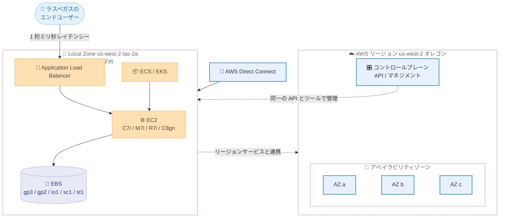

# AWS Local Zones - ラスベガス (ネバダ州) の新しい Local Zone が一般提供開始

**リリース日**: 2026 年 8 月 20 日
**サービス**: AWS Local Zones
**機能**: 米国ネバダ州ラスベガスにおける新しい AWS Local Zone の一般提供 (GA)

📊 [このアップデートのインフォグラフィックを見る](https://takech9203.github.io/aws-news-summary/20260820-aws-local-zones-las-vegas-nevada.html)

## 概要

AWS は、米国ネバダ州ラスベガスに新しい AWS Local Zone の一般提供 (GA) を発表しました。この Local Zone は米国西部 (オレゴン) リージョン (us-west-2) の拡張として提供され、ゾーン ID は `us-west-2-las-2a` です。

AWS Local Zones は、コンピュート、ストレージ、ネットワーキングなどのコアサービスを世界の大都市圏の近くに配置するインフラストラクチャです。エンドユーザーに近い場所でワークロードを実行することで、1 桁ミリ秒の低レイテンシーを実現し、データレジデンシー要件への対応、AI/ML 推論ワークロードの実行、レガシーアプリケーションのクラウド移行・モダナイゼーションの加速を支援します。リージョンと同一の AWS API、ツール、サービスをそのまま利用できる点が特長です。

ラスベガス都市圏でレイテンシーに敏感なアプリケーション (リアルタイムゲーム、メディア配信、ライブイベント処理など) を運用する企業や、ネバダ州内でのデータ処理要件を持つ組織が主な対象ユーザーです。

**アップデート前の課題**

このアップデート以前は、ラスベガス周辺のワークロードに以下の課題がありました。

- ラスベガスのエンドユーザー向けに超低レイテンシーが必要な場合、最寄りの AWS リージョン (オレゴンや北カリフォルニア) までの物理的距離に起因するネットワーク遅延が発生していた
- ラスベガスには既存の Local Zone があるものの、対応インスタンスタイプやサービスが限られる場合があり、キャパシティや世代の新しいインスタンスの選択肢に制約があった
- 最新世代インスタンス (C7i、M7i、R7i、C8gn など) をエッジロケーションで利用する選択肢が限られていた

**アップデート後の改善**

今回のアップデートにより、以下が可能になりました。

- ラスベガス都市圏のエンドユーザーに対して 1 桁ミリ秒レイテンシーでアプリケーションを提供できるようになった
- 最新世代の EC2 インスタンス (C7i、M7i、R7i、C8gn) と複数の EBS ボリュームタイプ (gp3、gp2、io1、sc1、st1) をエッジで利用できるようになった
- Amazon ECS / Amazon EKS によるコンテナワークロード、Application Load Balancer、AWS Direct Connect をラスベガスの Local Zone で利用できるようになった

## アーキテクチャ図



ラスベガスの新しい Local Zone `us-west-2-las-2a` は、オレゴンリージョン (us-west-2) の拡張として動作します。エンドユーザーに近い場所でコンピュートとストレージを提供しつつ、管理はリージョンと同一の API・ツールで行えます。

## サービスアップデートの詳細

### 主要機能

1. **最新世代 EC2 インスタンスのサポート**
   - Amazon EC2 の C7i (コンピュート最適化)、M7i (汎用)、R7i (メモリ最適化) インスタンスをサポート
   - ネットワーク最適化型の C8gn (AWS Graviton4 ベース) インスタンスもサポート
   - ワークロード特性に応じたインスタンス選択が可能

2. **複数の EBS ボリュームタイプのサポート**
   - 汎用 SSD (gp3、gp2)、プロビジョンド IOPS SSD (io1) をサポート
   - コールド HDD (sc1)、スループット最適化 HDD (st1) もサポートし、コスト効率の高いストレージ階層化が可能

3. **コンテナとネットワーキングサービスのサポート**
   - Amazon ECS および Amazon EKS によるコンテナワークロードの実行
   - Application Load Balancer によるローカルなロードバランシング
   - AWS Direct Connect によるオンプレミス環境との専用線接続

4. **リージョンとの一貫した運用体験**
   - AWS リージョンと同一の API、ツール、サービスセットを利用可能
   - 既存の運用プロセスやデプロイパイプラインをそのまま適用可能

## 技術仕様

### Local Zone の基本情報

| 項目 | 詳細 |
|------|------|
| ゾーン ID | `us-west-2-las-2a` |
| 親リージョン | 米国西部 (オレゴン) リージョン (us-west-2) |
| 所在地 | 米国ネバダ州ラスベガス |
| コンピュート | EC2 C7i、M7i、R7i、C8gn |
| ストレージ | EBS gp3、gp2、io1、sc1、st1 |
| コンテナ | Amazon ECS、Amazon EKS |
| ネットワーキング | Application Load Balancer、AWS Direct Connect |
| 提供ステータス | 一般提供 (GA) |

### 有効化方法

Local Zone はデフォルトでは無効のため、利用前にオプトイン (有効化) が必要です。以下のいずれかの方法で有効化できます。

- AWS Global View の [Regions and Zones] タブから有効化
- `ModifyAvailabilityZoneGroup` API を使用して有効化

## 設定方法

### 前提条件

1. AWS アカウントを保有していること
2. 親リージョンである米国西部 (オレゴン) リージョン (us-west-2) を利用できること
3. ゾーングループの有効化権限 (`ec2:ModifyAvailabilityZoneGroup`) を持つ IAM プリンシパルで操作すること

### 手順

#### ステップ 1: Local Zone のゾーングループを確認

```bash
aws ec2 describe-availability-zones \
  --region us-west-2 \
  --all-availability-zones \
  --filters "Name=zone-name,Values=us-west-2-las-2a"
```

オレゴンリージョンで利用可能なゾーン一覧からラスベガスの Local Zone を確認しています。`OptInStatus` が `not-opted-in` の場合は次のステップで有効化が必要です。

#### ステップ 2: Local Zone を有効化

```bash
aws ec2 modify-availability-zone-group \
  --region us-west-2 \
  --group-name us-west-2-las-2 \
  --opt-in-status opted-in
```

`ModifyAvailabilityZoneGroup` API でラスベガスの Local Zone グループをオプトインしています。有効化後、このゾーンにリソースをデプロイできるようになります。

#### ステップ 3: Local Zone にサブネットを作成して EC2 インスタンスを起動

```bash
# Local Zone にサブネットを作成
aws ec2 create-subnet \
  --region us-west-2 \
  --vpc-id vpc-xxxxxxxx \
  --cidr-block 10.0.10.0/24 \
  --availability-zone us-west-2-las-2a

# 作成したサブネットに EC2 インスタンスを起動
aws ec2 run-instances \
  --region us-west-2 \
  --image-id ami-xxxxxxxx \
  --instance-type c7i.xlarge \
  --subnet-id subnet-xxxxxxxx
```

既存の VPC を Local Zone に拡張するサブネットを作成し、そのサブネットに C7i インスタンスを起動しています。VPC はリージョンと Local Zone をまたいで利用できます。

## メリット

### ビジネス面

- **エンドユーザー体験の向上**: ラスベガス都市圏のユーザーに 1 桁ミリ秒レイテンシーでサービスを提供でき、リアルタイム性が求められるアプリケーションの品質が向上する
- **データレジデンシー要件への対応**: データを特定の地理的場所に保持する必要がある規制・契約要件に対応しやすくなる
- **移行・モダナイゼーションの加速**: オンプレミスからの移行時に、レイテンシー要件を維持したままクラウドへ移行できる

### 技術面

- **最新世代インスタンスの利用**: C7i / M7i / R7i / C8gn といった最新世代インスタンスをエッジで利用でき、性能とコスト効率が向上する
- **一貫した運用モデル**: リージョンと同一の API・ツールで管理でき、既存の IaC や CI/CD パイプラインを流用できる
- **ハイブリッド接続**: AWS Direct Connect により、ラスベガス近郊のオンプレミス環境と低レイテンシーで接続できる

## デメリット・制約事項

### 制限事項

- 利用できるサービスとインスタンスタイプはリージョンに比べて限定される (今回サポートされるのはコンピュート、ストレージ、コンテナ、一部ネットワーキングサービス)
- Local Zone は単一ゾーン構成のため、リージョンのマルチ AZ 構成と同等の可用性設計はできない
- 利用前にゾーングループのオプトインが必要

### 考慮すべき点

- Local Zones の料金はリージョンと異なる場合があるため、料金ページで事前に確認が必要
- 高可用性が必要なワークロードは、親リージョン (us-west-2) との組み合わせによるフェイルオーバー設計を検討すべき
- レイテンシー効果はエンドユーザーの地理的位置に依存するため、ラスベガス都市圏以外のユーザーには効果が限定的

## ユースケース

### ユースケース 1: ライブイベント・エンターテインメント向けリアルタイム配信

**シナリオ**: ラスベガスの大規模イベント会場やカジノリゾートで、リアルタイムの映像処理やインタラクティブなコンテンツ配信を行う。会場内のユーザーへの応答遅延を最小化したい。

**実装例**:
```
- us-west-2-las-2a に C7i インスタンスで映像処理パイプラインを構築
- Application Load Balancer で会場内クライアントからのトラフィックを分散
- 処理済みデータは親リージョン us-west-2 の S3 にアーカイブ
```

**効果**: 会場内ユーザーに対して 1 桁ミリ秒レイテンシーで応答でき、リアルタイム性の高い体験を提供できる。

### ユースケース 2: オンプレミスワークロードのハイブリッド移行

**シナリオ**: ラスベガス近郊のデータセンターで稼働するレイテンシーに敏感な業務システムを、段階的にクラウドへ移行したい。

**実装例**:
```
- AWS Direct Connect でオンプレミスと Local Zone を専用線接続
- 移行第 1 段階として、アプリケーション層を EKS 上のコンテナへ移行
- データベース層はオンプレミスに残し、低レイテンシー接続で連携
```

**効果**: アプリケーション間のレイテンシー要件を維持したまま段階的な移行が可能になり、移行リスクを低減できる。

### ユースケース 3: AI/ML 推論のエッジ実行

**シナリオ**: ユーザーの操作に対して即座に応答する必要がある AI 推論 (レコメンデーション、画像解析など) を、エンドユーザーの近くで実行したい。

**実装例**:
```
- us-west-2 リージョンでモデルをトレーニング
- 学習済みモデルを us-west-2-las-2a の C8gn / C7i インスタンスにデプロイ
- ECS でモデルサービングコンテナを運用し、ALB 経由で推論 API を公開
```

**効果**: 推論リクエストへの応答時間を短縮し、リアルタイム性が求められる AI アプリケーションの体験を向上できる。

## 料金

AWS Local Zones では、Local Zone 内で利用する EC2 インスタンスや EBS ボリュームなどに対して、ゾーン固有のオンデマンド料金が適用されます。料金はリージョンと異なる場合があるため、最新の料金は [AWS Local Zones 料金ページ](https://aws.amazon.com/about-aws/global-infrastructure/localzones/pricing/) を参照してください。

Local Zone の有効化自体に追加料金は発生せず、利用したリソースに対する従量課金です。

## 利用可能リージョン

- **新しい Local Zone**: 米国ネバダ州ラスベガス (`us-west-2-las-2a`)
- **親リージョン**: 米国西部 (オレゴン) リージョン (us-west-2)

AWS Local Zones は現在、世界の 30 以上の大都市圏で利用可能です。

## 関連サービス・機能

- **Amazon EC2**: Local Zone 上で C7i / M7i / R7i / C8gn インスタンスを起動可能
- **Amazon EBS**: gp3 / gp2 / io1 / sc1 / st1 ボリュームでブロックストレージを提供
- **Amazon ECS / Amazon EKS**: Local Zone 上でコンテナワークロードを実行可能
- **Application Load Balancer**: Local Zone 内でのトラフィック分散を提供
- **AWS Direct Connect**: オンプレミス環境との専用線接続を提供
- **AWS Outposts**: より厳密なオンプレミス要件がある場合の代替エッジソリューション

## 参考リンク

- 📊 [インフォグラフィック](https://takech9203.github.io/aws-news-summary/20260820-aws-local-zones-las-vegas-nevada.html)
- [公式発表 (What's New)](https://aws.amazon.com/about-aws/whats-new/2026/08/aws-local-zones-las-vegas-nevada/)
- [AWS Local Zones 概要](https://aws.amazon.com/about-aws/global-infrastructure/localzones/)
- [AWS Local Zones 料金ページ](https://aws.amazon.com/about-aws/global-infrastructure/localzones/pricing/)
- [ModifyAvailabilityZoneGroup API リファレンス](https://docs.aws.amazon.com/AWSEC2/latest/APIReference/API_ModifyAvailabilityZoneGroup.html)

## まとめ

米国ネバダ州ラスベガスに新しい AWS Local Zone (`us-west-2-las-2a`) が一般提供され、最新世代の EC2 インスタンスや EBS、ECS / EKS、ALB、Direct Connect をエンドユーザーの近くで利用できるようになりました。ラスベガス都市圏で低レイテンシーが求められるワークロードやデータレジデンシー要件を持つ場合は、AWS Global View または `ModifyAvailabilityZoneGroup` API でゾーンを有効化し、活用を検討することを推奨します。
