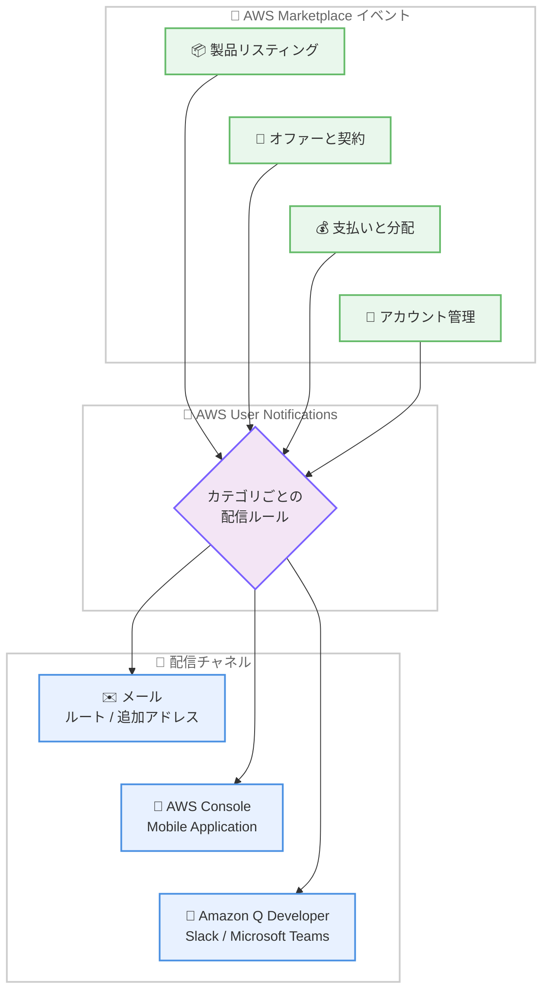

# AWS Marketplace - パートナー向けカテゴリベース通知とマルチチャネル配信

**リリース日**: 2026 年 8 月 20 日
**サービス**: AWS Marketplace
**機能**: カテゴリベース通知とマルチチャネル配信 (AWS User Notifications 連携)

📊 [このアップデートのインフォグラフィックを見る](https://takech9203.github.io/aws-news-summary/20260820-aws-marketplace.html)

## 概要

AWS Marketplace は、パートナー (ISV および AWS Marketplace Channel Partner) 向けに、カテゴリベースの通知設定とマルチチャネル配信のサポートを発表しました。AWS User Notifications のマネージド通知機能を利用することで、AWS Marketplace のイベント通知を 4 つのカテゴリに分類し、カテゴリごとに通知先の連絡先と配信チャネルを選択できるようになります。

配信チャネルとして、従来のルートユーザーのメールアドレスに加えて、追加のメールアドレスや配布リスト、AWS Console Mobile Application、さらに Slack や Microsoft Teams などのチャットツール上の Amazon Q Developer を利用できます。これにより、製品リスティングの担当チーム、契約管理チーム、経理チームなど、それぞれの業務に関係する通知だけを適切なチームへ適切なチャネルで届けることが可能になります。

**アップデート前の課題**

このアップデート以前は、AWS Marketplace の通知配信に以下の課題がありました。

- 通知はアカウントのルートユーザーのメールアドレスまたはカスタムエイリアスにのみ送信され、カテゴリを選択できなかった
- すべての通知が同じ宛先に届くため、担当チームへの振り分けを手動で行う必要があった
- メール以外の配信チャネル (モバイルアプリやチャットツール) を選択できなかった

**アップデート後の改善**

今回のアップデートにより、以下が可能になりました。

- 通知を 4 つのカテゴリ (製品リスティング、オファーと契約、支払いと分配、アカウント管理) 単位で管理できるようになった
- カテゴリごとに、どの連絡先がどのチャネルで通知を受け取るかを選択できるようになった
- メールに加えて、AWS Console Mobile Application や Slack / Microsoft Teams 上の Amazon Q Developer 経由での通知受信が可能になった

## アーキテクチャ図



AWS Marketplace の各イベントは 4 つのカテゴリに分類され、AWS User Notifications のマネージド通知でカテゴリごとに設定した配信ルールに従い、メール、モバイルアプリ、チャットツールの各チャネルへ配信されます。

## サービスアップデートの詳細

### 主要機能

1. **4 つの通知カテゴリ**
   - **製品リスティング**: 未対応の製品タスク、AMI / コンテナ製品の定期スキャン結果、SaaS 製品の Vendor Insights セキュリティプロファイルのスナップショットに関する通知
   - **オファーと契約**: プライベートオファー、リセラーアクティビティ、プロフェッショナルサービスのリクエスト、契約の開始 / キャンセル、キャンセルリクエスト、契約作成の失敗に関する通知
   - **支払いと分配**: 支払いリクエスト、請求調整、請求書提出の結果、支払い失敗、分配 (ディスバースメント) の問題に関する通知
   - **アカウント管理**: ビジネスアカウントおよび銀行口座の検証アクション、承認 / 有効期限切れ / 却下に関する通知

2. **マルチチャネル配信**
   - デフォルトではアカウントのルートユーザーのメールアドレスに配信
   - 追加のメールアドレスや配布リストを手動で追加可能
   - AWS Console Mobile Application での受信に対応
   - Slack や Microsoft Teams などのチャットツール上の Amazon Q Developer での受信に対応

3. **AWS User Notifications によるマネージド通知**
   - AWS User Notifications コンソールでマネージド通知を有効化して利用
   - コンソールの通知センターでも通知を一元的に確認可能
   - カテゴリごとに通知を受け取る連絡先とチャネルを選択可能

## 技術仕様

### 通知カテゴリと対象イベント

| カテゴリ | 主な対象イベント |
|------|------|
| 製品リスティング | 未対応の製品タスク、AMI / コンテナ製品のスキャン結果、Vendor Insights スナップショット |
| オファーと契約 | プライベートオファー、リセラーアクティビティ、契約の開始 / キャンセル、契約作成の失敗 |
| 支払いと分配 | 支払いリクエスト、請求調整、請求書提出の結果、支払い失敗、分配の問題 |
| アカウント管理 | ビジネス / 銀行口座の検証、承認、有効期限切れ、却下 |

### 配信チャネル

| チャネル | 詳細 |
|------|------|
| メール | デフォルトはルートユーザーのメールアドレス。追加アドレスや配布リストを登録可能 |
| AWS Console Mobile Application | モバイルアプリのプッシュ通知で受信 |
| Amazon Q Developer | Slack や Microsoft Teams などのチャットツールで受信 |

### 送信元メールアドレス

| 通知の種類 | 送信元 |
|------|------|
| 従来の AWS Marketplace メール通知 | `no-reply@marketplace.aws` |
| AWS User Notifications 経由の通知 | `partner-central@aws.com` |

メールプロバイダーによってはこれらのメールがスパムとして分類される場合があるため、必要に応じて受信設定を調整してください。

## 設定方法

### 前提条件

1. AWS Marketplace のセラーアカウント (ISV または AWS Marketplace Channel Partner) として登録済みであること
2. AWS User Notifications コンソールへアクセスできる IAM 権限があること
3. チャットツールで受信する場合は、Amazon Q Developer のチャットアプリケーション連携が設定済みであること

### 手順

#### ステップ 1: マネージド通知の有効化

AWS User Notifications コンソールの [マネージド通知](https://console.aws.amazon.com/notifications/home#/managed-notifications) ページにアクセスし、AWS Marketplace のマネージド通知を有効化します。有効化すると、AWS Marketplace のイベント通知が通知センターに表示されるようになります。

#### ステップ 2: カテゴリごとの通知設定

マネージド通知の設定画面で、4 つのカテゴリ (製品リスティング、オファーと契約、支払いと分配、アカウント管理) ごとに、通知を受け取る連絡先と配信チャネルを選択します。デフォルトではアカウントのルートユーザーのメールアドレスに配信されるため、追加の受信者は手動で登録します。

#### ステップ 3: 配信チャネルの追加

必要に応じて、以下のチャネルを追加します。

- 追加のメールアドレスまたは配布リストの登録
- AWS Console Mobile Application での通知受信の有効化
- Slack や Microsoft Teams 上の Amazon Q Developer との連携設定

## メリット

### ビジネス面

- **通知対応の迅速化**: 支払い失敗や契約作成の失敗などの重要な通知が担当チームへ直接届くため、対応の遅れを防止できる
- **チーム別の責任分担**: 製品チーム、営業チーム、経理チームがそれぞれ関係するカテゴリの通知のみを受け取れるため、業務の分担が明確になる
- **通知の見逃し防止**: メールに加えてチャットツールやモバイルアプリでも受信できるため、重要なイベントの見逃しリスクを低減できる

### 技術面

- **AWS User Notifications への統合**: 通知設定を AWS User Notifications コンソールで一元管理でき、通知センターでの確認も可能になる
- **マルチチャネル配信**: Amazon Q Developer 経由で Slack / Microsoft Teams に配信でき、既存のチャット運用フローに組み込める
- **柔軟な受信者管理**: カテゴリごとに異なる連絡先を設定できるため、ルートメールへの依存を減らせる

## デメリット・制約事項

### 制限事項

- 通知カテゴリは 4 種類 (製品リスティング、オファーと契約、支払いと分配、アカウント管理) に固定されており、より細かいイベント単位でのフィルタリングは対象外
- マネージド通知を有効化しない場合、従来どおりルートユーザーのメールアドレスまたはカスタムエイリアスへの配信のみとなる
- 追加の受信者はデフォルトでは登録されないため、手動での追加が必要

### 考慮すべき点

- AWS User Notifications 経由の通知は `partner-central@aws.com` から送信されるため、メールフィルタリングルールの確認が必要
- チャットツールで受信する場合は、Amazon Q Developer のチャットアプリケーション連携の事前設定が必要
- 従来のカスタムメールエイリアス (最大 10 件) による通知設定との併用方針をチーム内で整理しておくことが望ましい

## ユースケース

### ユースケース 1: 経理チームへの支払い関連通知の直接配信

**シナリオ**: ISV の経理チームが、支払い失敗や分配の問題を迅速に把握したい。従来はルートメールに届く通知を管理者が手動で転送していた。

**実装例**:
```
1. AWS User Notifications コンソールでマネージド通知を有効化
2. 「支払いと分配」カテゴリの受信者に経理チームの配布リストを追加
3. 配信チャネルとしてメールを選択
```

**効果**: 支払い失敗や分配の問題が経理チームへ直接届き、対応までのリードタイムを短縮できる。

### ユースケース 2: 営業チームの Slack チャネルでの契約通知の受信

**シナリオ**: AWS Marketplace Channel Partner の営業チームが、プライベートオファーの受諾や契約開始を Slack 上でリアルタイムに把握したい。

**実装例**:
```
1. Amazon Q Developer と Slack の連携を設定
2. 「オファーと契約」カテゴリの配信チャネルとして
   Amazon Q Developer in chat applications を選択
3. 営業チームの Slack チャネルに通知を配信
```

**効果**: 契約イベントを営業チームがチャット上で即座に確認でき、顧客フォローアップを迅速化できる。

### ユースケース 3: 製品チームへのスキャン結果通知の振り分け

**シナリオ**: AMI / コンテナ製品を提供する ISV が、定期スキャンの検出結果や未対応の製品タスクを製品チームだけに届けたい。

**実装例**:
```
1. 「製品リスティング」カテゴリの受信者に製品チームの
   メーリングリストを追加
2. AWS Console Mobile Application での受信も有効化し、
   外出先でも重要な検出結果を確認可能にする
```

**効果**: セキュリティスキャンの検出結果や製品タスクを製品チームが直接把握でき、製品リスティングの健全性を維持しやすくなる。

## 料金

AWS Marketplace の通知機能および AWS User Notifications のマネージド通知の利用に追加料金は発生しません。

## 利用可能リージョン

AWS Marketplace が運営されているすべての AWS 商用リージョンで利用可能です。

## 関連サービス・機能

- **AWS User Notifications**: 本アップデートの基盤となる通知管理サービス。マネージド通知の有効化とカテゴリ / チャネル設定を行う
- **Amazon Q Developer**: Slack や Microsoft Teams などのチャットツールで通知を受信するための連携機能を提供
- **AWS Console Mobile Application**: モバイルアプリでの通知受信に対応
- **AWS Marketplace Management Portal**: 従来のカスタムメールエイリアス (最大 10 件) の管理を行うポータル

## 参考リンク

- 📊 [インフォグラフィック](https://takech9203.github.io/aws-news-summary/20260820-aws-marketplace.html)
- [公式発表 (What's New)](https://aws.amazon.com/about-aws/whats-new/2026/08/aws-marketplace/)
- [ドキュメント: Managing email notifications for AWS Marketplace events](https://docs.aws.amazon.com/marketplace/latest/userguide/email-notifications.html)
- [ドキュメント: AWS managed notifications (AWS User Notifications User Guide)](https://docs.aws.amazon.com/notifications/latest/userguide/managed-notifications.html)
- [AWS User Notifications コンソール (マネージド通知)](https://console.aws.amazon.com/notifications/home#/managed-notifications)

## まとめ

AWS Marketplace のパートナー向け通知が、AWS User Notifications を通じてカテゴリベースかつマルチチャネルで管理できるようになりました。ルートメール依存の通知運用から脱却し、担当チームごとに必要な通知を適切なチャネルで受け取れるため、Marketplace ビジネスを運営する ISV および Channel Partner は、AWS User Notifications コンソールでマネージド通知を有効化し、カテゴリごとの配信設定を見直すことを推奨します。
