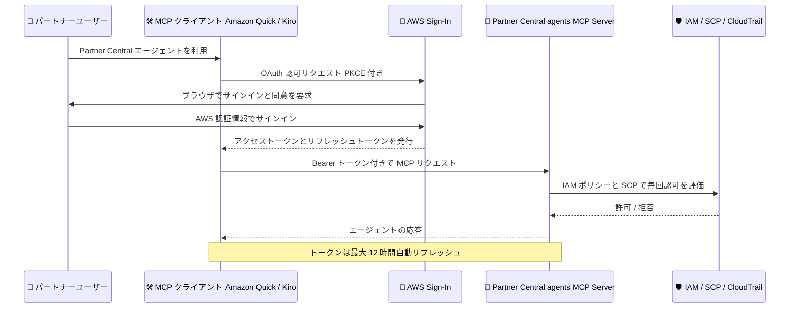

# AWS Partner Central - agents MCP Server の OAuth (AWS Sign-In) サポート

**リリース日**: 2026 年 8 月 20 日
**サービス**: AWS Partner Central
**機能**: AWS Partner Central agents MCP Server now supports OAuth with AWS Sign-In

📊 [このアップデートのインフォグラフィックを見る](https://takech9203.github.io/aws-news-summary/20260820-aws-partner-central-mcp.html)

## 概要

AWS Partner Central agents MCP Server が、AWS Sign-In による OAuth 認証をサポートしました。AWS パートナーは、Amazon Quick や Kiro などの普段使用しているツールから、既存の AWS アイデンティティ、サインイン方法、IAM 権限、ガバナンス統制をそのまま利用して Partner Central エージェントへのアクセスを認可できます。追加の認証ソフトウェアをインストールしたり維持したりする必要はありません。

これまで AWS パートナーが既存ツールから Partner Central エージェントにアクセスするには、SigV4 認証情報を使用した MCP プロキシをセットアップするか、AWS マネジメントコンソール経由で IAM 認証情報を使って AWS Partner Central にサインインする必要がありました。今回の OAuth サポートにより、AWS Sign-In を通じて Amazon Quick や Kiro などのツールに Partner Central エージェントへのアクセスを認可するだけで済むようになり、セットアップが大幅に簡素化されます。

パートナーは既存ツールから OAuth を使用して、共同販売 (Co-Sell) エンゲージメント、AWS ファンディング申請、AWS Marketplace セラーセットアップなどの業務を実行できます。管理者は IAM ポリシー、グローバル条件キー、トークンのイントロスペクション / 失効 API、動的クライアント登録 (DCR)、CloudTrail 監査イベントによってアクセスをガバナンスできます。

**アップデート前の課題**

このアップデート以前は、以下の課題がありました。

- 既存ツールから Partner Central エージェントにアクセスするには、SigV4 認証情報を使用する MCP プロキシのセットアップが必要だった
- または AWS マネジメントコンソール経由で IAM 認証情報を使って AWS Partner Central にサインインする必要があった
- 追加の認証ソフトウェアのインストールや維持管理の負担が発生していた

**アップデート後の改善**

今回のアップデートにより、以下が可能になりました。

- AWS Sign-In のブラウザベース OAuth フローで、Amazon Quick や Kiro などのツールから直接 Partner Central エージェントにアクセスできるようになった
- 既存の AWS アイデンティティ、サインイン方法、IAM 権限をそのまま利用でき、プロキシや追加ソフトウェアが不要になった
- IAM ポリシー、条件キー、トークンイントロスペクション / 失効 API、動的クライアント登録、CloudTrail 監査イベントによる一元的なガバナンスが可能になった

## アーキテクチャ図



パートナーユーザーが MCP クライアントから AWS Sign-In の OAuth フローで認可を受け、Partner Central agents MCP Server にアクセスする流れです。すべてのリクエストは既存の IAM ポリシーや SCP に基づいて評価され、OAuth トークンによって追加の権限が付与されることはありません。

## サービスアップデートの詳細

### 主要機能

1. **AWS Sign-In による OAuth 認証**
   - ブラウザベースのサインインで Partner Central エージェントへのアクセスを認可
   - OAuth 2.1 Authorization Code Grant と PKCE (Proof Key for Code Exchange) を強制
   - IAM ユーザー、ルートユーザー、IAM Identity Center ユーザー、SAML / カスタム ID ブローカーユーザーをサポート
   - アクセストークンは短命 (最大 1 時間)、リフレッシュトークンにより最大 12 時間自動更新

2. **既存ツールからの直接アクセス**
   - Amazon Quick、Kiro (IDE / CLI v3 以降)、Claude Code、Claude Desktop など MCP 対応クライアントからプロキシなしで接続可能
   - エンドポイント: `https://partnercentral-agents-mcp.us-east-1.api.aws/mcp`
   - 共同販売エンゲージメント、AWS ファンディング申請、AWS Marketplace セラーセットアップに対応

3. **管理者向けガバナンス機能**
   - IAM ポリシーとグローバル条件キーによるアクセス制御
   - トークンのイントロスペクション API (`IntrospectOAuth2TokenWithIAM`) と失効 API (`RevokeOAuth2TokenWithIAM`)
   - 動的クライアント登録 (許可リストに登録されたリダイレクト URI のみ受け付け)
   - CloudTrail による OAuth 認可とトークンライフサイクルイベントの監査

4. **既存の AWS 認可モデルとの統合**
   - エージェントを認可しても追加の AWS 権限は付与されない
   - すべてのリクエストは IAM ポリシー、SCP、RCP、アクセス許可の境界に基づいて評価される
   - `partnercentral:InvokeMcp` への明示的な Deny で MCP アクセス自体をブロック可能

## 技術仕様

### 認証方式の比較

| 項目 | OAuth (今回追加) | SigV4 (従来方式) |
|------|------------------|------------------|
| 認証フロー | ブラウザベースの AWS Sign-In | AWS 認証情報による署名 |
| 必要な準備 | `signin:AuthorizeOAuth2Access` と `signin:CreateOAuth2Token` の許可 | AWS CLI のインストールと認証情報の設定 |
| プロキシ | 不要 | 不要 (直接 HTTPS アクセス) |
| 適するケース | 対話的な利用、AWS CLI 不要で開始したい場合 | CI/CD、自動化スクリプトなどブラウザなしの環境 |
| トークン | Bearer トークン (自動リフレッシュ、最大 12 時間) | リクエストごとの SigV4 署名 |

### OAuth エンドポイント (AWS Sign-In)

| エンドポイント | パス | 説明 |
|----------------|------|------|
| Authorization | `/v1/authorize` | 対話型認可フローを開始 |
| Token | `/v1/token` | 認可コード、リフレッシュトークン、クライアント認証情報をトークンに交換 |
| Introspection | `/v1/introspect` | OAuth トークンのメタデータを返却 |
| Revocation | `/v1/revoke` | リフレッシュトークンを失効 |
| Dynamic Client Registration | `/v1/register` | 承認済み OAuth クライアントを登録 |

リージョナルエンドポイントは `https://{region}.oauth.signin.aws` 形式です。

### OAuth に必要な IAM 権限

OAuth フローを有効にするには、IAM ロールまたはユーザーに `AWSMcpServiceActionsFullAccess` マネージドポリシーをアタッチするか、以下のポリシーを追加します。

```json
{
    "Version": "2012-10-17",
    "Statement": [
        {
            "Effect": "Allow",
            "Action": [
                "signin:AuthorizeOAuth2Access",
                "signin:CreateOAuth2Token"
            ],
            "Resource": "*"
        }
    ]
}
```

MCP プロトコルアクセス自体は、認証済みのすべての AWS アイデンティティにデフォルトで許可されます。Partner Central の実データ操作には、`AWSPartnerCentralFullAccess` マネージドポリシーまたはユースケースに応じたカスタムポリシー (オポチュニティ管理、ファンディング、Marketplace アクセスなど) が別途必要です。

## 設定方法

### 前提条件

1. アクティブな Partner Central アカウント (AWS コンソールへ移行済み)
2. Partner Central 組織にリンクされ、Partner Central 用の IAM 権限を持つ AWS アカウント
3. MCP 対応クライアント (Amazon Quick、Kiro、Claude Code、Claude Desktop など)
4. OAuth 利用時: `signin:AuthorizeOAuth2Access` と `signin:CreateOAuth2Token` の IAM 許可

### 手順

#### ステップ 1: OAuth 権限の付与

```bash
aws iam attach-role-policy \
  --role-name YourPartnerRole \
  --policy-arn arn:aws:iam::aws:policy/AWSMcpServiceActionsFullAccess
```

利用する IAM ロールに `AWSMcpServiceActionsFullAccess` マネージドポリシーをアタッチし、ブラウザベースの OAuth サインインフローを有効化します。カスタムポリシーで `signin:AuthorizeOAuth2Access` と `signin:CreateOAuth2Token` のみを許可することもできます。

#### ステップ 2: MCP クライアントの設定

```bash
# Claude Code CLI の場合
claude mcp add partnercentral --transport http https://partnercentral-agents-mcp.us-east-1.api.aws/mcp

# Kiro CLI v3 以降の場合
kiro-cli --v3 mcp add --name partnercentral --url https://partnercentral-agents-mcp.us-east-1.api.aws/mcp
```

MCP クライアントに Partner Central agents MCP Server のエンドポイントをリモート MCP サーバーとして登録します。初回接続時にブラウザが開き、AWS Sign-In での認証と認可の同意を求められます。認証後はトークンがバックグラウンドで自動的にリフレッシュされます。Amazon Quick の場合は、Capabilities → Connectors から Web コネクタを作成し、Default OAuth app を選択して接続します。

#### ステップ 3: 動作確認

```json
{
    "jsonrpc": "2.0",
    "id": 3,
    "method": "tools/call",
    "params": {
        "name": "sendMessage",
        "arguments": {
            "content": [
                { "type": "text", "text": "Hello, what can you help me with?" }
            ],
            "catalog": "Sandbox"
        }
    }
}
```

`Sandbox` カタログを使用してテストメッセージを送信し、セットアップを確認します。`"status": "complete"` とエージェントからのテキスト応答が返れば設定は正常です。本番データを操作する場合は `catalog` を `AWS` に変更し、必要な Partner Central データアクセス権限を付与します。

## メリット

### ビジネス面

- **業務ツールへのシームレスな統合**: Amazon Quick や Kiro など日常業務で使用するツールから直接、共同販売エンゲージメント、ファンディング申請、Marketplace セラーセットアップを実行できる
- **オンボーディングの迅速化**: AWS CLI のインストールや認証情報の設定なしで、ブラウザサインインだけで利用を開始できる
- **運用負担の削減**: MCP プロキシや追加認証ソフトウェアのインストール・維持管理が不要になる

### 技術面

- **標準ベースの認可モデル**: OAuth 2.1 Authorization Code Grant と PKCE を強制し、単一使用の認可コードとローテーションされるリフレッシュトークンでリプレイ攻撃を防止
- **最小権限の維持**: OAuth トークンは追加の AWS 権限を付与せず、すべてのリクエストは既存の IAM ポリシー、SCP、RCP、アクセス許可の境界で評価される
- **包括的なガバナンス**: トークンイントロスペクション / 失効 API、動的クライアント登録、CloudTrail 監査イベント、IAM 条件キーによる一元管理が可能

## デメリット・制約事項

### 制限事項

- Partner Central agents MCP Server は米国東部 (バージニア北部) リージョンのみで提供 (接続自体は任意の場所から可能)
- OAuth を Kiro CLI で使用するには v3 以降が必要 (それ以前のバージョンは非対応)
- アクセストークンは短命で、OAuth セッションの自動リフレッシュは最大 12 時間 (以降はブラウザでの再認証が必要)
- セッションデータは作成から 48 時間で失効する一時的なもの

### 考慮すべき点

- 組織が許可リスト型の SCP を使用している場合、`partnercentral` と `signin` サービスを SCP で明示的に許可する必要がある
- `signin:AuthorizeOAuth2Access` や `signin:CreateOAuth2Token` を組織で制限している場合は、従来どおり SigV4 認証を使用する
- ブラウザなしで動作するエージェント (CI/CD、自動化スクリプト) には OAuth ではなく SigV4 が適する
- MCP プロトコルアクセスはデフォルトで全認証済みアイデンティティに許可されるため、ブロックしたい場合は `partnercentral:InvokeMcp` への明示的な Deny を適用する

## ユースケース

### ユースケース 1: Kiro からの共同販売オポチュニティ管理

**シナリオ**: パートナーのセールスエンジニアが、開発作業に使用している Kiro からそのまま共同販売オポチュニティの状況を確認し、更新する。

**実装例**:
```bash
kiro-cli --v3 mcp add --name partnercentral --url https://partnercentral-agents-mcp.us-east-1.api.aws/mcp
# エージェントへの依頼例
# 「予想売上 5 万ドル以上のオープンなオポチュニティを一覧して」
```

**効果**: コンソールへの切り替えや MCP プロキシのセットアップなしで、既存の IAM 権限の範囲内でオポチュニティを管理でき、営業活動の効率が向上する。

### ユースケース 2: Amazon Quick からのファンディング申請確認

**シナリオ**: パートナーのアライアンス担当者が、Amazon Quick のコネクタ経由で MAP ファンディングの適格性を確認し、申請状況を追跡する。

**実装例**:
```text
Amazon Quick で Capabilities → Connectors → Create → Web Connectors を選択し、
Model Context Protocol コネクタとして MCP エンドポイントを登録。
Auth configuration で Default OAuth app を選択してサインイン。
エージェントへの依頼例: 「オポチュニティ O1234567890 は MAP ファンディングの対象?」
```

**効果**: 認証ソフトウェアの追加インストールなしにファンディング業務を既存ツールに統合でき、申請リードタイムを短縮できる。

### ユースケース 3: 管理者によるアクセスガバナンスと監査

**シナリオ**: パートナー企業の AWS 管理者が、OAuth 経由のエージェントアクセスを IAM で統制し、CloudTrail で監査する。

**実装例**:
```json
{
    "Effect": "Deny",
    "Action": "partnercentral:InvokeMcp",
    "Resource": "*"
}
```

**効果**: 特定ユーザーやアカウントの MCP アクセスを明示的にブロックしつつ、トークンイントロスペクション / 失効 API と CloudTrail イベントで OAuth 認可とトークンライフサイクルを完全に可視化できる。

## 料金

AWS Partner Central agents MCP Server および AWS Sign-In の OAuth サポートは、AWS パートナー向けに提供されます。公式発表に追加料金に関する記載はありません。

## 利用可能リージョン

AWS Partner Central agents MCP Server は米国東部 (バージニア北部) リージョンで利用可能です。エンドポイントへの接続は任意の場所から可能です。

## 関連サービス・機能

- **AWS Sign-In**: OAuth 2.0 / 2.1 の認可、トークン管理、動的クライアント登録を提供する認証基盤。今回の OAuth フローの中核
- **AWS IAM**: OAuth 認可に対する権限 (`signin:*` アクション)、条件キー、`partnercentral:InvokeMcp` によるアクセス制御を提供
- **AWS CloudTrail**: OAuth 認可とトークンライフサイクルイベントの監査ログを記録
- **Amazon Quick / Kiro**: OAuth で Partner Central エージェントに接続できる AWS 提供のツール
- **AWS Marketplace**: エージェント経由でのセラーセットアップや商品管理に関連

## 参考リンク

- 📊 [インフォグラフィック](https://takech9203.github.io/aws-news-summary/20260820-aws-partner-central-mcp.html)
- [公式発表 (What's New)](https://aws.amazon.com/about-aws/whats-new/2026/8/aws-partner-central-mcp/)
- [ドキュメント: Getting Started with the Partner Central Agent MCP Server](https://docs.aws.amazon.com/partner-central/latest/developer-guide/mcp-getting-started.html)
- [ドキュメント: Sign-In with OAuth 2.0](https://docs.aws.amazon.com/signin/latest/userguide/oauth-sign-in-overview.html)
- [ドキュメント: AWS Sign-In の Actions, resources, and condition keys](https://docs.aws.amazon.com/service-authorization/latest/reference/list_signin.html)

## まとめ

AWS Partner Central agents MCP Server の OAuth サポートにより、パートナーは Amazon Quick や Kiro などの既存ツールからブラウザサインインだけで Partner Central エージェントを利用できるようになりました。OAuth トークンは追加権限を付与せず、既存の IAM / SCP ガバナンスがそのまま適用されるため、セキュリティを維持しながら利用開始の障壁を大きく下げるアップデートです。パートナー企業は、まず `signin:AuthorizeOAuth2Access` と `signin:CreateOAuth2Token` の権限設計と SCP の許可リスト確認から始めることを推奨します。
