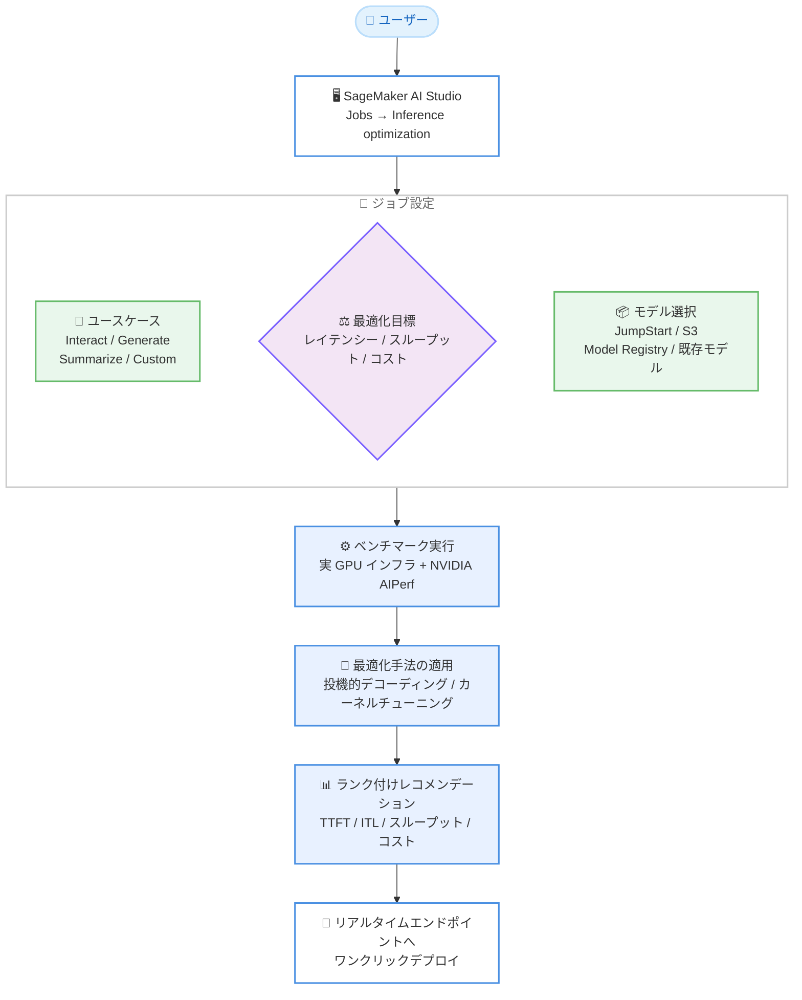

# Amazon SageMaker AI - 生成 AI 推論レコメンデーションの SageMaker AI Studio 対応

**リリース日**: 2026 年 8 月 20 日
**サービス**: Amazon SageMaker AI
**機能**: Generative AI Inference Recommendation in SageMaker AI Studio

📊 [このアップデートのインフォグラフィックを見る](https://takech9203.github.io/aws-news-summary/20260820-generative-ai-inference-recommendation-for-amazon-sagemaker-now-available-in-the-sagemaker-ai-studio.html)

## 概要

Amazon SageMaker AI の生成 AI 推論レコメンデーション機能が、SageMaker AI Studio の UI から利用可能になりました。ガイド付きのローコード / ノーコードのワークフローを通じて、生成 AI モデルのワークロードに最適な推論構成 (インスタンスタイプ、サービングコンテナ設定、最適化戦略) を探索できます。2026 年 4 月に API として提供開始された機能を、ビジュアルインターフェースを好むユーザー向けに拡張したものです。

ユーザーはワークロードの特性と優先事項 (レイテンシー、スループット、コスト) を指定するだけで、SageMaker が NVIDIA AIPerf を使用して実際の GPU インフラストラクチャ上で構成をベンチマークし、測定済みのパフォーマンスデータ付きでランク付けされた本番利用可能なレコメンデーションを返します。従来数週間かかっていた構成探索を数時間に短縮できます。

対象ユーザーは、生成 AI モデルを本番環境にデプロイする ML エンジニアやデータサイエンティスト、特にインフラストラクチャの深い専門知識を持たないチームです。

**アップデート前の課題**

このアップデート以前に存在していた課題や制限は以下のとおりです。

- 生成 AI モデルの本番デプロイでは、インスタンスタイプ、サービングコンテナ、最適化戦略の選定に数週間の手動ベンチマークや設定チューニング、試行錯誤が必要だった
- 2026 年 4 月に提供開始された推論レコメンデーション機能は API 経由でのみ利用可能であり、コードの記述が前提だった
- インフラストラクチャの専門知識がないチームは、検証済みのデプロイ構成を得ることが困難だった

**アップデート後の改善**

今回のアップデートにより可能になったことは以下のとおりです。

- SageMaker AI Studio の UI から、コードを書かずにガイド付きワークフローで推論レコメンデーションジョブを作成できるようになった
- ユースケースプロファイル (Interact、Generate、Summarize、Custom) と最適化目標 (レイテンシー最小化、スループット最大化、コスト最小化) を選択するだけで、目標に応じた最適化手法が自動適用されるようになった
- TTFT、トークン間レイテンシー、スループット、コストの実測値に基づくランク付けされたレコメンデーションを視覚的に比較し、Studio から直接リアルタイムエンドポイントへデプロイできるようになった

## アーキテクチャ図



SageMaker AI Studio の UI からユースケースと最適化目標を指定すると、実際の GPU インフラストラクチャ上でベンチマークが実行され、ランク付けされたレコメンデーションからワンクリックでエンドポイントをデプロイできる流れを示しています。

## サービスアップデートの詳細

### 主要機能

1. **ガイド付きジョブ作成ワークフロー**
   - SageMaker AI Studio の Jobs → Inference optimization からジョブを作成
   - ユースケースプロファイルを選択: Interact (チャット)、Generate (コンテンツ生成)、Summarize (ドキュメント要約)、Custom (独自の JSONL データセット、同時実行数、トークン設定を指定)
   - 最適化目標を選択: レイテンシー最小化、スループット最大化、コスト最小化
   - コンピュートの選択はオプションで、SageMaker が互換性のあるインスタンスを自動選択可能

2. **実インフラストラクチャでのベンチマーク**
   - モデルのアーキテクチャとメモリ要件を分析して構成空間を絞り込み
   - NVIDIA AIPerf を使用して実際の GPU ハードウェア上でベンチマークを実行し、複数回実行による信頼区間を提供
   - ベンチマーク中に作成されたエンドポイントは終了後に自動削除
   - 最適化目標に応じた手法を適用: スループット向けの投機的デコーディング (サポートされるモデルではドラフトモデルを先に学習)、レイテンシー向けのカーネルチューニング

3. **レコメンデーションの比較とデプロイ**
   - TTFT (Time to First Token)、トークン間レイテンシー (ITL)、スループット、コストでランク付けされた推論パッケージを表示
   - 視覚的な比較機能により構成間のトレードオフを確認可能
   - 新規エンドポイントへのデプロイ、または既存エンドポイントの更新をワンクリックで実行

4. **多様なモデルソースへの対応**
   - SageMaker JumpStart カタログのモデル
   - Amazon S3 上のモデルアーティファクト
   - Model Registry のモデルパッケージ
   - 既存の SageMaker モデル

## 技術仕様

### 機能仕様

| 項目 | 詳細 |
|------|------|
| アクセス方法 | SageMaker AI Studio の Jobs → Inference optimization |
| ユースケースプロファイル | Interact、Generate、Summarize、Custom |
| 最適化目標 | レイテンシー最小化、スループット最大化、コスト最小化 |
| モデルソース | JumpStart、Amazon S3、Model Registry、既存 SageMaker モデル |
| ベンチマークツール | NVIDIA AIPerf (実 GPU インフラストラクチャ上で実行) |
| 評価メトリクス | TTFT、トークン間レイテンシー、スループット、コスト |
| 最適化手法 | 投機的デコーディング、カーネルチューニング |
| 所要時間 | 一般的なワークロードで数分〜、カスタムワークロードで数時間程度 |
| デプロイ先 | SageMaker リアルタイムエンドポイント (新規作成または既存更新) |

### ジョブ管理

- ジョブの進行状況は Overview、Settings、Details の各タブで確認可能
- 実行中のジョブは Actions メニューから停止可能
- Custom プロファイルでは独自の JSONL 形式データセットを使用したベンチマークが可能

## 設定方法

### 前提条件

1. SageMaker AI Studio へのアクセス権を持つ SageMaker ドメインとユーザープロファイルが設定されていること
2. 実行ロールにベンチマーク用エンドポイントの作成・削除、モデルソース (S3、Model Registry など) へのアクセス権限があること
3. ベンチマークに使用する GPU インスタンスのサービスクォータが十分であること

### 手順

#### ステップ1: 最適化ジョブの作成

SageMaker AI Studio にサインインし、ナビゲーションから Jobs → Inference optimization を選択して、新しい最適化ジョブを作成します。

#### ステップ2: 戦略の設定

ユースケースプロファイル (Interact、Generate、Summarize、Custom のいずれか) と最適化目標 (レイテンシー最小化、スループット最大化、コスト最小化のいずれか) を選択します。Custom を選択した場合は、独自の JSONL データセット、同時実行数、トークン設定を指定します。

#### ステップ3: モデルとコンピュートの選択

JumpStart カタログ、S3 上のモデルアーティファクト、Model Registry、既存の SageMaker モデルからモデルを選択します。コンピュートの指定はオプションであり、省略した場合は SageMaker が互換性のあるインスタンスを自動選択します。

#### ステップ4: ジョブの起動とモニタリング

ジョブを起動し、Overview、Settings、Details タブで進行状況を確認します。必要に応じて Actions メニューからジョブを停止できます。

#### ステップ5: レコメンデーションの確認とデプロイ

ランク付けされたレコメンデーションを TTFT、ITL、スループット、コストの実測値で比較し、選択した構成を新規エンドポイントへデプロイするか、既存エンドポイントを更新します。エンドポイントが In Service になると呼び出し可能になります。

## メリット

### ビジネス面

- **市場投入までの時間短縮**: 数週間かかっていた推論構成の探索を数時間に短縮し、生成 AI アプリケーションの本番化を加速できる
- **コスト最適化の判断材料**: 実測されたコストデータに基づいて構成を比較でき、過剰プロビジョニングを回避できる
- **専門人材への依存低減**: インフラストラクチャの深い専門知識がなくても、検証済みの本番利用可能な構成を取得できる

### 技術面

- **実測データに基づく信頼性**: シミュレーションではなく実 GPU ハードウェア上で NVIDIA AIPerf によるベンチマークを実行し、複数回実行の信頼区間付きで結果を提供する
- **目標に応じた自動最適化**: スループット重視なら投機的デコーディング、レイテンシー重視ならカーネルチューニングなど、目標に整合した最適化手法が自動適用される
- **API との一貫性**: UI と API は同じ基盤を共有しており、UI で試した後に API で CI/CD パイプラインへ組み込むといった段階的な活用が可能

## デメリット・制約事項

### 制限事項

- 利用可能リージョンは 7 リージョンに限定される (日本では東京リージョンで利用可能)
- レコメンデーションの生成自体は無料だが、ベンチマーク中に作成される最適化ジョブとエンドポイントには標準のコンピュート料金が発生する
- 投機的デコーディングなど一部の最適化手法は、モデルがサポートしている場合にのみ適用される

### 考慮すべき点

- ベンチマークには GPU インスタンスが使用されるため、対象インスタンスタイプのサービスクォータを事前に確認する必要がある
- レコメンデーションは実行時点のインスタンス提供状況やモデル状態に基づくため、ファインチューニング後、新しいインスタンスタイプのリージョン追加後、トラフィックパターンの変化後、フレームワークのアップグレード後には再実行が推奨される
- Custom プロファイルで実ワークロードに近い結果を得るには、代表的な JSONL データセットの準備が必要となる

## ユースケース

### ユースケース1: チャットアプリケーションのレイテンシー最適化

**シナリオ**: 顧客向けチャットボットで JumpStart の LLM を使用しており、応答の体感速度 (TTFT) を最優先で改善したい。

**実装例**:
```
1. Studio の Jobs → Inference optimization でジョブを作成
2. ユースケースプロファイル: Interact
3. 最適化目標: レイテンシー最小化
4. モデル: JumpStart カタログから対象 LLM を選択
5. TTFT でランク付けされた構成から上位を選択してデプロイ
```

**効果**: カーネルチューニングを含むレイテンシー最適化構成が実測値付きで提示され、手動チューニングなしで体感速度を改善できる。

### ユースケース2: バッチ要約処理のコスト削減

**シナリオ**: 大量のドキュメント要約をバッチ処理しており、リアルタイム性よりもコスト効率を重視したい。

**実装例**:
```
1. ユースケースプロファイル: Summarize
2. 最適化目標: コスト最小化
3. モデル: S3 上のファインチューニング済みモデルアーティファクトを指定
4. コスト順にランク付けされた構成を比較し、スループット要件を満たす最安構成を選択
```

**効果**: 実測コストデータに基づいて最もコスト効率の良いインスタンスタイプと構成を選択でき、過剰プロビジョニングを回避できる。

### ユースケース3: ファインチューニング後の構成再評価

**シナリオ**: Model Registry で管理しているモデルをファインチューニングした後、既存エンドポイントの構成が引き続き最適か確認したい。

**実装例**:
```
1. ユースケースプロファイル: Custom (本番トラフィックを模した JSONL データセットを使用)
2. 最適化目標: スループット最大化
3. モデル: Model Registry の新しいモデルパッケージを選択
4. レコメンデーション結果から既存エンドポイントの更新を実行
```

**効果**: モデル更新のたびに実測ベンチマークで構成を再検証し、既存エンドポイントをワンクリックで最適構成に更新できる。

## 料金

レコメンデーションの生成自体に追加料金はかかりません。ただし、ベンチマーク中にプロビジョニングされる最適化ジョブおよびエンドポイントには、標準の SageMaker AI コンピュート料金が適用されます。ベンチマークで作成されたエンドポイントはジョブ完了後に自動削除されます。

詳細は [Amazon SageMaker AI の料金ページ](https://aws.amazon.com/sagemaker-ai/pricing/) を参照してください。

## 利用可能リージョン

以下の 7 リージョンで利用可能です。

- 米国東部 (バージニア北部)
- 米国東部 (オハイオ)
- 米国西部 (オレゴン)
- 欧州 (アイルランド)
- 欧州 (フランクフルト)
- アジアパシフィック (シンガポール)
- アジアパシフィック (東京)

## 関連サービス・機能

- **SageMaker Inference Recommender**: 従来型 ML モデル向けの推論レコメンデーション機能。今回の機能は生成 AI モデルに特化した後継的な位置づけ
- **SageMaker JumpStart**: 事前学習済みモデルカタログ。レコメンデーションジョブのモデルソースとして直接選択可能
- **SageMaker Model Registry**: モデルパッケージの管理機能。登録済みモデルパッケージをレコメンデーション対象として指定可能
- **SageMaker リアルタイム推論エンドポイント**: レコメンデーション結果のデプロイ先。新規作成と既存エンドポイントの更新に対応

## 参考リンク

- 📊 [インフォグラフィック](https://takech9203.github.io/aws-news-summary/20260820-generative-ai-inference-recommendation-for-amazon-sagemaker-now-available-in-the-sagemaker-ai-studio.html)
- [公式発表 (What's New)](https://aws.amazon.com/about-aws/whats-new/2026/08/generative-ai-inference-recommendation-for-amazon-sagemaker-now-available-in-the-sagemaker-ai-studio)
- [AWS Blog: Launching UI for generative AI inference recommendations in Amazon SageMaker AI](https://aws.amazon.com/blogs/machine-learning/launching-ui-for-generative-ai-inference-recommendations-in-amazon-sagemaker-ai/)
- [ドキュメント: Generative AI inference recommendations](https://docs.aws.amazon.com/sagemaker/latest/dg/generative-ai-inference-recommendations.html)
- [料金ページ](https://aws.amazon.com/sagemaker-ai/pricing/)

## まとめ

生成 AI モデルの推論構成探索が、SageMaker AI Studio 上のガイド付き UI で完結するようになり、コードを書かずに実測データに基づく本番利用可能な構成を数時間で取得できるようになりました。生成 AI モデルのデプロイでインスタンス選定やチューニングに時間を費やしているチームは、東京リージョンでも利用可能なため、まずは既存ワークロードのプロファイルに近いユースケースで試行し、現行構成とのコスト・性能差を確認することを推奨します。
