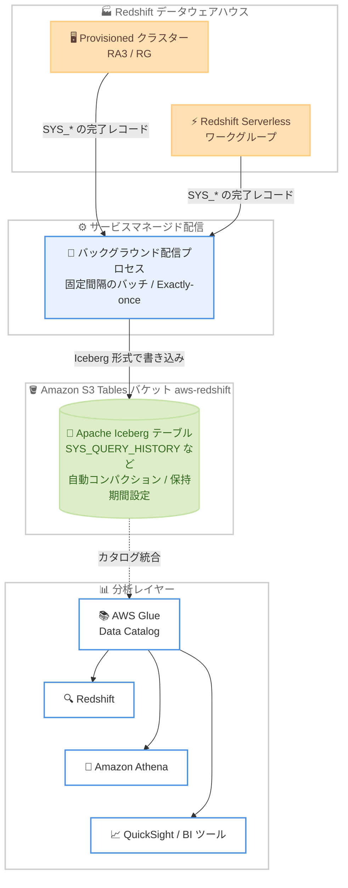

# Amazon Redshift - Amazon S3 Tables 統合によるシステムテーブルの長期保持

**リリース日**: 2026 年 8 月 20 日
**サービス**: Amazon Redshift / Amazon S3 Tables
**機能**: システムテーブルの長期保持 (Long-term system table retention with Amazon S3 Tables integration)

📊 [このアップデートのインフォグラフィックを見る](https://takech9203.github.io/aws-news-summary/20260820-redshift-long-term-system-table-retention.html)

## 概要

Amazon Redshift が Amazon S3 Tables とのネイティブ統合による、システムテーブルデータの長期保持機能を発表しました。従来、Redshift のシステムテーブル (SYS_* モニタリングビュー) のデータはクラスター内に約 7 日間しか保持されず、それ以降のデータはコンプライアンス、監査、オブザーバビリティの用途で利用できませんでした。本機能を有効化すると、Redshift が選択したシステムテーブルの新規レコードを Apache Iceberg 形式でお客様アカウント内の S3 Tables に自動的に書き込み、パーティショニング、コンパクション、スナップショット管理まで AWS が実施します。

保存されたデータはオープンな Iceberg 形式であるため、Redshift だけでなく Amazon Athena、AWS Glue、Amazon EMR など Iceberg 互換の任意のエンジンから照会でき、Amazon QuickSight やサードパーティー BI ツールによるダッシュボード構築にも利用できます。また、AWS Agent Toolkit のシステムテーブルスキルを使用すると、自然言語によるパフォーマンス分析や最適化推奨の取得も可能です。

対象は Amazon Redshift Provisioned の RA3 / RG インスタンスと Amazon Redshift Serverless で、コンプライアンス要件を持つ企業、複数の データウェアハウス を運用するプラットフォームチーム、長期のパフォーマンストレンド分析を行う DBA / SRE に特に有用なアップデートです。

**アップデート前の課題**

- システムテーブルのデータはクラスター内で約 7 日間しか保持されず、それ以前の履歴を参照できなかった
- 長期保持のためには、システムテーブルを S3 へエクスポートするカスタム ETL パイプラインを構築・保守する必要があり、スキーマ変更時に破損するリスクや本番ワークロードとのリソース競合が発生していた
- 複数のデータウェアハウスを運用する場合、監視データを一元化するためにデータ共有 (data sharing) などの追加の仕組みが必要だった

**アップデート後の改善**

- 有効化するだけで Redshift がシステムテーブルデータを S3 Tables へ自動配信し、カスタム ETL パイプラインが不要になった
- 配信は分離されたバックグラウンドプロセスで実行され、本番ワークロードへの影響なしに数か月〜数年単位の保持が可能になった
- 統合 (consolidated) デプロイモデルにより、同一アカウント・リージョン内の複数データウェアハウスの監視データを共有テーブルに集約し、フリート横断の分析が可能になった
- Iceberg 形式のオープンなデータとして、Redshift / Athena / その他 Iceberg 互換エンジンや BI ツールから自由に分析できるようになった

## アーキテクチャ図



Redshift の各データウェアハウスからシステムテーブルの完了レコードがバックグラウンドプロセス経由で S3 Tables に Iceberg 形式で配信され、AWS Glue Data Catalog 統合を通じて Redshift / Athena / BI ツールから照会できる構成です。

## サービスアップデートの詳細

### 主要機能

1. **サービスマネージドな S3 Tables への自動配信**
   - 有効化すると、Redshift がアカウント内に `aws-redshift` という名前の S3 テーブルバケットを作成し、選択したシステムテーブルの新規レコードを固定間隔のバッチで書き込む
   - テーブル作成、スキーマ定義と進化、Iceberg 形式での書き込み、コンパクションとスナップショット管理まで AWS が実施し、構築・保守するインフラは不要
   - 完了 (completed / aborted / canceled) したアクティビティのみが配信され、実行中のクエリは最終状態に達してから配信される
   - 各レコードは Exactly-once で配信され、再有効化やテーブルの再追加でも重複しない

2. **2 つのデプロイモデル**
   - **Per-warehouse (個別)**: データウェアハウスごとに専用の S3 テーブルセットへ書き込み、物理的に分離。機密データを扱うウェアハウスに適する
   - **Consolidated (統合)**: 同一アカウント・リージョン内の複数ウェアハウスのデータを共有テーブルに集約。`warehouse_namespace_arn` や `warehouse_name` 列で発生元を識別し、フリート横断の分析が可能
   - 1 つのデータウェアハウスで同時に使用できるのはどちらか一方のみ

3. **柔軟なテーブル選択と保持期間の制御**
   - 25 以上の `SYS_*` モニタリングビュー (SYS_QUERY_HISTORY、SYS_CONNECTION_LOG、SYS_USERLOG など) から公開対象を個別選択、または「すべて」を選択可能
   - 「すべて」を選択すると、将来追加される対応ビューも設定変更なしで自動的に含まれる
   - 保持期間は S3 Tables のレコード有効期限 (record expiration) 機能でテーブル単位に日数指定。未設定の場合は無期限に保持

4. **オープンフォーマットによる自由な分析**
   - データは Apache Iceberg 形式で保存され、AWS Glue Data Catalog 統合後は Redshift、Athena、EMR など Iceberg 互換エンジンから照会可能
   - AWS Lake Formation によるテーブル / 列 / 行レベルの細粒度アクセス制御に対応
   - AWS Agent Toolkit のシステムテーブルスキルにより、自然言語でのパフォーマンス分析や最適化推奨の取得が可能

## 技術仕様

### 配信されるテーブルに追加されるメタデータ列

| 列名 | 型 | 説明 |
|------|------|------|
| `warehouse_account_id` | string | ソースデータウェアハウスを所有する AWS アカウント |
| `warehouse_region_name` | string | ソースデータウェアハウスのリージョン |
| `warehouse_namespace_arn` | string | ネームスペースの ARN (リネーム・再作成でも不変の一意識別子) |
| `warehouse_name` | string | クラスター名またはワークグループ名 |
| `s3_tables_ingestion_time` | timestamp(6), UTC | Redshift が行を S3 Tables にコミットした時刻 |

### 主な設定パラメータ (AWS CLI)

| パラメータ | 対象 | 説明 |
|------|------|------|
| `--log-destination-type` | 両方 | `s3table` を指定して S3 Tables への公開を設定 (他に `s3`、`cloudwatch`) |
| `--log-exports` | Provisioned | 公開する `SYS_*` ビューのリスト、または `all` |
| `--s3-table-names` | Serverless | 公開する `SYS_*` ビューのリスト、または `all` |
| `--s3-table-action` | Serverless | `Enable` または `Disable` |
| `--s3-table-granularity` | 両方 | Provisioned: `cluster` (既定) / `account`、Serverless: `namespace` (既定) / `account` |
| `--s3-table-kms-key-id` | 両方 | 暗号化用 KMS キーの ARN / ID (既定は SSE-S3) |

### API変更履歴

| 日付 | サービス | 変更内容 |
|------|----------|----------|
| 2026/08/19 | [Amazon Redshift](https://awsapichanges.com/archive/changes/4429ee-redshift.html) | 20 updated api methods - EnableLogging / DisableLogging / DescribeLoggingStatus などに S3 Tables 宛先 (`s3table`) と関連パラメータを追加 |
| 2026/08/19 | [Redshift Serverless](https://awsapichanges.com/archive/changes/4429ee-redshift-serverless.html) | 7 updated api methods - CreateNamespace / UpdateNamespace / GetNamespace などに `s3TablePublishStatus` (公開状態、粒度、最終取り込み時刻) を追加 |

### 必要な IAM 権限 (有効化するプリンシパル)

- `redshift:EnableLogging` (Provisioned) または `redshift-serverless:UpdateNamespace` (Serverless)
- `s3tables:CreateTableBucket`
- `s3tables:PutTableBucketEncryption`
- `s3tables:PutTableBucketPolicy`

バケット作成後のネームスペース・テーブル作成は Redshift と S3 Tables 間のサービス信頼関係で実行されるため、追加権限は不要です。

## 設定方法

### 前提条件

1. Amazon Redshift Provisioned (RA3 / RG) クラスターまたは Redshift Serverless ワークグループ
2. 有効化するプリンシパルに上記の IAM 権限があること
3. Redshift や Athena から照会する場合は、S3 テーブルバケットを AWS Glue Data Catalog と統合済みであること (アカウント・リージョンごとに 1 回)
4. 一部のビュー (SYS_QUERY_DETAIL、SYS_QUERY_EXPLAIN など 8 ビュー) はパッチ P203 以降が必要

### 手順

#### ステップ1: 配信を有効化する (Provisioned クラスターの例)

```bash
aws redshift enable-logging \
    --cluster-identifier my-redshift-cluster \
    --log-destination-type s3table \
    --log-exports all \
    --s3-table-granularity account
```

ログ宛先を `s3table` に設定し、すべての対応システムテーブルをアカウント単位の統合 (consolidated) モデルで S3 Tables へ公開します。特定テーブルのみを対象とする場合は `--log-exports sys_query_history sys_query_text sys_userlog` のように指定し、ウェアハウスごとに分離する場合は `--s3-table-granularity cluster` を指定します。

#### ステップ2: 配信を有効化する (Redshift Serverless の例)

```bash
aws redshift-serverless update-namespace \
    --namespace-name my-namespace \
    --log-destination-type s3table \
    --s3-table-action Enable \
    --s3-table-names all \
    --s3-table-granularity namespace
```

Serverless ではネームスペース単位で設定します。`--s3-table-action Enable` で公開を有効化し、対象テーブルは `--s3-table-names` で指定します。

#### ステップ3: 配信状態を確認する

```bash
# Provisioned の場合
aws redshift describe-logging-status \
    --cluster-identifier my-redshift-cluster

# Serverless の場合
aws redshift-serverless get-namespace \
    --namespace-name my-namespace
```

有効なシステムテーブル、S3 Tables のネームスペース、粒度、テーブルごとの最終取り込み時刻を確認できます。

#### ステップ4: Redshift から照会する

S3 テーブルバケットを AWS Glue Data Catalog と統合した後、外部スキーマを作成して照会します。

```sql
CREATE EXTERNAL SCHEMA audit_history
FROM DATA CATALOG
DATABASE '<resource_link_database>'
IAM_ROLE '<iam_role_arn>';

SELECT * FROM audit_history.sys_query_history
WHERE warehouse_name = 'my-redshift-cluster';
```

Glue Data Catalog のリソースリンクデータベースを外部スキーマとして登録し、通常の 2 部名前表記でシステムテーブルの履歴データを照会します。

## メリット

### ビジネス面

- **コンプライアンス・監査対応**: クエリ履歴、接続ログ、変更履歴を数か月〜数年単位で保持でき、監査要件を追加開発なしで満たせる。配信データはイミュータブルで改ざんできないため、監査証跡としての完全性が保たれる
- **運用コスト削減**: カスタム ETL パイプラインの構築・保守が不要になり、スキーマ変更への追随やジョブ監視の負担から解放される
- **書き込みは無料**: S3 Tables への配信自体に追加料金はなく、支払うのは保存分の S3 Tables 料金と照会時のエンジン利用料のみ

### 技術面

- **本番ワークロードへの影響なし**: 配信は分離されたバックグラウンドプロセスで実行され、クラスターのコンピュートを消費しない。Serverless ではワークグループを起動状態に保つこともない
- **オープンフォーマット**: Apache Iceberg 形式のため、Redshift / Athena / EMR / サードパーティーエンジンなど任意の Iceberg 互換エンジンで分析でき、ベンダーロックインがない
- **フリート横断の可視性**: 統合デプロイモデルにより、同一アカウント・リージョン内の全ウェアハウスの監視データを 1 か所で分析できる
- **Exactly-once 配信**: 再有効化やテーブルの再追加でもデータが重複しない

## デメリット・制約事項

### 制限事項

- 単一アカウント・単一リージョン内でのサポート。アカウント / リージョン横断の分析はクエリ時に結果を結合する必要がある (クロスアカウントは AWS Glue Data Catalog 共有で対応可能)
- 1 つのデータウェアハウスで使えるデプロイモデルは一度に 1 つのみ。モデル切り替えや無効化 / 再有効化をしても過去データはバックフィルされない
- 配信データはイミュータブルで、Redshift から行の変更・削除はできない (読み取りアクセスのみ制御可能)
- S3 テーブルを削除すると保持データが完全に失われ、配信も停止する。再有効化しても過去データは復元されない
- KMS キーは S3 テーブル作成後に変更できない。変更には機能の無効化とテーブル削除 (データ完全削除) が必要
- SYS_QUERY_DETAIL など 8 ビューはパッチ P203 以降でないとデータが配信されない

### 考慮すべき点

- SYS_QUERY_TEXT や SYS_PROCEDURE_MESSAGES はクエリ内のリテラル値を含む可能性があるため、機密データを扱う場合は per-warehouse モデルでの分離や Lake Formation による細粒度アクセス制御を検討する
- 保持期間 (レコード有効期限) を設定しない場合、データは無期限に保持されストレージコストが増え続けるため、コンプライアンス要件に基づく最小限の保持期間を設定する
- 配信は固定間隔のバッチであり、リアルタイムではない。また完了したアクティビティのみが配信される
- カスタマーマネージド KMS キーを使う場合は、`systemtables.redshift.amazonaws.com` と `maintenance.s3tables.amazonaws.com` へのキーポリシー許可を有効化前に設定しておく

## ユースケース

### ユースケース1: コンプライアンス監査証跡の長期保持

**シナリオ**: 金融機関がデータウェアハウスへのアクセス記録 (誰がいつ接続し、どのクエリを実行したか) を 1 年以上保持することを求められている。

**実装例**:
```bash
aws redshift enable-logging \
    --cluster-identifier finance-dwh \
    --log-destination-type s3table \
    --log-exports sys_connection_log sys_userlog sys_query_history sys_query_text \
    --s3-table-granularity cluster
```
その後、S3 Tables のレコード有効期限を 400 日に設定し、Lake Formation で監査チームのみに読み取り権限を付与。

**効果**: ETL パイプラインなしで改ざん不可能な監査証跡を確保し、監査対応の工数とリスクを大幅に削減。

### ユースケース2: フリート全体のオブザーバビリティダッシュボード

**シナリオ**: プラットフォームチームが同一アカウント内の 10 以上のクラスターとワークグループの利用状況・パフォーマンスを一元的に監視したい。

**実装例**:
```sql
-- 統合 (account 粒度) モデルで有効化した後、ウェアハウス別のクエリ実行数を集計
SELECT warehouse_name,
       DATE_TRUNC('day', start_time) AS day,
       COUNT(*) AS query_count,
       AVG(elapsed_time) AS avg_elapsed
FROM audit_history.sys_query_history
GROUP BY 1, 2
ORDER BY 2 DESC, 3 DESC;
```
QuickSight などの BI ツールを Glue Data Catalog 経由で接続しダッシュボード化。

**効果**: データ共有の設定なしにフリート横断の利用状況を可視化し、コスト最適化や容量計画の判断材料を一元化。

### ユースケース3: 変更前後のパフォーマンス比較と過去インシデントの調査

**シナリオ**: WLM 設定変更やインスタンスタイプ変更の影響を数週間〜数か月のスパンで評価したい。また 7 日以上前に発生したインシデントの根本原因を分析したい。

**実装例**:
```sql
-- 設定変更前後 30 日間のクエリ実行時間トレンドを比較
SELECT DATE_TRUNC('week', start_time) AS week,
       PERCENTILE_CONT(0.5) WITHIN GROUP (ORDER BY elapsed_time) AS p50,
       PERCENTILE_CONT(0.95) WITHIN GROUP (ORDER BY elapsed_time) AS p95
FROM audit_history.sys_query_history
WHERE start_time BETWEEN '2026-07-01' AND '2026-08-31'
GROUP BY 1 ORDER BY 1;
```

**効果**: クラスター内の 7 日間の保持期間に縛られず、長期トレンドに基づいた客観的な変更評価とポストモーテムが可能になる。

## 料金

システムテーブルデータの S3 Tables への書き込み (配信) 自体は無料です。課金対象は以下のとおりです。

- 保持データに対する標準の S3 Tables ストレージ料金とメンテナンス (コンパクション等) 料金
- データを照会するクエリエンジン (Redshift、Athena など) の利用料金 (各エンジンの料金体系に従う)

保持期間を長くするほどストレージコストが増加するため、S3 Tables のレコード有効期限をテーブル単位で設定してコストを制御できます。詳細は [Amazon S3 の料金ページ](https://aws.amazon.com/s3/pricing/) を参照してください。

## 利用可能リージョン

Amazon Redshift Provisioned (RA3 / RG) および Amazon Redshift Serverless で、以下のリージョンで利用可能です (東京・大阪リージョンを含む)。

米国東部 (バージニア北部、オハイオ)、米国西部 (北カリフォルニア、オレゴン)、アフリカ (ケープタウン)、アジアパシフィック (香港、台北、東京、ソウル、大阪、ムンバイ、ハイデラバード、シンガポール、シドニー、ジャカルタ、メルボルン、マレーシア、タイ)、カナダ (中部)、欧州 (フランクフルト、チューリッヒ、ストックホルム、ミラノ、スペイン、アイルランド、ロンドン、パリ)、イスラエル (テルアビブ)、南米 (サンパウロ)

## 関連サービス・機能

- **Amazon S3 Tables**: Apache Iceberg 形式のテーブルデータをフルマネージドで保存する機能。本機能の保存先であり、コンパクション・スナップショット管理・レコード有効期限を提供
- **AWS Glue Data Catalog**: S3 Tables のカタログ統合により、Redshift / Athena などからの照会とクロスアカウント共有を実現
- **AWS Lake Formation**: 保持データに対するテーブル / 列 / 行レベルの細粒度アクセス制御を提供
- **Amazon Athena**: Iceberg 形式の保持データをサーバーレスで照会可能
- **AWS Agent Toolkit (システムテーブルスキル)**: 保持データに対する自然言語でのパフォーマンス分析・最適化推奨を提供

## 参考リンク

- 📊 [インフォグラフィック](https://takech9203.github.io/aws-news-summary/20260820-redshift-long-term-system-table-retention.html)
- [公式発表 (What's New)](https://aws.amazon.com/about-aws/whats-new/2026/08/redshift-long-term-system-table-retention/)
- [AWS Blog: Long-term system tables retention in Amazon Redshift with Amazon S3 Tables](https://aws.amazon.com/blogs/big-data/long-term-system-tables-retention-in-amazon-redshift-with-amazon-s3-tables/)
- [ドキュメント: System table integration with S3 Tables](https://docs.aws.amazon.com/redshift/latest/mgmt/system-table-s3-tables.html)
- [System table skills for AWS Agent Toolkit (GitHub)](https://github.com/aws/agent-toolkit-for-aws/tree/main/skills/specialized-skills/system-table-skills)
- [料金ページ (Amazon S3 / S3 Tables)](https://aws.amazon.com/s3/pricing/)

## まとめ

Redshift システムテーブルの 7 日間という保持制限が、S3 Tables へのフルマネージド配信によって事実上撤廃され、カスタム ETL なしでコンプライアンス監査・長期トレンド分析・フリート横断監視が実現できるようになりました。書き込みは無料でワークロードへの影響もないため、監査要件や運用可視化のニーズがある環境ではまず対象の SYS_* ビューを選定して有効化を検討することを推奨します。KMS キーは後から変更できないため、暗号化要件とデプロイモデル (個別 / 統合) は有効化前に決めておくことが重要です。
