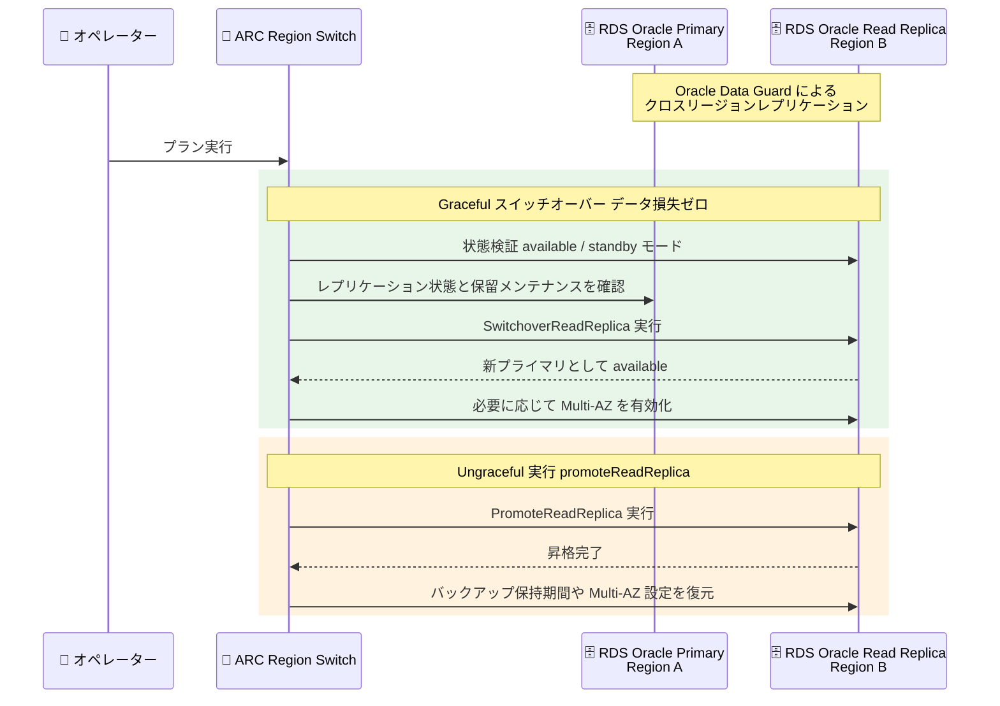

# Amazon Application Recovery Controller (ARC) - Amazon RDS Switchover Read Replica 実行ブロック

**リリース日**: 2026 年 8 月 20 日
**サービス**: Amazon Application Recovery Controller (ARC)
**機能**: Region Switch Amazon RDS Switchover Read Replica Execution Block

📊 [このアップデートのインフォグラフィックを見る](https://takech9203.github.io/aws-news-summary/20260820-region-switch-rds-switchover-execution-block.html)

## 概要

Amazon Application Recovery Controller (ARC) の Region Switch に、Amazon RDS Switchover Read Replica 実行ブロックが追加された。この機能により、Oracle Data Guard を使用してクロスリージョンリードレプリカを構成した Amazon RDS for Oracle データベースのリージョン間フェイルオーバーを、Region Switch プランのステップとして自動化できるようになる。

ARC Region Switch は、リージョン障害発生時にマルチリージョンアプリケーションのフェイルオーバーをオーケストレーションし、目標復旧時間 (RTO) を予測可能な範囲に収めるための機能である。今回追加された実行ブロックは、計画的なフェイルオーバーではデータ損失ゼロのスイッチオーバーを、緊急時のフェイルオーバーでは速度を優先したリードレプリカの昇格を自動実行する。ネイティブなクロスアカウントサポートも提供され、Region Switch プランとは別のアカウントにある RDS インスタンスの復旧を一元管理できる。

**アップデート前の課題**

- Oracle Data Guard を使用する RDS for Oracle のリージョンフェイルオーバーでは、プライマリデータベースとリードレプリカのロールを手動で入れ替える、またはレプリカを手動でプライマリに昇格する必要があった
- 手動操作はレプリケーション状態やバックアップ設定の確認など多くのチェック作業を伴い、復旧時間が長引く要因となっていた
- 複数アカウントにまたがる RDS インスタンスの復旧を、単一のフェイルオーバープランで一元的に管理することが困難だった

**アップデート後の改善**

- Region Switch プランに RDS Switchover Read Replica 実行ブロックを組み込み、Oracle Data Guard 構成のロール切り替えを自動化できるようになった
- Graceful パス (計画フェイルオーバー) ではプライマリとスタンバイ間のデータ同期を確認した上でスイッチオーバーを実行し、データ損失ゼロを実現する
- Ungraceful パス (緊急フェイルオーバー) ではリードレプリカを直接昇格し、復旧速度を優先できる
- エンジン互換性、レプリケーション状態、バックアップ設定、保留中のメンテナンスなどをプラン評価時に自動検証する
- クロスアカウントサポートにより、組織全体の RDS インスタンス復旧を単一プランで一元管理できる

## アーキテクチャ図



Region Switch が RDS Switchover Read Replica 実行ブロックを実行する際のシーケンスを示す。Graceful パスでは検証後にスイッチオーバーを実行してデータ損失ゼロを保証し、Ungraceful パスではリードレプリカを直接昇格して復旧速度を優先する。

## サービスアップデートの詳細

### 主要機能

1. **Graceful スイッチオーバー (デフォルト)**
   - ターゲットのリードレプリカが available 状態になるまで待機し、Oracle 19c 以降のリードレプリカが有効なスタンバイモード (mounted または open-read-only) であることを検証
   - プライマリとスタンバイ間でレプリケーションがアクティブであること、スタンバイで自動バックアップが有効であることを確認
   - 両インスタンスのブロッキングとなる保留中メンテナンスアクションを確認した上で `SwitchoverReadReplica` を呼び出し、スタンバイをプライマリに昇格
   - 元のプライマリで Multi-AZ が有効だった場合、新プライマリでも Multi-AZ を有効化して構成を一致させる

2. **Ungraceful 実行 (リードレプリカ昇格)**
   - `promoteReadReplica` 動作を指定した Ungraceful 実行では、`PromoteReadReplica` を使用してリードレプリカを直接昇格
   - レプリケーションが完全に同期していない場合はデータ損失の可能性があるが、復旧速度を優先できる
   - 昇格後、元のプライマリのバックアップ保持期間、優先バックアップウィンドウ、Multi-AZ 設定を復元
   - 動作を指定せずに Ungraceful 実行をリクエストした場合は、Graceful スイッチオーバーパスにフォールバック

3. **プラン評価時の自動検証**
   - DB インスタンス ARN の有効性と各リージョンでのインスタンス存在確認
   - リードレプリカ関係の有効性、エンジンが Oracle 19c 以降であること (Aurora やカスタムエンジンは対象外)、プライマリとスタンバイのエンジンバージョン一致を検証
   - オプショングループが無関係なインスタンスと共有されていないことを確認 (スイッチオーバー時の問題を防止)
   - 検証に失敗した場合は警告メッセージを返し、コンソールまたは API で確認可能

4. **ネイティブクロスアカウントサポート**
   - Region Switch プランとは別のアカウントでホストされている RDS インスタンスの復旧を管理可能
   - 組織全体の復旧管理を単一プランに集約できる

## 技術仕様

### 実行ブロックの仕様

| 項目 | 詳細 |
|------|------|
| カテゴリ | Database switchover |
| 対象エンジン | Amazon RDS for Oracle 19c 以降 (Aurora、RDS Custom は対象外) |
| 前提構成 | Oracle Data Guard によるクロスリージョンリードレプリカ |
| Graceful 実行 | `SwitchoverReadReplica` によるロール切り替え (データ損失ゼロ) |
| Ungraceful 実行 | `PromoteReadReplica` によるレプリカ昇格 (速度優先) |
| スタンバイの要件 | mounted または open-read-only モード、自動バックアップ有効 (保持期間 1 以上) |
| 設定項目 | ステップ名、説明 (任意)、各リージョンの DB インスタンス ARN、タイムアウト |

### API 変更履歴

| 日付 | サービス | 変更内容 |
|------|----------|----------|
| 2026/08/20 | [ARC - Region switch](https://awsapichanges.com/archive/changes/648ecf-arc-region-switch.html) | 6 updated api methods - Region Switch プランでの Oracle データベース向け RDS Switchover Read Replica サポートを追加 |

## 設定方法

### 前提条件

1. ARC Region Switch プランが作成済みであること
2. Amazon RDS for Oracle 19c 以降で、クロスリージョンリードレプリカ (Oracle Data Guard) が構成されていること
3. スタンバイインスタンスが mounted または open-read-only モードであり、自動バックアップが有効であること
4. プランの実行ロールに RDS スイッチオーバー操作に必要な IAM ポリシーが設定されていること

### 手順

#### ステップ 1: 実行ロールへの IAM ポリシー設定

実行ブロックを設定する前に、プランの実行ロールに RDS スイッチオーバーに必要な権限を付与する。必要な権限の詳細は [Amazon RDS Switchover Read Replica execution block sample policy](https://docs.aws.amazon.com/r53recovery/latest/dg/security_iam_region_switch_rds_switchover_read_replica.html) を参照する。

#### ステップ 2: 実行ブロックの設定

ARC コンソールで Region Switch プランに実行ブロックを追加し、以下の値を入力する。

1. **Step name**: ステップ名を入力
2. **Step description (任意)**: ステップの説明を入力
3. **DB Instance ARN for Region**: プラン内の各リージョンのデータベースインスタンス ARN を入力 (すべてのリージョン分が必須)
4. **Timeout**: タイムアウト値を入力

入力後、**Save step** を選択して保存する。

#### ステップ 3: プランの評価と検証警告の確認

プランを保存すると、Region Switch がプラン評価の一環として実行ブロック設定を検証する。エンジンバージョン、レプリケーション状態、バックアップ設定、保留中メンテナンスなどのチェックに失敗した場合は警告メッセージが返されるため、コンソールまたは API で内容を確認し、構成を修正する。

## メリット

### ビジネス面

- **RTO の短縮と予測可能性**: データベースのロール切り替えが自動化され、リージョンフェイルオーバーの復旧時間を予測可能な範囲に収められる
- **運用負荷の軽減**: 手動でのスイッチオーバー手順やチェック作業が不要になり、障害対応時のオペレーター負担が減少する
- **組織全体の一元管理**: クロスアカウントサポートにより、複数アカウントの RDS インスタンス復旧を単一プランで管理できる

### 技術面

- **データ損失ゼロの切り替え**: Graceful パスではプライマリとスタンバイのデータ同期を確認してから昇格するため、計画フェイルオーバーでのデータ損失を防止できる
- **自動検証による安全性**: エンジン互換性、レプリケーション状態、バックアップ設定、保留中メンテナンスを事前に検証し、切り替え失敗のリスクを低減する
- **柔軟な障害対応**: 緊急時は `promoteReadReplica` 動作によりレプリカを直接昇格し、速度を優先した復旧が可能
- **構成の自動復元**: 切り替え後に Multi-AZ やバックアップ設定を元のプライマリの構成に合わせて自動的に復元する

## デメリット・制約事項

### 制限事項

- 対象は Amazon RDS for Oracle 19c 以降のみ (Aurora は Aurora Global Databases 実行ブロックを使用する)
- RDS Custom は対象外
- スタンバイインスタンスは mounted または open-read-only モードであり、自動バックアップが有効 (保持期間 1 以上) である必要がある
- プラン内の各リージョンに対して DB インスタンス ARN の指定が必須

### 考慮すべき点

- Ungraceful 実行 (`promoteReadReplica`) では、レプリケーションが完全に同期していない場合にデータ損失が発生する可能性がある
- Ungraceful 実行後は元のレプリケーション関係が解消されるため、フェイルバックにはレプリカの再構築が必要になる
- オプショングループを無関係なインスタンスと共有しているとスイッチオーバー時に問題が発生する可能性があるため、プラン評価の警告を確認する必要がある
- クロスアカウント構成では IAM ロールの信頼関係と権限を適切に管理する必要がある

## ユースケース

### ユースケース 1: 基幹系 Oracle データベースの計画的リージョン切り替え

**シナリオ**: RDS for Oracle をプライマリリージョンで運用し、Oracle Data Guard でセカンダリリージョンにリードレプリカを構成している基幹系システム。DR 訓練やリージョンメンテナンスに合わせて、データ損失なしで計画的にリージョンを切り替えたい。

**実装例**:
```text
Region Switch プランのアクティブ化ワークフローに
RDS Switchover Read Replica 実行ブロックを追加

- Step name: switchover-oracle-primary
- DB Instance ARN for us-east-1: arn:aws:rds:us-east-1:123456789012:db:oracle-primary
- DB Instance ARN for us-west-2: arn:aws:rds:us-west-2:123456789012:db:oracle-replica
- Timeout: 60
```

**効果**: Graceful スイッチオーバーによりデータ損失ゼロでロールが入れ替わり、DR 訓練を安全かつ再現性のある手順で実施できる。

### ユースケース 2: リージョン障害時の緊急フェイルオーバー

**シナリオ**: プライマリリージョンで障害が発生し、プライマリデータベースへのアクセスが不安定な状況。多少のデータ損失リスクを許容してでも、可能な限り早くセカンダリリージョンでサービスを再開したい。

**実装例**:
```text
Region Switch プランを Ungraceful モードで実行し、
実行ブロックの動作として promoteReadReplica を指定

- Region Switch が PromoteReadReplica を呼び出しレプリカを直接昇格
- 昇格後、バックアップ保持期間・バックアップウィンドウ・Multi-AZ 設定を
  元のプライマリの構成に合わせて自動復元
```

**効果**: プライマリと通信できない状況でも復旧速度を優先してレプリカを昇格でき、RTO を最小化できる。

### ユースケース 3: マルチアカウント環境での復旧一元管理

**シナリオ**: 復旧管理用の共有アカウントで Region Switch プランを運用し、ワークロードアカウントに RDS for Oracle インスタンスが存在するマルチアカウント構成。組織全体のフェイルオーバーを単一プランで管理したい。

**実装例**:
```text
共有アカウントの Region Switch プランに、
ワークロードアカウントの DB インスタンス ARN を指定した
RDS Switchover Read Replica 実行ブロックを追加

- クロスアカウントアクセス用の IAM ロールと権限を事前に設定
- Route 53、EKS、Lambda ESM など他の実行ブロックと組み合わせて
  アプリケーション全体のフェイルオーバーをオーケストレーション
```

**効果**: ネイティブなクロスアカウントサポートにより、複数アカウントにまたがる RDS インスタンスの復旧を単一の Region Switch プランで一元管理できる。

## 料金

ARC Region Switch の利用料金に含まれる。RDS Switchover Read Replica 実行ブロックの追加による追加料金は発生しない。

### 料金例

| 項目 | 料金 |
|------|------|
| Region Switch プラン | ARC Region Switch の標準料金に準拠 |
| RDS Switchover Read Replica 実行ブロック | 追加料金なし |
| RDS インスタンスとクロスリージョンレプリケーション | 標準の Amazon RDS 料金が適用 |

## 利用可能リージョン

ARC Region Switch が利用可能なすべての商用リージョンおよび AWS GovCloud (US) リージョンで使用可能。詳細は [Region availability for Region switch](https://docs.aws.amazon.com/r53recovery/latest/dg/aws-regions-rs.html) を参照。

## 関連サービス・機能

- **Amazon Application Recovery Controller (ARC)**: マルチリージョンアプリケーションの復旧制御を提供するサービス
- **ARC Region Switch**: リージョン間フェイルオーバーを自動化するプラン機能。Route 53、Aurora Global Databases、DocumentDB、EKS、Lambda ESM などの実行ブロックも提供
- **Amazon RDS for Oracle**: Oracle Data Guard を利用したクロスリージョンリードレプリカにより、マルチリージョンのディザスタリカバリ構成を実現
- **Aurora Global Databases 実行ブロック**: Aurora データベースのリージョン切り替えには本ブロックではなくこちらを使用

## 参考リンク

- 📊 [インフォグラフィック](https://takech9203.github.io/aws-news-summary/20260820-region-switch-rds-switchover-execution-block.html)
- [公式発表 (What's New)](https://aws.amazon.com/about-aws/whats-new/2026/08/region-switch-rds-switchover-execution-block/)
- [Amazon RDS Switchover Read Replica execution block ドキュメント](https://docs.aws.amazon.com/r53recovery/latest/dg/rds-switchover-read-replica-block.html)
- [ARC multi-Region recovery](https://aws.amazon.com/application-recovery-controller/multi-region-recovery/)
- [Working with Oracle replicas for Amazon RDS](https://docs.aws.amazon.com/AmazonRDS/latest/UserGuide/oracle-read-replicas.html)
- [Region availability for Region switch](https://docs.aws.amazon.com/r53recovery/latest/dg/aws-regions-rs.html)

## まとめ

ARC Region Switch への Amazon RDS Switchover Read Replica 実行ブロックの追加により、Oracle Data Guard を使用する RDS for Oracle のリージョンフェイルオーバーが自動化され、計画フェイルオーバーではデータ損失ゼロ、緊急時には速度優先の復旧を単一プランで実現できるようになった。RDS for Oracle をマルチリージョンで運用しているユーザーは、既存の Region Switch プランに本実行ブロックを追加し、プラン評価の検証結果を確認した上で DR 訓練に組み込むことを推奨する。
