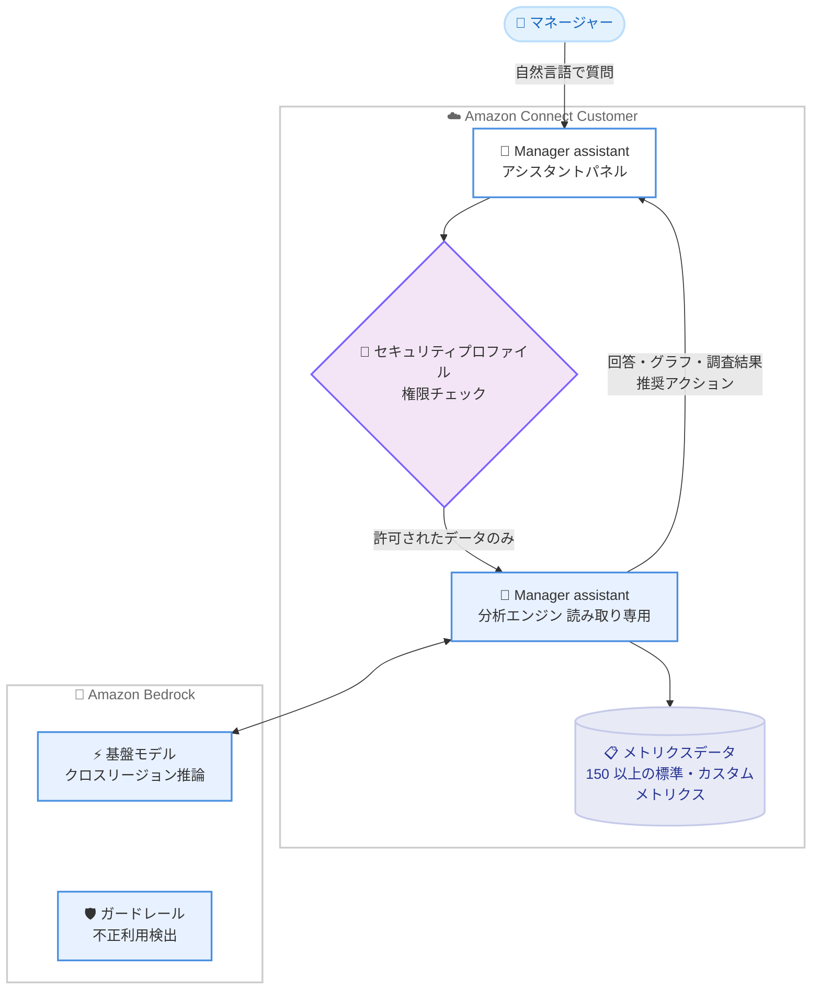

# Amazon Connect Customer - Manager assistant (データと対話できる生成 AI アシスタント)

**リリース日**: 2026 年 8 月 21 日
**サービス**: Amazon Connect Customer
**機能**: Manager assistant (プレビュー) - 自然言語によるコンタクトセンターデータの分析・調査機能

📊 [このアップデートのインフォグラフィックを見る](https://takech9203.github.io/aws-news-summary/20260821-amazon-connect-customer-ai-data-analytics.html)

## 概要

Amazon Connect Customer に、マネージャーやスーパーバイザーが自然言語でコンタクトセンターのデータと「チャット」できる生成 AI アシスタント「Manager assistant」が発表されました。「先週のコンタクトセンターのパフォーマンスはどうだった?」といった質問を入力するだけで、インスタンス内のメトリクスデータに基づいた回答、根拠、改善アクションが数秒で返されます。

Manager assistant は、セルフサービス、エージェントパフォーマンス、キューパフォーマンスにまたがる 150 以上の標準・カスタムメトリクスにアクセスできます。単なるメトリクスの参照にとどまらず、「なぜ」から始まる質問に対しては複数のデータディメンションを横断するマルチステップの調査 (Investigation) を実行し、要因の特定、寄与しなかった要因の明示、信頼度付きの優先順位化された推奨アクションまでを提示します。

対象ユーザーはコンタクトセンターのマネージャー、スーパーバイザー、オペレーション分析の担当者です。従来はアナリストによる数週間の調査やダッシュボードの深掘りが必要だった作業が、1 つの会話の中で完結します。

**アップデート前の課題**

生成 AI によるデータ分析支援がない環境では、以下の課題がありました。

- パフォーマンス低下の要因を特定するには、複数のダッシュボードやレポートを行き来して手動で深掘りする必要があった
- メトリクスの異常 (サービスレベル低下、処理時間増加など) の原因分析には、アナリストの工数と数日から数週間の調査時間が必要だった
- データはあっても「次に何をすべきか」というアクションへの変換はマネージャーの経験と時間に依存していた

**アップデート後の改善**

- ダッシュボードやレポートを切り替えることなく、自然言語の質問だけでメトリクスデータのインサイトを取得できるようになった
- 「なぜ」形式の質問で、要因分析・相関特定・推奨アクションまでを含むマルチステップ調査を数秒〜数十秒で実行できるようになった
- 信頼度インジケーターと理由付きの優先順位化されたアクションプランが自動生成され、意思決定までの時間が大幅に短縮された
- 同一チャット内でサマリーから特定のキュー・エージェント・時間帯への深掘りまで、フォローアップ質問で継続的に分析できるようになった

## アーキテクチャ図



マネージャーの自然言語の質問は、セキュリティプロファイルの権限チェックを経て、Amazon Bedrock の基盤モデルにより解釈されます。Manager assistant は読み取り専用アーキテクチャでインスタンス内のメトリクスデータを分析し、回答・可視化・推奨アクションを返します。

## サービスアップデートの詳細

### 主要機能

1. **自然言語によるメトリクス照会**
   - 「先週のコンタクトセンターのパフォーマンスはどうだった?」のような質問を入力するだけで、インスタンス内のメトリクスデータから回答を生成
   - エージェントパフォーマンス、キューの健全性、コンタクトボリューム、セルフサービス最適化、評価 (Evaluations) など幅広いトピックに対応
   - 150 以上の標準・カスタムメトリクスにアクセス可能
   - 回答には推奨アクションとフォローアップ用のサジェストプロンプトが含まれる

2. **調査 (Investigations) と推奨アクション**
   - 「なぜ」から始まる質問や調査リクエストに対して、Identify (対象特定) → Investigate (関連メトリクス調査) → Correlate (相関特定) → Recommend (推奨) のマルチステップ分析を実行
   - 前期間の同一曜日と比較するベースライン比較により、恣意的なしきい値に依存しない分析を実施
   - 主要因と副次要因を区別し、寄与しなかった要因もデータ付きで明示 (Explicit elimination)
   - 各推奨アクションには理由と信頼度インジケーター (High / Medium など) が付与され、優先度 (Immediate / Now / Strategic / Avoid) 別に提示
   - データが不十分な場合は推測せず、シグナル不足であることを明示

3. **可視化とサマリー生成**
   - メトリクスデータからグラフ、テーブル、ナラティブ (文章) サマリーを生成
   - 1 つの会話の中で、概要レベルの質問から特定のキュー・エージェント・時間帯への深掘りまでシームレスに移行可能

4. **アクセス制御との統合**
   - メトリクスデータの参照には、ダッシュボード等と同一のセキュリティプロファイル権限が必要
   - リソースタグ、エージェント階層、アクセス制御タグによるきめ細かなデータアクセス制御に対応

## 技術仕様

### 基盤技術

| 項目 | 詳細 |
|------|------|
| 基盤モデル | Amazon Bedrock 上の基盤モデルを使用 (質問解釈、メトリクス特定、データ取得、回答生成) |
| 推論方式 | クロスリージョン推論 (処理リージョンを限定したい場合は AWS Support に連絡) |
| アーキテクチャ | 読み取り専用 (インスタンスの設定やリソースの変更は不可) |
| 責任ある AI | Amazon Bedrock の自動不正利用検出を継承、ガードレールにより有害・オフトピックなコンテンツ生成を防止 |
| 対応言語 | プレビュー期間中、サポートされるすべての言語で利用可能 |
| アクセス方法 | Connect Customer 管理者 Web サイトの右パネルにあるアシスタントアイコン |

### サービスクォータ (プレビュー期間中)

| クォータ | デフォルト値 | 調整可否 |
|------|------|------|
| 最大メッセージ長 | 15,000 文字 / メッセージ | 不可 |
| リクエストレート | Connect Customer agent assist の SendMessage レートクォータに準拠 (リージョンにより異なる) | 可 (AWS Support 経由) |
| チャットコンテキスト | 直近のターンのみ参照 (長いチャットでは最初期のターンは参照されない) | 不可 |

### API 変更履歴

本アップデートは Connect Customer 管理者 Web サイト上のアシスタント機能であり、これに直接対応する公開 API の変更は 2026 年 8 月 21 日時点の awsapichanges.com では確認されていません。

## 設定方法

### 前提条件

1. Amazon Connect Customer インスタンスが AI Agents をサポートするリージョンに存在すること
2. 利用ユーザーに適切なセキュリティプロファイル権限が割り当てられていること
3. 参照したいメトリクスデータ (ユーザー、キュー、フロー等) に対するリソース別の View 権限があること

### 手順

#### ステップ 1: セキュリティプロファイル権限の割り当て

Connect Customer 管理者 Web サイトのセキュリティプロファイル設定で、以下の権限を割り当てます。

- **Workspace Applications > Connect assistant > View**: アシスタントへのアクセスを許可する権限
- **リソース別の View 権限**: 例えばフローのデータを参照するには **Flows - View**、ユーザーのデータを参照するには **Users - View** が必要 (ダッシュボードでの参照と同じ権限体系)

必要に応じて、リソースタグ、エージェント階層、アクセス制御タグを使用して、Manager assistant が返すメトリクスデータへのアクセスをきめ細かく制御できます。

#### ステップ 2: アシスタントを開いて質問する

1. Connect Customer 管理者 Web サイトで、右パネルのアシスタントアイコンを選択します
2. 質問を入力するか、サジェストされたプロンプト (コンタクトセンターの監視、キューパフォーマンスの確認、エージェント可用性の追跡など) を選択します

```text
質問例: How is my contact center performing over the last week?
```

#### ステップ 3: フォローアップ質問で深掘りする

回答を確認した後、フォローアップ質問でデータを深掘りしたり、履歴トレンドを表示したりできます。Manager assistant がサジェストするフォローアッププロンプトを選択することも可能です。

調査を実行する場合は、具体的な「なぜ」形式の質問が効果的です。

```text
効果的な質問例:
- Our service level dropped to 40 percent in the last hour but volume looks normal. What happened?
- Why is average handle time higher today compared to last Tuesday?
- What caused the abandonment spike in the Support queue between 2 PM and 3 PM?
```

## メリット

### ビジネス面

- **意思決定の高速化**: 従来アナリストとダッシュボードで数週間かかっていた要因分析が、数秒で優先順位付きのアクションプランに変わる
- **マネージャーの生産性向上**: ダッシュボードの深掘り作業から解放され、チームのコーチングや改善施策の実行に時間を割ける
- **アクション指向のインサイト**: 単なる数値の提示ではなく、信頼度と理由付きの推奨アクション (即時対応 / 回避すべき施策 / 戦略的対応) が得られる

### 技術面

- **読み取り専用アーキテクチャ**: インスタンス設定を変更できないため、誤操作のリスクなく安全に利用できる
- **既存の権限体系との統合**: ダッシュボードと同一のセキュリティプロファイル権限・タグベースアクセス制御が適用され、追加のガバナンス設計が不要
- **グラウンディングされた回答**: 回答はインスタンス内の実際のメトリクスデータ (ダッシュボードと同じデータ) に基づいて生成される
- **統計的に妥当な分析**: 前期間の同一曜日とのベースライン比較、要因の明示的な除外、シグナル不足時の明示など、分析品質を担保する設計

## デメリット・制約事項

### 制限事項

- プレビュー段階の機能であり、クォータや仕様は今後変更される可能性がある
- 読み取り専用モードで動作し、コンタクトセンター設定の変更やアクションの自動実行はできない
- 最大メッセージ長は 15,000 文字で、調整不可
- 長いチャットでは最初期のターンがコンテキストから外れるため、必要な文脈は改めてメッセージに含める必要がある
- リクエストレートは Connect Customer agent assist の SendMessage クォータに準拠し、超過時はスロットリングされる

### 考慮すべき点

- AI が生成する回答には不正確な内容が含まれる可能性があるため、ビジネス上の意思決定前に必ずダッシュボードやレポートで検証する必要がある
- 調査結果はデータの相関関係を特定するものであり、確定的な根本原因を保証するものではない
- クロスリージョン推論により選択リージョン外でデータが処理される場合がある (処理リージョンを限定したい場合は AWS Support への連絡が必要)
- 効果的な結果を得るには、曖昧な質問 (「何が悪いの?」) ではなく、メトリクス・期間・条件を含む具体的な質問が推奨される

## ユースケース

### ユースケース 1: サービスレベル低下の緊急調査

**シナリオ**: 直近 1 時間でサービスレベルが目標 80% に対して 40.6% まで低下したが、コンタクトボリュームは正常に見える。原因を即座に特定したい。

**実装例**:
```text
質問: Our service level is impacted in the last hour but volume looks normal.
Investigate what happened.
```

**効果**: マルチステップ調査により「主要因は人員不足、増幅要因は放棄呼、ボリュームと処理時間は寄与せず」といった構造化された分析結果と、「WFM へのエスカレーション (信頼度: High)」「キューコールバックの有効化 (信頼度: Medium)」「同時対応数の増加は回避すべき」などの優先順位付き推奨アクションが数十秒で得られます。

### ユースケース 2: 自動化対象キューの特定

**シナリオ**: セルフサービス自動化の投資対効果を最大化するため、どのキューから自動化に着手すべきかをデータに基づいて判断したい。

**実装例**:
```text
質問: Which queues are the best candidates for automation?
```

**効果**: 処理時間 (handle time) や後処理作業 (after-contact work) が最も長い箇所を分析し、信頼度スコアと予測インパクト付きの優先順位リストが返されます。従来はアナリストによる数週間の調査が必要だった意思決定を短時間で行えます。

### ユースケース 3: エージェントパフォーマンスの定期レビュー

**シナリオ**: 週次のチームレビューで、パフォーマンスのばらつきがあるエージェントを特定し、コーチング計画を立てたい。

**実装例**:
```text
質問例:
- Why are 3 agents handling twice the average handle time of the rest of the team?
- Why is adherence low today across the billing team?
```

**効果**: エージェント別のパフォーマンス差異の要因分析と、グラフ・テーブルによる可視化が同一チャット内で得られ、レポート作成の手間なくコーチングの優先対象と改善ポイントを特定できます。

## 料金

今回の発表およびドキュメントでは、Manager assistant 個別の料金は明示されていません。プレビュー段階の機能であるため、最新の料金情報は Amazon Connect の料金ページで確認してください。

## 利用可能リージョン

Amazon Connect Customer の AI Agents がサポートされているすべての AWS リージョンで利用可能です。詳細は [リージョン別の利用可否ドキュメント](https://docs.aws.amazon.com/connect/latest/adminguide/regions.html#amazonconnect_region) を参照してください。

なお、リクエストレートのクォータはリージョンにより異なります。

## 関連サービス・機能

- **Amazon Bedrock**: Manager assistant の基盤となる基盤モデルを提供。クロスリージョン推論、ガードレール、自動不正利用検出も Bedrock の機能を継承
- **Connect Customer メトリクス・ダッシュボード**: Manager assistant が参照するのはダッシュボードと同一のメトリクスデータであり、回答の検証にも使用する
- **セキュリティプロファイル**: アシスタントへのアクセスと参照可能なデータ範囲を制御する権限機構
- **タグベース・階層ベースのアクセス制御**: 返却されるメトリクスデータへのきめ細かなアクセス制御を実現

## 参考リンク

- 📊 [インフォグラフィック](https://takech9203.github.io/aws-news-summary/20260821-amazon-connect-customer-ai-data-analytics.html)
- [公式発表 (What's New)](https://aws.amazon.com/about-aws/whats-new/2026/08/amazon-connect-customer-ai-data-analytics)
- [ドキュメント: Manager assistant in Connect Customer](https://docs.aws.amazon.com/connect/latest/adminguide/manager-assistant.html)
- [ドキュメント: Get started with manager assistant](https://docs.aws.amazon.com/connect/latest/adminguide/manager-assistant-getting-started.html)
- [ドキュメント: Investigations and recommendations](https://docs.aws.amazon.com/connect/latest/adminguide/manager-assistant-investigations.html)
- [ドキュメント: AI models and data processing](https://docs.aws.amazon.com/connect/latest/adminguide/manager-assistant-ai-models.html)
- [ドキュメント: Service quotas for manager assistant](https://docs.aws.amazon.com/connect/latest/adminguide/manager-assistant-quotas.html)
- [料金ページ](https://aws.amazon.com/connect/pricing/)

## まとめ

Amazon Connect Customer の Manager assistant は、コンタクトセンターの 150 以上のメトリクスを自然言語で分析し、要因調査から信頼度付きの推奨アクションまでを数秒で提供する生成 AI アシスタントです。読み取り専用アーキテクチャと既存の権限体系との統合により、安全に導入できる点も特徴です。プレビュー段階のため回答の検証は必須ですが、Connect Customer を運用するマネージャーはまずセキュリティプロファイルに Connect assistant の View 権限を追加し、日次のパフォーマンス確認から試すことを推奨します。
