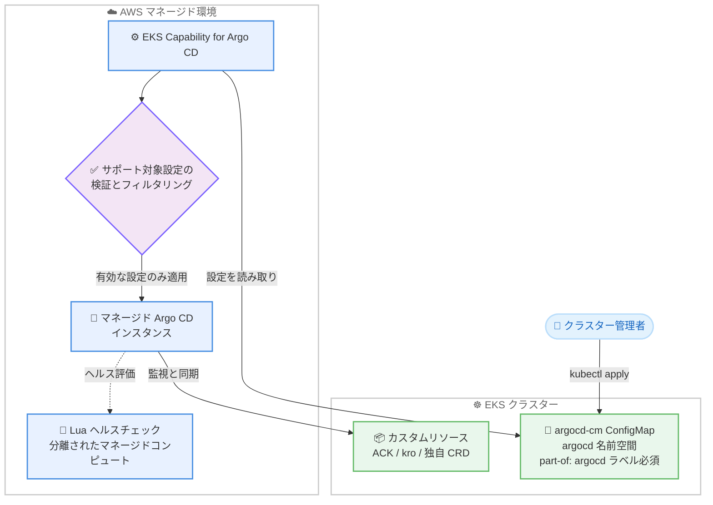

# Amazon EKS - EKS Capability for Argo CD のカスタム設定サポート

**リリース日**: 2026 年 8 月 21 日
**サービス**: Amazon Elastic Kubernetes Service (Amazon EKS)
**機能**: EKS Capability for Argo CD のカスタム設定 (argocd-cm ConfigMap) サポート

📊 [このアップデートのインフォグラフィックを見る](https://takech9203.github.io/aws-news-summary/20260821-amazon-eks-argo-cd-configuration.html)

## 概要

Amazon EKS Capability for Argo CD が、クラスター内の標準的な `argocd-cm` ConfigMap によるカスタム設定をサポートしました。アップストリームの Argo CD とまったく同じ方法 (同じキー、同じフォーマット) で設定を記述すると、AWS がその内容を読み取り、マネージドな Argo CD インスタンスに適用します。これにより、カスタムリソース向けのカスタムヘルスチェック定義、Argo CD UI バナーのカスタマイズ、リソースの監視・比較方法の調整など、マネージド環境でありながら柔軟な GitOps 継続的デリバリー体験を実現できます。

特に重要なのがカスタムヘルスチェックです。Argo CD はカスタムリソースに対する組み込みのヘルスロジックを持たないため、これまではリソースがプロビジョニング中や失敗状態でも Application が `Healthy` と報告される問題がありました。今回のアップデートにより、Lua スクリプトで独自のヘルスロジックを定義し、正確なヘルス報告と Sync Wave による正しいデプロイ順序制御が可能になります。さらに、ACK (AWS Controllers for Kubernetes) と kro (Kube Resource Orchestrator) のリソースについては、追加設定なしで正確なヘルス報告が行われる組み込みヘルスチェックが提供されます。

**アップデート前の課題**

このアップデート以前には、以下の課題がありました。

- マネージドな EKS Capability for Argo CD では、アップストリーム Argo CD で一般的な `argocd-cm` ConfigMap によるカスタマイズができなかった
- カスタムリソースにヘルスロジックがないため、リソースがまだプロビジョニング中でも Application が `Healthy` と報告され、Sync Wave が準備完了前に次のフェーズへ進んでしまう可能性があった
- UI バナーの表示、リソースの差分比較 (diff) のカスタマイズ、監視対象リソースの調整などができなかった

**アップデート後の改善**

今回のアップデートにより、以下が可能になりました。

- アップストリーム Argo CD と同じ `argocd-cm` ConfigMap でマネージドインスタンスをカスタマイズ可能になった (既存のアップストリームスクリプトやコミュニティ例が変更なしで利用可能)
- カスタムリソース向けのカスタムヘルスチェックを Lua スクリプトで定義でき、例えばデータベースリソースの準備が完了するまで Application を `Progressing` に保持できるようになった
- ACK と kro のリソースに対する組み込みヘルスチェックにより、追加設定なしで正確なヘルス報告が得られるようになった
- UI バナー、リソースの監視・比較・除外設定、Kustomize / Helm / Jsonnet の有効化などが調整可能になった

## アーキテクチャ図



クラスター管理者が自身のクラスターに `argocd-cm` ConfigMap を作成すると、Capability がサポート対象の設定のみを読み取り・検証し、マネージド Argo CD インスタンスに適用します。カスタムヘルスチェックの Lua スクリプトは、クラスターのデータや AWS API にアクセスできない分離されたマネージドコンピュート上で実行されます。

## サービスアップデートの詳細

### 主要機能

1. **argocd-cm ConfigMap によるカスタム設定**
   - アップストリーム Argo CD と同じキー・フォーマットで設定を記述する
   - ConfigMap は Capability で設定した Argo CD の名前空間 (デフォルトは `argocd`) に `argocd-cm` という名前で作成し、`app.kubernetes.io/part-of: argocd` ラベルを付与する必要がある
   - Capability はサポート対象の設定のみを適用し、それ以外のフィールドは無視する
   - 値が不正または不整形な場合、その値は無視されデフォルト設定で動作を継続するため、ConfigMap のミスがマネージドインスタンスを壊すことはない

2. **カスタムリソース向けカスタムヘルスチェック**
   - `resource.customizations.health.<group>_<kind>` キーに Lua スクリプトを記述してヘルスロジックを定義する
   - スクリプトはグローバル変数 `obj` でリソースオブジェクトにアクセスし、`Healthy` / `Progressing` / `Degraded` / `Suspended` のいずれかの `status` と任意の `message` を返す
   - 正確なヘルス報告により、Sync Wave がリソースの準備完了を待ってから次に進むようになる
   - アップストリームの既存スクリプトやコミュニティ例が変更なしで動作する

3. **ACK / kro 向け組み込みヘルスチェック**
   - ACK (AWS Controllers for Kubernetes) と kro (Kube Resource Orchestrator) のリソースは、追加設定なしで正確なヘルス報告が行われる
   - 対象リソースタイプにカスタムヘルスチェックを定義すると、組み込みのヘルスチェックを上書きできる

4. **UI カスタマイズ**
   - `ui.bannercontent` / `ui.bannerurl` / `ui.bannerpermanent` / `ui.bannerposition` で UI バナー (環境識別子やメンテナンス通知など) を表示できる
   - `ui.cssurl` でカスタム CSS によるブランディングが可能

5. **リソースの監視・比較設定**
   - `resource.customizations.ignoreDifferences.*` で Git とクラスターの比較時に無視するフィールド (HPA が管理するレプリカ数など) を指定できる
   - `resource.exclusions` / `resource.inclusions` で監視対象リソースタイプを制御し、パフォーマンスを改善できる
   - `resource.customizations.ignoreResourceUpdates.*` で再調整 (reconciliation) をトリガーしない更新イベントを指定し、負荷を削減できる

## 技術仕様

### サポートされる主な設定

| カテゴリ | 設定キーの例 | 適用方法 |
|------|------|------|
| UI | `ui.bannercontent`, `ui.bannerurl`, `ui.bannerpermanent`, `ui.bannerposition`, `ui.cssurl` | 上書き |
| リソースヘルス | `resource.customizations.health.<group>_<kind>` | 上書き |
| 差分比較 | `resource.customizations.ignoreDifferences.<group>_<kind>` / `.all`, `resource.compareoptions` | 追加 / 上書き |
| 更新イベント | `resource.customizations.ignoreResourceUpdates.<group>_<kind>` / `.all` | 追加 |
| 監視対象 | `resource.exclusions`, `resource.inclusions`, `resource.respectRBAC` | 追加 / 上書き |
| 表示 | `resource.customLabels`, `resource.sensitive.mask.annotations` | 上書き |
| マニフェストツール | `kustomize.enable`, `helm.enable`, `jsonnet.enable`, `kustomize.buildOptions` | 上書き |

### kustomize.buildOptions のサポートフラグ

`kustomize.buildOptions` は安全なフラグのサブセットにフィルタリングされます。任意のファイル読み取りや任意コード実行を可能にするフラグはサポートされません。

| フラグ | サポートされる値 | 備考 |
|------|------|------|
| `--reorder` | `legacy`, `none` | レンダリングされる YAML の順序のみ変更 |
| `--enable-helm` | Boolean | マネージドな Helm バイナリを実行 |
| `--enable-managedby-label` | Boolean | ラベル追加のみ |

`--load-restrictor`, `--enable-exec`, `--enable-alpha-plugins` を含むその他のフラグは破棄されます。

### ConfigMap の基本構造

```yaml
apiVersion: v1
kind: ConfigMap
metadata:
  name: argocd-cm
  namespace: argocd
  labels:
    app.kubernetes.io/part-of: argocd
data:
  ui.bannercontent: "Production cluster"
```

## 設定方法

### 前提条件

1. Argo CD Capability が作成済みの EKS クラスター
2. Capability で Argo CD 用に設定された名前空間 (デフォルトは `argocd`)
3. クラスターと通信できるように設定された `kubectl` CLI

### 手順

#### ステップ 1: カスタムヘルスチェックを含む ConfigMap を作成

```yaml
# argocd-cm.yaml
apiVersion: v1
kind: ConfigMap
metadata:
  name: argocd-cm
  namespace: argocd
  labels:
    app.kubernetes.io/part-of: argocd
data:
  resource.customizations.health.example.com_Database: |
    hs = {}
    hs.status = "Progressing"
    hs.message = "Waiting for the resource to become ready"
    if obj.status ~= nil then
      if obj.status.phase == "Ready" then
        hs.status = "Healthy"
        hs.message = "Database is ready"
      end
    end
    return hs
```

API グループ `example.com`、kind `Database` のカスタムリソースに対するヘルスチェックを定義しています。ステータスの `phase` が `Ready` になるまで `Progressing` を報告し、準備完了後に `Healthy` を報告します。

#### ステップ 2: ConfigMap をクラスターに適用

```bash
kubectl apply -f argocd-cm.yaml
```

`argocd-cm` ConfigMap を Argo CD の名前空間に作成します。Capability がサポート対象の設定を読み取り、マネージド Argo CD インスタンスに適用します。

#### ステップ 3: ヘルスチェックの動作を確認

```bash
argocd app get <application-name>
```

対象のカスタムリソースを含む Application のヘルスステータスを確認します。Argo CD UI で確認することも可能です。期待どおりに報告されない場合は、ConfigMap の名前・名前空間・必須ラベル・設定キーの `<group>_<kind>` が正しいかを確認します。

## メリット

### ビジネス面

- **マネージドと柔軟性の両立**: フルマネージドの運用負荷軽減を享受しながら、セルフマネージド Argo CD と同等のカスタマイズが可能になり、移行の障壁が下がる
- **デプロイの信頼性向上**: リソースの準備完了を正確に検知してからデプロイを進められるため、本番環境での不完全なデプロイによる障害リスクを低減できる
- **既存資産の再利用**: アップストリームの設定やコミュニティのヘルスチェックスクリプトを変更なしで利用でき、学習・移行コストを削減できる

### 技術面

- **正確なヘルス報告**: カスタムリソースのヘルスロジックを定義でき、Application の `Healthy` 報告が実態と一致する
- **Sync Wave の正しい順序制御**: 依存リソース (データベースなど) の準備完了を待ってから後続のリソースを同期できる
- **安全な実行環境**: Lua ヘルスチェックは Capability ごとに分離されたマネージドコンピュートで実行され、クラスターのデータや AWS API にアクセスできない
- **フェイルセーフな設定適用**: 不正な値は無視されデフォルトで動作を継続するため、設定ミスでマネージドインスタンスが停止しない

## デメリット・制約事項

### 制限事項

- サポートされるのはアップストリーム Argo CD 設定のサブセットのみで、サポート対象外の設定は無視され効果を持たない
- Lua の標準ライブラリは利用できない (`useOpenLibs` は常に無効)。標準ライブラリに依存するスクリプトをセルフマネージド環境から移行する場合、同じように動作しない可能性がある
- `kustomize.buildOptions` は安全なフラグのサブセットのみサポートされ、`--load-restrictor` などは破棄される
- ヘルス評価が一時的に利用できない場合、対象のカスタムリソースは `Progressing` として報告される

### 考慮すべき点

- ConfigMap は安全なストアではないため、シークレットや認証情報などの機密情報を `argocd-cm` に格納してはならない
- `argocd-cm` ConfigMap への書き込み権限を持つプリンシパルは、マネージド Argo CD インスタンスの設定を変更できる。アクセス制御は IAM ではなくクラスターの Kubernetes RBAC で行われるため、Argo CD 名前空間のオブジェクト変更権限は信頼できるユーザーとサービスアカウントのみに付与する
- 開発者には Application の作成・管理は許可しつつ ConfigMap の変更は許可しない、といった RBAC 設計が推奨される
- 本番利用前に開発環境でヘルスチェックスクリプトの動作をテストすることが推奨される

## ユースケース

### ユースケース 1: データベースリソースの準備完了を待つ Sync Wave 制御

**シナリオ**: アプリケーションのデプロイ前に、ACK や独自オペレーターで管理するデータベースのプロビジョニング完了を待ちたい。従来はデータベースの作成中でも Application が `Healthy` と報告され、アプリケーションが先にデプロイされて接続エラーが発生していた。

**実装例**:
```yaml
data:
  resource.customizations.health.example.com_Database: |
    hs = {}
    hs.status = "Progressing"
    hs.message = "Waiting for the resource to become ready"
    if obj.status ~= nil and obj.status.phase == "Ready" then
      hs.status = "Healthy"
      hs.message = "Database is ready"
    end
    return hs
```

**効果**: データベースが `Ready` になるまで Application が `Progressing` に保持され、Sync Wave の後続フェーズ (アプリケーションデプロイ) が準備完了後に実行される。

### ユースケース 2: HPA 管理のレプリカ数を差分比較から除外

**シナリオ**: Horizontal Pod Autoscaler がレプリカ数を動的に変更するため、Git のマニフェストとクラスターの状態が常に `OutOfSync` と表示されてしまう。

**実装例**:
```yaml
data:
  resource.customizations.ignoreDifferences.apps_Deployment: |
    jsonPointers:
      - /spec/replicas
```

**効果**: HPA による動的なレプリカ数変更が差分として検出されなくなり、実質的な構成変更のみが `OutOfSync` として報告される。

### ユースケース 3: 環境識別バナーによる誤操作防止

**シナリオ**: 複数環境の Argo CD を運用しており、オペレーターが本番環境と検証環境を取り違えて操作するリスクを減らしたい。

**実装例**:
```yaml
data:
  ui.bannercontent: "Production cluster - 変更時は承認プロセスに従ってください"
  ui.bannerpermanent: "true"
  ui.bannerposition: "top"
  ui.bannerurl: "https://wiki.example.com/runbooks/production"
```

**効果**: Argo CD UI の上部に常時バナーが表示され、オペレーターが現在操作している環境を即座に識別できる。バナーからランブックへの導線も提供できる。

## 料金

今回の発表に追加料金に関する記載はありません。EKS Capability for Argo CD の利用料金については、Amazon EKS の料金ページを参照してください。

## 利用可能リージョン

EKS Capability for Argo CD が利用可能なすべての AWS リージョンでカスタム設定がサポートされます。

## 関連サービス・機能

- **Argo CD (アップストリーム)**: 本 Capability のベースとなる OSS の GitOps 継続的デリバリーツール。`argocd-cm` ConfigMap の設定キーとフォーマットは共通
- **AWS Controllers for Kubernetes (ACK)**: Kubernetes から AWS リソースを管理するコントローラー群。組み込みヘルスチェックの対象
- **kro (Kube Resource Orchestrator)**: 複数の Kubernetes リソースを合成して管理するオーケストレーター。組み込みヘルスチェックの対象
- **Kubernetes RBAC**: `argocd-cm` ConfigMap へのアクセス制御を担い、マネージドインスタンスの設定変更権限を統制する

## 参考リンク

- 📊 [インフォグラフィック](https://takech9203.github.io/aws-news-summary/20260821-amazon-eks-argo-cd-configuration.html)
- [公式発表 (What's New)](https://aws.amazon.com/about-aws/whats-new/2026/08/amazon-eks-argo-cd-configuration)
- [ドキュメント: Configure Argo CD settings](https://docs.aws.amazon.com/eks/latest/userguide/argocd-configure-settings.html)
- [Argo CD ドキュメント: argocd-cm ConfigMap リファレンス](https://argo-cd.readthedocs.io/en/stable/operator-manual/argocd-cm-yaml/)
- [Argo CD ドキュメント: Resource Health](https://argo-cd.readthedocs.io/en/stable/operator-manual/health/)
- [料金ページ](https://aws.amazon.com/eks/pricing/)

## まとめ

EKS Capability for Argo CD が `argocd-cm` ConfigMap によるカスタム設定に対応し、マネージド環境でもカスタムヘルスチェック・UI バナー・リソース比較設定などのカスタマイズが可能になりました。特にカスタムリソースのヘルスロジック定義と ACK / kro 向け組み込みヘルスチェックにより、Sync Wave による正確なデプロイ順序制御が実現します。セルフマネージド Argo CD からの移行を検討していたチームや、ACK / kro で AWS リソースを GitOps 管理しているチームは、まず開発環境でヘルスチェックスクリプトを検証したうえで導入することを推奨します。
