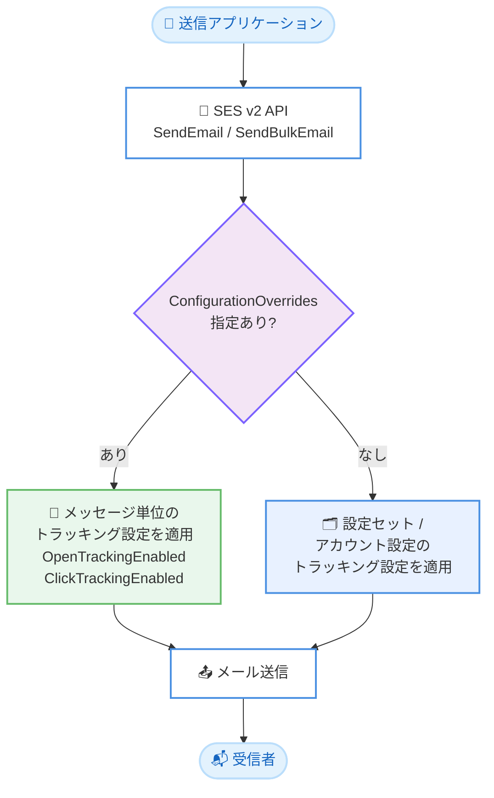

# Amazon SES - オープン/クリックトラッキングのオーバーライドパラメータのサポート

**リリース日**: 2026 年 8 月 21 日
**サービス**: Amazon Simple Email Service (SES)
**機能**: SendEmail / SendBulkEmail API におけるオープン/クリックトラッキングの上書き (Override) パラメータ

📊 [このアップデートのインフォグラフィックを見る](https://takech9203.github.io/aws-news-summary/20260821-amazon-ses-adds-open-click-tracking-override.html)

## 概要

Amazon SES が、メール送信 API (SendEmail および SendBulkEmail) のリクエスト単位でオープントラッキング (開封追跡) とクリックトラッキング (クリック追跡) の有効/無効を上書きできる、新しいオーバーライドパラメータのサポートを発表しました。API リクエストに `ConfigurationOverrides` オブジェクトを含めることで、そのメッセージに限定してトラッキング動作を制御できます。

これまでトラッキングの有効/無効は設定セット (Configuration Set) 単位で管理する必要があり、トラッキング設定の組み合わせごとに個別の設定セットを用意しなければなりませんでした。今回のアップデートにより、API 呼び出しごとにトラッキング動作を切り替えられるようになり、設定セットの管理オーバーヘッドが大幅に削減されます。オーバーライドは関連付けられた設定セットで定義されたトラッキング動作よりも優先されるため、既存の設定セット構成を変更する必要はありません。

特に、受信者ごとのトラッキング同意 (オプトイン/オプトアウト) を尊重した送信を実装しやすくなり、GDPR や CNIL (フランス情報処理・自由全国委員会) ガイダンスなどのデータ保護要件への対応に有効です。メール配信基盤を運用する開発者、マーケティング担当者、コンプライアンス要件を持つ企業が主な対象ユーザーです。

**アップデート前の課題**

- トラッキングの有効/無効は設定セット単位でのみ制御可能で、メッセージ単位での切り替えができなかった
- オープン/クリックトラッキングの組み合わせ (4 パターン) ごとに個別の設定セットを作成・管理する必要があった
- 受信者ごとのトラッキング同意に応じて送信を分岐する場合、送信ロジック側で設定セットを切り替える実装が必要で、管理が煩雑だった

**アップデート後の改善**

- SendEmail / SendBulkEmail のリクエストに `ConfigurationOverrides.Tracking` を指定するだけで、メッセージ単位でトラッキングを制御できるようになった
- トラッキング設定の組み合わせごとに設定セットを量産する必要がなくなり、設定セットの構成をシンプルに保てるようになった
- オーバーライドは設定セットの定義より優先されるため、既存の設定セット構造を変更せずに導入できるようになった
- 受信者の同意状態に基づくトラッキング制御が容易になり、GDPR や CNIL ガイダンスなどのデータ保護要件に対応しやすくなった

## アーキテクチャ図



送信リクエストに `ConfigurationOverrides` が含まれる場合、設定セットやアカウント設定よりも優先してメッセージ単位のトラッキング設定が適用される流れを示しています。指定しなかった設定は、従来どおり設定セットまたはアカウント設定の値が使用されます。

## サービスアップデートの詳細

### 主要機能

1. **メッセージ単位のトラッキングオーバーライド**
   - SendEmail / SendBulkEmail のリクエストボディに `ConfigurationOverrides` オブジェクトを指定可能
   - `Tracking` オブジェクト配下の `OpenTrackingEnabled` と `ClickTrackingEnabled` に `ENABLED` または `DISABLED` を指定
   - オーバーライドはそのリクエストに含まれるメッセージにのみ適用され、アカウントレベル設定や設定セット自体は変更されない

2. **設定セットに対する優先適用**
   - オーバーライドで指定した設定は、関連付けられた設定セットで定義されたトラッキング動作よりも優先される
   - オーバーライドしなかった設定は、設定セット、アカウントレベル設定、または SES デフォルトの値がそのまま適用される
   - 既存の設定セット構成を変更せずに段階的に導入できる

3. **データ保護要件への対応**
   - 受信者単位のトラッキング同意 (オプトイン/オプトアウト) を送信時に反映可能
   - GDPR や CNIL ガイダンスなど、トラッキングに対する明示的な同意を求める規制への対応を簡素化

## 技術仕様

### ConfigurationOverrides パラメータ

| 項目 | 詳細 |
|------|------|
| 対象 API | SendEmail、SendBulkEmail (SES API v2) |
| パラメータ | `ConfigurationOverrides.Tracking` (TrackingConfigurationOverrides オブジェクト) |
| `OpenTrackingEnabled` | `ENABLED` / `DISABLED` — オープントラッキングの上書き |
| `ClickTrackingEnabled` | `ENABLED` / `DISABLED` — クリックトラッキングの上書き |
| 優先順位 | オーバーライド > 設定セット > アカウントレベル設定 / SES デフォルト |
| 適用範囲 | 指定したリクエストのメッセージのみ (設定セット自体は変更されない) |
| 追加料金 | なし |

### API 変更履歴

| 日付 | サービス | 変更内容 |
|------|----------|----------|
| 2026/08/20 | [Amazon Simple Email Service](https://awsapichanges.com/archive/changes/648ecf-email.html) | 2 updated api methods - SendEmail および SendBulkEmail のリクエストに `ConfigurationOverrides` パラメータを追加 |

### リクエスト例

```json
{
  "FromEmailAddress": "sender@example.com",
  "Destination": {
    "ToAddresses": ["recipient@example.com"]
  },
  "Content": {
    "Simple": {
      "Subject": { "Data": "お知らせ" },
      "Body": {
        "Html": { "Data": "<p>本文 <a href=\"https://example.com\">リンク</a></p>" }
      }
    }
  },
  "ConfigurationSetName": "my-config-set",
  "ConfigurationOverrides": {
    "Tracking": {
      "OpenTrackingEnabled": "DISABLED",
      "ClickTrackingEnabled": "DISABLED"
    }
  }
}
```

## 設定方法

### 前提条件

1. Amazon SES で送信元 ID (ドメインまたはメールアドレス) が検証済みであること
2. SES API v2 (SendEmail / SendBulkEmail) を使用していること
3. 最新の AWS CLI または AWS SDK を使用していること

### 手順

#### ステップ 1: トラッキングを無効化して送信する

```bash
aws sesv2 send-email \
  --from-email-address "sender@example.com" \
  --destination "ToAddresses=recipient@example.com" \
  --content '{
    "Simple": {
      "Subject": {"Data": "お知らせ"},
      "Body": {"Html": {"Data": "<p>本文 <a href=\"https://example.com\">リンク</a></p>"}}
    }
  }' \
  --configuration-set-name "my-config-set" \
  --configuration-overrides '{
    "Tracking": {
      "OpenTrackingEnabled": "DISABLED",
      "ClickTrackingEnabled": "DISABLED"
    }
  }'
```

設定セット `my-config-set` を使用しつつ、このメッセージに限りオープントラッキングとクリックトラッキングの両方を無効化して送信します。設定セット側でトラッキングが有効になっていても、オーバーライドが優先されます。

#### ステップ 2: 片方のトラッキングのみ上書きする

```bash
aws sesv2 send-email \
  --from-email-address "sender@example.com" \
  --destination "ToAddresses=recipient@example.com" \
  --content '{
    "Simple": {
      "Subject": {"Data": "キャンペーンのご案内"},
      "Body": {"Html": {"Data": "<p><a href=\"https://example.com/campaign\">詳細はこちら</a></p>"}}
    }
  }' \
  --configuration-set-name "my-config-set" \
  --configuration-overrides '{
    "Tracking": {
      "ClickTrackingEnabled": "ENABLED"
    }
  }'
```

クリックトラッキングのみ有効化を明示し、オープントラッキングは指定しません。指定しなかった設定は、設定セットまたはアカウントレベル設定の既存の値がそのまま適用されます。

#### ステップ 3: 受信者の同意状態に応じて動的に切り替える

アプリケーション側で受信者の同意状態 (オプトイン/オプトアウト) をデータベースなどで管理し、送信時に `ConfigurationOverrides` の値を動的に組み立てます。SendBulkEmail でも同様にリクエスト単位でオーバーライドを指定できるため、同意状態ごとに送信バッチを分割してトラッキング設定を切り替える運用が可能です。

## メリット

### ビジネス面

- **コンプライアンス対応の簡素化**: 受信者ごとのトラッキング同意を送信時に反映でき、GDPR や CNIL ガイダンスなどのデータ保護要件への対応が容易になる
- **運用コストの削減**: トラッキング設定の組み合わせごとに設定セットを作成・維持する必要がなくなり、管理オーバーヘッドが減少する
- **追加費用なし**: 本機能の利用に追加料金は発生しない

### 技術面

- **メッセージ単位の柔軟な制御**: API 呼び出しごとにトラッキング動作を切り替えられ、送信ロジックがシンプルになる
- **既存構成への非破壊的な導入**: オーバーライドは設定セットより優先されるため、既存の設定セット構造を変更せずに導入できる
- **部分的な上書きが可能**: オープン/クリックのいずれか一方だけを上書きし、残りは既存設定を引き継ぐことができる

## デメリット・制約事項

### 制限事項

- 対象は SES API v2 の SendEmail および SendBulkEmail であり、旧 SES API (v1) の送信操作は対象外
- オーバーライドはトラッキング設定の上書きであり、イベント発行先 (Event Destination) を作成するものではない。オープン/クリックイベントを Amazon SNS や Amazon Kinesis Data Firehose などに発行するには、引き続き適切なイベント発行先を持つ設定セットが必要
- オーバーライドはリクエスト内のメッセージにのみ適用され、アカウントレベル設定や設定セット自体の値は変更されない

### 考慮すべき点

- 受信者の同意状態に応じた制御を行う場合、同意情報の管理と送信ロジックへの反映はアプリケーション側で実装する必要がある
- トラッキングを無効化したメッセージについては開封率やクリック率の指標が取得できなくなるため、分析レポートへの影響を事前に確認する必要がある
- クリックトラッキングを有効にするとリンクが SES のトラッキング用 URL に書き換えられるため、メッセージ単位で有効/無効を切り替える場合はリンク挙動の違いに注意する

## ユースケース

### ユースケース 1: 受信者のトラッキング同意に基づく送信制御

**シナリオ**: EU 圏の顧客にマーケティングメールを送信する SaaS 企業が、GDPR に基づき、トラッキングに同意していない受信者にはオープン/クリックトラッキングを行わずにメールを届けたい。

**実装例**:
```python
import boto3

ses = boto3.client("sesv2")

def send_marketing_email(recipient, consent):
    params = {
        "FromEmailAddress": "news@example.com",
        "Destination": {"ToAddresses": [recipient]},
        "Content": {...},
        "ConfigurationSetName": "marketing-config-set",
    }
    if not consent:
        params["ConfigurationOverrides"] = {
            "Tracking": {
                "OpenTrackingEnabled": "DISABLED",
                "ClickTrackingEnabled": "DISABLED",
            }
        }
    return ses.send_email(**params)
```

**効果**: 単一の設定セットのまま、受信者の同意状態に応じてトラッキングを動的に制御でき、コンプライアンス要件を満たしながら送信基盤をシンプルに保てる。

### ユースケース 2: トランザクションメールとマーケティングメールの使い分け

**シナリオ**: パスワードリセットなどのトランザクションメールではトラッキングを行わず、キャンペーンメールではエンゲージメント計測のためトラッキングを有効にしたい。従来は用途別に複数の設定セットを管理していた。

**実装例**:
```json
{
  "ConfigurationSetName": "common-config-set",
  "ConfigurationOverrides": {
    "Tracking": {
      "OpenTrackingEnabled": "DISABLED",
      "ClickTrackingEnabled": "DISABLED"
    }
  }
}
```

**効果**: 共通の設定セット 1 つに集約し、メッセージの種類に応じてオーバーライドで切り替えることで、設定セットの数を削減し運用を簡素化できる。

### ユースケース 3: SendBulkEmail による一括送信でのバッチ単位制御

**シナリオ**: ニュースレターを SendBulkEmail で一括送信する際、トラッキング同意済みの受信者グループと未同意のグループでバッチを分け、それぞれに適したトラッキング設定を適用したい。

**実装例**:
```bash
# 同意済みグループ: トラッキング有効で一括送信
aws sesv2 send-bulk-email \
  --from-email-address "news@example.com" \
  --default-content '{"Template": {"TemplateName": "newsletter", "TemplateData": "{}"}}' \
  --bulk-email-entries file://consented-recipients.json \
  --configuration-set-name "newsletter-config-set" \
  --configuration-overrides '{"Tracking": {"OpenTrackingEnabled": "ENABLED", "ClickTrackingEnabled": "ENABLED"}}'
```

**効果**: 一括送信でもリクエスト単位でトラッキングを制御でき、大規模配信における同意管理とエンゲージメント計測を両立できる。

## 料金

本機能の利用に追加料金は発生しません。Amazon SES の通常の送信料金 (送信メール数に基づく従量課金) のみが適用されます。

## 利用可能リージョン

Amazon SES が利用可能なすべての AWS リージョンで利用できます (東京、大阪リージョンを含む)。

## 関連サービス・機能

- **SES 設定セット (Configuration Sets)**: トラッキングやイベント発行先などの送信設定をグループ化する機能。今回のオーバーライドは設定セットの定義より優先される
- **SES Virtual Deliverability Manager (VDM)**: 配信性とエンゲージメントの分析機能。オーバーライドで有効化したトラッキングのイベントは VDM に記録される
- **SES イベント発行 (Event Publishing)**: オープン/クリックイベントを Amazon SNS、Amazon Kinesis Data Firehose、Amazon CloudWatch などに発行する機能。イベントの外部発行には引き続きイベント発行先を持つ設定セットが必要

## 参考リンク

- 📊 [インフォグラフィック](https://takech9203.github.io/aws-news-summary/20260821-amazon-ses-adds-open-click-tracking-override.html)
- [公式発表 (What's New)](https://aws.amazon.com/about-aws/whats-new/2026/08/amazon-ses-adds-open-click-tracking-override/)
- [SendEmail API リファレンス (SES API v2)](https://docs.aws.amazon.com/ses/latest/APIReference-V2/API_SendEmail.html)
- [SendBulkEmail API リファレンス (SES API v2)](https://docs.aws.amazon.com/ses/latest/APIReference-V2/API_SendBulkEmail.html)
- [ConfigurationOverrides データ型](https://docs.aws.amazon.com/ses/latest/APIReference-V2/API_ConfigurationOverrides.html)
- [Amazon SES 料金ページ](https://aws.amazon.com/ses/pricing/)

## まとめ

Amazon SES の SendEmail / SendBulkEmail に `ConfigurationOverrides` パラメータが追加され、メッセージ単位でオープン/クリックトラッキングを制御できるようになりました。トラッキング設定の組み合わせごとに設定セットを量産する必要がなくなり、GDPR などの規制に基づく受信者単位の同意管理も実装しやすくなります。設定セットでトラッキングを管理している場合は、オーバーライドの活用による構成の簡素化を検討することを推奨します。
