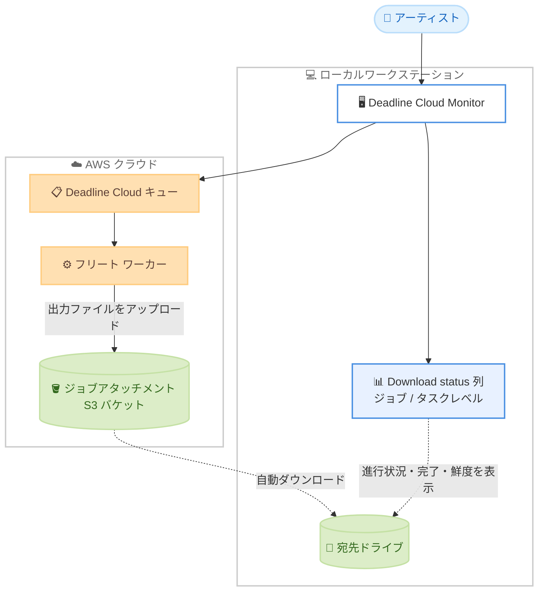

# AWS Deadline Cloud - Deadline Cloud Monitor での自動ダウンロードステータス追跡

**リリース日**: 2026 年 8 月 21 日
**サービス**: AWS Deadline Cloud
**機能**: Deadline Cloud Monitor における自動ダウンロードステータスの追跡

📊 [このアップデートのインフォグラフィックを見る](https://takech9203.github.io/aws-news-summary/20260821-aws-deadline-cloud-auto-download-status-tracking.html)

## 概要

AWS Deadline Cloud の Deadline Cloud Monitor (DCM) デスクトップアプリが、クラウドで実行されたジョブからの自動ファイルダウンロードの進行状況、ステータス、健全性を表示できるようになりました。Deadline Cloud は、視覚効果 (VFX)、アニメーション、プロダクトデザイン、シミュレーション、ゲーミングなどの計算負荷の高いワークロードをクラウドで実行するためのフルマネージドサービスです。DCM はレンダリング環境、ジョブ、リソース、コストを可視化するデスクトップアプリであり、今回のアップデートにより、自動設定されたジョブ出力が宛先ドライブへ正常にダウンロードされたことを DCM 上で確認できるようになりました。

DCM にはジョブレベルとタスクレベルの両方で新しい「Download status」列が追加され、ダウンロードの進行状況と、すべての出力ファイルがドライブ上で利用可能になったことの確認が可能です。ステータス情報がどの程度新しいものかを示すインジケーターも表示され、何らかの理由でファイルが利用できない場合には、次に取るべきアクションの明確なガイダンスがアプリ上に表示されます。

これにより手動でのドライブ確認作業が不要になり、後続タスクを開始する前に出力ファイルの可用性を確実に確認できます。手動でのファイル確認が現実的でない大規模レンダーパイプラインにおいて、特に価値の高いアップデートです。

**アップデート前の課題**

自動ダウンロードの完了状況を確認する仕組みが DCM 上になく、運用上の負担がありました。

- 自動ダウンロードされた出力ファイルが宛先ドライブに揃っているかを、ドライブを直接開いて手動で確認する必要があった
- ダウンロードの進行状況や失敗の有無を DCM 上で把握できなかった
- 出力ファイルの到着を確認できないまま後続タスク (コンポジット、レビューなど) を開始してしまい、ファイル不足による手戻りが発生するリスクがあった

**アップデート後の改善**

DCM 上でダウンロード状況を一元的に確認できるようになりました。

- ジョブレベルとタスクレベルの「Download status」列で、ダウンロードの進行状況と完了を確認できるようになった
- ステータス情報の鮮度を示すインジケーターにより、表示内容がどの時点の情報かを判断できるようになった
- ファイルが利用できない場合、次のステップに関する明確なガイダンスがアプリ上に表示されるようになった
- 手動でのドライブ確認が不要になり、後続タスク開始前に出力の可用性を確実に確認できるようになった

## アーキテクチャ図



クラウド上のフリートワーカーが生成した出力ファイルはジョブアタッチメント用の S3 バケットを経由してローカルの宛先ドライブへ自動ダウンロードされます。今回のアップデートにより、このダウンロードの進行状況と完了状態を DCM の「Download status」列で確認できるようになりました。

## サービスアップデートの詳細

### 主要機能

1. **Download status 列の追加**
   - ジョブレベルとタスクレベルの両方に新しい「Download status」列が追加された
   - 自動ダウンロードの進行状況を表示する
   - すべての出力ファイルが宛先ドライブ上で利用可能になったことを確認できる

2. **ステータス鮮度インジケーター**
   - 表示されているダウンロードステータスがどの程度新しい情報かを示すインジケーターを表示する
   - 表示内容がどの時点の状態を反映しているかを判断できる

3. **問題発生時のガイダンス表示**
   - 何らかの理由でファイルが利用できない場合、次に取るべきステップの明確なガイダンスをアプリ上に表示する
   - トラブルシューティングの起点を DCM に集約できる

## 技術仕様

### 機能の位置付け

| 項目 | 詳細 |
|------|------|
| 対象アプリ | Deadline Cloud Monitor (DCM) デスクトップアプリ |
| 対象機能 | 自動ファイルダウンロードのステータス追跡 |
| 表示レベル | ジョブレベルおよびタスクレベル |
| 表示内容 | ダウンロード進行状況、完了確認、ステータス鮮度、エラー時のガイダンス |
| 対象ワークロード | VFX、アニメーション、プロダクトデザイン、シミュレーション、ゲーミングなどのレンダリング / 計算ワークロード |

### API 変更履歴

本アップデートは Deadline Cloud Monitor デスクトップアプリの機能追加であり、発表日前後の期間において AWS API Changes 上で関連する Deadline Cloud の API 変更は確認されていません。

## 設定方法

### 前提条件

1. AWS Deadline Cloud のファーム、キュー、フリートが設定済みであること
2. Deadline Cloud Monitor デスクトップアプリがワークステーションにインストールされていること (新機能を利用するには最新バージョンへの更新を推奨)
3. ジョブ出力の自動ダウンロードが設定されていること

### 手順

#### ステップ 1: Deadline Cloud Monitor を起動してサインインする

```bash
# Deadline Cloud Monitor デスクトップアプリを起動し、
# ファームの URL とユーザー認証情報でサインインする
```

DCM にサインインすると、ファーム内のキューとジョブの一覧が表示されます。

#### ステップ 2: ジョブ一覧で Download status 列を確認する

ジョブ一覧またはタスク一覧を表示し、新しく追加された「Download status」列を確認します。この列には自動ダウンロードの進行状況と完了状態が表示され、ステータスの鮮度を示すインジケーターも併せて表示されます。

#### ステップ 3: ダウンロード完了を確認して後続作業を開始する

すべての出力ファイルが宛先ドライブ上で利用可能になったことを「Download status」列で確認してから、コンポジットやレビューなどの後続タスクを開始します。ファイルが利用できない場合は、アプリに表示されるガイダンスに従って対処します。

## メリット

### ビジネス面

- **手戻りの削減**: 出力ファイルの到着を確認してから後続作業を開始できるため、ファイル不足による作業のやり直しを防止できる
- **生産性の向上**: ドライブを直接確認する手作業がなくなり、アーティストや TD (テクニカルディレクター) が本来の制作作業に集中できる
- **大規模パイプラインでの信頼性向上**: 手動確認が現実的でない大量のジョブ / タスクを扱うレンダーパイプラインでも、出力の可用性を確実に把握できる

### 技術面

- **可視性の向上**: ダウンロードの進行状況、完了、健全性を DCM 上で一元的に把握できる
- **情報鮮度の明示**: ステータスがどの時点の情報かをインジケーターで判断でき、古い情報に基づく誤った判断を防げる
- **トラブルシューティングの効率化**: ファイルが利用できない場合の次のステップがアプリ上に表示され、原因調査の起点が明確になる

## デメリット・制約事項

### 制限事項

- Deadline Cloud Monitor デスクトップアプリの機能であり、AWS マネジメントコンソールの機能ではない
- 自動ダウンロードが設定されているジョブ出力が対象である
- 新機能を利用するには DCM を新機能対応バージョンへ更新する必要がある

### 考慮すべき点

- ステータス表示には鮮度インジケーターが付随するため、最新状態の確認が必要な場合はインジケーターを併せて確認する運用が望ましい
- 出力ファイルは S3 に無期限に保存されるため、ストレージコスト削減にはキューの S3 バケットに対する S3 ライフサイクル設定の検討が引き続き有効である

## ユースケース

### ユースケース 1: 大規模レンダーファームでの出力確認の自動化

**シナリオ**: 数百ショットのアニメーション作品を制作するスタジオで、毎晩数千タスクのレンダリングジョブを実行している。従来は朝一番にファイルサーバーを手動で確認し、出力の欠落がないかチェックしていた。

**実装例**:
```
1. 夜間バッチでレンダリングジョブを投入 (自動ダウンロード設定済み)
2. 翌朝、DCM のジョブ一覧で Download status 列を確認
3. すべてのジョブが完了状態であることを確認してから
   コンポジット工程を開始
```

**効果**: ファイルサーバーの手動チェック作業が不要になり、出力欠落による手戻りを防ぎながらパイプライン全体の稼働開始を早められる。

### ユースケース 2: タスク単位での部分的な作業開始

**シナリオ**: 長時間かかるシミュレーションジョブのうち、完了したタスクの出力から順次後続処理を進めたい。

**実装例**:
```
1. DCM でジョブを選択し、タスク一覧を表示
2. タスクレベルの Download status 列で
   ダウンロード完了済みタスクを特定
3. 完了済みタスクの出力ファイルのみを使って
   後続処理を先行開始
```

**効果**: ジョブ全体の完了を待たずにタスク単位で作業を開始でき、パイプライン全体のリードタイムを短縮できる。

### ユースケース 3: ダウンロード障害の迅速な検知と対処

**シナリオ**: ネットワーク障害やディスク容量不足などにより、一部の出力ファイルがローカルドライブにダウンロードされていない。

**実装例**:
```
1. DCM の Download status 列で異常のあるジョブ / タスクを特定
2. アプリに表示される次のステップのガイダンスを確認
3. ガイダンスに従って原因を解消し、出力を取得
```

**効果**: ファイル不足に気付かないまま後続作業を進めてしまう事故を防ぎ、障害発生時の対処時間を短縮できる。

## 料金

今回の発表では、本機能に関する追加料金の記載はありません。Deadline Cloud Monitor デスクトップアプリ自体は無料で利用でき、Deadline Cloud の利用料金 (ワーカーのコンピューティング使用量、ライセンス使用量など) が通常どおり適用されます。詳細は [AWS Deadline Cloud の料金ページ](https://aws.amazon.com/deadline-cloud/pricing/) を参照してください。

## 利用可能リージョン

今回の発表では利用可能リージョンの明記はありません。本機能は Deadline Cloud Monitor デスクトップアプリの機能であり、Deadline Cloud を利用しているすべての環境で DCM の更新により利用できると考えられます。最新の対応状況は公式ドキュメントを確認してください。

## 関連サービス・機能

- **Deadline Cloud Monitor (DCM)**: レンダリング環境、ジョブ、リソース、コストを可視化するデスクトップアプリ。今回のアップデートの対象
- **ジョブアタッチメント (Job Attachments)**: ジョブの入出力ファイルを Amazon S3 経由で転送する Deadline Cloud の仕組み。出力ファイルの自動ダウンロードの基盤
- **Amazon S3**: ジョブ出力の保存先。出力は無期限に保存されるため、コスト最適化には S3 ライフサイクル設定が有効
- **Usage Explorer**: DCM 内でコストを可視化する機能。2026 年 8 月には EBS 永続ボリュームのコスト追跡にも対応

## 参考リンク

- 📊 [インフォグラフィック](https://takech9203.github.io/aws-news-summary/20260821-aws-deadline-cloud-auto-download-status-tracking.html)
- [公式発表 (What's New)](https://aws.amazon.com/about-aws/whats-new/2026/08/aws-deadline-cloud-auto-download-status-tracking/)
- [AWS Deadline Cloud 製品ページ](https://aws.amazon.com/deadline-cloud/)
- [Deadline Cloud での完了した出力のダウンロード (ユーザーガイド)](https://docs.aws.amazon.com/deadline-cloud/latest/userguide/download-finished-output.html)
- [料金ページ](https://aws.amazon.com/deadline-cloud/pricing/)

## まとめ

今回のアップデートにより、Deadline Cloud Monitor 上でジョブ出力の自動ダウンロードの進行状況と完了状態をジョブ / タスクレベルで確認できるようになり、手動でのドライブ確認が不要になりました。大規模レンダーパイプラインを運用するチームは、DCM を最新バージョンへ更新し、後続タスク開始前の出力確認フローに「Download status」列の確認を組み込むことを推奨します。
