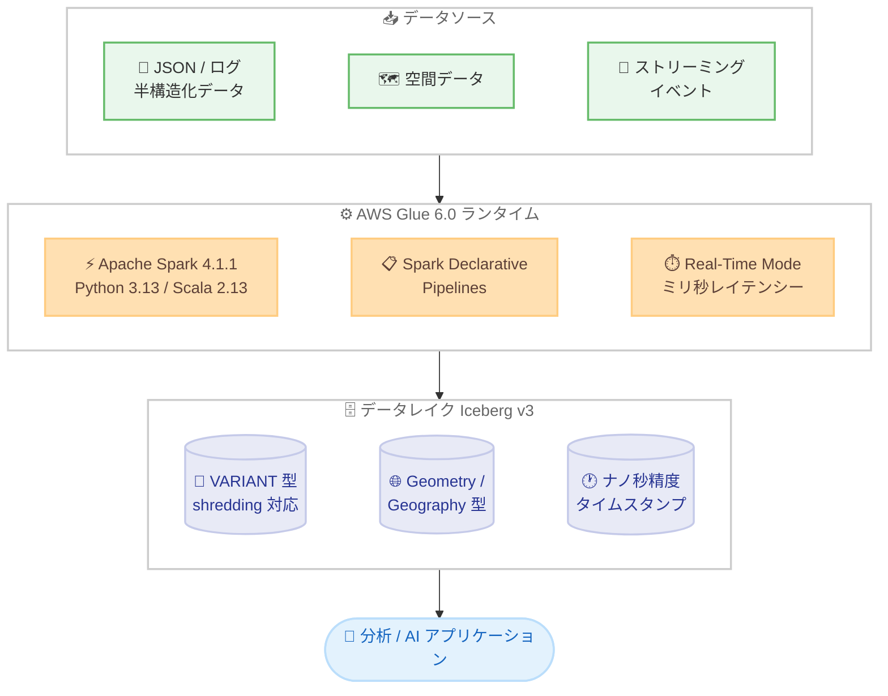

# AWS Glue - AWS Glue 6.0 一般提供開始 (30% 値下げと Apache Iceberg v3 サポート)

**リリース日**: 2026 年 8 月 21 日
**サービス**: AWS Glue
**機能**: AWS Glue 6.0 (Apache Spark 4.1 ランタイム、30% 価格引き下げ、Apache Iceberg v3 完全サポート)

📊 [このアップデートのインフォグラフィックを見る](https://takech9203.github.io/aws-news-summary/20260821-aws-glue-6-0-price-reduction-iceberg-v3.html)

## 概要

AWS Glue の新しいメジャーバージョンである AWS Glue 6.0 が一般提供開始されました。従来バージョンと比較して 30% の価格引き下げが実施され、ランタイムは Apache Spark 4.1.1、Python 3.13、Scala 2.13.17 にアップグレードされています。オープンテーブルフォーマット (OTF) も Apache Iceberg 1.11.0、Apache Hudi 1.1.1、Delta Lake 4.2.0 に更新されました。

最大の目玉は Apache Iceberg v3 仕様の完全サポートです。半構造化データを高速に読み取れる VARIANT データ型 (variant shredding 対応)、空間データ処理向けの Geometry / Geography 型、ナノ秒精度のタイムスタンプ、UNKNOWN 型と DEFAULT カラム値による柔軟なスキーマ進化に対応します。AWS Blog では「フルサーバーレスのマネージド Spark サービスとしては最も完全な Iceberg v3 実装」と位置づけられています。

さらに、宣言的にパイプラインを定義できる Spark Declarative Pipelines (SDP)、ミリ秒レベルのレイテンシーを実現するストリーミングの Real-Time Mode、Arrow ネイティブ Python UDF / UDTF など、開発者の生産性とパフォーマンスを向上させる機能が追加されました。大規模 ETL、定期バッチ処理、ストリーミング分析、AI アプリケーション向けデータ基盤を運用するすべてのユーザーが対象です。

**アップデート前の課題**

- JSON やログなどの半構造化データは文字列カラムに格納してパースするか、スキーマをフラット化する必要があり、読み取り性能の低下、重複データコピー、上流のスキーマ変更によるパイプライン破損が発生していた
- ストリーミング処理はマイクロバッチベースであり、ミリ秒レベルの低レイテンシーが求められるユースケースには対応が難しかった
- ETL パイプラインの実行順序や依存関係を制御するオーケストレーションコードを繰り返し記述する必要があった
- Python UDF は Python と JVM 間のシリアライゼーションオーバーヘッドにより性能が制限されていた

**アップデート後の改善**

- 同一ワークロードの DPU 時間あたり料金が従来バージョン比で 30% 引き下げられ、ジョブのアップグレードだけでコスト削減が可能になった
- Iceberg v3 の VARIANT 型により、半構造化データをスキーマのフラット化なしで保存・クエリでき、variant shredding によって従来の文字列カラムより高速な読み取りが可能になった
- Spark Declarative Pipelines により「データがどうあるべきか」を宣言するだけで、エンジンが実行順序と最適化を自動決定するようになった
- Real-Time Mode により、ステートレスストリーミングでミリ秒レベルのレイテンシーを実現できるようになった
- Spark Upgrade Agent (Apache Spark 向け生成 AI アップグレード) により、既存ジョブ (Glue 2.0 以降) を自動で移行できる

## アーキテクチャ図



AWS Glue 6.0 では、多様なデータソースを Spark 4.1 ベースの新ランタイムで処理し、Iceberg v3 の新データ型 (VARIANT、Geometry / Geography、ナノ秒タイムスタンプ) を活用したデータレイクに書き込むことができます。

## サービスアップデートの詳細

### 主要機能

1. **30% の価格引き下げ**
   - AWS Glue 6.0 で実行するジョブの料金が従来バージョン比で 30% 引き下げ
   - ジョブの Glue バージョンを 6.0 に変更するだけでコスト削減を実現
   - 課金体系自体は従来どおり DPU 時間あたりの秒単位課金

2. **Apache Iceberg v3 完全サポート (Iceberg 1.11.0)**
   - **VARIANT データ型**: JSON・ログ・イベントデータをスキーマのフラット化なしで保存・クエリ可能。variant shredding (自動シュレッディング) により、従来の文字列カラムより高速な読み取りを実現
   - **Geometry / Geography データ型**: GIS 分析、位置インテリジェンス、地理空間パイプライン向けのネイティブ空間処理
   - **ナノ秒精度タイムスタンプ**: IoT センサー、科学計算、高頻度金融ワークロード向け
   - **柔軟なスキーマ進化**: UNKNOWN データ型と DEFAULT カラム値により、上流のスキーマ変更によるパイプライン障害を防止
   - なお、deletion vectors (削除ベクトル) と row lineage は Glue 5.1 の Iceberg 1.10.0 時点で既にサポート済み

3. **Spark Declarative Pipelines (SDP)**
   - SQL または DataFrame API でエンドツーエンドのデータパイプラインを宣言的に定義する新フレームワーク
   - ストリーミングテーブルとマテリアライズドビューをサポート
   - 実行順序と最適化はエンジンが自動決定し、繰り返しのオーケストレーションコードが不要に

4. **ストリーミングの Real-Time Mode**
   - Spark 4.1 の Real-Time Mode に Glue の最適化実行を組み合わせ、ステートレスストリーミングでミリ秒レベルのレイテンシーを実現
   - リアルタイムイベント処理、低レイテンシー変換、時間依存のデータルーティングに対応

5. **Arrow ネイティブ Python UDF / UDTF**
   - Python UDF / UDTF を Apache Arrow のカラムナフォーマットでネイティブ実行
   - Python と JVM 間のシリアライゼーションオーバーヘッドを排除し、複雑な変換での PySpark 性能を向上

6. **その他のランタイム強化**
   - **Spark Connect 対応**: Interactive Sessions への薄いクライアント接続が可能になり、リモート開発ワークフローをサポート
   - **Python 仮想環境 (`--python-virtual-env`)**: ユーザーが独自にビルドした Python venv を Spark ドライバー / エグゼキューターにアタッチでき、依存関係を完全に制御可能
   - **コネクタ更新**: Amazon Redshift、MongoDB、Snowflake、OpenSearch などのコネクタを更新

## 技術仕様

### ランタイムバージョン比較

| 依存関係 | AWS Glue 6.0 | AWS Glue 5.1 | AWS Glue 5.0 |
|------|------|------|------|
| Apache Spark | 4.1.1 | 3.5.6 | 3.5.4 |
| Python | 3.13 | 3.11 | 3.11 |
| Scala | 2.13.17 | 2.12.18 | 2.12.18 |
| Java | 17 | 17 | 17 |
| Hadoop | 3.4.2 | 3.4.1 | 3.4.1 |
| Apache Arrow | 18.3.0 | 12.0.1 | 12.0.1 |
| AWS SDK for Java | 2.44.6 (v2 のみ) | 2.35.5 | 2.29.52 |
| Boto3 | 1.42.84 | 1.40.61 | 1.34.131 |

### オープンテーブルフォーマット (OTF) バージョン

| OTF | AWS Glue 6.0 | AWS Glue 5.1 | AWS Glue 5.0 |
|------|------|------|------|
| Apache Iceberg | 1.11.0 (v3 完全対応) | 1.10.0 | 1.7.1 |
| Apache Hudi | 1.1.1 | 1.0.2 | 0.15.0 |
| Delta Lake | 4.2.0 | 3.3.2 | 3.3.0 |

### 破壊的変更 (Breaking Changes)

| 変更内容 | 対応方法 |
|------|------|
| EMRFS の削除 (S3A が唯一の S3 ファイルシステム) | `fs.s3.consistent.*` などの EMRFS 固有設定を削除。`s3://` パスは自動的に S3A を使用 |
| AWS SDK for Java v1 の削除 | `com.amazonaws.services.*` を `software.amazon.awssdk.services.*` に移行 |
| Scala 2.12 から 2.13 へのアップグレード | カスタム JAR を Scala 2.13.17 で再コンパイル。`JavaConversions` は `CollectionConverters` に置換 |
| ANSI モードがデフォルトで有効 (Spark 4.1) | オーバーフローや不正キャストが NULL ではなく例外に。旧動作には `spark.sql.ansi.enabled=false` を設定 |
| `SQLContext` の削除 | `SparkSession` を直接使用 |
| `getResolvedOptions` の前方一致無効化 | 引数の完全名を使用するか、`allow_abbrev=True` を指定 |

## 設定方法

### 前提条件

1. AWS Glue を利用できる AWS アカウントと IAM 権限
2. 既存ジョブを移行する場合は、Scala 2.13 / Spark 4.1 / Python 3.13 との互換性確認 (移行チェックリストを参照)
3. Iceberg v3 の新データ型を使用する場合は Spark DataFrames を使用 (DynamicFrames は非対応)

### 手順

#### ステップ 1: 新規ジョブで Glue 6.0 を選択

```bash
aws glue create-job \
  --name my-glue-6-job \
  --role arn:aws:iam::123456789012:role/GlueJobRole \
  --glue-version "6.0" \
  --command '{"Name": "glueetl", "ScriptLocation": "s3://my-bucket/scripts/etl.py", "PythonVersion": "3"}' \
  --worker-type G.1X \
  --number-of-workers 10
```

`create-job` API の `--glue-version` パラメータに `6.0` を指定して新規ジョブを作成しています。AWS Glue Studio では [Job Details] タブの Glue version で「Glue 6.0 - Supports Spark 4.1.1, Scala 2, Python 3」を選択します。SageMaker Unified Studio のバージョンドロップダウンからも選択できます。

#### ステップ 2: 既存ジョブを Glue 6.0 に更新

```bash
aws glue update-job \
  --job-name my-existing-job \
  --job-update '{"GlueVersion": "6.0", "Role": "arn:aws:iam::123456789012:role/GlueJobRole", "Command": {"Name": "glueetl", "ScriptLocation": "s3://my-bucket/scripts/etl.py", "PythonVersion": "3"}}'
```

`update-job` API で既存ジョブの `GlueVersion` を `6.0` に変更しています。API 自体の変更は不要で、バージョン指定の変更のみで移行できます。大規模な移行には AWS Glue Studio の Spark Upgrade Agent (Apache Spark 向け生成 AI アップグレード) を使用すると、Glue 2.0 以降の既存ジョブを自動でアップグレードできます。

#### ステップ 3: Iceberg v3 テーブルの作成 (Spark SQL)

```sql
CREATE TABLE glue_catalog.db.events (
  event_id BIGINT,
  event_time TIMESTAMP,
  payload VARIANT,
  location GEOMETRY
)
USING iceberg
TBLPROPERTIES ('format-version'='3');
```

`format-version` を `3` に指定して Iceberg v3 テーブルを作成し、VARIANT 型と GEOMETRY 型のカラムを定義しています。半構造化データは `payload` カラムにそのまま格納でき、variant shredding により高速に読み取れます。なお、v3 テーブルは Athena SQL からは読み取れないため、クロスエンジン互換性が必要な場合は v2 を使用してください。

#### ステップ 4: インタラクティブセッションでの利用

```
%glue_version 6.0
```

ノートブックやインタラクティブセッションでは `%glue_version` マジックに `6.0` を設定します。Glue 6.0 では Spark Connect プロトコルによる Interactive Sessions への接続もサポートされます。

## メリット

### ビジネス面

- **30% のコスト削減**: ジョブのバージョン変更だけで同一ワークロードの実行コストを 30% 削減でき、大規模 ETL ほど削減効果が大きい
- **開発生産性の向上**: Spark Declarative Pipelines によりオーケストレーションコードの記述・保守コストを削減
- **移行コストの低減**: Spark Upgrade Agent による生成 AI 支援の自動アップグレードで、旧バージョンからの移行工数を削減

### 技術面

- **半構造化データ処理の高速化**: VARIANT 型と variant shredding により、JSON / ログデータの読み取り性能が文字列カラム格納方式より向上
- **スキーマ変更への耐性**: UNKNOWN 型と DEFAULT カラム値により、上流のスキーマ変更でパイプラインが破損するリスクを低減
- **低レイテンシーストリーミング**: Real-Time Mode によりミリ秒レベルのイベント処理が可能
- **PySpark 性能向上**: Arrow ネイティブ UDF により Python と JVM 間のシリアライゼーションオーバーヘッドを排除
- **最新 OSS エコシステム**: Spark 4.1、Python 3.13、Iceberg 1.11.0 など最新バージョンの機能・性能改善を利用可能

## デメリット・制約事項

### 制限事項

- Iceberg v3 テーブル (`'format-version'='3'`) は Athena SQL から読み取れない (`Cannot read unsupported version 3` エラー)。Athena とのクロスエンジン互換性が必要な場合は v2 を使用する
- Iceberg v3 の新データ型は Spark DataFrames のみ対応で、DynamicFrames では動作しない
- AWS Glue Studio の Visual ETL は Iceberg v3 の新データ型に非対応 (SageMaker Unified Studio への移行が推奨)
- 細かい粒度のアクセス制御 (FGAC) は VARIANT カラムに非対応
- Iceberg のネイティブテーブル暗号化キーとマルチ引数変換は非対応
- Spark Declarative Pipelines は一部の SQL 構文のサポートに制限がある

### 考慮すべき点

- **ANSI モードがデフォルト有効**: 整数オーバーフローや不正キャストが NULL ではなく例外をスローするため、既存クエリの動作確認が必要。旧動作には `spark.sql.ansi.enabled=false` を設定
- **Scala 2.13 への再コンパイル**: Scala 2.12 でコンパイルしたカスタム JAR は `NoSuchMethodError` などで失敗するため再コンパイルが必須
- **AWS SDK for Java v1 / EMRFS の削除**: SDK v1 依存コードの v2 移行と EMRFS 固有設定の削除が必要 (boto3 を使う Python ジョブは変更不要)
- **Python 3.13 互換性**: `imp`、`cgi` などの非推奨モジュールが削除されているため、依存ライブラリの互換性確認が必要
- `--additional-python-modules` は引き続き動作するが非推奨となり、`--python-virtual-env` への移行が推奨される

## ユースケース

### ユースケース 1: 半構造化イベントデータのデータレイク取り込み

**シナリオ**: モバイルアプリのイベントログ (JSON) は頻繁にフィールドが追加・変更されるため、スキーマのフラット化やカスタムパースコードの保守が負担になっている。

**実装例**:
```python
# Iceberg v3 テーブルの VARIANT カラムに JSON をそのまま格納
df = spark.readStream.format("kinesis").options(**kinesis_options).load()
df.selectExpr("event_id", "parse_json(payload_json) AS payload") \
  .writeStream.format("iceberg") \
  .toTable("glue_catalog.analytics.app_events")

# クエリ時は VARIANT フィールドに直接アクセス
spark.sql("""
  SELECT payload:user.country, COUNT(*)
  FROM glue_catalog.analytics.app_events
  GROUP BY payload:user.country
""")
```

**効果**: スキーマ管理の負担なく半構造化データを取り込み、variant shredding により文字列パース方式より高速なクエリを実現。上流のスキーマ変更でもパイプラインが破損しない。

### ユースケース 2: 位置情報分析パイプライン

**シナリオ**: 物流企業が車両の位置データを分析し、配送エリアの最適化を行いたいが、これまで空間データは WKT 文字列などで格納し外部ライブラリで処理していた。

**実装例**:
```sql
CREATE TABLE glue_catalog.logistics.vehicle_tracks (
  vehicle_id STRING,
  tracked_at TIMESTAMP,
  position GEOGRAPHY
)
USING iceberg
TBLPROPERTIES ('format-version'='3');
```

**効果**: Iceberg v3 の Geography 型によるネイティブ空間処理で、GIS 分析や位置インテリジェンスのパイプラインをシンプルに構築できる。

### ユースケース 3: 既存 ETL ジョブの一括コスト削減

**シナリオ**: Glue 4.0 / 5.x で数百本の ETL ジョブを運用しており、コスト削減とランタイム刷新を図りたい。

**実装例**:
```
1. AWS Glue Studio で Spark Upgrade Agent を実行し、対象ジョブの互換性分析と自動アップグレードを実施
2. 移行チェックリスト (Scala 2.13 再コンパイル、ANSI モード影響、SDK v2 移行) を確認
3. 検証後、update-job で GlueVersion を 6.0 に一括変更
```

**効果**: 同一ワークロードで DPU 料金が 30% 削減され、最新ランタイムの性能改善によりジョブ実行時間の短縮も期待できる。

## 料金

AWS Glue の ETL ジョブは DPU (Data Processing Unit) 時間あたりの秒単位課金です。AWS Glue 6.0 では、従来バージョンと比較して 30% の価格引き下げが適用されます。リージョンごとの正確な料金は [AWS Glue 料金ページ](https://aws.amazon.com/glue/pricing/) を参照してください。

### 料金例 (参考)

| 項目 | 内容 |
|--------|------------------|
| 従来バージョンの DPU 単価 (例) | 1 DPU 時間あたり 0.44 USD |
| Glue 6.0 | 従来バージョン比 30% 引き下げ |
| 削減効果の例 | 10 DPU x 100 時間 / 月のワークロードで、月額コストの 30% を削減 |

## 利用可能リージョン

すべての AWS 商用リージョン、AWS GovCloud (US)、AWS 中国リージョンで利用可能です (東京・大阪リージョンを含む)。リージョン別の対応状況は AWS Capabilities by Region で確認できます。

## 関連サービス・機能

- **Amazon SageMaker Unified Studio**: Glue 6.0 ジョブの作成・実行に対応。Visual ETL で Iceberg v3 新データ型を使う場合の推奨移行先
- **Amazon Athena**: Iceberg v2 テーブルのクエリに対応。ただし Glue 6.0 で作成した Iceberg v3 テーブルは現時点で読み取り不可のため注意
- **AWS Lake Formation**: Hudi / Delta Lake テーブルの FTA (フルテーブルアクセス) 読み書きを継続サポート
- **Spark Upgrade Agent (Apache Spark 向け生成 AI アップグレード)**: Glue 2.0 以降の既存ジョブを Glue 6.0 へ自動アップグレード
- **AWS Glue Interactive Sessions**: Spark Connect プロトコルによるシンクライアント接続をサポート

## 参考リンク

- 📊 [インフォグラフィック](https://takech9203.github.io/aws-news-summary/20260821-aws-glue-6-0-price-reduction-iceberg-v3.html)
- [公式発表 (What's New)](https://aws.amazon.com/about-aws/whats-new/2026/08/aws-glue-6-0-price-reduction-iceberg-v3)
- [AWS Blog: AWS Glue 6.0 now available with 30% lower price and full Apache Iceberg v3 support](https://aws.amazon.com/blogs/aws/aws-glue-6-0-now-available-with-30-lower-price-and-full-apache-iceberg-v3-support/)
- [ドキュメント: Migrating AWS Glue for Spark jobs to AWS Glue version 6.0](https://docs.aws.amazon.com/glue/latest/dg/migrating-version-60.html)
- [ドキュメント: Generative AI upgrades for Apache Spark (Spark Upgrade Agent)](https://docs.aws.amazon.com/glue/latest/dg/upgrade-analysis.html)
- [料金ページ](https://aws.amazon.com/glue/pricing/)

## まとめ

AWS Glue 6.0 は、30% の価格引き下げと Spark 4.1 / Python 3.13 / Iceberg v3 対応を同時に実現した大型アップデートであり、バージョン変更だけでコスト削減が得られる点は既存ユーザーにとって大きな価値があります。一方で、ANSI モードのデフォルト有効化や Scala 2.13 / SDK v2 への移行などの破壊的変更があるため、Spark Upgrade Agent と移行チェックリストを活用して計画的に検証・移行を進めることを推奨します。Athena との Iceberg v3 互換性制限にも注意してください。
