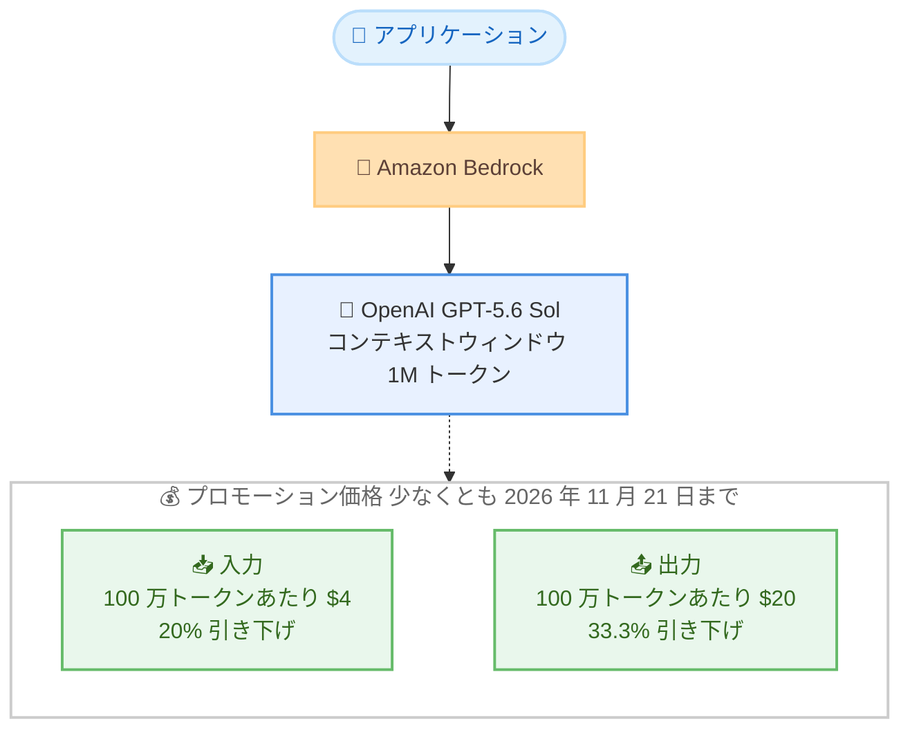

# Amazon Bedrock - OpenAI GPT-5.6 Sol の値下げ

**リリース日**: 2026 年 8 月 21 日
**サービス**: Amazon Bedrock
**機能**: OpenAI GPT-5.6 Sol の API 価格引き下げ

📊 [このアップデートのインフォグラフィックを見る](https://takech9203.github.io/aws-news-summary/20260821-bedrock-openai-gpt-56-sol-reduced-pricing.html)

## 概要

Amazon Bedrock で提供されている OpenAI の最上位モデル GPT-5.6 Sol の API 価格が引き下げられました。今回の値下げにより、入力は 100 万トークンあたり $4 (20% 引き下げ)、出力は 100 万トークンあたり $20 (33.3% 引き下げ) となります。このプロモーション価格は少なくとも 2026 年 11 月 21 日まで有効です。

GPT-5.6 Sol は、コーディング、サイバーセキュリティ、科学研究の分野で最先端のエージェンティック性能を発揮する OpenAI の最上位モデルであり、エージェンティックコーディングベンチマークで最先端の結果を達成しています。今回の値下げは、先行して実施された GPT-5.6 Terra および Luna の値下げに続くもので、OpenAI モデルファミリー全体の価格が引き下げられたことになります。

自律型コーディングエージェント、マルチステップの分析、リサーチワークフローなど、大量のトークンを消費する高ボリュームワークロードを Amazon Bedrock 上でより手頃なコストで運用できるようになり、フロンティアモデルを活用したエージェント構築のハードルが下がります。

**アップデート前の課題**

高性能なフロンティアモデルの利用には相応のコストが伴っていました。

- GPT-5.6 Sol は値下げ前、入力 100 万トークンあたり $5、出力 100 万トークンあたり $30 (引き下げ率からの換算値) の料金が設定されており、大量トークンを消費するワークロードではコストが高額になりやすかった
- 自律型コーディングエージェントのような長時間・多ターンのワークロードでは、出力トークン課金がコストの大きな割合を占めていた
- コスト面の理由から、最上位モデルの利用を一部のワークロードに限定せざるを得ないケースがあった

**アップデート後の改善**

今回の値下げにより、コスト効率が大幅に向上しました。

- 入力価格が 100 万トークンあたり $4 に引き下げられた (20% 引き下げ)
- 出力価格が 100 万トークンあたり $20 に引き下げられた (33.3% 引き下げ)
- 出力トークンを大量に生成するエージェンティックワークロードほど値下げの恩恵が大きく、最上位モデルをより広範なワークロードへ適用しやすくなった

## アーキテクチャ図



Amazon Bedrock 経由で GPT-5.6 Sol を呼び出す構成と、今回のプロモーション価格の概要を示しています。

## サービスアップデートの詳細

### 主要機能

1. **入力トークン価格の引き下げ**
   - 入力価格が 100 万トークンあたり $4 に引き下げられた
   - 引き下げ率は 20%
   - プロンプトキャッシュ (キャッシュ読み取りは 100 万トークンあたり $0.40) と組み合わせることで、繰り返しの多いワークロードのコストをさらに削減可能

2. **出力トークン価格の引き下げ**
   - 出力価格が 100 万トークンあたり $20 に引き下げられた
   - 引き下げ率は 33.3% と入力よりも大きく、出力トークンを大量に生成するエージェンティックワークロードで特に効果が大きい

3. **プロモーション期間**
   - 引き下げ後の価格は少なくとも 2026 年 11 月 21 日まで有効
   - GPT-5.6 Terra および Luna の値下げに続く措置で、OpenAI モデルファミリー全体が値下げの対象となった

## 技術仕様

### GPT-5.6 Sol モデル仕様

| 項目 | 詳細 |
|------|------|
| モデル ID | `openai.gpt-5.6-sol` |
| 推論プロファイル | `us.openai.gpt-5.6-sol` (Geo)、`global.openai.gpt-5.6-sol` (Global) |
| コンテキストウィンドウ | 1M トークン |
| 入力モダリティ | テキスト、画像 |
| 出力モダリティ | テキスト |
| 対応 API | Responses、Chat Completions、Converse |
| 対応エンドポイント | bedrock-runtime、bedrock-mantle |
| プロンプトキャッシュ | 対応 (bedrock-runtime では Responses API のみ) |
| Guardrails | 対応 (Converse API のみ) |
| サービスティア | Standard のみ (Priority、Flex、Reserved は非対応) |
| モデル提供開始日 | 2026 年 7 月 13 日 |

### 認証と接続の例

```bash
# Amazon Bedrock の API キーを使用して OpenAI SDK から接続
OPENAI_API_KEY="<Bedrock API キー>"
OPENAI_BASE_URL="https://bedrock-runtime.us-east-1.amazonaws.com/openai/v1"
```

## 設定方法

### 前提条件

1. AWS アカウントを保有していること
2. Amazon Bedrock コンソールで API キー (長期キー) を作成済みであること
3. IAM アイデンティティに、推論プロファイルに加えてアカウントのデフォルトプロジェクト (`arn:aws:bedrock:{region}:{account-id}:project/default`) に対する `bedrock:InvokeModel` 権限が付与されていること

### 手順

#### ステップ 1: SDK のインストール

```bash
pip install openai
```

Responses API を利用するために OpenAI Python SDK をインストールします。Amazon Bedrock は OpenAI 互換エンドポイントを提供しているため、OpenAI SDK をそのまま利用できます。

#### ステップ 2: 環境変数の設定

```bash
export OPENAI_API_KEY="<Bedrock API キー>"
export OPENAI_BASE_URL="https://bedrock-runtime.us-east-1.amazonaws.com/openai/v1"
```

Amazon Bedrock の API キーと、bedrock-runtime エンドポイントのベース URL を環境変数に設定します。これにより OpenAI SDK からの呼び出しが Amazon Bedrock にルーティングされます。

#### ステップ 3: 推論リクエストの実行

```python
from openai import OpenAI

client = OpenAI()

response = client.responses.create(
    model="global.openai.gpt-5.6-sol",
    input="Can you explain the features of Amazon Bedrock?"
)
print(response)
```

Responses API で GPT-5.6 Sol を呼び出します。bedrock-runtime エンドポイントではリージョン内推論は利用できないため、モデル名にはクロスリージョン推論プロファイル (`us.openai.gpt-5.6-sol` または `global.openai.gpt-5.6-sol`) を指定します。

## メリット

### ビジネス面

- **コスト削減**: 入力 20%、出力 33.3% の値下げにより、既存ワークロードのモデル利用コストを変更なしで削減できる
- **最上位モデルの適用範囲拡大**: これまでコスト面で見送っていたワークロードにもフロンティアモデルを適用しやすくなる
- **予見性のあるプロモーション期間**: 少なくとも 2026 年 11 月 21 日までの価格が明示されており、期間中のコスト計画を立てやすい

### 技術面

- **エージェンティックワークロードとの親和性**: 出力トークンの値下げ幅が大きいため、長い推論・生成を繰り返す自律型エージェントのコスト効率が特に向上する
- **プロンプトキャッシュとの併用**: キャッシュ読み取り価格 ($0.40 / 100 万トークン) と組み合わせることで、システムプロンプトやツール定義の再利用コストを大幅に削減できる
- **OpenAI SDK 互換**: OpenAI SDK と Responses API / Chat Completions API をそのまま利用でき、既存コードの移行コストが小さい

## デメリット・制約事項

### 制限事項

- プロモーション価格の保証期間は 2026 年 11 月 21 日までであり、それ以降の価格は明示されていない
- サービスティアは Standard のみ対応で、Priority、Flex、Reserved は利用できない
- bedrock-runtime エンドポイントではリージョン内推論に対応しておらず、クロスリージョン推論プロファイルの利用が必要
- 構造化出力 (Structured outputs)、Count tokens、Intelligent prompt routing などの一部 Bedrock 機能には非対応

### 考慮すべき点

- 発表された $4 / $20 の価格は Global クロスリージョン推論 (Global CRIS) のショートコンテキスト (272K) の価格であり、In-Region / Geo CRIS では $4.40 / $22.00 とやや高くなる
- 272K トークンを超えるロングコンテキスト (1M) の利用時は別価格 (Global CRIS で入力 $8、出力 $30) が適用されるため、長大なコンテキストを扱う場合はコスト試算に注意が必要
- 2026 年 11 月 21 日以降の価格改定に備え、コスト前提を定期的に見直すことが推奨される

## ユースケース

### ユースケース 1: 自律型コーディングエージェント

**シナリオ**: リポジトリ全体を対象にコード生成、テスト、修正を繰り返す自律型コーディングエージェントを運用する。エージェントは 1 タスクあたり大量の出力トークンを生成する。

**実装例**:
```python
from openai import OpenAI

client = OpenAI()

response = client.responses.create(
    model="global.openai.gpt-5.6-sol",
    input="リポジトリのテスト失敗を解析し、修正パッチを生成してください。",
)
```

**効果**: 出力価格が 33.3% 引き下げられたため、出力トークン中心のコーディングエージェントの運用コストを大幅に削減できる。

### ユースケース 2: マルチステップのデータ分析パイプライン

**シナリオ**: 大量のドキュメントやログを段階的に解析し、要約・分類・レポート生成を行うマルチステップ分析を日次バッチで実行する。

**実装例**:
```python
for document in documents:
    response = client.responses.create(
        model="us.openai.gpt-5.6-sol",
        input=f"次のドキュメントを解析し、重要な指標を抽出してください。\n{document}",
    )
```

**効果**: 入力 20% の値下げにより、大量ドキュメントを投入する高ボリュームワークロードの月次コストを圧縮できる。

### ユースケース 3: リサーチワークフロー

**シナリオ**: 科学研究やセキュリティ調査において、長い推論チェーンを伴う調査タスクを GPT-5.6 Sol に実行させる。共通のシステムプロンプトと参照資料を繰り返し利用する。

**実装例**:
```python
# プロンプトキャッシュを活用して共通コンテキストの再利用コストを削減
response = client.responses.create(
    model="global.openai.gpt-5.6-sol",
    input=research_prompt_with_shared_context,
)
```

**効果**: 値下げ後の価格とプロンプトキャッシュ (キャッシュ読み取り $0.40 / 100 万トークン) の併用により、繰り返しの多いリサーチワークフローのコスト効率が大きく向上する。

## 料金

GPT-5.6 Sol は使用したトークン数に応じた従量課金です。今回の値下げにより、入力 100 万トークンあたり $4 (20% 引き下げ)、出力 100 万トークンあたり $20 (33.3% 引き下げ) となりました。このプロモーション価格は少なくとも 2026 年 11 月 21 日まで有効です。

モデルカードに記載されている詳細な価格 (100 万トークンあたり、Standard ティア) は以下のとおりです。

### ショートコンテキスト (272K)

| 推論オプション | 入力 | 入力 - 30 分キャッシュ書き込み | 入力 - キャッシュ読み取り | 出力 |
|----------------|------|-------------------------------|--------------------------|------|
| In-Region | $4.40 | $5.50 | $0.44 | $22.00 |
| Geo CRIS | $4.40 | $5.50 | $0.44 | $22.00 |
| Global CRIS | $4.00 | $5.00 | $0.40 | $20.00 |

### ロングコンテキスト (1M)

| 推論オプション | 入力 | 入力 - 30 分キャッシュ書き込み | 入力 - キャッシュ読み取り | 出力 |
|----------------|------|-------------------------------|--------------------------|------|
| In-Region | $8.80 | $11.00 | $0.88 | $33.00 |
| Geo CRIS | $8.80 | $11.00 | $0.88 | $33.00 |
| Global CRIS | $8.00 | $10.00 | $0.80 | $30.00 |

### 料金例

| 使用量 (Global CRIS、ショートコンテキスト) | 月額料金 (概算) |
|--------------------------------------------|------------------|
| 入力 1 億トークン + 出力 2,000 万トークン | $800 (入力 $400 + 出力 $400) |
| 入力 10 億トークン + 出力 2 億トークン | $8,000 (入力 $4,000 + 出力 $4,000) |

## 利用可能リージョン

GPT-5.6 Sol は bedrock-runtime エンドポイントのクロスリージョン推論で利用できます。

- **Geo CRIS (`us.openai.gpt-5.6-sol`)**: us-east-1、us-east-2、us-west-1、us-west-2
- **Global CRIS (`global.openai.gpt-5.6-sol`)**: 東京 (ap-northeast-1)、大阪 (ap-northeast-3) を含む世界各地のリージョンから利用可能
- **bedrock-mantle エンドポイント (In-Region)**: us-east-1、us-east-2

最新のリージョン対応状況は [Regional availability by models](https://docs.aws.amazon.com/bedrock/latest/userguide/models-region-compatibility.html) を参照してください。

## 関連サービス・機能

- **GPT-5.6 Terra / Luna**: 同じ GPT-5.6 ファミリーのモデルで、先行して値下げが実施されている。ワークロードの要件に応じたモデル選択でさらなるコスト最適化が可能
- **Amazon Bedrock クロスリージョン推論**: Geo / Global の推論プロファイルによりリージョンをまたいだ負荷分散を実現。Global CRIS は最も低価格な推論オプション
- **Amazon Bedrock プロンプトキャッシュ**: 共通プロンプトのキャッシュにより入力コストを削減。今回の値下げと組み合わせることで高ボリュームワークロードのコスト効率がさらに向上
- **Amazon Bedrock Guardrails**: Converse API 経由で GPT-5.6 Sol にガードレールを適用し、責任ある AI 利用を実現

## 参考リンク

- 📊 [インフォグラフィック](https://takech9203.github.io/aws-news-summary/20260821-bedrock-openai-gpt-56-sol-reduced-pricing.html)
- [公式発表 (What's New)](https://aws.amazon.com/about-aws/whats-new/2026/08/bedrock-openai-gpt-56-sol-reduced-pricing/)
- [GPT-5.6 Sol モデルカード](https://docs.aws.amazon.com/bedrock/latest/userguide/model-card-openai-gpt-56-sol.html)
- [リージョン対応状況](https://docs.aws.amazon.com/bedrock/latest/userguide/models-region-compatibility.html)
- [Amazon Bedrock 料金ページ](https://aws.amazon.com/bedrock/pricing/)

## まとめ

Amazon Bedrock 上の OpenAI GPT-5.6 Sol が入力 20%、出力 33.3% 値下げされ、エージェンティックコーディングをはじめとする高ボリュームワークロードでフロンティアモデルを活用するコストが大きく下がりました。プロモーション価格は少なくとも 2026 年 11 月 21 日まで有効です。GPT-5.6 Sol の採用を検討していたチームは、この期間中に PoC や本番ワークロードへの適用を進め、プロンプトキャッシュや Global CRIS との併用によるコスト最適化効果を検証することを推奨します。
