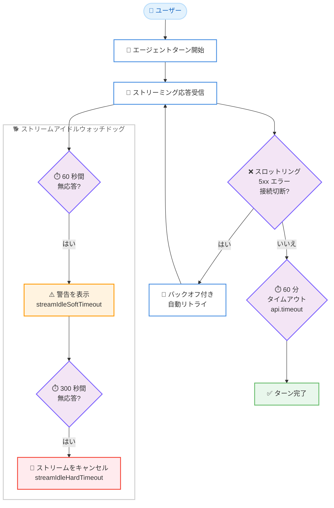

# Kiro - スペックレビューのマウス操作対応とストリーム自動リカバリ

**リリース日**: 2026年8月21日
**サービス**: Kiro
**機能**: Spec Review Mouse Support and Automatic Stream Recovery (Kiro CLI 2.19)

📊 [このアップデートのインフォグラフィックを見る](https://takech9203.github.io/aws-news-summary/20260821-kiro-changelog-2026-08-21.html)

## 概要

Kiro CLI 2.19 がリリースされ、スペックレビュー画面でのマウス操作サポートと、ストリーミング接続障害からの自動リカバリ機能が追加されました。スペックレビュー画面では、マウスホイールによるドキュメントのスクロールと、クリックによるカーソル位置の指定が可能になりました。`m` キーでマウスサポートのオン / オフを切り替えられます。

内部的には、ストリームアイドルウォッチドッグ、バックオフ付き自動リトライ、60 分のストリーミングタイムアウトが導入され、接続の切断やスロットリングされたリクエストが発生しても、ターンがハングしたり中断されたりしなくなりました。長時間の応答が途中で打ち切られる問題も解消されています。

このアップデートは、Kiro CLI でスペック駆動開発を行う開発者、および不安定なネットワーク環境や長時間実行されるエージェントタスクを扱うユーザーに特に有用です。2.19.0 (2026 年 8 月 19 日) に続き、パッチ 2.19.1 (2026 年 8 月 21 日) では V3 の `.kiroignore` 対応やセッション起動の高速化などの修正が追加されています。

**アップデート前の課題**

- スペックレビュー画面はキーボード操作のみで、マウスによるスクロールやカーソル位置指定ができなかった
- 応答ストリームが停止すると、ターンがハングしたまま応答を待ち続ける必要があった
- スロットリング、5xx エラー、接続切断が発生すると、ターンが失敗して手動での再実行が必要だった
- 長時間の応答が途中で打ち切られることがあった
- 停止したサブエージェントがターン全体をハングさせることがあった

**アップデート後の改善**

- スペックレビュー画面でマウスによるスクロールとクリックでのカーソル位置指定が可能になった
- アイドルウォッチドッグが 60 秒間の無応答で警告し、300 秒で自動キャンセルするため、ハングしなくなった
- スロットリング、5xx エラー、接続切断はバックオフ付きで自動リトライされるようになった
- ストリーミング応答にデフォルト 60 分のタイムアウトが設定され、長い応答が打ち切られなくなった
- サブエージェントにアイドルタイムアウト (デフォルト 3,600 秒) が導入され、ターン全体のハングを防止できるようになった

## アーキテクチャ図



ストリーミング応答の受信中に無応答状態や一時的なエラーが発生した場合の自動リカバリの流れを示しています。ウォッチドッグによる段階的な検知と、バックオフ付き自動リトライにより、ターンがハングせずに継続または終了します。

## サービスアップデートの詳細

### 主要機能

1. **スペックレビュー画面のマウスサポート**
   - スペックレビュー画面でマウスホイールによるドキュメントのスクロールが可能になった
   - クリックでカーソル位置を指定できるようになった
   - `m` キーを押すことでマウスサポートのオン / オフを切り替え可能

2. **ストリームとネットワーク障害からの自動リカバリ**
   - アイドルウォッチドッグ: 60 秒間の無応答で警告を表示し、300 秒で自動キャンセル
   - スロットリング、5xx エラー、接続切断はバックオフ付きで自動リトライ
   - ストリーミング応答にデフォルト 60 分のタイムアウトを設定し、長い応答の打ち切りを防止
   - `api.streamIdleSoftTimeout`、`api.streamIdleHardTimeout`、`api.timeout` の各設定でチューニング可能

3. **改善点 (Improvements)**
   - **スラッシュコマンドのキューイング**: エージェントの動作中に入力したコマンドが自動実行される。読み取り専用コマンドは即時、それ以外はターン終了時に実行
   - **ツール呼び出しのフェイルファスト**: 利用不可のツールへの呼び出しは、ターン終了まで滞留せず即座に失敗する
   - **サブエージェントのタイムアウト**: 停止したサブエージェントがターン全体をハングさせなくなった。`api.subagentTimeout` (デフォルト 3,600 秒) で設定可能
   - **新しい MCP プロトコル対応**: V3 がプロトコルリビジョン 2026-07-28 を要求する MCP サーバーに接続可能になった

4. **修正点 (Fixes) の主な内容**
   - コンテキストウィンドウのオーバーフロー時に、リトライループではなく自動コンパクションが実行される。コンパクション自体がオーバーフローした場合も、最も古い履歴を削除してリカバリする
   - ターン途中の認証期限切れ時に、ターンを終了せずトークンをリフレッシュしてリトライする (V2/V3)
   - Kiro CLI の自己アップデート後も認証リフレッシュとセッションコマンドが動作し続ける
   - `/goal` が一時的なエラーで停止せず、バックオフ付きでリトライする
   - ゴール実行中の Ctrl+C は CLI を終了せず、ゴールをキャンセルする
   - 認識されないスラッシュコマンドは、チャットとしてモデルに送信されず拒否される
   - `fileMatch` または `manual` インクルードのステアリングファイルが、glob マッチで自動注入されなくなった
   - レジストリ MCP サーバーがデフォルトの OAuth スコープを要求しなくなり、Atlassian MCP サーバーとの認証が修正された

5. **パッチ 2.19.1 (2026 年 8 月 21 日)**
   - V3 のファイル検索が `.kiroignore` を尊重し、除外パスが検索結果に含まれなくなった
   - V3 セッションの起動が高速化された
   - リクエスト送信中に接続が閉じた場合、V3 がターンをリトライする
   - V3 のシェル承認の選択肢に、Kiro が決定を保存できる場合のみ「Always allow」が表示される
   - ファイル以外のツール出力が上限を超えた場合、V3 は同じ呼び出しを繰り返さず、そのツールに適したリカバリ方法を提案する

## 技術仕様

### ストリームリカバリ関連の設定

| 設定項目 | 説明 | デフォルト値 |
|------|------|------|
| `api.streamIdleSoftTimeout` | 無応答時に警告を表示するまでの時間 | 60 秒 |
| `api.streamIdleHardTimeout` | 無応答時にストリームをキャンセルするまでの時間 | 300 秒 |
| `api.timeout` | ストリーミング応答全体のタイムアウト | 60 分 |
| `api.subagentTimeout` | サブエージェントのアイドルタイムアウト | 3,600 秒 |

### スペックレビューの操作

| 操作 | 動作 |
|------|------|
| マウスホイール | ドキュメントのスクロール |
| クリック | カーソル位置の指定 |
| `m` キー | マウスサポートのオン / オフ切り替え |

## 設定方法

### 前提条件

1. Kiro CLI がインストールされていること
2. Kiro CLI 2.19.0 以降にアップデートされていること

### 手順

#### ステップ1: Kiro CLI のアップデート

```bash
kiro-cli update
```

Kiro CLI を最新バージョンにアップデートします。今回の修正により、自己アップデート後も認証リフレッシュとセッションコマンドが動作し続けます。

#### ステップ2: スペックレビューでマウスを使用

スペックレビュー画面を開くと、デフォルトでマウス操作が有効です。スクロールでドキュメントを移動し、クリックでカーソルを配置します。ターミナルのテキスト選択などマウスを他の用途に使いたい場合は、`m` キーを押してマウスサポートをオフに切り替えます。

#### ステップ3: ストリームタイムアウトのチューニング (必要に応じて)

Kiro CLI の settings で以下の項目を調整します。

```json
{
  "api.streamIdleSoftTimeout": 60,
  "api.streamIdleHardTimeout": 300,
  "api.subagentTimeout": 3600
}
```

無応答時の警告までの秒数、キャンセルまでの秒数、サブエージェントのアイドルタイムアウトを環境に合わせて設定します。デフォルト値のままでも自動リカバリは有効です。

## メリット

### ビジネス面

- **生産性の向上**: ハングしたターンを手動で中断・再実行する待ち時間がなくなり、開発フローが中断されにくくなる
- **作業成果の保護**: 接続切断やスロットリングでターンが失われないため、長時間のエージェントタスクを安心して実行できる
- **学習コストの低減**: スペックレビューで慣れ親しんだマウス操作が使えるため、ターミナル UI に不慣れなユーザーでもスムーズにレビューできる

### 技術面

- **自動リトライとバックオフ**: スロットリング、5xx エラー、接続切断といった一時的な障害をユーザーの介入なしに吸収する
- **段階的なウォッチドッグ**: 60 秒警告と 300 秒キャンセルの 2 段階検知により、ハング状態を早期に可視化しつつ誤検知を抑制する
- **設定によるチューニング**: `api.streamIdleSoftTimeout` などの設定で、ネットワーク環境やワークロードに合わせた調整が可能
- **コンテキストオーバーフローの自動回復**: リトライループに陥らず自動コンパクションで回復し、コンパクション自体の失敗にも対応する

## デメリット・制約事項

### 制限事項

- マウスサポートは Kiro CLI のスペックレビュー画面が対象であり、ターミナルエミュレーターのマウスイベント対応が前提となる
- マウスサポートが有効な間は、ターミナル標準のテキスト選択操作と競合する場合がある (`m` キーで切り替えて対応)
- MCP プロトコルリビジョン 2026-07-28 への対応は V3 が対象

### 考慮すべき点

- アイドルウォッチドッグはデフォルトで 300 秒後にストリームをキャンセルするため、応答間隔が極端に長いワークロードでは `api.streamIdleHardTimeout` の調整を検討する
- 自動リトライにより、一時的な障害時のターン完了までの時間が従来より長くなる可能性がある (ハングや失敗の代わりにリトライが行われるため)
- 2.19.1 パッチの修正 (`.kiroignore` 対応など) を利用するには、2.19.0 ではなく 2.19.1 へのアップデートが必要

## ユースケース

### ユースケース1: スペックレビューの効率化

**シナリオ**: スペック駆動開発で長大な要件定義や設計ドキュメントをレビューする際に、キーボード操作のみではドキュメント内の移動やコメント位置の指定に時間がかかっていた。

**実装例**:
```text
1. Kiro CLI でスペックレビュー画面を開く
2. マウスホイールでドキュメント全体をスクロールして確認
3. 修正したい箇所をクリックしてカーソルを配置し、フィードバックを入力
4. テキスト選択が必要な場合は m キーでマウスサポートを一時的にオフ
```

**効果**: ドキュメント内の移動と位置指定が直感的になり、レビューのスループットが向上する。

### ユースケース2: 不安定なネットワーク環境での開発

**シナリオ**: モバイル回線や VPN 経由など、接続が不安定な環境で Kiro CLI を使用しており、接続切断のたびにターンが失敗して作業をやり直していた。

**実装例**:
```text
1. Kiro CLI 2.19 以降にアップデート
2. 通常どおりエージェントにタスクを依頼
3. 接続切断や 5xx エラーが発生しても、バックオフ付き自動リトライで継続
4. 必要に応じて api.streamIdleSoftTimeout / api.streamIdleHardTimeout を調整
```

**効果**: 一時的なネットワーク障害でターンが失われず、やり直しの手間が削減される。

### ユースケース3: 長時間実行されるエージェントタスクの安定化

**シナリオ**: サブエージェントを活用した大規模なリファクタリングや調査タスクで、応答の停止やサブエージェントのハングによりターン全体が止まってしまうことがあった。

**実装例**:
```json
{
  "api.timeout": 3600,
  "api.subagentTimeout": 3600
}
```

**効果**: 60 分のストリーミングタイムアウトとサブエージェントのアイドルタイムアウトにより、長い応答は打ち切られず、停止したサブエージェントはターン全体を巻き込まずにタイムアウトする。

## 利用可能リージョン

Kiro はグローバルに提供されるサービスであり、リージョンの制約はありません。

## 関連サービス・機能

- **Kiro スペック駆動開発**: 要件・設計・タスクをスペックとして管理する Kiro の中核機能。今回のマウスサポートはスペックレビュー体験を強化する
- **Kiro CLI Terminal UI**: ターミナル上で動作する Kiro のインターフェース。スペックレビュー画面はこの一部として提供される
- **MCP (Model Context Protocol)**: 外部ツールやデータソースと接続するプロトコル。V3 がプロトコルリビジョン 2026-07-28 に対応した
- **Kiro サブエージェント**: タスクを委譲する仕組み。今回のアップデートでアイドルタイムアウトが導入された

## 参考リンク

- 📊 [インフォグラフィック](https://takech9203.github.io/aws-news-summary/20260821-kiro-changelog-2026-08-21.html)
- [Kiro Changelog: Spec Review Mouse Support and Automatic Stream Recovery](https://kiro.dev/changelog/cli/2-19/)
- [Kiro Changelog 一覧](https://kiro.dev/changelog/)
- [Kiro CLI Terminal UI ドキュメント (Spec Review)](https://kiro.dev/docs/cli/terminal-ui/#spec-review)
- [Kiro CLI Settings リファレンス](https://kiro.dev/docs/cli/reference/settings)

## まとめ

Kiro CLI 2.19 は、スペックレビューのマウス操作対応による使い勝手の向上と、ストリームアイドルウォッチドッグ・自動リトライ・60 分タイムアウトによる信頼性の強化を同時に実現するアップデートです。特に不安定なネットワーク環境や長時間のエージェントタスクを扱うユーザーにとって、ターンのハングや中断が大幅に減る実用的な改善です。Kiro CLI を利用中の場合は、2.19.1 へのアップデートを推奨します。
