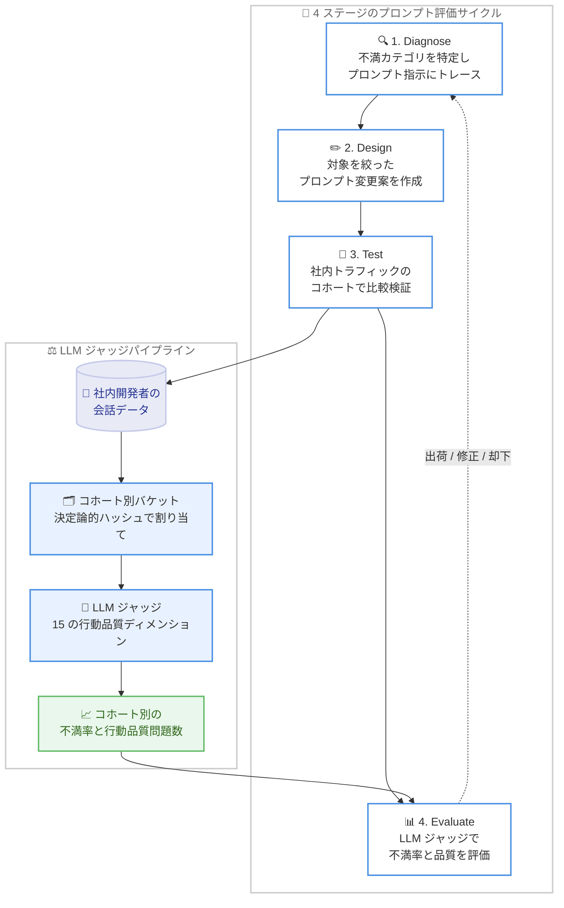

# Kiro - 継続的プロンプト評価: LLM ジャッジとライブシグナルによるエージェント品質改善

**リリース日**: 2026年8月21日
**サービス**: Kiro
**機能**: 継続的プロンプト評価 (Continuous Prompt Evaluation) の技術解説

📊 [このアップデートのインフォグラフィックを見る](https://takech9203.github.io/aws-news-summary/20260821-kiro-continuous-prompt-evaluation.html)

## 概要

Kiro チームは、システムプロンプトと設定変更の品質を継続的に評価する社内の仕組み「継続的プロンプト評価」について解説するブログ記事を公開しました。この記事では、LLM-as-judge (LLM ジャッジ) と実際の利用データ (ライブシグナル) を組み合わせて、Kiro エージェントの品質を改善するワークフローが紹介されています。ベンチマークの結果と、社内開発者による数千件の Kiro 会話に対する LLM ベースの分析を組み合わせ、タスク完了、検証、ツール使用における改善機会を特定します。

背景にあるのは、システムプロンプトの挙動を事前に網羅的に検証することが困難であるという課題です。システムプロンプトは、モデル、ツール、コードベース、タスク、ユーザーの組み合わせにわたって動作するため、テストスイートで完全にカバーすることはできません。単体では妥当に見える指示が想定外のケースで意図しない挙動を引き起こしたり、あるシナリオを改善する変更が別のシナリオを退行させたりします。また、新しいモデルが指示をより厳密に従うようになることで、それまで目立たなかった問題が顕在化する「プロンプトの陳腐化」も発生します。

この記事は、エージェント型システムを運用するチームにとって参考になる評価手法の知見を提供するとともに、Kiro ユーザーに対しては、こうした改善サイクルによってタスクの完遂率、コードスタイルの遵守、変更後の検証行動などが向上していることを示しています。

**アップデート前の課題**

システムプロンプトの品質管理には、以下のような課題が存在していました。

- システムプロンプトの挙動は、モデル、ツール、コードベース、タスク、ユーザーの組み合わせが膨大であり、テストスイートで網羅的に検証できなかった
- 新しいモデルが指示をより厳密に解釈することで、既存の指示が有害になる「プロンプトの陳腐化」を検出しにくかった
- ベンチマークは重要な品質シグナルだが、日常の開発作業に現れるすべての挙動 (ワークスペース固有のコンテキスト、実サービスとの連携、セッションをまたぐ会話など) を捉えられなかった

**アップデート後の改善**

継続的プロンプト評価の仕組みにより、以下が実現されました。

- 実際のワークフロー上で問題を検出し、繰り返し発生するパターンを分類して、プロンプト指示にまでトレースできるようになった
- 15 の行動品質ディメンションに基づく LLM ジャッジにより、コホート間で一貫した比較が可能になった
- モデルアップグレード時の再検証プロセスが確立され、プロンプト変更の効果がモデル依存であることを踏まえた運用が可能になった
- Kiro CLI では行動品質の問題が 32% 減少、Kiro IDE ではスタイル不一致が 54% 減少するなどの成果が得られた

## アーキテクチャ図

プロンプト変更は 4 ステージのサイクル (診断、設計、テスト、評価) で検証され、社内トラフィックの会話データがコホート別に LLM ジャッジで採点されます。このサイクルは、プロンプト、ユーザー行動、モデル能力の変化に合わせて繰り返されます。

## 技術内容の詳細

### 4 ステージのプロンプト評価サイクル

1. **Diagnose (診断)**
   - LLM ジャッジを現在の社内トラフィックに対して実行し、繰り返し発生する不満パターンを特定・分類する
   - 高頻度のクラスタごとに、原因となるプロンプト指示 (または欠落している指示) にトレースする
   - 例: 「タスクが未完了」という不満の多発は、エージェントに実行よりも計画の説明を促していたガイダンスが原因と判明した

2. **Design (設計)**
   - 診断された問題に対して、対象を絞った変更候補を作成する
   - 候補は主に安全性 (safety)、検証 (verification)、トーン (tone)、挙動 (behavior) の 4 カテゴリに対応する
   - 各候補は、テスト前に意図する挙動と退行リスクを明記する

3. **Test (テスト)**
   - 候補をコントロール (対照群) と分離されたコホートで比較し、必要に応じて候補を組み合わせたコホートで相互作用も検証する
   - 実験設計とサンプルサイズによって、結果が方向性の示唆にとどまるか、より広い結論を支持するかが決まる

4. **Evaluate (評価)**
   - 同一の LLM ジャッジのルーブリックを各コホートに適用し、不満率と行動品質問題の発生率を比較する
   - 得られた証拠に基づき、各候補を出荷、修正、却下のいずれかに振り分ける

### LLM-as-judge: 15 の行動品質ディメンション

評価フレームワークは、社内の会話を 15 の行動ディメンションで採点します。記事で例示されているディメンションは以下のとおりです。

| ディメンション | 内容 |
|------|------|
| タスク完全性 | タスクを最後まで完了したか |
| 主張の正確性 | 断定する前にエージェントが検証したか |
| コードスタイル遵守 | プロジェクトの既存パターンに従ったか |
| 失敗アプローチの認識 | 同じ失敗アプローチの繰り返しを認識したか |
| 破壊的アクションのフラグ | リスクのある操作の前に確認したか |
| ツール使用の適切性 | 適切なツールを選択したか |
| 検証行動 | テスト実行やコンパイル確認を行ったか |

ジャッジは、会話からの明示的な証拠 (修正、不満の表明、タスクの放棄、確認) を必須とします。曖昧な会話はどちらのバリアントに対してもカウントされず、過剰な偽陽性判定を避ける保守的で一貫した比較が維持されます。

ジャッジが測定する 2 つの主要シグナルは以下です。

- **明示的な不満 (Explicit dissatisfaction)**: ユーザーが明示的に不満を表明したか、会話を放棄したか、エージェントの作業をやり直したか。会話内の明示的なフィードバックからのみ推定され、ツールの実行結果やアンケートスコアからは推定しない
- **行動品質の問題 (Behavioral quality issues)**: エージェントが 15 の品質基準のいずれかを満たさなかったか。例として、コードを読まずに主張する、タスク完了前に停止する、プロジェクトの既存パターンを無視するなど

### A/B 実験インフラストラクチャ

- プロンプト変更の出荷前に、社内トラフィック上の分離されたコホートで構成を比較する
- 対象の社内開発者は、ユーザー ID の決定論的ハッシュにより安定したユーザーバケットに割り当てられ、会話の結果とは独立している
- 各バケットは実験ごとに 1 つのプロンプトバリアントに対応する
- ジャッジパイプラインは記録された実験割り当てに基づいて会話を分析し、すべてのコホートに同一のルーブリックを適用する
- 小規模な分離コホートは、本番影響の正確な推定ではなく、退行箇所を特定するための方向性の診断として扱う
- ある集中的な社内デプロイでは、安全性・検証・トーン・挙動の 4 カテゴリにわたり 27 件のプロンプト変更候補をスクリーニングした。劣化を示した候補は修正または削除され、組み合わせコホートとより大規模なフォローアップ比較によって広い結論を裏付けた
- このパイプラインはユーザーが目にする設定の比較にも利用されており、デフォルトの推論努力レベル (reasoning effort level) の評価では、コード修正やデバッグなどの一般的なタスクで高い努力レベルによる改善が確認された

### 直近のサイクルの結果

以下の数値は社内の実験レベルの比較で観測された差分であり、普遍的な本番環境への効果の推定値ではない点に注意が必要です。

**初回のモデルとプロンプトの実験**

| 対象 | 指標 | 変化 |
|------|------|------|
| Kiro CLI | 明示的な不満シグナル | 5% 減少 |
| Kiro CLI | 行動品質の問題 | 32% 減少 |
| Kiro CLI | タスク完全性の問題 | 10.6% 減少 |
| Kiro IDE | 行動品質の問題 | 20% 減少 |
| Kiro IDE | 未完了タスクの納品 | 21% 減少 |
| Kiro IDE | 失敗アプローチの繰り返し | 36% 減少 |
| Kiro IDE | スタイル不一致 | 54% 減少 |

**新モデルでの再検証**

- 再検証は初回実験とは異なる問いに答えるもので、同じプロンプト変更がモデルアップグレード後も有効かをテストする
- 新しいモデルとプロンプトのベースラインは、同じルーブリックの下ですでに行動品質の問題が少なく、改善余地 (ヘッドルーム) が小さいため、初回サイクルより小さい効果は設計上の想定であり退行ではない
- より厳しいベースラインに対しても、同じプロンプト変更は行動品質の問題をさらに 4% 削減し、明示的な不満を 2.6 ポイント改善した
- 新しいモデルは一部の指示をより文字どおりに従う傾向があり (特に低い努力レベルで)、旧モデル向けに調整されたガイダンスがそのまま移行できないケースがあった
- そのため、各モデルアップグレードを新しい「モデルとプロンプトの構成」として扱い、既知の不満ケースをリプレイし、過去の成功ケースを回帰チェックとして使用し、行動品質・不満・退行・効率を測定してからロールアウト前に再調整する

## エージェント型システムを評価するチームへの示唆

記事では、自身のエージェント型システムを評価するチーム向けに以下の教訓が示されています。

- **ライブ利用の評価はベンチマークを補完する**: 標準ベンチマークは引き続き有用だが、実ユーザーセッションからの社内フィードバックは、ユーザー固有のワークスペースコンテキスト、実際の本番サービスとの連携、セッションをまたいで再開される会話など、標準ベンチマークが同時に捉えられないディメンションを明らかにする
- **分離コホートは方向性のスクリーニングに使う**: 小規模な候補コホートは退行箇所の特定に役立つが、より広い結論を導く前には、組み合わせた比較と十分な検定力を持つフォローアップ比較が必要
- **プロンプトの効果はモデル依存**: 同じ変更が、あるモデルバージョンでは行動品質の問題を 32% 削減し、別のバージョンでは 4% の削減にとどまった。モデルアップグレードのたびに再検証が必要
- **不要になったガイダンスは廃止する**: 最大級の改善の一部は、行数制限や非推奨ツールの回避策など、時代遅れの制約の削除から得られた。シンプルなプロンプトほどモデルの挙動との整合を保ちやすい

## Kiro ユーザーへの影響

これらの改善により、Kiro は以下の点でより信頼性の高い挙動を示すようになります。

- タスク全体を完遂する可能性が高まる
- うまくいかないアプローチに固執せず、方針転換しやすくなる
- プロジェクトの既存のコードスタイルに従いやすくなる
- 次に進む前に、変更がコンパイルできるか、テストが通るかを検証するようになる
- リスクのある操作の前には確認を求め、安全な作業は直接進めるようになる

Kiro チームは、プロンプトとモデルの変化に合わせてこのプロンプト評価を繰り返し、デプロイ前にアップデートを検証しています。

## メリット

### ビジネス面

- **透明性の向上**: Kiro の品質改善プロセスが公開されることで、ユーザーはエージェントの挙動改善がどのように検証されているかを理解できる
- **品質の継続的改善**: モデルアップグレードのたびに再検証が行われるため、モデル更新による品質退行のリスクが低減される
- **他チームへの知見提供**: 独自のエージェント型システムを構築・運用する組織にとって、評価手法のリファレンスとなる

### 技術面

- **証拠ベースの評価**: LLM ジャッジが明示的な証拠を必須とすることで、偽陽性を抑えた保守的で一貫性のある品質測定が可能
- **決定論的なコホート割り当て**: ユーザー ID のハッシュに基づく安定したバケット割り当てにより、会話結果に依存しないバイアスの少ない実験が可能
- **プロンプトの簡素化**: 不要な制約の削除がモデルとの整合性を高めるという知見は、プロンプトエンジニアリング全般に適用できる

## デメリット・制約事項

### 制限事項

- 記事で示された数値は社内の実験レベルの比較で観測された差分であり、本番環境における普遍的な効果の推定値ではない
- 小規模な分離コホートの結果は方向性の診断にとどまり、個別に統計的検定力を持つ推定値ではない
- この記事の範囲は人手で作成されたシステムプロンプトと設定変更の評価であり、自動トラジェクトリマイニング、変更の自動生成、ハーネスの自己改善は対象外

### 考慮すべき点

- 安定したコホート割り当てはプロンプト実験内の選択バイアスを制御するが、ライブトラフィックにおけるすべてのバイアスや相互作用を排除するわけではない
- プロンプト変更の効果はモデルに依存するため、同様の手法を採用する場合はモデルアップグレードごとの再検証が必須となる
- 明示的なフィードバックのみを不満シグナルとするため、暗黙的な不満 (無言での利用停止など) は捕捉されない可能性がある

## 利用可能リージョン

グローバル (Kiro はグローバルに提供されるサービスです)

## 関連サービス・機能

- **Kiro IDE**: 本記事の評価対象の 1 つ。スペック駆動開発を支援するエージェント型 IDE
- **Kiro CLI**: 本記事の評価対象の 1 つ。コマンドラインから Kiro エージェントを利用するツール
- **推論努力レベル (Reasoning Effort)**: ジャッジパイプラインで評価されたユーザー設定。コード修正やデバッグなどのタスクで高い努力レベルによる改善が確認された

## 参考リンク

- 📊 [インフォグラフィック](https://takech9203.github.io/aws-news-summary/20260821-kiro-continuous-prompt-evaluation.html)
- [公式ブログ記事 (Kiro Blog)](https://kiro.dev/blog/continuous-prompt-evaluation/)
- [Kiro ドキュメント](https://kiro.dev/docs/)
- [Kiro Changelog](https://kiro.dev/changelog/)

## まとめ

本記事は、Kiro チームがシステムプロンプトの品質を LLM ジャッジと実利用データに基づく 4 ステージのサイクルで継続的に評価・改善している仕組みを公開したものです。プロンプトの効果がモデル依存であること、不要なガイダンスの削除が大きな改善につながることなど、エージェント型システムを運用するすべてのチームに有益な知見が含まれています。独自の AI エージェントを構築・運用している場合は、ベンチマークに加えてライブシグナルによる評価と、モデルアップグレードごとの再検証プロセスの導入を検討することを推奨します。
