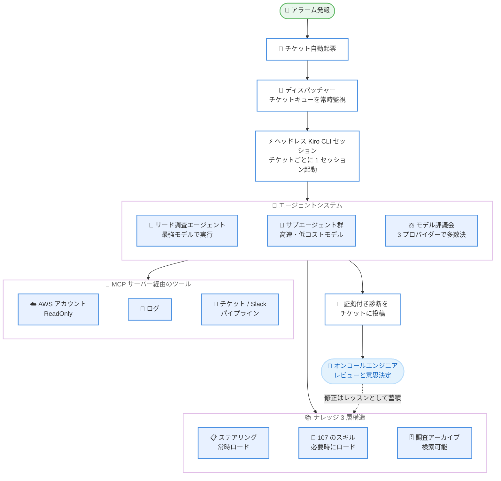

# Kiro - AI エージェントによる本番インシデントトリアージの実践知見

**リリース日**: 2026年8月21日
**サービス**: Kiro
**機能**: Kiro CLI を活用した本番インシデントトリアージエージェントの構築・運用事例

📊 [このアップデートのインフォグラフィックを見る](https://takech9203.github.io/aws-news-summary/20260821-kiro-trust-agent-triage.html)

## 概要

Kiro チームが、本番環境のインシデントトリアージを AI エージェントに任せるまでの道のりと、その仕組み・学びを解説するブログ記事を公開しました。Kiro のデータプレーン (IDE、CLI、Web、iOS、Kiro Crew からのエージェンティックチャットリクエストを Amazon Bedrock 上の複数モデルへ配信する経路) を運用するチームが、アラーム発報からチケットへの診断結果投稿までを無人で実行するトリアージエージェントを、製品として出荷している Kiro CLI そのものの上に構築した実例です。

記事では、深夜 2 時 33 分に発報した可用性アラームに対し、13 分 35 秒後には「競合仮説をすべて棄却済みの、根拠付きの診断と推奨アクション」がチケットに記載され、オンコールエンジニアの仕事が「調査の開始」から「完成した調査ブリーフのレビューと意思決定」に変わった様子が紹介されています。オーケストレーションフレームワークやファインチューニング済みモデル、専用ランタイムは使わず、Markdown ファイルと MCP サーバー、標準の Kiro CLI だけで構成されている点が特徴です。

**アップデート前の課題**

AI エージェント登場以前のインシデントトリアージには、以下の課題がありました。

- アラーム発報のたびに、疲弊した人間のオンコールエンジニアが深夜でも調査を最初から開始する必要があった
- 容量イベント、不正アクセス、不良デプロイ、アラーム閾値の誤設定など、仮説ごとに異なるログループ、アカウント、クエリ言語を横断する必要があった
- 数十アカウントにまたがるリクエスト ID の突合のような大規模な調査は、インシデント対応中の深夜には現実的に実施できなかった
- 過去の調査で得られた知見が個人の記憶に留まり、システムとして蓄積・再利用されにくかった

**アップデート後の改善**

記事で紹介されたアプローチにより、以下が実現されています。

- アラームからチケット化、エージェントセッションの起動、証拠付き診断の投稿までが無人で完結 (代表的な月で約 250 件の調査、完了までの中央値 13.6 分)
- ツール呼び出しの 96.9% が読み取り操作である点に着目し、ReadOnly ロールの許可リストで安全に自律動作
- 調査結果や修正指示が「レッスン」「ナレッジアーカイブ」「スキル」として蓄積され、次回の同種アラームは前回の到達点から調査を開始
- オンコールの仕事が「調査の実施」から「エージェントが完了した調査のレビューと判断」へ変化

## アーキテクチャ図



アラームがチケット化されると、ディスパッチャーがチケットごとにヘッドレス Kiro CLI セッションを起動します。エージェントは ReadOnly スコープのツールで調査を行い、証拠付きの診断をチケットに投稿し、人間はレビューと最終判断に専念します。

## サービスアップデートの詳細

### システム構成の主要要素

1. **標準の Kiro CLI をそのまま利用**
   - オーケストレーションフレームワーク、ファインチューニング済みモデル、専用エージェントランタイムは一切不使用
   - 顧客に出荷しているものと同じ Kiro CLI を自チームの運用に向けて構成
   - エンジニアがコードと同様にレビューできる 3 種類のプレーンファイル (エージェント設定、MCP サーバー定義、スキルとナレッジ) で構成

2. **エージェント設定とステアリングファイル**
   - 使用モデル、ツール、運用ルールを記した Markdown のステアリングファイルで構成
   - 各ルールは「人間が一度下した判断」であり、以後すべてのセッションに適用される
   - 例: 「結論を述べる前に競合仮説を検証・棄却すること」「チケットの解決やシビリティ変更は人間のみが行う」

3. **MCP サーバーによるツール接続**
   - AWS アカウント (ReadOnly)、ログ、チケット、パイプライン、コードレビュー、Slack に接続
   - 無人セッションはロール許可リストにより ReadOnly がデフォルトで、Admin 権限の要求はエラーを返す
   - クレデンシャルはセッションごとに発行され、エージェントが宣言したタスクにスコープが限定される

4. **モデルの使い分けはランタイムパラメータ**
   - リード調査エージェントは利用可能な最強モデルで実行
   - ファンアウト作業は高速・低コストモデルのサブエージェント群 (スワーム) に委任
   - 真に曖昧な判断は 3 プロバイダーのモデルによる「評議会」に並列で諮り、意見の不一致は「さらに証拠を集めるべきシグナル」として扱う

### スキルによるプログレッシブディスクロージャー

- 巨大なシステムプロンプトに全ランブックを詰め込む方式は、約 10 個目のランブックで破綻する (発火していない 99 個のアラーム向け指示がコンテキストを圧迫するため)
- 代わりに、状況ごとの Markdown プレイブックである「スキル」を 107 個用意し、コンテキストにはその索引のみを常駐させる
- チケットがスキルに合致した場合のみ、該当スキルの全文をロードする
- ナレッジはコストに応じて 3 層化: 常時必要な事実は常駐、プレイブックはオンデマンドロード、数百件の過去調査は検索可能なアーカイブに格納
- この層構造により、長時間の調査で最初に発生する「コンテキスト枯渇」を回避

### 調査の実例

- **深夜の可用性アラーム**: 2:33 AM の発報から 13 分 35 秒で、「ストリームのサイレントな停止 (本番バグまたは容量スケーリングが原因)、影響顧客、棄却済みの競合仮説、根拠付きの推奨アクション」がチケットに投稿された
- **セル単位の原因特定**: 一見モデル全体の容量イベントに見えたアラームで、全ストリームエラーをリクエスト ID でルーティングレコードと突合し、エラーの 96.5% が分離されたサービングセル 2 個に集中していることを発見。「セルごとのクォータの偏り」という仮説を ReadOnly クレデンシャルで検証し、上流依存関係の潜在バグを特定した

### フライホイール: 人間が構築し、エージェントが回す

システムを毎週改善しているのは「調査 → 記録 → コンパイル → 進化」のループです。

1. **修正はレッスンになる**: 人間による修正は一度だけ保存され、以後のすべてのセッションに注入される。エージェントは自分を誤導したドキュメント自体も修正する
2. **調査はナレッジになる**: クローズしたチケットは蒸留され、将来のセッションが最初に検索するアーカイブに蓄積される
3. **エージェントがスキルを起草し、人間がレビューする**: 新規インシデント後、エージェントが新しいプレイブックや差分を起草する。レート制限プレイブックのセル単位調査ステップは、この方法で当夜のうちに追加された
4. **エージェント間の共有状態**: 条件付き書き込みのエスカレーショントラッカーにより、同一インシデントを観測する 10 の並列エージェントが起票する上流チケットは 1 件に集約される

## 技術仕様

### 運用実績と統制の仕組み

| 項目 | 詳細 |
|------|------|
| 調査件数 | 代表的な月で約 250 件を無人で完了 |
| 完了時間 | 中央値 13.6 分 |
| ツール呼び出しの読み取り比率 | 96.9% (安全・可逆・並列化可能)、残りはゲート制御 |
| スキル数 | 107 個 (索引のみ常駐、該当時に全文ロード) |
| コスト | 顧客と同じクレジット単位で計測。月額は自社トップティアサブスクリプション 9 契約分相当 |
| コスト統制 | セッションタイムアウト、スタック検知、同時実行数の上限、ファンアウト用の低コストモデル |
| セキュリティ | ReadOnly ロール許可リスト、セッション単位・タスクスコープのクレデンシャル発行 |

## メリット

### ビジネス面

- **オンコール負荷の構造的軽減**: 深夜のアラームは「調査を始める仕事」ではなく「完成した調査をレビューする仕事」になり、ポケベルは「エージェントが完了した作業の意思決定キュー」に変化する
- **明確なコスト対効果**: 月額コストはトップティアサブスクリプション 9 契約分相当で、約 250 件の調査を自動化。回収した時間はブリーフのレビュー、エージェントの修正、根本原因の解消に再投資される
- **知識の組織的蓄積**: 疲弊した深夜の人間には不可能な「学んだことの記録」をエージェントが毎回実行し、システムの知識が複利的に増える

### 技術面

- **既存投資の活用**: 長年のランブック、アラーム Wiki、ポストインシデントノートがそのまま「エージェントコンテキスト」への投資となる
- **特別なインフラ不要**: Markdown、MCP サーバー、標準の Kiro CLI のみで構成され、エンジニアが通常のコードレビューと同じプロセスで管理できる
- **検証可能な出力**: すべてのステップがログに残り、投稿されるすべての主張はそれを生成したクエリにリンクされる。「精度の主張」ではなく「検証可能な出力」が信頼を生む

## デメリット・制約事項

### 制限事項

- チケットの解決やシビリティ変更などの重要操作は人間のみが実行可能で、エージェントには許可されていない
- 修正のコードレビュー起草や閾値チューニングは可能になりつつあるが、人間による必須レビューの背後に置かれている
- 単一の「自律性設定」は存在せず、アクションごとに個別ルールをステアリングファイルへ蓄積する必要がある

### 考慮すべき点

- **ドキュメントのバグはマシンスピードで継承される**: 参照ドキュメントの古い 1 行が複数チケットに伝播した事例があり、対策はモデル改善ではなく「セッションが誤ったら、何に誤導されたかを問い、そのドキュメントを直す」習慣だった
- **学習パイプラインはゴミも複利で増やす**: 中断されたセッションの生テキストが修正ストアに混入し、将来のセッションが誤って「運用の知恵」として学習した事例がある。書き込み前のスキーマ検証と夜間のプルーニングで対処
- **自信のある生半可な回答は誤答より高くつく**: 「結論の前に競合仮説を検証・棄却する」というステアリングルールが、どのモデルアップグレードよりも効果的だった
- **簡潔さが信頼を築く**: 顧客可視スレッドには短い投稿 1 件、詳細はワークログへ分離。パートナーチームはエージェントを「最良の調査」ではなく「最悪のコメント」で評価する

## ユースケース

### ユースケース1: 深夜アラームの無人トリアージ

**シナリオ**: 深夜 2 時 33 分にフロンティアモデルの可用性アラームが発火し、本番レスポンスがストリーム途中で停止している。

**実装例**:
```text
1. モニタリングがチケットを自動起票
2. ディスパッチャーがヘッドレス Kiro CLI セッションを起動
3. エージェントがスキル索引から該当プレイブックをロード
4. ReadOnly ツールでログ・アラーム・ルーティングレコードを調査
5. 競合仮説を棄却した診断と推奨アクションをチケットに投稿
```

**効果**: 13 分 35 秒で根拠付き診断が完成し、オンコールエンジニアは「エスカレーションを起票して」の一文で対応を完了できる。

### ユースケース2: 大規模データ突合による根本原因特定

**シナリオ**: 新モデルのアラームが一見モデル全体の容量イベントに見えるが、真の原因が不明。

**実装例**:
```text
1. 全ストリームエラーをリクエスト ID でルーティングレコードと突合
2. エラーの 96.5% がサービングセル 2 個に集中していることを発見
3. 「セルごとのクォータの偏り」仮説を ReadOnly クレデンシャルで検証
4. 上流依存関係の潜在バグとして特定・報告
```

**効果**: 週末の深夜、インシデント対応中、数十アカウント横断という「人間には実施不可能な条件」での網羅的調査が実現する。

### ユースケース3: 自チーム運用への Kiro CLI 適用

**シナリオ**: 自社の運用チームが、専用基盤を作らずにエージェントによるチケットキュー処理を始めたい。

**実装例**:
```text
1. エージェント設定 (モデル・ツール・ステアリング Markdown) を作成
2. MCP サーバーで AWS ReadOnly、ログ、チケット、Slack に接続
3. 既存ランブックを状況別スキル (Markdown プレイブック) に分割
4. チケットキュー監視のディスパッチャーからヘッドレスセッションを起動
5. 人間の修正をレッスンとして蓄積するループを整備
```

**効果**: 既存のランブック資産を活かしつつ、レビュー可能なプレーンファイルだけでトリアージ自動化を段階的に導入できる。

## 利用可能リージョン

グローバル (Kiro はグローバルに提供されています)

## 関連サービス・機能

- **Kiro CLI**: 本事例のエージェント実行基盤。顧客に提供されているものと同一の CLI をヘッドレスモードで利用
- **Model Context Protocol (MCP)**: AWS アカウント、ログ、チケット、Slack などのツールへの接続に使用
- **Amazon Bedrock**: Kiro のデータプレーンが Anthropic、OpenAI、GLM、Qwen、DeepSeek、MiniMax の各モデルをホストするために利用
- **Kiro のスキル / ステアリング機能**: プログレッシブディスクロージャーによるコンテキスト管理と運用ルールの適用に使用

## 参考リンク

- 📊 [インフォグラフィック](https://takech9203.github.io/aws-news-summary/20260821-kiro-trust-agent-triage.html)
- [公式ブログ記事: How We Learned to Trust an AI Agent to Triage Production Incidents](https://kiro.dev/blog/trust-agent-triage/)
- [Kiro Blog](https://kiro.dev/blog/)
- [Kiro ドキュメント](https://kiro.dev/docs/)

## まとめ

本記事は、標準の Kiro CLI と Markdown、MCP サーバーだけで本番インシデントトリアージを無人化し、オンコールの仕事を「調査の開始」から「完成した調査のレビューと意思決定」へ変えた実践事例です。読み取り中心の作業を ReadOnly 権限で自律化し、重要操作は人間に残すという権限設計と、修正をレッスンとして蓄積するフライホイールは、エージェント運用を検討するすべてのチームに参考になります。まずは既存のランブックをスキルとして構造化し、小さな読み取り専用タスクからエージェントへの委任を試すことを推奨します。
