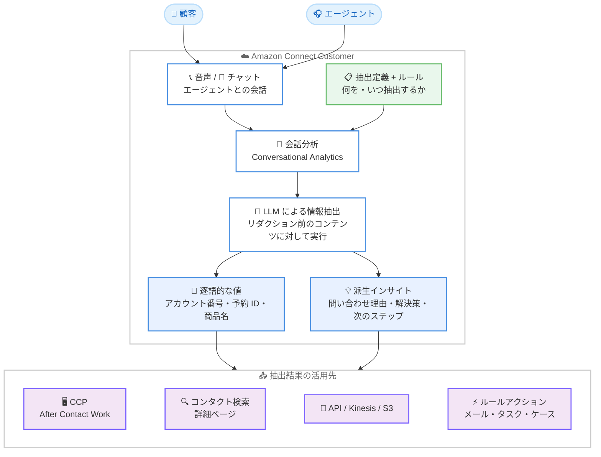

# Amazon Connect Customer - エージェントの音声・チャット会話からの情報抽出

**リリース日**: 2026 年 8 月 24 日
**サービス**: Amazon Connect Customer
**機能**: 会話からの情報抽出 (Information Extraction)

📊 [このアップデートのインフォグラフィックを見る](https://takech9203.github.io/aws-news-summary/20260824-amazon-connect-customer-information.html)

## 概要

Amazon Connect Customer が、エージェントの音声およびチャット会話からの情報抽出 (Information Extraction) をサポートしました。生成 AI (LLM) を活用して、会話の中で言及されたアカウント番号や予約 ID、商品名などの逐語的な値 (Verbatim) と、問い合わせ理由・提供した解決策・約束した次のステップなどの派生インサイト (Derived) を自動的にキャプチャし、コンタクトに構造化データとして関連付けます。

抽出対象と抽出タイミングは会話分析 (Conversational Analytics) のルールで定義します。抽出はリダクション (機密情報のマスキング) 適用前の生のコンタクトコンテンツに対して動作するため、通話録音やトランスクリプトから機密情報をリダクションしつつ、必要なデータポイントのみを抽出するといった柔軟な運用が可能です。

抽出された情報は、エージェントは After Contact Work 中に Contact Control Panel (CCP) で確認でき、スーパーバイザーはコンタクト検索でのフィルタリングやレビューに活用できます。開発者は API、Amazon Kinesis Data Streams、Amazon S3 出力ファイル経由でアクセスできます。さらに、抽出値をメール通知・タスク作成・ケース作成などのルールアクションに変数として連携し、ワークフローを自動化できます。

**アップデート前の課題**

このアップデート以前は、会話中の重要情報の記録は手作業に依存していました。

- エージェントは通話後に、アカウント番号や予約 ID などの重要情報を手動で CRM やメモに転記する必要があり、After Contact Work の時間が長くなっていた
- 問い合わせ理由や解決策、次のステップなどのインサイトを構造化データとして一貫した形式で記録することが困難だった
- スーパーバイザーが特定の情報 (例: 特定の予約 ID に関する問い合わせ) を含むコンタクトを検索することが難しかった
- 会話内容に基づくフォローアップメールの送信やタスク作成を自動化するには、独自の開発が必要だった

**アップデート後の改善**

今回のアップデートにより、会話からの情報キャプチャが自動化されます。

- LLM が会話から逐語的な値と派生インサイトを自動抽出し、手動データ入力を削減してエージェントとスーパーバイザーの生産性を向上
- 抽出定義とルールを設定するだけで、抽出対象 (何を) と抽出タイミング (いつ) をノーコードで定義可能
- リダクション前のコンテンツに対して抽出が動作するため、機密情報の保護と必要データの取得を両立 (例: クレジットカード番号をリダクションしつつ下 6 桁のみ抽出)
- 抽出値をルールアクション (メール送信、タスク作成、ケース作成、通知) に変数として注入し、後続ワークフローを自動化

## アーキテクチャ図



会話分析ルールに基づき LLM が会話から情報を抽出し、抽出結果がエージェント・スーパーバイザー・開発者向けの各チャネルとルールアクションに連携される流れを示しています。

## サービスアップデートの詳細

### 主要機能

1. **逐語的な値 (Verbatim) の抽出**
   - 会話中に実際に言及された値をそのままキャプチャ
   - 例: 希望する呼び名、アカウント番号、請求書番号、予約 ID、商品名
   - 1 つの抽出定義が 1 つのコンタクト内で複数回マッチした場合、すべてのマッチがリストとして返される (例: 往復航空券の会話で「フライト番号」を抽出すると "XX123, YY567" のように全件返却)

2. **派生インサイト (Derived) の抽出**
   - 会話内容から推論される情報をキャプチャ
   - 例: 問い合わせ理由、提供した解決策、約束した次のステップ
   - コンタクトの内容を構造化データとして一貫した形式で記録可能

3. **抽出定義とルールによる制御**
   - 抽出定義 (Extraction Definition) で「何を抽出するか」を定義
   - 会話分析ルールで「いつ抽出するか」を設定し、ルール発火時に LLM がコンタクトコンテンツを処理
   - After Contact Work 分析ルールとポストコンタクト分析ルールの両方に対応

4. **リダクション前コンテンツへの抽出**
   - 抽出はリダクション適用前の生のコンタクトコンテンツに対して動作
   - 録音・トランスクリプトの機密情報をリダクションしながら、必要なデータの全部または一部を抽出可能
   - 例: クレジットカード番号を録音とトランスクリプトからリダクションしつつ、下 6 桁のみを抽出

5. **多様なアクセス手段とワークフロー連携**
   - エージェント: CCP の After Contact Work 中に抽出値を確認
   - スーパーバイザー: コンタクト詳細ページでの確認、コンタクト検索でのフィルタリング
   - 開発者: API (ListRealtimeContactAnalysisSegments / ListRealtimeContactAnalysisSegmentsV2)、Kinesis Data Streams へのリアルタイムイベント配信、S3 の会話分析出力ファイル
   - ルールアクション: 抽出値を変数としてメール送信、タスク作成、ケース作成、通知に注入

## 技術仕様

### 抽出結果の提供場所

| 提供場所 | 詳細 |
|------|------|
| Contact Control Panel (CCP) | After Contact Work 中にエージェントが確認 |
| コンタクト詳細ページ | コンタクト終了後に確認 |
| コンタクト検索 | 抽出情報に基づくフィルタリング・検索 |
| Amazon S3 | 会話分析出力ファイルに抽出データを格納 |
| API | ListRealtimeContactAnalysisSegments (音声) / ListRealtimeContactAnalysisSegmentsV2 (チャット) |
| Amazon Kinesis | 抽出情報イベントをリアルタイムでデータストリームに配信 |
| ルールアクション | メール送信、タスク作成、ケース作成、通知への変数注入 |

### 制限値

| 項目 | 上限 |
|------|------|
| インスタンスあたりの抽出定義数 | 100 |
| After Contact Work 分析ルールでのコンタクトあたり抽出数 | 20 |
| ポストコンタクト分析ルールでのコンタクトあたり抽出数 | 20 |

### 必要なセキュリティプロファイル権限

セキュリティプロファイルの「Analytics and Optimization」で以下の権限を設定します。

| 対象ユーザー | 必要な権限 |
|------|------|
| 抽出定義を管理するユーザー | Conversational analytics = View、Information extraction - definitions = All、Rules = All、Rules - Generative AI = All |
| 抽出結果を閲覧するユーザー | Conversational analytics = View、Information extraction - results = View |

## 設定方法

### 前提条件

1. Amazon Connect Customer インスタンスであること (従来の Amazon Connect インスタンスでは利用不可)
2. フローに「Set recording and analytics behavior」ブロックを含め、会話分析 (Conversational Analytics) を有効化していること
3. セキュリティプロファイルで情報抽出に関する権限を設定していること

### 手順

#### ステップ 1: 会話分析の有効化

フローエディタで「Set recording and analytics behavior」ブロックを追加し、対象チャネル (音声・チャット) の会話分析を有効化します。これにより、コンタクトのコンテンツが分析対象となります。

#### ステップ 2: 抽出定義の作成

Amazon Connect 管理コンソールで抽出定義 (Extraction Definition) を作成し、抽出したい情報 (例: 予約 ID、問い合わせ理由) を定義します。逐語的な値と派生インサイトのどちらもここで定義します。

#### ステップ 3: ルールの設定

会話分析ルールを作成し、どの条件のときに (いつ) 抽出を実行するかを設定します。ルールが発火すると LLM がコンタクトコンテンツを処理し、抽出結果を返します。

#### ステップ 4: 抽出結果の確認と活用

CCP の After Contact Work、コンタクト詳細ページ、コンタクト検索で抽出結果を確認します。必要に応じて、抽出値を変数としてメール送信・タスク作成・ケース作成などのルールアクションに連携し、ワークフローを自動化します。開発者は API や Kinesis Data Streams、S3 出力ファイルからプログラムでアクセスできます。

## メリット

### ビジネス面

- **処理時間の短縮**: エージェントの手動データ入力が削減され、After Contact Work を含むハンドルタイムが短縮される
- **フォローアップの自動化**: 抽出値をメール送信やタスク作成に連携することで、対応漏れを防ぎ顧客体験を向上できる
- **追加コストなし**: Amazon Connect Customer の音声・チャットコンタクトで追加料金なしで利用可能

### 技術面

- **ノーコードで構成可能**: 抽出定義とルールの設定だけで LLM による情報抽出を構成でき、独自の音声認識・NLP パイプラインの開発が不要
- **セキュリティとデータ活用の両立**: リダクション前のコンテンツに対する抽出により、機密情報の保護と必要データの取得を同時に実現
- **豊富なインテグレーション**: API、Kinesis Data Streams、S3 出力ファイルを通じて、CRM や外部システムとの連携を柔軟に実装可能

## デメリット・制約事項

### 制限事項

- Amazon Connect Customer インスタンスでのみ利用可能 (従来の Amazon Connect インスタンスでは利用不可)
- インスタンスあたりの抽出定義は最大 100 件
- コンタクトあたりの抽出数は After Contact Work 分析ルール・ポストコンタクト分析ルールでそれぞれ最大 20 件
- 会話分析の有効化が前提となる

### 考慮すべき点

- 抽出はリダクション前のコンテンツに対して動作するため、機密データの全部または一部を抽出できてしまう。抽出定義の設計とアクセス権限 (Information extraction - results) の管理を慎重に行う必要がある
- LLM による派生インサイトは推論結果であるため、重要な業務判断に使用する場合は精度の検証を行うことが望ましい
- 利用可能リージョンはドキュメントの「Availability of Connect Customer features by Region」で確認が必要

## ユースケース

### ユースケース 1: 旅行会社のフォローアップ自動化

**シナリオ**: 旅行会社のコンタクトセンターで、ホテル予約の変更依頼を受け付けている。通話後にエージェントが予約情報を手動で転記し、フォローアップメールを作成している。

**実装例**:
```
抽出定義: ホテル名 (逐語)、予約 ID (逐語)、問い合わせ理由 (派生)
ルール: 通話終了後に抽出を実行し、抽出値を変数として
       アウトバウンドメールのテンプレートに注入して自動送信
```

**効果**: ハンドルタイムと手動入力を削減し、フォローアップメールの送信漏れを防止する。

### ユースケース 2: スーパーバイザーによるコンタクト分析

**シナリオ**: 特定の商品に関する問い合わせが増加しており、スーパーバイザーが該当するコンタクトを抽出してレビューしたい。

**実装例**:
```
抽出定義: 商品名 (逐語)、問い合わせ理由 (派生)、提供した解決策 (派生)
活用方法: コンタクト検索で「商品名 = 対象商品」の条件でフィルタリングし、
         解決策の傾向をレビュー
```

**効果**: 特定トピックのコンタクトを迅速に特定でき、品質管理やナレッジ改善のサイクルを高速化する。

### ユースケース 3: CRM への自動データ連携

**シナリオ**: コンタクト終了後に、会話で確認したアカウント番号や次のステップを CRM に自動登録したい。

**実装例**:
```
抽出定義: アカウント番号 (逐語)、次のステップ (派生)
連携方法: Kinesis Data Streams に配信される抽出情報イベントを
         AWS Lambda で処理し、CRM の API を呼び出して更新
```

**効果**: 転記ミスをなくし、CRM のデータ鮮度と正確性を向上する。

## 料金

情報抽出は、Amazon Connect Customer の音声およびチャットコンタクトにおいて追加料金なしで利用できます。

## 利用可能リージョン

リージョンごとの利用可否は、ドキュメントの [Availability of Connect Customer features by Region](https://docs.aws.amazon.com/connect/latest/adminguide/regions.html) を参照してください。

## 関連サービス・機能

- **Amazon Connect Contact Lens (会話分析)**: 情報抽出の基盤となる分析機能。フローで会話分析を有効化することが前提となる
- **Amazon Kinesis Data Streams**: 抽出情報イベントのリアルタイム配信先。外部システム連携のハブとして活用可能
- **Amazon S3**: 会話分析出力ファイルの保存先。抽出データがファイルに含まれる
- **Amazon Connect Tasks / Cases**: ルールアクションとして抽出値を注入し、タスクやケースを自動作成可能

## 参考リンク

- 📊 [インフォグラフィック](https://takech9203.github.io/aws-news-summary/20260824-amazon-connect-customer-information.html)
- [公式発表 (What's New)](https://aws.amazon.com/about-aws/whats-new/2026/08/amazon-connect-customer-information/)
- [ドキュメント: Information extraction](https://docs.aws.amazon.com/connect/latest/adminguide/information-extraction.html)
- [ドキュメント: リージョン別機能一覧](https://docs.aws.amazon.com/connect/latest/adminguide/regions.html)
- [Amazon Connect 製品ページ](https://aws.amazon.com/connect/)

## まとめ

Amazon Connect Customer の情報抽出により、会話中の重要情報のキャプチャが LLM で自動化され、エージェントの手動データ入力の削減とワークフロー自動化が追加料金なしで実現できます。会話分析を利用中の Amazon Connect Customer ユーザーは、まず抽出定義とルールを少数のユースケース (予約 ID や問い合わせ理由など) で試し、リダクションとの組み合わせやルールアクション連携へ段階的に拡大することを推奨します。
