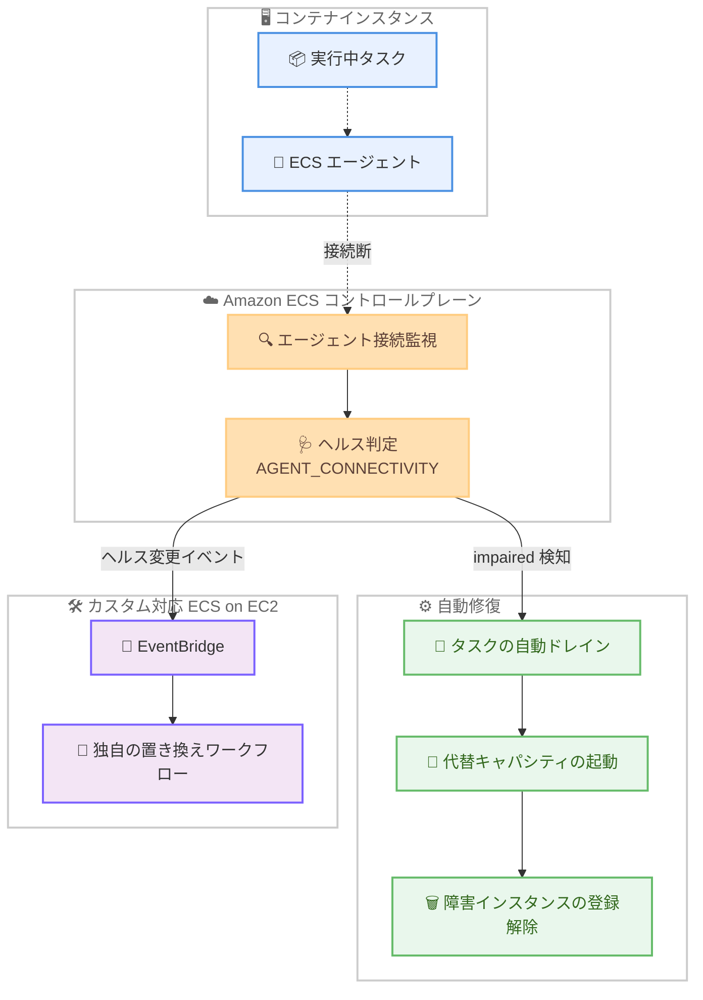

# Amazon ECS - エージェント接続障害のあるコンテナインスタンスの自動検出・修復

**リリース日**: 2026 年 8 月 24 日
**サービス**: Amazon Elastic Container Service (Amazon ECS)
**機能**: エージェント接続ヘルスチェック (AGENT_CONNECTIVITY) と障害インスタンスの自動修復

📊 [このアップデートのインフォグラフィックを見る](https://takech9203.github.io/aws-news-summary/20260824-amazon-ecs-agent-connectivity-health.html)

## 概要

Amazon ECS が、ECS コンテナエージェントと ECS コントロールプレーン間の接続状態を継続的に監視し、接続障害 (impaired) 状態となったコンテナインスタンスを自動的に検出・修復する機能を発表しました。EBS ボリュームの劣化、ホストの熱イベント、ネットワーク接続障害といったインフラストラクチャ起因のイベントは、ECS エージェントとコントロールプレーン間の接続を切断し、タスクが正常に稼働していないにもかかわらず検知されない「サイレント障害」を引き起こす可能性がありました。本アップデートにより、こうした障害を ECS が自動的に検知し、可用性を手動介入なしで維持できるようになります。

今回のアップデートでは、新しいタイプのヘルス変更イベント **AGENT_CONNECTIVITY** が追加され、AWS Fargate、Amazon ECS Managed Instances、Amazon ECS on EC2 のすべてのコンピューティングオプションで利用できます。さらに ECS Managed Instances と AWS Fargate では、障害を検知した際に、実行中タスクのドレイン、代替キャパシティの起動、障害インスタンスの登録解除までを ECS が自動的に実行します。

対象ユーザーは、ECS でコンテナワークロードを運用するすべてのユーザーです。特に、これまで独自のヘルスチェックや監視の仕組みでエージェント切断を検知していた運用チームにとって、運用負荷の大幅な削減につながるアップデートです。

**アップデート前の課題**

このアップデート以前は、インフラ障害によるエージェント切断への対応に課題がありました。

- インフライベント (EBS ボリューム劣化、熱イベント、ネットワーク障害など) によりエージェントとコントロールプレーンの接続が切断されても、標準機能では即座に検知できず、ワークロード障害が見過ごされる可能性があった
- エージェント切断の検知には、CloudWatch メトリクスや独自スクリプトによるカスタム監視 (`agentConnected` フィールドのポーリングなど) を構築する必要があった
- 障害インスタンスを検知した後も、タスクのドレイン、代替キャパシティの確保、インスタンスの登録解除といった復旧作業を手動または自作の自動化で行う必要があった

**アップデート後の改善**

今回のアップデートにより、以下が可能になりました。

- ECS がエージェントとコントロールプレーン間の接続を継続的に監視し、切断がしきい値を超えたインスタンスを自動的に impaired (障害) 状態としてマークするようになった
- 新しいヘルス変更イベント AGENT_CONNECTIVITY が EventBridge 経由で配信され、Fargate、ECS Managed Instances、ECS on EC2 のすべてで接続障害を検知できるようになった
- ECS Managed Instances と AWS Fargate では、実行中タスクの自動ドレイン、代替キャパシティの起動、障害インスタンスの登録解除までが完全自動化された
- ECS on EC2 では、このヘルスイベントをトリガーとして独自のインスタンス置き換えワークフローを構築できるようになった

## アーキテクチャ図



ECS コントロールプレーンがエージェント接続を継続監視し、切断を検知すると、Managed Instances / Fargate では自動修復フロー (ドレイン → 代替起動 → 登録解除) を実行し、ECS on EC2 では EventBridge イベントを通じて独自ワークフローを起動できます。

## サービスアップデートの詳細

### 主要機能

1. **エージェント接続の継続監視**
   - ECS がコンテナエージェントとコントロールプレーン間の接続状態を継続的に監視
   - コンテナインスタンスの切断状態がしきい値を超えると、ECS がそのインスタンスを impaired (障害) 状態としてマーク
   - EBS ボリューム劣化、ホストの熱イベント、ネットワーク障害などインフラ起因の切断を検知可能

2. **新しいヘルスチェックタイプ AGENT_CONNECTIVITY**
   - コンテナインスタンスヘルスの新しいチェックタイプとして AGENT_CONNECTIVITY が追加
   - AWS Fargate、Amazon ECS Managed Instances、Amazon ECS on EC2 のすべてのコンピューティングオプションで利用可能
   - `describe-container-instances` の `CONTAINER_INSTANCE_HEALTH` オプションや、EventBridge の「ECS Container Instance Health Change」イベントで確認可能

3. **障害インスタンスの自動修復 (Managed Instances / Fargate)**
   - ECS Managed Instances と AWS Fargate では、障害検知後の復旧を ECS が自動実行
   - 実行中タスクの自動ドレイン → 代替キャパシティの起動 → 障害インスタンスの登録解除という一連の流れを手動介入なしで完了
   - アプリケーションの可用性を自動的に維持

4. **ECS on EC2 でのカスタムワークフロー構築**
   - ECS on EC2 では、AGENT_CONNECTIVITY ヘルスイベントを利用して独自のインスタンス置き換えワークフローを構築可能
   - EventBridge ルールと Lambda や Systems Manager Automation を組み合わせた自動復旧を実装できる

## 技術仕様

### コンテナインスタンスヘルスの仕様

| 項目 | 詳細 |
|------|------|
| ヘルスチェックタイプ | `AGENT_CONNECTIVITY` (今回追加) |
| 既存のヘルスチェックタイプ | `CONTAINER_RUNTIME` (EC2)、`ACCELERATED_COMPUTE` (Managed Instances)、`DAEMON` (Managed Instances) |
| `overallStatus` の値 | `OK`、`IMPAIRED`、`INSUFFICIENT_DATA`、`INITIALIZING` |
| ステータス優先順位 | `IMPAIRED` > `INSUFFICIENT_DATA` > `INITIALIZING` > `OK` (最も深刻なステータスが優先) |
| 対象コンピューティング | AWS Fargate、Amazon ECS Managed Instances、Amazon ECS on EC2 |
| 自動修復の対象 | Amazon ECS Managed Instances、AWS Fargate |
| イベント配信 | EventBridge (`detail-type`: `ECS Container Instance Health Change`) |
| 必要なエージェントバージョン | ヘルス監視には ECS エージェント 1.57.0 以降 (EC2 の場合) |
| 必要な AWS CLI バージョン | v1.22.3 以降または v2.3.6 以降 |

### AGENT_CONNECTIVITY ヘルスイベントの例

EventBridge に配信されるエージェント接続ヘルスイベントの形式は以下のとおりです。

```json
{
    "version": "0",
    "id": "EXAMPLE-7d2a-9f1c-4b6e-EXAMPLE9c8d1",
    "detail-type": "ECS Container Instance Health Change",
    "source": "aws.ecs",
    "account": "123456789012",
    "time": "2026-07-29T22:34:13Z",
    "region": "us-west-2",
    "resources": [
        "arn:aws:ecs:us-west-2:123456789012:container-instance/my-cluster/a1b2c3d4EXAMPLE"
    ],
    "detail": {
        "clusterArn": "arn:aws:ecs:us-west-2:123456789012:cluster/my-cluster",
        "containerInstanceArn": "arn:aws:ecs:us-west-2:123456789012:container-instance/my-cluster/a1b2c3d4EXAMPLE",
        "capacityProviderName": "my-capacity-provider",
        "ec2InstanceId": "i-0abcdef1234567890",
        "overallStatus": "IMPAIRED",
        "healthChecks": [
            {
                "type": "AGENT_CONNECTIVITY",
                "status": "IMPAIRED",
                "lastStatusChange": "2026-07-29T22:34:13Z",
                "lastUpdated": "2026-07-29T22:34:09Z",
                "statusReason": "Agent disconnected since 2026-07-29T22:34:13Z"
            }
        ]
    }
}
```

`statusReason` には、エージェントがいつから切断されているかが記録されます。

## 設定方法

### 前提条件

1. Amazon ECS クラスターが作成済みであること (Fargate、ECS Managed Instances、または ECS on EC2)
2. ECS on EC2 の場合、ECS コンテナエージェントのバージョンが 1.57.0 以降であること
3. AWS CLI バージョン 1.22.3 以降または 2.3.6 以降がインストールされていること

### 手順

#### ステップ 1: コンテナインスタンスのヘルスステータスを確認する

```bash
aws ecs describe-container-instances \
    --cluster my-cluster \
    --container-instances 47279cd2cadb41cbaef2dcEXAMPLE \
    --include CONTAINER_INSTANCE_HEALTH
```

`describe-container-instances` に `CONTAINER_INSTANCE_HEALTH` オプションを付与して実行することで、`healthStatus` オブジェクト内の `overallStatus` と、`AGENT_CONNECTIVITY` を含む個別ヘルスチェックの `details` 配列を確認できます。

#### ステップ 2: EventBridge ルールでヘルス変更イベントを受信する

```bash
aws events put-rule \
    --name ecs-agent-connectivity-health \
    --event-pattern '{
        "source": ["aws.ecs"],
        "detail-type": ["ECS Container Instance Health Change"],
        "detail": {
            "healthChecks": {
                "type": ["AGENT_CONNECTIVITY"],
                "status": ["IMPAIRED"]
            }
        }
    }'
```

EventBridge ルールを作成し、AGENT_CONNECTIVITY タイプのヘルスチェックが IMPAIRED になったイベントのみをフィルタリングします。これにより、エージェント接続障害の発生を通知や自動化のトリガーにできます。

#### ステップ 3: ターゲットを設定して通知または自動復旧を実行する

```bash
aws events put-targets \
    --rule ecs-agent-connectivity-health \
    --targets "Id"="1","Arn"="arn:aws:sns:ap-northeast-1:123456789012:ecs-health-alerts"
```

作成したルールに SNS トピックや Lambda 関数をターゲットとして設定します。ECS Managed Instances と Fargate では修復自体は ECS が自動実行するため通知用途が中心となり、ECS on EC2 では Lambda などで独自のインスタンス置き換えワークフローを起動できます。

## メリット

### ビジネス面

- **可用性の向上**: インフラ障害によるサイレントなワークロード障害が自動検知・自動修復され、サービス停止時間を最小化できる
- **運用コストの削減**: エージェント切断の監視・復旧のための独自ツール開発や、オンコール対応による手動復旧作業が不要になる
- **追加料金なし**: 本機能は追加料金なしで利用でき、既存の ECS ワークロードにそのまま適用される

### 技術面

- **全コンピューティングオプション対応**: Fargate、ECS Managed Instances、ECS on EC2 のすべてで AGENT_CONNECTIVITY ヘルスイベントを利用できる
- **完全自動の修復フロー**: Managed Instances と Fargate では、タスクドレイン、代替キャパシティ起動、インスタンス登録解除までが自動化されている
- **既存のヘルス監視との統合**: CONTAINER_RUNTIME、ACCELERATED_COMPUTE、DAEMON といった既存のヘルスチェックと同じ仕組み (describe-container-instances、EventBridge イベント) で統一的に監視できる

## デメリット・制約事項

### 制限事項

- 自動修復 (タスクドレイン、代替キャパシティ起動、登録解除) が提供されるのは ECS Managed Instances と AWS Fargate のみで、ECS on EC2 ではヘルスイベントに基づく独自ワークフローの構築が必要
- 切断から impaired と判定されるまでにはしきい値 (一定時間の切断継続) があり、瞬時に検知されるわけではない
- EC2 起動タイプでコンテナインスタンスヘルス監視を利用するには、ECS エージェント 1.57.0 以降が必要

### 考慮すべき点

- ECS on EC2 で自動置き換えを実現する場合、EventBridge ルールと Lambda / Auto Scaling / Systems Manager Automation などを組み合わせたワークフローの設計・テストが必要
- 自動ドレインによるタスクの再配置が発生するため、タスクの graceful shutdown (`stopTimeout` や SIGTERM ハンドリング) が適切に実装されているか確認することを推奨
- 単一タスクで稼働しているワークロードでは、ドレイン中の可用性確保のために desired count やデプロイ設定の見直しを検討する

## ユースケース

### ユースケース 1: 本番 Web サービスの可用性自動維持 (ECS Managed Instances)

**シナリオ**: ECS Managed Instances 上で稼働する本番 Web サービスにおいて、ホストの熱イベントによりエージェント接続が失われた。従来は監視アラート受領後にオンコール担当者が手動でインスタンスを入れ替えていた。

**実装例**:
```text
1. ECS がエージェント切断を検知し、インスタンスを IMPAIRED としてマーク
2. ECS が実行中タスクを自動ドレインし、代替キャパシティを起動
3. 障害インスタンスを自動的に登録解除
4. EventBridge イベントを SNS 経由で通知し、事後確認のみ実施
```

**効果**: 手動介入なしでサービスが自動復旧し、MTTR (平均復旧時間) とオンコール負荷を大幅に削減できる。

### ユースケース 2: ECS on EC2 での独自インスタンス置き換えワークフロー

**シナリオ**: ECS on EC2 で Auto Scaling グループを利用してクラスターを運用しており、エージェント接続障害が発生したインスタンスを自動的に入れ替えたい。

**実装例**:
```text
1. EventBridge ルールで AGENT_CONNECTIVITY / IMPAIRED イベントを捕捉
2. Lambda 関数で該当インスタンスを DRAINING 状態に変更
   (aws ecs update-container-instances-state --status DRAINING)
3. タスクのドレイン完了後、Auto Scaling グループの
   terminate-instance-in-auto-scaling-group で該当インスタンスを終了
4. Auto Scaling グループが代替インスタンスを自動起動
```

**効果**: EC2 起動タイプでも Managed Instances に近い自動復旧を実現し、障害インスタンスの滞留を防止できる。

### ユースケース 3: サイレント障害の可視化と監査

**シナリオ**: 複数クラスターを運用する組織で、インフラ起因のエージェント切断がどの程度発生しているかを把握し、インフラ品質の傾向分析に活用したい。

**実装例**:
```text
1. EventBridge ルールで ECS Container Instance Health Change イベントを
   すべて CloudWatch Logs に記録
2. AGENT_CONNECTIVITY の IMPAIRED / OK 遷移を Logs Insights で集計
3. クラスター別・AZ 別の発生頻度をダッシュボード化
```

**効果**: これまで検知が難しかったエージェント切断の発生状況を定量的に把握でき、キャパシティ戦略や AZ 配置の改善判断に活用できる。

## 料金

本機能は追加料金なしで利用できます。エージェント接続の監視と自動修復は、Amazon ECS の標準機能として提供されます。

なお、EventBridge イベントの配信先として Lambda や SNS を利用する場合は、それぞれのサービスの標準料金が適用されます。

## 利用可能リージョン

すべての AWS 商用リージョンおよび AWS GovCloud (US) リージョンで利用可能です。

## 関連サービス・機能

- **Amazon EventBridge**: ECS Container Instance Health Change イベントの受信と、通知・自動化ワークフローへのルーティングに使用
- **Amazon ECS Managed Instances**: 自動修復 (ドレイン、代替起動、登録解除) が完全自動で提供されるコンピューティングオプション
- **AWS Fargate**: Managed Instances と同様に自動修復が提供されるサーバーレスコンピューティングオプション
- **Amazon EC2 Auto Scaling**: ECS on EC2 で独自の置き換えワークフローを構築する際の代替インスタンス起動に活用
- **Amazon CloudWatch**: ヘルスイベントのログ記録、メトリクス監視、ダッシュボード化に活用

## 参考リンク

- 📊 [インフォグラフィック](https://takech9203.github.io/aws-news-summary/20260824-amazon-ecs-agent-connectivity-health.html)
- [公式発表 (What's New)](https://aws.amazon.com/about-aws/whats-new/2026/08/amazon-ecs-agent-connectivity-health/)
- [ドキュメント: Monitor Amazon ECS container instance health](https://docs.aws.amazon.com/AmazonECS/latest/developerguide/container-instance-health.html)
- [ドキュメント: Amazon ECS container instance health change events](https://docs.aws.amazon.com/AmazonECS/latest/developerguide/ecs_container_instance_health_events.html)
- [Amazon ECS 開発者ガイド](https://docs.aws.amazon.com/AmazonECS/latest/developerguide/Welcome.html)

## まとめ

Amazon ECS のエージェント接続監視と自動修復により、インフラ障害によるサイレントなワークロード障害を追加料金なしで自動検知・自動復旧できるようになりました。ECS Managed Instances と Fargate のユーザーは特別な設定なしで恩恵を受けられ、ECS on EC2 のユーザーは AGENT_CONNECTIVITY ヘルスイベントを活用した自動置き換えワークフローの構築を検討することを推奨します。まずは EventBridge ルールを設定し、自環境でのヘルスイベントの可視化から始めるとよいでしょう。
