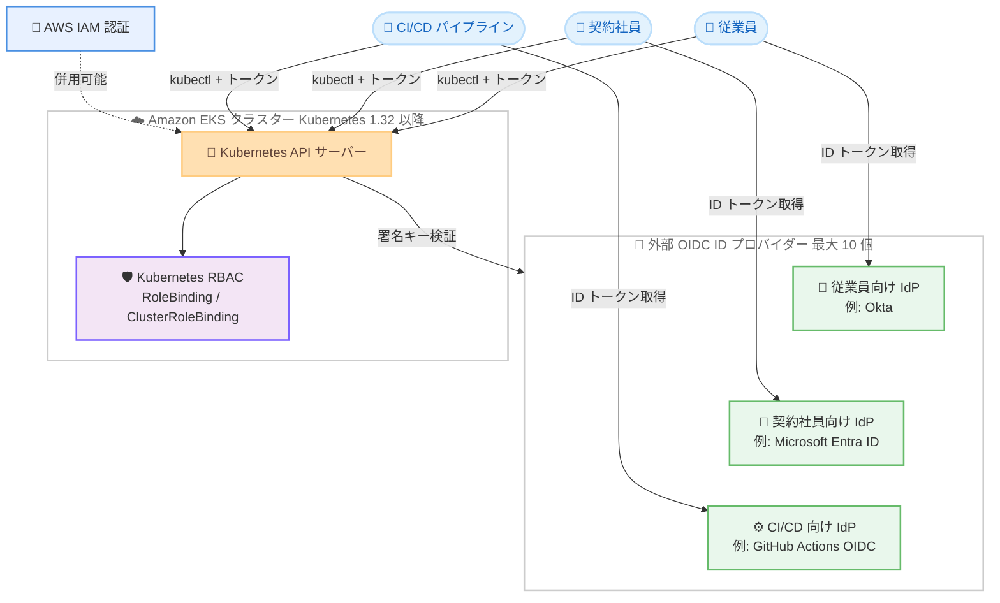

# Amazon EKS - クラスターあたり複数の外部 OIDC ID プロバイダーのサポート

**リリース日**: 2026 年 8 月 24 日
**サービス**: Amazon Elastic Kubernetes Service (Amazon EKS)
**機能**: クラスターあたり複数の外部 OpenID Connect (OIDC) ID プロバイダーの関連付け

📊 [このアップデートのインフォグラフィックを見る](https://takech9203.github.io/aws-news-summary/20260824-amazon-eks-multiple-oidc-providers.html)

## 概要

Amazon EKS が、1 つのクラスターに対して複数の外部 OpenID Connect (OIDC) ID プロバイダーの関連付けをサポートするようになりました。Kubernetes バージョン 1.32 以降を実行するクラスターでは、クラスターあたり最大 10 個の OIDC ID プロバイダーを関連付けることができます。

多くの組織では、従業員、契約社員、CI/CD システムといった異なるユーザー層に対して、それぞれ別の ID プロバイダーを使用しています。今回のアップデートにより、これらのユーザー層を単一のプロバイダーに統合したり、複数のプロバイダーを仲介する ID ブローカーを別途運用したりすることなく、各プロバイダーを直接 EKS クラスターに関連付けて認証に利用できるようになりました。各プロバイダーは独立して設定・管理され、各ユーザー層は自身のプロバイダーと ID マッピングを通じて認証されます。既存の IAM 認証は、設定されたすべての OIDC プロバイダーと並行して引き続き機能します。

**アップデート前の課題**

- 以前は 1 クラスターに関連付けられる外部 OIDC ID プロバイダーが 1 つに制限されていた
- 従業員、契約社員、CI/CD システムなど、異なる ID プロバイダーを利用するユーザー層が混在する場合、全ユーザーを単一のプロバイダーに統合する必要があった
- あるいは、複数のプロバイダーを束ねる ID ブローカー (Dex や Keycloak など) を別途構築・運用する必要があり、運用負荷と障害点が増加していた

**アップデート後の改善**

- Kubernetes 1.32 以降のクラスターで、最大 10 個の外部 OIDC ID プロバイダーを 1 つのクラスターに関連付けられるようになった
- ユーザー統合や ID ブローカーの運用が不要になり、各ユーザー層が既存の ID プロバイダーをそのまま利用できるようになった
- 各プロバイダーを独立して設定・管理できるため、プロバイダーごとにユーザー名プレフィックスやグループプレフィックス、必須クレームを個別に制御できる

## アーキテクチャ図



異なるユーザー層がそれぞれの OIDC ID プロバイダーから取得した ID トークンで同一の EKS クラスターに認証し、Kubernetes RBAC で権限が制御される構成を示しています。既存の IAM 認証はすべてのプロバイダーと並行して利用できます。

## サービスアップデートの詳細

### 主要機能

1. **複数 OIDC ID プロバイダーの関連付け**
   - Kubernetes 1.32 以降のクラスターで、最大 10 個の OIDC ID プロバイダーを関連付け可能
   - すべての OIDC プロバイダー設定の合計サイズは 12 KB 未満である必要がある
   - 1.32 より前のバージョンのクラスターでは、従来どおり 1 個のみ関連付け可能

2. **プロバイダーごとの独立した設定・管理**
   - 発行者 URL (`issuerUrl`) と名前 (`name`) は、クラスターに関連付けるすべてのプロバイダー間で一意である必要がある (同じプロバイダーを複数回関連付けることは不可)
   - プロバイダーごとにユーザー名クレーム、グループクレーム、プレフィックス、必須クレームを個別に設定可能
   - 従来と同じ `AssociateIdentityProviderConfig` API (AWS Management Console、AWS CLI、AWS SDK、eksctl) で追加

3. **IAM 認証との共存**
   - 既存の AWS IAM 認証は、設定されたすべての OIDC プロバイダーと並行して引き続き機能
   - IAM 認証はノードのクラスター参加に必要なため無効化不可
   - クラスターの作成自体は引き続き IAM プリンシパルで行う必要がある

## 技術仕様

### 複数 OIDC プロバイダーの要件と制限

| 項目 | 詳細 |
|------|------|
| 最大プロバイダー数 | 10 個 (Kubernetes 1.32 以降)、1 個 (1.32 より前) |
| 設定サイズ上限 | すべての OIDC プロバイダー設定の合計で 12 KB 未満 |
| 一意性の要件 | `issuerUrl` と `name` はクラスター内のプロバイダー間で一意 |
| 発行者 URL | `https://` で始まり、インターネット経由でパブリックにアクセス可能であること (自己署名証明書は非サポート) |
| 関連付け操作 | クラスター更新として扱われ、`UPDATING` 状態に遷移。反映に数分かかる場合があり、`DescribeUpdate` で進捗を追跡可能 |
| コントロールプレーンエグレス | `controlPlaneEgressMode=CUSTOMER_ROUTED` の場合、発行者エンドポイントが設定したエグレス経路から到達可能であること |
| プレフィックス制限 | `usernamePrefix` および `groupsPrefix` に `system:` (またはその一部) は指定不可 |

### IAM ポリシーによる関連付けの制御

`eks:AssociateIdentityProviderConfig` アクションに対する IAM ポリシーで、関連付け可能なプロバイダーを制御できます。以下は `issuerUrl` が Amazon Cognito、`clientId` が `kubernetes` の場合のみ関連付けを許可する例です。

```json
{
    "Version": "2012-10-17",
    "Statement": [
        {
            "Sid": "AllowCognitoOnly",
            "Effect": "Deny",
            "Action": "eks:AssociateIdentityProviderConfig",
            "Resource": "arn:aws:eks:us-west-2:111122223333:cluster/my-instance",
            "Condition": {
                "StringNotLikeIfExists": {
                    "eks:issuerUrl": "https://cognito-idp.us-west-2.amazonaws.com/*"
                }
            }
        },
        {
            "Sid": "DenyOtherClients",
            "Effect": "Deny",
            "Action": "eks:AssociateIdentityProviderConfig",
            "Resource": "arn:aws:eks:us-west-2:111122223333:cluster/my-instance",
            "Condition": {
                "StringNotEquals": {
                    "eks:clientId": "kubernetes"
                }
            }
        },
        {
            "Sid": "AllowOthers",
            "Effect": "Allow",
            "Action": "eks:*",
            "Resource": "*"
        }
    ]
}
```

## 設定方法

### 前提条件

1. Kubernetes バージョン 1.32 以降を実行する Amazon EKS クラスター (複数プロバイダーを利用する場合)
2. OIDC ID プロバイダーの発行者 URL (パブリックにアクセス可能な `https://` URL) とクライアント ID (audience)
3. `eks:AssociateIdentityProviderConfig` を実行できる IAM 権限

### 手順

#### ステップ 1: eksctl 用の設定ファイルを作成

```yaml
# associate-identity-provider.yaml
---
apiVersion: eksctl.io/v1alpha5
kind: ClusterConfig

metadata:
  name: my-cluster
  region: ap-northeast-1

identityProviders:
  - name: employee-idp
    type: oidc
    issuerUrl: https://idp-a.example.com
    clientId: kubernetes
    usernameClaim: email
    usernamePrefix: "empl:"
    groupsClaim: groups
    groupsPrefix: "empl:"
  - name: cicd-idp
    type: oidc
    issuerUrl: https://idp-b.example.com
    clientId: kubernetes
    usernameClaim: sub
    usernamePrefix: "cicd:"
    groupsClaim: groups
    groupsPrefix: "cicd:"
```

複数の OIDC ID プロバイダーを `identityProviders` セクションに列挙した設定ファイルです。`name`、`type`、`issuerUrl`、`clientId` が必須項目です。プロバイダーごとに異なるプレフィックスを設定することで、ユーザー名やグループ名の衝突を防止します。

#### ステップ 2: ID プロバイダーを関連付け

```bash
eksctl associate identityprovider -f associate-identity-provider.yaml
```

設定ファイルに記載した OIDC ID プロバイダーをクラスターに関連付けます。この操作はクラスター更新として扱われ、クラスターは `UPDATING` 状態になります。反映まで数分かかる場合があります。

AWS Management Console から設定する場合は、クラスターの [Access] タブにある [OIDC Identity Providers] セクションで [Associate Identity Provider] を選択し、名前、発行者 URL、クライアント ID、ユーザー名クレーム、グループクレームなどを入力します。

#### ステップ 3: RBAC で権限を割り当て

```bash
kubectl apply -f - <<EOF
apiVersion: rbac.authorization.k8s.io/v1
kind: ClusterRoleBinding
metadata:
  name: employee-viewers
subjects:
  - kind: Group
    name: "empl:engineering"
    apiGroup: rbac.authorization.k8s.io
roleRef:
  kind: ClusterRole
  name: view
  apiGroup: rbac.authorization.k8s.io
EOF
```

OIDC プロバイダーから提供されるグループクレーム (プレフィックス付き) に対して、Kubernetes RBAC の ClusterRoleBinding で権限を割り当てます。この例では従業員向け IdP の `engineering` グループに読み取り専用の `view` ロールを付与しています。

## メリット

### ビジネス面

- **ID 統合プロジェクトの回避**: 従業員、契約社員、パートナーなどの異なるユーザー層を単一の ID プロバイダーに統合する大規模なプロジェクトが不要になり、既存の ID 基盤をそのまま活用できる
- **運用コストの削減**: Dex や Keycloak などの ID ブローカーを別途構築・運用する必要がなくなり、インフラコストと運用負荷を削減できる
- **追加費用なし**: 本機能は追加料金なしで利用可能

### 技術面

- **プロバイダーごとの独立管理**: 各プロバイダーの設定 (クレームマッピング、プレフィックス、必須クレーム) を独立して変更でき、変更の影響範囲を限定できる
- **障害点の削減**: ID ブローカーという単一障害点を排除し、認証経路をシンプルに保てる
- **IAM 認証との共存**: 既存の IAM ベースのアクセス (aws-auth、EKS アクセスエントリ) を維持したまま、OIDC 認証を段階的に導入できる

## デメリット・制約事項

### 制限事項

- 複数プロバイダー (最大 10 個) の関連付けは Kubernetes 1.32 以降のクラスターに限定され、それより前のバージョンでは 1 個のみ
- すべての OIDC プロバイダー設定の合計サイズは 12 KB 未満に制限される
- 発行者 URL はパブリックにアクセス可能である必要があり、自己署名証明書のプロバイダーはサポートされない
- OIDC プロバイダーのユーザーで AWS Management Console にサインインすることはできない (コンソールでの Kubernetes リソース表示には IAM アカウントが必要)
- クラスターの作成やノードの参加には引き続き IAM が必要で、IAM 認証は無効化できない

### 考慮すべき点

- プロバイダー間でユーザー名やグループ名が衝突しないよう、プロバイダーごとに `usernamePrefix` と `groupsPrefix` を設定することが推奨される
- `requiredClaims` で ID トークンに必須のキーと値のペアを検証し、許可したトークンのみを受け入れるよう構成することが推奨される
- ID プロバイダー側では、クラスターが必要とするクレームのみをトークンに含めるよう構成し、トークン漏えい時の情報露出を最小化する
- 関連付けはクラスター更新となり反映に数分かかるため、変更作業のタイミングに注意する
- `controlPlaneEgressMode=CUSTOMER_ROUTED` を使用している場合、コントロールプレーンから発行者エンドポイントへの到達性を確保する必要がある

## ユースケース

### ユースケース 1: 従業員と契約社員で異なる IdP を利用する組織

**シナリオ**: 従業員は社内の Okta、契約社員は取引先の Microsoft Entra ID で管理されており、両者が同じ EKS クラスター上のアプリケーションを運用する。

**実装例**:
```yaml
identityProviders:
  - name: okta-employees
    type: oidc
    issuerUrl: https://mycompany.okta.com
    clientId: kubernetes
    usernameClaim: email
    usernamePrefix: "okta:"
    groupsClaim: groups
    groupsPrefix: "okta:"
  - name: entra-contractors
    type: oidc
    issuerUrl: https://login.microsoftonline.com/TENANT_ID/v2.0
    clientId: CLIENT_ID
    usernameClaim: email
    usernamePrefix: "entra:"
    groupsClaim: groups
    groupsPrefix: "entra:"
```

**効果**: ID ブローカーを介さずに両方のユーザー層が直接クラスターに認証でき、RBAC でプレフィックス付きグループごとに権限を分離できる。

### ユースケース 2: 人間のユーザーと CI/CD システムの認証分離

**シナリオ**: 開発者は社内 IdP で認証し、GitHub Actions などの CI/CD パイプラインは専用の OIDC 発行者からの短命トークンでクラスターにデプロイする。

**実装例**:
```yaml
identityProviders:
  - name: corp-idp
    type: oidc
    issuerUrl: https://idp.example.com
    clientId: kubernetes
    usernameClaim: email
    usernamePrefix: "corp:"
    groupsClaim: groups
    groupsPrefix: "corp:"
  - name: github-actions
    type: oidc
    issuerUrl: https://token.actions.githubusercontent.com
    clientId: my-eks-cluster
    usernameClaim: sub
    usernamePrefix: "gha:"
    requiredClaims:
      repository_owner: my-org
```

**効果**: 長期クレデンシャルを CI/CD に配布せず、`requiredClaims` で特定の組織のリポジトリからのトークンのみを受け入れる安全なデプロイ経路を構築できる。

### ユースケース 3: IdP 移行時の並行稼働

**シナリオ**: 組織が旧 IdP から新 IdP へ移行する期間中、両方のプロバイダーでの認証を維持しながら段階的にユーザーを移行する。

**実装例**:
```yaml
identityProviders:
  - name: legacy-idp
    type: oidc
    issuerUrl: https://legacy-idp.example.com
    clientId: kubernetes
    usernameClaim: email
    usernamePrefix: "legacy:"
    groupsClaim: groups
    groupsPrefix: "legacy:"
  - name: new-idp
    type: oidc
    issuerUrl: https://new-idp.example.com
    clientId: kubernetes
    usernameClaim: email
    usernamePrefix: "new:"
    groupsClaim: groups
    groupsPrefix: "new:"
```

**効果**: 移行期間中もダウンタイムなしで両プロバイダーを並行稼働させ、移行完了後に旧プロバイダーの関連付けを解除するだけで切り替えが完了する。

## 料金

本機能は追加費用なしで利用できます。Amazon EKS クラスター自体の料金 (クラスターあたりの時間料金およびワーカーノードなどのコンピューティングリソース料金) は通常どおり発生します。

## 利用可能リージョン

Amazon EKS が利用可能なすべての AWS リージョンで利用できます (東京・大阪リージョンを含む)。

## 関連サービス・機能

- **AWS IAM / EKS アクセスエントリ**: OIDC 認証と並行して利用できる認証手段。クラスター作成やノード参加には IAM が必須
- **Amazon Cognito**: OIDC 準拠の ID プロバイダーとして EKS クラスターに関連付け可能
- **Kubernetes RBAC**: OIDC で認証されたユーザーやグループへの権限付与に使用 (RoleBinding / ClusterRoleBinding)
- **Amazon CloudWatch Logs**: コントロールプレーンの監査ログを有効化すると、OIDC 認証ユーザーの操作が監査ログに記録される

## 参考リンク

- 📊 [インフォグラフィック](https://takech9203.github.io/aws-news-summary/20260824-amazon-eks-multiple-oidc-providers.html)
- [公式発表 (What's New)](https://aws.amazon.com/about-aws/whats-new/2026/08/amazon-eks-multiple-oidc-providers/)
- [ドキュメント: Grant users access to Kubernetes with an external OIDC provider](https://docs.aws.amazon.com/eks/latest/userguide/authenticate-oidc-identity-provider.html)
- [API リファレンス: AssociateIdentityProviderConfig](https://docs.aws.amazon.com/eks/latest/APIReference/API_AssociateIdentityProviderConfig.html)
- [料金ページ: Amazon EKS の料金](https://aws.amazon.com/eks/pricing/)

## まとめ

Amazon EKS が Kubernetes 1.32 以降のクラスターで最大 10 個の外部 OIDC ID プロバイダーの関連付けをサポートし、従業員・契約社員・CI/CD システムなど異なるユーザー層の認証を ID ブローカーなしで直接統合できるようになりました。複数の ID 基盤を持つ組織や IdP 移行を計画している組織は、プレフィックスと必須クレームのベストプラクティスに従いながら、本機能によるクラスター認証のシンプル化を検討することを推奨します。
