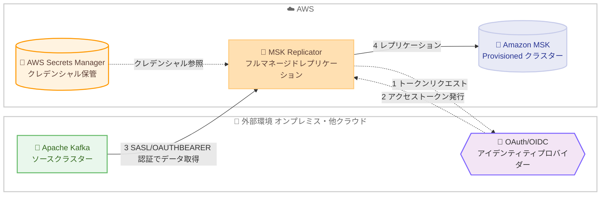

# Amazon MSK - MSK Replicator が外部 Apache Kafka クラスターからのレプリケーションで OAuth 2.0 (SASL/OAUTHBEARER) 認証をサポート

**リリース日**: 2026 年 8 月 24 日
**サービス**: Amazon Managed Streaming for Apache Kafka (Amazon MSK)
**機能**: MSK Replicator の外部 Apache Kafka クラスター接続における OAuth 2.0 (SASL/OAUTHBEARER) 認証サポート

📊 [このアップデートのインフォグラフィックを見る](https://takech9203.github.io/aws-news-summary/20260824-amazon-msk-replicator-OAuth-support.html)

## 概要

Amazon MSK Replicator が、外部 Apache Kafka クラスターから Amazon MSK Provisioned クラスターへのデータレプリケーションにおいて、OAuth 2.0 (SASL/OAUTHBEARER) 認証をサポートしました。対象となる外部クラスターには、オンプレミス環境、AWS 上のセルフマネージド環境、他のクラウドプロバイダー上の Apache Kafka クラスターが含まれます。

この機能により、OAuth/OIDC 認証で構成された外部 Apache Kafka クラスターでも、MSK Replicator を使用して Amazon MSK へのワークロード移行、MSK ベースのクラスターをフェイルオーバーまたはバックアップターゲットとするディザスタリカバリ、ハイブリッドおよびマルチクラウド環境間でのデータ分散を実現できるようになります。

MSK Replicator は Kafka クラスター間のデータレプリケーションを自動化する Amazon MSK の機能であり、カスタムレプリケーションインフラストラクチャの管理や MirrorMaker 2 などのオープンソースツールの設定が不要になります。セルフマネージドのレプリケーションツールとは異なり、レプリケーション時に元の Kafka トピック名を保持しながら無限レプリケーションループを自動的に回避し、コンシューマーグループオフセットを双方向に同期するため、プロデューサーとコンシューマーを任意の順序で独立してクラスター間で移動できます。

**アップデート前の課題**

- 以前は、MSK Replicator が外部 Apache Kafka クラスターへの接続でサポートする認証方式は SASL/SCRAM と mTLS のみであった
- OAuth/OIDC 認証で構成された外部 Kafka クラスターは、MSK Replicator によるレプリケーションの対象にできなかった
- OAuth 認証を採用する組織は、MSK への移行やレプリケーションのために認証方式を変更するか、MirrorMaker 2 などのセルフマネージドツールを運用する必要があった

**アップデート後の改善**

- 今回のアップデートにより、OAuth 2.0 (SASL/OAUTHBEARER) 認証を使用して外部 Kafka クラスターから Amazon MSK Provisioned クラスターへデータをレプリケートできるようになった
- 外部クラスターの認証設定を変更することなく、Amazon MSK への移行やディザスタリカバリ構成を実現できるようになった
- クライアントクレデンシャル、IAM JWT ベアラー、クライアントクレデンシャルアサーションといった複数の OAuth 認証パターンを API で設定できるようになった

## アーキテクチャ図



MSK Replicator が OAuth/OIDC アイデンティティプロバイダーのトークンエンドポイントからアクセストークンを取得し、SASL/OAUTHBEARER 認証で外部 Apache Kafka クラスターに接続してデータを Amazon MSK Provisioned クラスターへレプリケートする流れを示しています。

## サービスアップデートの詳細

### 主要機能

1. **OAuth 2.0 (SASL/OAUTHBEARER) 認証による外部クラスター接続**
   - 外部 Apache Kafka クラスターへの接続時に、SASL/SCRAM と mTLS に加えて OAuth 2.0 認証を選択可能
   - OAuth/OIDC 認証で構成されたオンプレミス、AWS 上のセルフマネージド、他クラウド上の Kafka クラスターが対象
   - レプリケーション先は Amazon MSK Provisioned クラスター

2. **複数の OAuth クレデンシャル取得方式**
   - `ClientCredentials`: クライアント ID とシークレットによるクライアントクレデンシャルフロー。クレデンシャルは AWS Secrets Manager のシークレット ARN で指定
   - `IamJwtBearer`: IAM を利用した JWT ベアラー方式。オーディエンスと署名アルゴリズム (RS256 または ES384) を指定
   - `ClientCredentialsAssertion`: クライアントアサーション (署名付き JWT) を使用したクライアントクレデンシャルフロー。署名アルゴリズムは RS256 または ES384 をサポート

3. **トークンエンドポイントの柔軟な設定**
   - `TokenEndpointUrl` でアイデンティティプロバイダーのトークンエンドポイントを指定
   - `TokenEndpointAuthenticationMethod` で POST、BASIC、NONE の認証方法を選択
   - `Scope` による OAuth スコープの指定、`TokenEndpointTlsCertificateArn` によるトークンエンドポイントの TLS 証明書指定に対応

4. **MSK Replicator の既存の利点をそのまま活用**
   - 元の Kafka トピック名を保持したままレプリケーションでき、無限レプリケーションループを自動回避
   - コンシューマーグループオフセットの双方向同期により、プロデューサーとコンシューマーを任意の順序で独立して移行可能
   - レプリケーション基盤の自動スケーリングにより、容量の監視やスケーリング作業が不要

## 技術仕様

### 認証方式の比較

| 項目 | 詳細 |
|------|------|
| 対応認証方式 (外部クラスター接続) | SASL/SCRAM、mTLS、OAuth 2.0 (SASL/OAUTHBEARER) ※今回追加 |
| OAuth クレデンシャル方式 | ClientCredentials、IamJwtBearer、ClientCredentialsAssertion |
| 署名アルゴリズム | RS256、ES384 |
| トークンエンドポイント認証方法 | POST、BASIC、NONE |
| クレデンシャル保管 | AWS Secrets Manager (シークレット ARN で指定) |
| レプリケーション先 | Amazon MSK Provisioned クラスター |
| 転送中の暗号化 | TLS |

### API変更履歴

| 日付 | サービス | 変更内容 |
|------|----------|----------|
| 2026/08/24 | [kafka](https://awsapichanges.com/archive/changes/14aac2-kafka.html) | 2 updated api methods - `CreateReplicator` および `DescribeReplicator` に `SaslOAuthBearer` 認証設定が追加 |

### CreateReplicator API の OAuth 設定例

```json
{
  "ClientAuthentication": {
    "SaslOAuthBearer": {
      "TokenEndpointUrl": "https://idp.example.com/oauth2/token",
      "ClientCredentials": {
        "TokenRequestSecretArn": "arn:aws:secretsmanager:ap-northeast-1:123456789012:secret:oauth-client-credentials"
      },
      "TokenEndpointAuthenticationMethod": "POST",
      "Scope": "kafka:read",
      "TokenEndpointTlsCertificateArn": "arn:aws:secretsmanager:ap-northeast-1:123456789012:secret:token-endpoint-ca-cert"
    }
  }
}
```

外部 Apache Kafka クラスターのクライアント認証設定として、OAuth 2.0 のトークンエンドポイント URL、クライアントクレデンシャルを格納した Secrets Manager シークレットの ARN、スコープなどを指定します。

## 設定方法

### 前提条件

1. レプリケーション先となる Amazon MSK Provisioned クラスターが作成済みであること
2. 外部 Apache Kafka クラスターが OAuth/OIDC 認証 (SASL/OAUTHBEARER) で構成されており、MSK Replicator からネットワーク到達可能であること
3. OAuth クライアントクレデンシャルを AWS Secrets Manager にシークレットとして保存済みであること
4. MSK Replicator 用のサービス実行ロール (IAM ロール) が準備済みであること

### 手順

#### ステップ1: OAuth クレデンシャルを Secrets Manager に保存

```bash
aws secretsmanager create-secret \
  --name oauth-client-credentials \
  --secret-string '{"clientId":"my-client-id","clientSecret":"my-client-secret"}'
```

外部 Kafka クラスターの認証に使用する OAuth クライアント ID とクライアントシークレットを AWS Secrets Manager に保存します。MSK Replicator はこのシークレットを参照してトークンエンドポイントからアクセストークンを取得します。

#### ステップ2: OAuth 認証を指定して Replicator を作成

```bash
aws kafka create-replicator \
  --replicator-name "external-kafka-to-msk" \
  --service-execution-role-arn "arn:aws:iam::123456789012:role/msk-replicator-role" \
  --kafka-clusters '[
    {
      "ApacheKafkaCluster": {
        "ApacheKafkaClusterId": "source-external-kafka",
        "BootstrapBrokerString": "broker1.example.com:9093,broker2.example.com:9093"
      },
      "VpcConfig": {
        "SecurityGroupIds": ["sg-0123456789abcdef0"],
        "SubnetIds": ["subnet-aaaa1111", "subnet-bbbb2222"]
      },
      "ClientAuthentication": {
        "SaslOAuthBearer": {
          "TokenEndpointUrl": "https://idp.example.com/oauth2/token",
          "ClientCredentials": {
            "TokenRequestSecretArn": "arn:aws:secretsmanager:ap-northeast-1:123456789012:secret:oauth-client-credentials"
          },
          "TokenEndpointAuthenticationMethod": "POST"
        }
      },
      "EncryptionInTransit": {"EncryptionType": "TLS"}
    },
    {
      "AmazonMskCluster": {
        "MskClusterArn": "arn:aws:kafka:ap-northeast-1:123456789012:cluster/target-msk/xxxx"
      },
      "VpcConfig": {
        "SecurityGroupIds": ["sg-0fedcba9876543210"],
        "SubnetIds": ["subnet-cccc3333", "subnet-dddd4444"]
      }
    }
  ]' \
  --replication-info-list '[
    {
      "SourceKafkaClusterId": "source-external-kafka",
      "TargetKafkaClusterArn": "arn:aws:kafka:ap-northeast-1:123456789012:cluster/target-msk/xxxx",
      "TargetCompressionType": "NONE",
      "TopicReplication": {
        "TopicsToReplicate": [".*"],
        "TopicNameConfiguration": {"Type": "IDENTICAL"}
      },
      "ConsumerGroupReplication": {
        "ConsumerGroupsToReplicate": [".*"],
        "SynchroniseConsumerGroupOffsets": true
      }
    }
  ]'
```

`create-replicator` API で、ソースとなる外部 Apache Kafka クラスターの `ClientAuthentication` に `SaslOAuthBearer` を指定して Replicator を作成します。トピック名設定を `IDENTICAL` にすることで、元のトピック名を保持したままレプリケーションできます。

#### ステップ3: Replicator の状態を確認

```bash
aws kafka describe-replicator \
  --replicator-arn "arn:aws:kafka:ap-northeast-1:123456789012:replicator/external-kafka-to-msk/xxxx"
```

作成した Replicator の状態 (`ReplicatorState`) が `RUNNING` になっていることを確認します。`DescribeReplicator` のレスポンスでも、設定した `SaslOAuthBearer` の内容を確認できます。

## メリット

### ビジネス面

- **移行の障壁を低減**: OAuth/OIDC 認証を採用している組織が、認証基盤を変更することなく Amazon MSK への移行を計画できる
- **事業継続性の向上**: 外部 Kafka クラスターのフェイルオーバーまたはバックアップターゲットとして MSK クラスターを活用したディザスタリカバリ構成を実現できる
- **運用コストの削減**: MirrorMaker 2 などのセルフマネージドレプリケーションツールの構築・運用が不要になり、運用負荷を削減できる

### 技術面

- **モダンな認証方式への対応**: SASL/SCRAM や mTLS に加えて、トークンベースの OAuth 2.0 認証を選択できるため、既存のアイデンティティプロバイダーと統合しやすい
- **柔軟なクレデンシャル管理**: クライアントクレデンシャル、IAM JWT ベアラー、クライアントアサーションの 3 方式から選択でき、クレデンシャルは Secrets Manager で安全に管理できる
- **シームレスな移行体験**: トピック名の保持、無限ループの自動回避、コンシューマーグループオフセットの双方向同期により、プロデューサーとコンシューマーを独立して移行できる

## デメリット・制約事項

### 制限事項

- レプリケーション先は Amazon MSK Provisioned クラスターに限定される
- OAuth 認証がサポートされるのは外部 Apache Kafka クラスターをソースとする構成であり、公式発表に記載された範囲は外部クラスターから Amazon MSK への方向である
- MSK Replicator が利用可能なリージョンでのみ使用できる

### 考慮すべき点

- MSK Replicator から外部 Kafka クラスターおよび OAuth トークンエンドポイントへのネットワーク到達性 (VPC、セキュリティグループ、オンプレミス接続など) を事前に設計する必要がある
- OAuth クレデンシャルの保管に AWS Secrets Manager を使用するため、Secrets Manager の利用料金とシークレットのローテーション運用を考慮する必要がある
- クロスリージョンレプリケーションの場合は、標準のリージョン間データ転送料金が別途発生する

## ユースケース

### ユースケース1: OAuth 認証構成のオンプレミス Kafka から Amazon MSK への移行

**シナリオ**: オンプレミスで Keycloak などの OIDC プロバイダーと連携した Apache Kafka クラスターを運用しており、認証構成を変えずに Amazon MSK へ段階的に移行したい。

**実装例**:
```
1. OAuth クライアントクレデンシャルを Secrets Manager に保存
2. SaslOAuthBearer 認証で外部クラスターをソースとする Replicator を作成
3. TopicNameConfiguration を IDENTICAL に設定してトピック名を保持
4. コンシューマー、プロデューサーの順に MSK 側へ切り替え
```

**効果**: 認証基盤や既存アプリケーションのトピック名を変更せずに、データ損失リスクなく段階的に MSK へ移行できる。

### ユースケース2: 他クラウド上の Kafka をソースとするディザスタリカバリ

**シナリオ**: 他のクラウドプロバイダー上で OAuth 認証構成の Kafka クラスターを運用しており、AWS 上の MSK クラスターをバックアップまたはフェイルオーバーターゲットとして利用したい。

**実装例**:
```
1. 他クラウドの Kafka クラスターをソース、MSK Provisioned をターゲットに Replicator を作成
2. SynchroniseConsumerGroupOffsets を有効化してオフセットを同期
3. 障害発生時にコンシューマーを MSK 側へフェイルオーバー
```

**効果**: クラウド障害時にも MSK 側で処理を再開でき、マルチクラウド環境における事業継続性を確保できる。

### ユースケース3: ハイブリッド環境でのデータ分散

**シナリオ**: オンプレミスの基幹システムで生成されるストリーミングデータを、AWS 上の分析基盤 (Amazon Managed Service for Apache Flink や Amazon OpenSearch Service など) でリアルタイムに活用したい。

**実装例**:
```
1. オンプレミス Kafka から MSK への Replicator を OAuth 認証で構成
2. MSK 上のレプリケートされたトピックを分析サービスから購読
3. DetectAndCopyNewTopics を有効化して新規トピックを自動レプリケーション
```

**効果**: オンプレミスのデータを認証構成の変更なしに AWS の分析エコシステムへ継続的に供給できる。

## 料金

MSK Replicator の料金は、作成した Replicator ごとの時間単位の料金と、MSK Replicator で処理したデータ量 (メタデータを含む) に対する GB 単位の料金で構成されます。トピック名設定を「Identical」にした場合、レプリケーションループ防止のためにフィルタリングされたデータも処理データ量に含まれます。クロスリージョンレプリケーションでは、リージョン間データ転送の標準料金が別途発生します (同一リージョン内レプリケーションではデータ転送料金は不要)。

OAuth 2.0 認証の利用による追加料金の記載はありません。

### 料金例 (米国西部オレゴンから米国東部バージニア北部への継続レプリケーションの公式例)

| 項目 | 料金 (概算) |
|--------|------------------|
| Replicator 時間料金 (720 時間) | $0.30/時間 × 720 = $216 |
| データ処理料金 (126,562.5 GB) | $0.08/GB × 126,562.5 = $10,125 |
| リージョン間データ転送 (126,562.5 GB) | $0.02/GB × 126,562.5 = $2,531 |

最新の料金は [Amazon MSK 料金ページ](https://aws.amazon.com/msk/pricing/) を参照してください。

## 利用可能リージョン

MSK Replicator が利用可能なすべての AWS リージョンでサポートされます。MSK Replicator は、米国東部 (バージニア北部、オハイオ)、米国西部 (オレゴン、北カリフォルニア)、アジアパシフィック (東京、ソウル、シンガポール、シドニー、ムンバイ)、欧州 (アイルランド、フランクフルト、ロンドン、パリ、ストックホルム)、カナダ (中部)、南米 (サンパウロ) を含む多数のリージョンで利用できます。最新のリージョン一覧は [MSK Replicator ドキュメント](https://docs.aws.amazon.com/msk/latest/developerguide/msk-replicator.html) を参照してください。

## 関連サービス・機能

- **Amazon MSK Provisioned**: 今回のアップデートにおけるレプリケーション先。Express ブローカーと Standard ブローカーの 2 種類を提供
- **AWS Secrets Manager**: OAuth クライアントクレデンシャルやトークンエンドポイントの TLS 証明書を安全に保管するために使用
- **Amazon CloudWatch**: `ReplicatorBytesInPerSec` や `ReplicatorThroughput` などのメトリクスでレプリケーションの処理量を監視
- **AWS IAM**: MSK Replicator のサービス実行ロールおよび IamJwtBearer 方式での認証に使用

## 参考リンク

- 📊 [インフォグラフィック](https://takech9203.github.io/aws-news-summary/20260824-amazon-msk-replicator-OAuth-support.html)
- [公式発表 (What's New)](https://aws.amazon.com/about-aws/whats-new/2026/08/amazon-msk-replicator-OAuth-support/)
- [AWS Blog: Migrate third-party and self-managed Apache Kafka clusters to Amazon MSK Express brokers with Amazon MSK Replicator](https://aws.amazon.com/blogs/big-data/migrate-third-party-and-self-managed-apache-kafka-clusters-to-amazon-msk-express-brokers-with-amazon-msk-replicator/)
- [MSK Replicator ドキュメント](https://docs.aws.amazon.com/msk/latest/developerguide/msk-replicator.html)
- [MSK Replicator 製品ページ](https://aws.amazon.com/msk/features/msk-replicator/)
- [Amazon MSK 料金ページ](https://aws.amazon.com/msk/pricing/)
- [API 変更履歴 (awsapichanges.com)](https://awsapichanges.com/archive/changes/14aac2-kafka.html)

## まとめ

MSK Replicator の OAuth 2.0 (SASL/OAUTHBEARER) 認証サポートにより、OAuth/OIDC 認証で構成された外部 Apache Kafka クラスターからでも、認証基盤を変更することなく Amazon MSK へのフルマネージドなレプリケーションが可能になりました。オンプレミスや他クラウドの Kafka クラスターの移行、ディザスタリカバリ、ハイブリッド環境でのデータ分散を検討している場合は、`CreateReplicator` API の `SaslOAuthBearer` 設定を確認し、自社のアイデンティティプロバイダーとの統合を検証することを推奨します。
