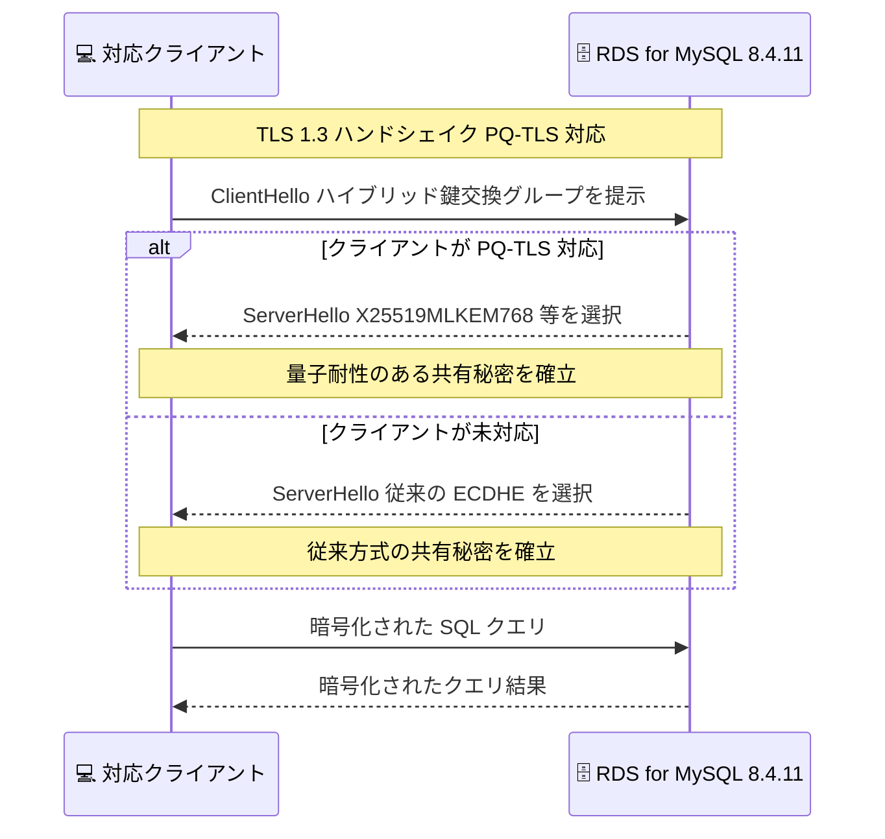

# Amazon RDS for MySQL - マイナーバージョン 8.4.11 サポート

**リリース日**: 2026 年 8 月 24 日
**サービス**: Amazon RDS for MySQL
**機能**: MySQL マイナーバージョン 8.4.11 のサポート (ポスト量子 TLS 鍵交換対応)

📊 [このアップデートのインフォグラフィックを見る](https://takech9203.github.io/aws-news-summary/20260824-amazon-rds-mysql-8411-available.html)

## 概要

Amazon RDS for MySQL が、コミュニティ版 MySQL の最新マイナーバージョンである 8.4.11 をサポートしました。このバージョンには、MySQL コミュニティによるバグ修正、パフォーマンス改善、新機能に加え、以前のバージョンで発見された CVE (共通脆弱性識別子) への修正が含まれています。

本アップデートの最大の注目点は、ポスト量子 TLS (PQ-TLS) 鍵交換のサポートが導入されたことです。RDS ドキュメントによると、TLS 1.3 接続においてポスト量子ハイブリッド鍵交換 (`X25519MLKEM768` および `SecP256r1MLKEM768`) がサポートされ、対応クライアントは量子コンピュータ攻撃に耐性のある共有秘密を自動的にネゴシエートします。これにより、転送中データの暗号化に「Harvest Now, Decrypt Later (今収集し、後で復号する)」攻撃への対策となるポスト量子暗号のオプションが提供されます。

AWS は、CVE 修正やその他の改善を取り込むため、新しいマイナーバージョンへのアップグレードを推奨しています。アップグレードには、メンテナンスウィンドウ中の自動マイナーバージョンアップグレード、またはより安全でシンプルな Amazon RDS マネージド Blue/Green デプロイが利用できます。

**アップデート前の課題**

- 以前の RDS for MySQL では、クライアントとデータベース間の TLS 接続に従来の楕円曲線ベースの鍵交換のみが使用されており、将来の量子コンピュータによる解読リスク (Harvest Now, Decrypt Later 攻撃) への対策が取れなかった
- 以前のマイナーバージョン (8.4.10 以前) には、後に発見された CVE や、オプティマイザ・InnoDB・レプリケーション関連の既知のバグが残存していた
- タイムゾーン情報が古いデータ (tzdata) に基づいていた

**アップデート後の改善**

- TLS 1.3 接続でポスト量子ハイブリッド鍵交換 (`X25519MLKEM768`、`SecP256r1MLKEM768`) が利用可能になり、転送中データを量子耐性のある暗号で保護できるようになった
- MySQL コミュニティによる CVE 修正、バグ修正、パフォーマンス改善が取り込まれ、セキュリティと安定性が向上した
- タイムゾーン情報が `tzdata2026c` ベースに更新された

## アーキテクチャ図



MySQL 8.4.11 へアップグレードした RDS インスタンスでは、PQ-TLS 対応クライアントとの TLS 1.3 接続時にポスト量子ハイブリッド鍵交換が自動的にネゴシエートされます。未対応クライアントは従来どおり接続できるため、段階的な移行が可能です。

## サービスアップデートの詳細

### 主要機能

1. **ポスト量子 TLS (PQ-TLS) 鍵交換のサポート**
   - TLS 1.3 接続でポスト量子ハイブリッド鍵交換 `X25519MLKEM768` および `SecP256r1MLKEM768` をサポート
   - ML-KEM は NIST が標準化したポスト量子鍵カプセル化アルゴリズム (FIPS 203) で、従来の楕円曲線 Diffie-Hellman と組み合わせたハイブリッド方式により、既存の安全性を維持しつつ量子耐性を追加
   - ポスト量子鍵交換に対応したクライアントは、量子耐性のある共有秘密を自動的にネゴシエート
   - 現在のセッションでネゴシエートされたグループは、ステータス変数 `Ssl_named_group` で確認可能

2. **CVE 修正とコミュニティ改善**
   - 以前のバージョンの MySQL で発見された CVE に対する修正を含む
   - MySQL コミュニティによるバグ修正、パフォーマンス改善、新機能を反映
   - タイムゾーン情報を `tzdata2026c` ベースに更新

3. **柔軟なアップグレードパス**
   - 自動マイナーバージョンアップグレード: 有効化すると、スケジュールされたメンテナンスウィンドウ中に自動でアップグレード
   - Amazon RDS マネージド Blue/Green デプロイ: 本番環境のコピー (Green 環境) でアップグレードを検証してから切り替える、より安全でシンプルな方式

## 技術仕様

### バージョン情報

| 項目 | 詳細 |
|------|------|
| エンジンバージョン | MySQL 8.4.11 |
| コミュニティリリース日 | 2026 年 7 月 28 日 |
| RDS リリース日 | 2026 年 8 月 21 日 |
| RDS 標準サポート終了日 | 2027 年 8 月 21 日 |
| メジャーバージョン 8.4 のコミュニティ EOL | 2029 年 4 月 30 日 |

### PQ-TLS 鍵交換の詳細

| 項目 | 詳細 |
|------|------|
| 対応プロトコル | TLS 1.3 |
| ハイブリッド鍵交換グループ | `X25519MLKEM768`、`SecP256r1MLKEM768` |
| ベースアルゴリズム | ML-KEM (NIST FIPS 203) + 楕円曲線 Diffie-Hellman |
| ネゴシエート結果の確認方法 | `SHOW STATUS LIKE 'Ssl_named_group';` |
| クライアント要件 | ポスト量子鍵交換に対応した TLS ライブラリ (AWS-LC、対応版 OpenSSL など) |

### ネゴシエートされた鍵交換グループの確認

```sql
-- 現在のセッションで使用された鍵交換グループを確認
SHOW STATUS LIKE 'Ssl_named_group';
```

PQ-TLS でネゴシエートされた場合、`X25519MLKEM768` などのグループ名が返されます。

## 設定方法

### 前提条件

1. RDS for MySQL 8.4 系の DB インスタンスが存在すること (8.0 系からはメジャーバージョンアップグレードが必要)
2. アップグレード前にスナップショットまたはバックアップを取得しておくこと
3. Blue/Green デプロイを使用する場合、バイナリログ (`binlog`) が有効であること

### 手順

#### ステップ 1: 利用可能なバージョンの確認

```bash
aws rds describe-db-engine-versions \
  --engine mysql \
  --engine-version 8.4.11 \
  --query "DBEngineVersions[].{Engine:Engine,EngineVersion:EngineVersion}" \
  --output table
```

利用するリージョンで MySQL 8.4.11 が利用可能かを確認します。

#### ステップ 2: 手動でのマイナーバージョンアップグレード

```bash
aws rds modify-db-instance \
  --db-instance-identifier my-mysql-instance \
  --engine-version 8.4.11 \
  --apply-immediately
```

既存の DB インスタンスを MySQL 8.4.11 に手動でアップグレードします。`--apply-immediately` を省略すると、次のメンテナンスウィンドウで適用されます。

#### ステップ 3: Blue/Green デプロイによる安全なアップグレード (推奨)

```bash
# Blue/Green デプロイを作成
aws rds create-blue-green-deployment \
  --blue-green-deployment-name mysql-8411-upgrade \
  --source arn:aws:rds:ap-northeast-1:123456789012:db:my-mysql-instance \
  --target-engine-version 8.4.11

# Green 環境で検証後、切り替えを実行
aws rds switchover-blue-green-deployment \
  --blue-green-deployment-identifier bgd-xxxxxxxxxxxxxxxx \
  --switchover-timeout 300
```

本番環境 (Blue) のコピーとして Green 環境を 8.4.11 で作成し、動作検証後に切り替えます。切り替えは通常 1 分未満で完了し、データ損失なしでアップグレードできます。

#### ステップ 4: 自動マイナーバージョンアップグレードの有効化 (任意)

```bash
aws rds modify-db-instance \
  --db-instance-identifier my-mysql-instance \
  --auto-minor-version-upgrade \
  --apply-immediately
```

自動マイナーバージョンアップグレードを有効化すると、今後の新しいマイナーバージョンがメンテナンスウィンドウ中に自動適用されます。

## メリット

### ビジネス面

- **将来のセキュリティリスクへの先行対応**: 量子コンピュータの実用化を見据えた「Harvest Now, Decrypt Later」攻撃への対策を、マネージドサービスのアップグレードだけで導入できる
- **コンプライアンス対応**: NIST 標準 (FIPS 203) に基づくポスト量子暗号の採用により、将来的な規制・ガイドライン (CNSA 2.0 など) への対応を前倒しできる
- **脆弱性リスクの低減**: CVE 修正を含む最新バージョンへの追随により、セキュリティ監査やリスク評価での指摘事項を減らせる

### 技術面

- **ハイブリッド方式による安全な移行**: ML-KEM と従来の楕円曲線暗号を組み合わせたハイブリッド鍵交換のため、どちらか一方のアルゴリズムが破られても安全性が維持される
- **クライアント互換性の維持**: PQ-TLS 未対応のクライアントは従来の鍵交換で接続を継続できるため、アプリケーション側の段階的な対応が可能
- **安全なアップグレード手段**: Blue/Green デプロイにより、本番影響を最小化しながら検証済みの状態で切り替えられる

## デメリット・制約事項

### 制限事項

- PQ-TLS 鍵交換は TLS 1.3 接続でのみ利用可能
- ポスト量子鍵交換の恩恵を受けるには、クライアント側の TLS ライブラリ (AWS-LC や対応版 OpenSSL など) がハイブリッド鍵交換グループに対応している必要がある
- MySQL 8.0 系からの移行はメジャーバージョンアップグレードとなり、互換性検証が別途必要 (なお、RDS 標準サポートにおける MySQL 8.0 は 2026 年 7 月 31 日に終了し、以降は RDS Extended Support の対象)

### 考慮すべき点

- マイナーバージョンアップグレードでも短時間のダウンタイムが発生するため、メンテナンスウィンドウの計画または Blue/Green デプロイの利用を検討する
- 自動マイナーバージョンアップグレードを有効にする場合、適用タイミングがメンテナンスウィンドウに依存するため、事前にステージング環境での検証プロセスを整備しておく
- RDS for MySQL のマイナーバージョンは RDS リリースから約 1 年で標準サポートが終了する (8.4.11 は 2027 年 8 月 21 日) ため、継続的なアップグレード運用が必要

## ユースケース

### ユースケース 1: 金融機関における長期機密データの転送保護

**シナリオ**: 金融機関が顧客の取引データを長期間 (10 年以上) 機密として扱う必要があり、現在傍受された通信が将来の量子コンピュータで復号されるリスクに備えたい。

**実装例**:
```bash
# Blue/Green デプロイで 8.4.11 へアップグレード後、
# PQ-TLS 対応クライアントから接続し、鍵交換グループを確認
mysql -h my-mysql-instance.xxxx.ap-northeast-1.rds.amazonaws.com \
  -u admin -p --ssl-mode=REQUIRED \
  -e "SHOW STATUS LIKE 'Ssl_named_group';"
```

**効果**: 転送中データが量子耐性のあるハイブリッド鍵交換で保護され、Harvest Now, Decrypt Later 攻撃のリスクを低減できる。

### ユースケース 2: セキュリティパッチ適用の運用自動化

**シナリオ**: 多数の RDS for MySQL インスタンスを運用しており、CVE 修正を含むマイナーバージョンを遅滞なく適用したいが、手動アップグレードの運用負荷が高い。

**実装例**:
```bash
# 全インスタンスで自動マイナーバージョンアップグレードを有効化
for db in $(aws rds describe-db-instances \
  --query "DBInstances[?Engine=='mysql'].DBInstanceIdentifier" --output text); do
  aws rds modify-db-instance \
    --db-instance-identifier "$db" \
    --auto-minor-version-upgrade
done
```

**効果**: メンテナンスウィンドウ中に CVE 修正済みバージョンが自動適用され、脆弱性対応の運用負荷とパッチ適用漏れのリスクを削減できる。

### ユースケース 3: 本番環境の無停止に近いアップグレード

**シナリオ**: 24 時間稼働の EC サイトのデータベースを、ダウンタイムを最小限に抑えて 8.4.11 にアップグレードしたい。

**実装例**:
```bash
# Green 環境を作成し、レプリケーション同期後に検証、その後切り替え
aws rds create-blue-green-deployment \
  --blue-green-deployment-name ec-site-mysql-upgrade \
  --source arn:aws:rds:ap-northeast-1:123456789012:db:ec-site-db \
  --target-engine-version 8.4.11
```

**効果**: Green 環境で事前検証を行った上で、通常 1 分未満の切り替え時間でアップグレードが完了し、ビジネスへの影響を最小化できる。

## 料金

MySQL 8.4.11 の利用自体に追加料金はありません。通常の Amazon RDS for MySQL の料金 (インスタンス、ストレージ、I/O、データ転送) が適用されます。

Blue/Green デプロイ使用時は、Green 環境の稼働中に追加のインスタンスおよびストレージ料金が発生する点に注意してください。

リージョンごとの料金と利用可能状況の詳細は [Amazon RDS for MySQL 料金ページ](https://aws.amazon.com/rds/mysql/pricing/) を参照してください。

## 利用可能リージョン

公式発表ではリージョンごとの利用可能状況について [Amazon RDS for MySQL 料金ページ](https://aws.amazon.com/rds/mysql/pricing/) を参照するよう案内されています。RDS for MySQL のマイナーバージョンは通常、コミュニティリリースから 30 日以内に各リージョンへ展開されます。

## 関連サービス・機能

- **Amazon RDS Blue/Green デプロイ**: 本番環境のコピーで変更を検証し、短時間で切り替えるマネージドなアップグレード機構。本アップデートの推奨アップグレード手段
- **AWS-LC / s2n-tls**: AWS が開発するオープンソース暗号ライブラリ。ML-KEM によるハイブリッド鍵交換をサポートし、AWS のポスト量子暗号移行の基盤となっている
- **AWS KMS / ACM / Secrets Manager**: すでに ML-KEM ハイブリッド鍵交換をサポートしている AWS サービス。AWS 全体でポスト量子暗号への移行が進行中
- **Amazon Aurora MySQL**: MySQL 互換のクラウドネイティブデータベース。RDS for MySQL と同様にコミュニティバージョンへの追随が行われる

## 参考リンク

- 📊 [インフォグラフィック](https://takech9203.github.io/aws-news-summary/20260824-amazon-rds-mysql-8411-available.html)
- [公式発表 (What's New)](https://aws.amazon.com/about-aws/whats-new/2026/08/amazon-rds-mysql-8411-available/)
- [Amazon RDS User Guide - MySQL on Amazon RDS versions](https://docs.aws.amazon.com/AmazonRDS/latest/UserGuide/MySQL.Concepts.VersionMgmt.html)
- [Amazon RDS User Guide - Upgrading a MySQL DB instance](https://docs.aws.amazon.com/AmazonRDS/latest/UserGuide/USER_UpgradeDBInstance.MySQL.html)
- [Amazon RDS User Guide - Blue/Green Deployments](https://docs.aws.amazon.com/AmazonRDS/latest/UserGuide/blue-green-deployments.html)
- [MySQL 8.4.11 Release Notes (コミュニティ)](https://dev.mysql.com/doc/relnotes/mysql/8.4/en/news-8-4-11.html)
- [AWS Post-Quantum Cryptography](https://aws.amazon.com/security/post-quantum-cryptography/)
- [Amazon RDS for MySQL 料金ページ](https://aws.amazon.com/rds/mysql/pricing/)

## まとめ

MySQL 8.4.11 は、CVE 修正に加えてポスト量子ハイブリッド鍵交換 (`X25519MLKEM768`、`SecP256r1MLKEM768`) を導入した、セキュリティ面で重要なマイナーバージョンです。RDS for MySQL 8.4 系を利用中のユーザーは、Blue/Green デプロイまたはメンテナンスウィンドウでの自動アップグレードにより早期の適用を推奨します。長期機密データを扱うワークロードでは、クライアント側 TLS ライブラリの PQ-TLS 対応状況も併せて確認するとよいでしょう。
