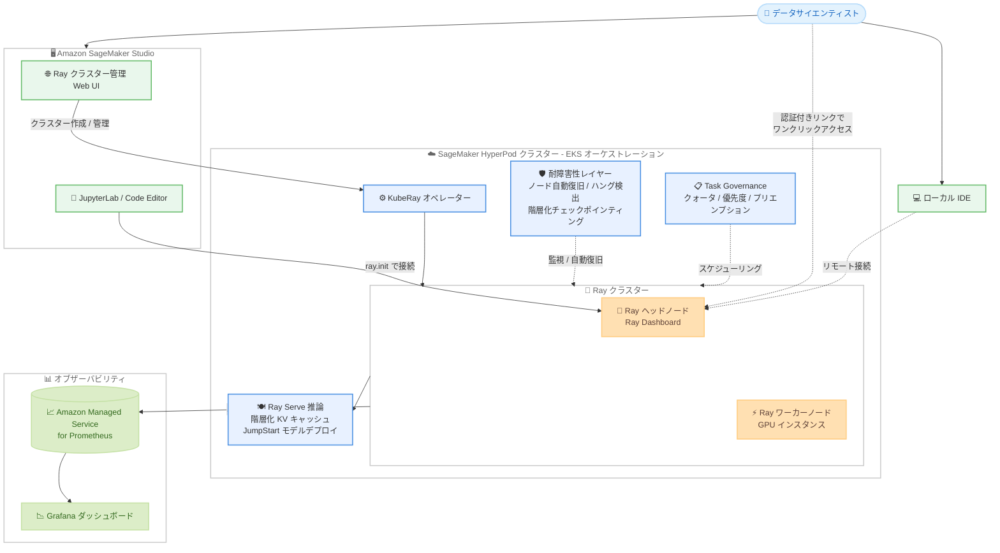

# Amazon SageMaker HyperPod - Ray サポートの強化

**リリース日**: 2026 年 8 月 24 日
**サービス**: Amazon SageMaker HyperPod
**機能**: Ray on SageMaker HyperPod (Ray サポートの強化)

📊 [このアップデートのインフォグラフィックを見る](https://takech9203.github.io/aws-news-summary/20260824-amazon-sagemaker-hyperpod-ray.html)

## 概要

Amazon SageMaker HyperPod が、AI ワークロードをスケールさせるためのオープンソースフレームワークである Ray のサポートを大幅に強化しました。今回のアップデートにより、Amazon EKS でオーケストレーションされる HyperPod クラスター上で、Ray ワークロードの開発から本番運用までを一貫して支援する機能群が利用可能になります。

強化された機能は 4 つの領域にわたります。(1) SageMaker Studio の Web インターフェイスによる Ray クラスターの作成・編集・監視・削除と、JupyterLab / Code Editor / ローカル IDE からの直接接続、(2) Grafana ダッシュボード (Amazon Managed Service for Prometheus 連携) の自動プロビジョニングと Ray Dashboard へのワンクリックアクセスによる組み込みオブザーバビリティ、(3) ノード自動復旧・ハングジョブ検出・階層化チェックポインティングによる耐障害性トレーニング、(4) Ray Serve 向けの階層化 KV キャッシュと SageMaker JumpStart モデルの直接デプロイによる推論の高速化です。

重要な点として、HyperPod はオープンソースの Ray を置き換えるのではなく、その周辺に機能を追加する設計になっています。既存の Ray コード、Ray API、KubeRay カスタムリソースは変更なしでそのまま動作するため、すでに Ray を利用しているチームは移行コストなしで HyperPod の付加価値を享受できます。Studio のフル機能を採用することも、必要な機能だけを個別に自社 ML プラットフォームに組み込むことも可能です。

**アップデート前の課題**

- Kubernetes 上で Ray クラスターを運用するには kubectl や KubeRay の専門知識が必要で、データサイエンティストが自律的にクラスターを管理することが難しかった
- Ray Dashboard へのアクセスに `kubectl port-forward` などの手作業が必要で、メトリクス収集や Grafana ダッシュボードの構築も自前で行う必要があった
- GPU 障害やジョブハングが発生した際の検出と復旧を手動で行う必要があり、大規模トレーニングの有効稼働時間 (goodput) が低下しやすかった
- Ray Serve での LLM 推論において、KV キャッシュの管理や JumpStart モデルのデプロイに追加の実装作業が必要だった

**アップデート後の改善**

- SageMaker Studio の Web インターフェイスから Ray クラスターを作成・編集・監視・削除でき、JupyterLab / Code Editor / ローカル IDE を実行中のクラスターにアタッチして `ray.init()` で接続し、マルチノードクラスターをローカル開発環境のように扱えるようになった
- Grafana ダッシュボードと Amazon Managed Service for Prometheus が自動プロビジョニングされ、認証付きブラウザリンクで Ray Dashboard にワンクリックでアクセスできるようになった
- GPU 障害、ジョブハング、損失スパイク、スループット低下を自動検出し、ノード自動復旧と、クラスターメモリから状態を復元する階層化チェックポインティングにより goodput を最大化できるようになった
- 階層化 KV キャッシュによるプレフィックス再利用で TTFT (最初のトークンまでの時間) を短縮し、JumpStart モデルを Ray Serve に直接デプロイできるようになった

## アーキテクチャ図



SageMaker Studio から Ray クラスターを管理し、IDE から直接接続して開発します。HyperPod の耐障害性レイヤーと Task Governance がクラスターを支え、メトリクスは Amazon Managed Service for Prometheus 経由で Grafana に自動連携されます。

## サービスアップデートの詳細

### 主要機能

1. **マネージド開発環境 (SageMaker Studio 統合)**
   - SageMaker Studio 内の専用 Web インターフェイスから、Ray クラスターの作成・編集・監視・削除が可能
   - JupyterLab、Code Editor、またはローカル IDE のセッションを実行中の Ray クラスターにアタッチし、`ray.init()` で接続してインタラクティブに開発
   - マルチノードクラスターをローカル開発環境のように扱えるため、ジョブの再サブミットの繰り返しや kubectl の専門知識が不要

2. **組み込みオブザーバビリティ**
   - HyperPod Observability アドオンにより、Amazon Managed Service for Prometheus をバックエンドとする Grafana ダッシュボードを自動プロビジョニング
   - Ray メトリクスが自動収集され、ダッシュボードで即座に可視化
   - 認証付きのセキュアなブラウザリンクによる Ray Dashboard へのワンクリックアクセス (`kubectl port-forward` 不要)

3. **耐障害性トレーニング**
   - GPU 障害、ジョブハング、損失スパイク、スループット低下をカバーするノード自動復旧とハングジョブ検出
   - クラスターメモリから状態を復元する階層化チェックポインティングにより、復旧時間を短縮し goodput を最大化
   - HyperPod Task Governance によるクォータ、優先度ベースのスケジューリング、プリエンプション、アイドルコンピュートの貸し借りで GPU 使用率を向上

4. **推論の高速化 (Ray Serve)**
   - キャッシュ済みプレフィックスを再利用するマネージド階層化 KV キャッシュにより、最初のトークンまでの時間 (TTFT) を短縮
   - SageMaker JumpStart モデルを Ray Serve に直接デプロイ可能
   - Ray Serve 向けのマネージド Karpenter オートスケーリング

5. **オープンソース互換性**
   - 既存のオープンソース Ray コード、Ray API、KubeRay カスタムリソースは変更なしでそのまま動作
   - Studio のフル機能を採用するか、不足している機能だけを個別に導入するかを選択可能

## 技術仕様

### 機能マトリクス

| 領域 | 機能 | 実現方法 |
|------|------|----------|
| オーケストレーション | Ray ワークロードの実行 | オープンソース KubeRay オペレーター (EKS 上) |
| 開発 | クラスター管理 Web UI | SageMaker Studio |
| 開発 | インタラクティブ開発 | JupyterLab / Code Editor / リモート IDE + `ray.init()` |
| 可視化 | メトリクスダッシュボード | HyperPod Observability アドオン (Grafana + Amazon Managed Service for Prometheus) |
| 可視化 | Ray Dashboard アクセス | 認証付きブラウザリンク (ワンクリック) |
| 耐障害性 | 障害検出 | GPU 障害 / ジョブハング / 損失スパイク / スループット低下の自動検出 |
| 耐障害性 | 復旧 | ノード自動復旧 + 階層化チェックポインティング (クラスターメモリからの復元) |
| スケジューリング | リソースガバナンス | HyperPod Task Governance (クォータ / 優先度 / プリエンプション / 貸し借り) |
| 推論 | TTFT 短縮 | マネージド階層化 KV キャッシュ (プレフィックス再利用) |
| 推論 | モデルデプロイ | SageMaker JumpStart モデルの直接デプロイ |
| 推論 | オートスケーリング | マネージド Karpenter |

## 設定方法

### 前提条件

1. Amazon EKS でオーケストレーションされる SageMaker HyperPod クラスター (Slurm オーケストレーションは対象外)
2. Amazon SageMaker Studio へのアクセス (Web ベースの開発体験を利用する場合)
3. HyperPod Observability アドオン (オブザーバビリティ機能を利用する場合)

### 手順

#### ステップ 1: EKS オーケストレーションの HyperPod クラスターを準備

```bash
aws sagemaker describe-cluster --cluster-name my-hyperpod-cluster
```

既存の HyperPod クラスターの設定を確認します。EKS オーケストレーションであることを確認してください。クラスターがない場合は、SageMaker コンソールまたは CLI から EKS オーケストレーションの HyperPod クラスターを新規作成します。

#### ステップ 2: KubeRay と必要なアドオンをインストール

公式ドキュメントの「Installing KubeRay on HyperPod Amazon EKS」に従い、KubeRay オペレーターをクラスターにインストールします。オブザーバビリティを利用する場合は HyperPod Observability アドオンを、推論の高速化を利用する場合は Ray Serve 関連のコンポーネントを導入します。すべてを導入することも、必要な機能だけを選択して導入することも可能です。

#### ステップ 3: SageMaker Studio から Ray クラスターを作成・接続

SageMaker Studio の Ray ワークロード管理インターフェイスから Ray クラスターを作成します。作成後、JupyterLab または Code Editor のセッションをクラスターにアタッチし、ノートブックから接続します。

```python
import ray

# アタッチされたセッションから Ray クラスターに接続
ray.init()
```

`ray.init()` を実行すると、アタッチされた Ray クラスターに接続され、マルチノードクラスターをローカル環境のように利用できます。Ray Dashboard には Studio 上の認証付きリンクからワンクリックでアクセスできます。

## メリット

### ビジネス面

- **開発生産性の向上**: データサイエンティストが Kubernetes の専門知識なしで Ray クラスターを自律的に管理でき、インフラチームへの依存が減少
- **GPU コストの最適化**: Task Governance によるクォータ管理・優先度スケジューリング・アイドルコンピュートの貸し借りで、高価な GPU リソースの使用率を最大化
- **移行コストゼロ**: 既存の Ray コードが変更なしで動作するため、Ray を利用中のチームは追加開発なしで HyperPod の付加価値を享受可能

### 技術面

- **goodput の最大化**: ノード自動復旧・ハングジョブ検出・クラスターメモリからの階層化チェックポイント復元により、大規模トレーニングの有効稼働時間を最大化
- **運用負荷の削減**: Grafana + Amazon Managed Service for Prometheus の自動プロビジョニングと Ray Dashboard へのセキュアなワンクリックアクセスにより、監視基盤の構築・運用が不要
- **推論性能の向上**: 階層化 KV キャッシュのプレフィックス再利用により TTFT を短縮し、マネージド Karpenter で需要に応じたオートスケーリングを実現

## デメリット・制約事項

### 制限事項

- Amazon EKS でオーケストレーションされる HyperPod クラスターでのみ利用可能 (Slurm オーケストレーションのクラスターは対象外)
- SageMaker HyperPod が EKS オーケストレーションをサポートするリージョンに限定される

### 考慮すべき点

- HyperPod クラスター自体の構築と EKS の基本的な運用体制が前提となるため、小規模なワークロードには SageMaker Training Job など他の選択肢との比較検討が必要
- オブザーバビリティ機能を利用する場合、Amazon Managed Service for Prometheus および Grafana 関連の追加コストが発生する可能性がある
- フル機能を採用するか個別機能のみ導入するかで運用モデルが異なるため、既存 ML プラットフォームとの統合方針を事前に整理することが望ましい

## ユースケース

### ユースケース 1: 基盤モデルの大規模分散トレーニング

**シナリオ**: 数百 GPU を使用した基盤モデルの事前学習で、GPU 障害やジョブハングによるトレーニングの中断が頻発し、有効稼働時間が低下している。

**実装例**:
```python
import ray
from ray.train.torch import TorchTrainer
from ray.train import ScalingConfig

ray.init()

trainer = TorchTrainer(
    train_loop_per_worker=train_func,
    scaling_config=ScalingConfig(num_workers=64, use_gpu=True),
)
result = trainer.fit()
```

**効果**: HyperPod がノード障害を自動検出して復旧し、階層化チェックポインティングによりクラスターメモリから高速に状態を復元。トレーニングコードの変更なしで goodput を最大化できる。

### ユースケース 2: LLM のインタラクティブな開発と実験

**シナリオ**: データサイエンティストチームが分散データ処理とハイパーパラメータチューニングを試行錯誤したいが、ジョブ投入のたびに待ち時間が発生し、kubectl での操作にも不慣れである。

**実装例**:
```python
# SageMaker Studio の JupyterLab を Ray クラスターにアタッチして接続
import ray
ray.init()

# マルチノードクラスターをローカル環境のように利用
ds = ray.data.read_parquet("s3://my-bucket/training-data/")
ds = ds.map_batches(preprocess_fn, num_gpus=1)
```

**効果**: Studio の Web UI からクラスターを作成し、ノートブックから直接接続してインタラクティブに反復開発が可能。ジョブ再サブミットの繰り返しと kubectl の習得が不要になる。

### ユースケース 3: Ray Serve による低レイテンシー LLM 推論

**シナリオ**: 長いシステムプロンプトを共有する対話型アプリケーションで、最初のトークンまでの時間 (TTFT) を短縮しつつ、需要変動に応じてスケールさせたい。

**実装例**:
```
1. SageMaker JumpStart からモデルを選択し Ray Serve に直接デプロイ
2. マネージド階層化 KV キャッシュを有効化し、共有プレフィックスを再利用
3. マネージド Karpenter によるオートスケーリングを設定
```

**効果**: キャッシュ済みプレフィックスの再利用により TTFT を短縮。JumpStart モデルのデプロイ作業が簡素化され、トラフィックに応じた自動スケールで運用負荷とコストを最適化できる。

## 料金

SageMaker HyperPod の Ray サポート強化自体に追加料金はありません。HyperPod クラスターで使用するインスタンスに対して SageMaker HyperPod の料金が適用されます。オブザーバビリティ機能を利用する場合は、Amazon Managed Service for Prometheus および Amazon Managed Grafana の料金が別途発生する可能性があります。詳細は [SageMaker の料金ページ](https://aws.amazon.com/sagemaker/pricing/) を参照してください。

## 利用可能リージョン

SageMaker HyperPod が Amazon EKS オーケストレーションをサポートするすべての AWS リージョンで利用可能です。対象リージョンの一覧は [SageMaker HyperPod のドキュメント](https://docs.aws.amazon.com/sagemaker/latest/dg/sagemaker-hyperpod.html) を参照してください。

## 関連サービス・機能

- **Amazon EKS**: Ray on HyperPod の前提となるオーケストレーター。KubeRay オペレーターが EKS 上で Ray クラスターを管理
- **Amazon SageMaker Studio**: Ray クラスターの管理 Web UI と JupyterLab / Code Editor による開発環境を提供
- **Amazon Managed Service for Prometheus / Grafana**: HyperPod Observability アドオンが自動プロビジョニングするメトリクス基盤とダッシュボード
- **SageMaker JumpStart**: 事前学習済みモデルを Ray Serve に直接デプロイ可能
- **HyperPod Task Governance**: クォータ、優先度スケジューリング、プリエンプション、アイドルコンピュートの貸し借りによる GPU リソース管理
- **Karpenter**: Ray Serve 推論ワークロードのマネージドオートスケーリング

## 参考リンク

- 📊 [インフォグラフィック](https://takech9203.github.io/aws-news-summary/20260824-amazon-sagemaker-hyperpod-ray.html)
- [公式発表 (What's New)](https://aws.amazon.com/about-aws/whats-new/2026/08/amazon-sagemaker-hyperpod-ray)
- [ドキュメント: Ray on SageMaker HyperPod](https://docs.aws.amazon.com/sagemaker/latest/dg/sagemaker-hyperpod-ray.html)
- [SageMaker HyperPod 製品ページ](https://aws.amazon.com/sagemaker/ai/hyperpod/)
- [料金ページ](https://aws.amazon.com/sagemaker/pricing/)

## まとめ

今回のアップデートにより、SageMaker HyperPod はオープンソース Ray との完全な互換性を保ちながら、開発環境・オブザーバビリティ・耐障害性・推論高速化の 4 領域で運用課題を解消するマネージド機能を提供します。EKS オーケストレーションの HyperPod で Ray を利用中、または導入を検討中のチームは、既存コードを変更せずに導入できるため、まず SageMaker Studio での Ray クラスター管理とオブザーバビリティ機能から試すことを推奨します。
