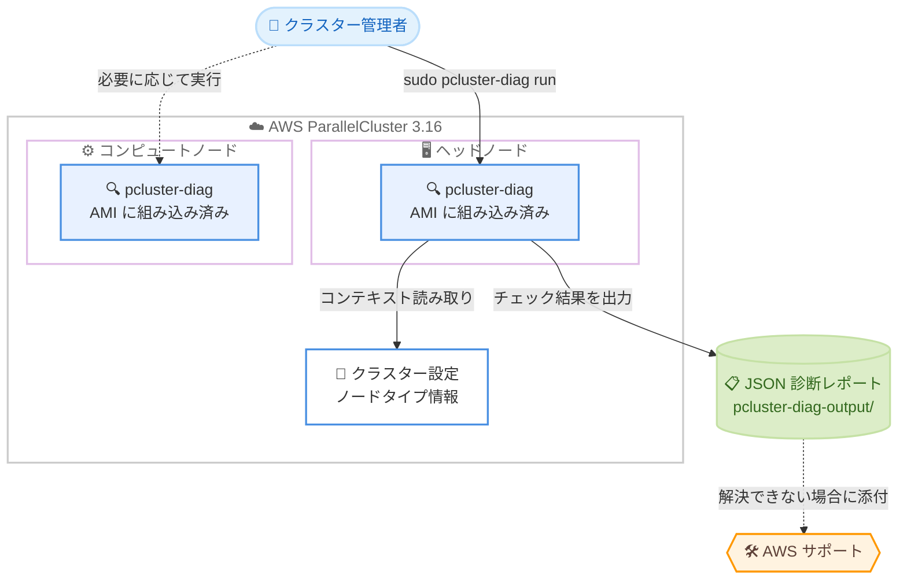

# AWS ParallelCluster - バージョン 3.16 とノード上診断ツール pcluster-diag

**リリース日**: 2026 年 8 月 24 日
**サービス**: AWS ParallelCluster
**機能**: ParallelCluster 3.16 GA (pcluster-diag 診断ツール、耐障害性向上、ソフトウェアスタック更新)

📊 [このアップデートのインフォグラフィックを見る](https://takech9203.github.io/aws-news-summary/20260824-aws-parallelcluster.html)

## 概要

AWS ParallelCluster 3.16 が一般提供 (GA) されました。ParallelCluster は、AWS 上で HPC (High Performance Computing) クラスターを自動的にプロビジョニングし、弾力的にスケーリングするオープンソースのクラスター管理ツールです。研究開発部門のユーザーや、科学技術計算ワークロードを運用する IT 管理者が主な対象です。

本リリースの目玉は、ParallelCluster AMI に組み込まれた新しい診断ツール **pcluster-diag** です。任意のクラスターノード上で単一コマンドを実行するだけで一連の診断チェックを行い、構造化された JSON レポートを出力します。クラスターが実行時に異常な挙動を示した際の一次切り分けとして利用でき、解決できない場合はレポートを AWS サポートケースに添付して調査を迅速化できます。

また、クラスターの作成・更新・イメージビルドの耐障害性が強化されたほか、NVIDIA ドライバー、CUDA、EFA インストーラー、Slurm などの HPC / AI・ML ソフトウェアスタックが最新バージョンに更新されています。

**アップデート前の課題**

以前の ParallelCluster では、クラスターの問題調査に手間がかかっていました。

- クラスターノードの問題を切り分けるには、各種ログファイル (`/var/log/parallelcluster/` 配下など) を手動で確認し、ノードの状態を個別に調査する必要があった
- ノードの健全性を体系的に確認する標準ツールがなく、調査の品質が担当者のスキルに依存していた
- AWS サポートへの問い合わせ時に、ノードの状態を示す構造化された情報を揃えるのに時間がかかっていた
- 一時的な障害 (IMDS 接続失敗、リポジトリメタデータの不整合など) によりクラスター作成やイメージビルドが失敗することがあった

**アップデート後の改善**

- `sudo pcluster-diag run` の単一コマンドで、ノードに適用可能なすべての診断チェックを一括実行し、JSON 形式の構造化レポートを取得できるようになった
- ノードタイプとクラスター設定を自動で読み取り、該当するチェックのみを実行するコンテキスト認識型の診断が可能になった
- EBS ボリュームアタッチのリトライや、RHEL / Rocky Linux でのリポジトリメタデータリセットなどにより、クラスター作成・更新・イメージビルドの耐障害性が向上した
- Slurm 25.11.6、NVIDIA ドライバー 595.71.05、CUDA 13.2.2、EFA インストーラー 1.49.0 など、最新のソフトウェアスタックを利用できるようになった

## アーキテクチャ図



管理者は任意のクラスターノード上で `pcluster-diag` を実行できます。ツールはノードタイプとクラスター設定を読み取って該当するチェックのみを実行し、JSON レポートをローカルに保存します。解決が難しい場合は、このレポートを AWS サポートケースに添付できます。

## サービスアップデートの詳細

### 主要機能

1. **pcluster-diag 診断ツール**
   - ParallelCluster 3.16.0 以降のすべての AMI (公式 AMI および `pcluster build-image` で作成したカスタム AMI) に組み込み済み
   - 任意のクラスターノードで実行可能。問題箇所が不明な場合はヘッドノードでの実行が推奨される
   - **コンテキスト認識**: 起動時にノードタイプとデプロイ済みクラスター設定を読み取り、該当するチェックのみを実行。使用していない機能のチェックはスキップとして報告
   - **デフォルトで読み取り専用**: クラスター設定を変更しない。読み取り専用でないチェックは明示的な承認が必要で、拒否した場合はスキップとして記録
   - **単一実行で完結**: あるチェックが失敗しても他のチェックは継続実行され、1 回の実行でノードの全体像を把握できる

2. **クラスターライフサイクルの耐障害性向上**
   - クラスター作成時、IMDS への一時的な接続失敗が発生した場合に EBS ボリュームのアタッチをリトライ
   - RHEL / Rocky Linux でのイメージビルド時、リトライ時にリポジトリメタデータをリセットすることで一時的なビルド失敗を削減
   - ログインノードの更新がヘッドノード主導のオーケストレーションを再利用する方式になり、cfn-hup / cfn-init への依存を排除
   - ブートストラップファイルを `/tmp` から `/opt/parallelcluster/tmp` に移動し、`/tmp` を noexec でマウントするカスタム AMI に対応

3. **HPC / AI・ML ソフトウェアスタックの更新**
   - Slurm 25.11.6、NVIDIA ドライバー 595.71.05、CUDA Toolkit 13.2.2、EFA インストーラー 1.49.0 などへ更新
   - NVIDIA コンポーネントのインストール方式を run ファイルからローカルリポジトリパッケージに変更
   - NVIDIA MIG 有効時は GPU ヘルスチェックが DCGM 診断をスキップするよう改善

4. **その他の主な変更点**
   - Amazon Linux 2 サポートおよび AWS Batch スケジューラーサポートを削除
   - CLI が Python 3.13 をサポート。CLI 実行には `tag:GetResources` 権限が新たに必要
   - ヘッドノードの NFS サーバーが NFSv4 専用に変更。NFS lockd ポートが 32768 から 4045 に変更 (NFSv3 マウントを使用する場合はファイアウォールで TCP/UDP 4045 の開放が必要)
   - FSx for Lustre の `AutomaticBackupRetentionDays` の最大値が 35 日から 90 日に拡大
   - `ExternalSlurmdbd` 使用時のクラスター名を 40 文字以内に制限するバリデーターを追加

## 技術仕様

### pcluster-diag の仕様

| 項目 | 詳細 |
|------|------|
| 提供形態 | ParallelCluster 3.16.0 以降の AMI に組み込み (公式 / カスタム AMI 両方) |
| 実行対象 | 任意のクラスターノード (ヘッドノード、コンピュートノード、ログインノード) |
| 実行権限 | root 権限が必要 (`sudo pcluster-diag run`) |
| 出力形式 | JSON レポート (標準出力) + 進捗ログ (標準エラー出力) |
| レポート保存先 | カレントディレクトリの `./pcluster-diag-output/` 配下にタイムスタンプ付きファイルとして保存 |
| ツールソースの場所 | `/opt/parallelcluster/sources/pcluster-diag` |
| チェックの更新 | GitHub の aws-parallelcluster-cookbook リポジトリから最新チェックを取得し、実行中のノード上でインプレース更新可能 |

### チェックステータス

| ステータス | 意味 | 対応 |
|------|------|------|
| `PASSED` | 問題は検出されなかった | 不要 |
| `WARNING` | 問題を引き起こす可能性のある事象を検出 | `warnings` リストを確認して対応 |
| `FAILURE` | ノード上の問題を検出 | `errors` リストを確認してすべての問題に対応 |
| `CHECK_ERROR` | チェックが完了できず状態を確認できなかった | 問題ではなく不確定として扱い、AWS サポートに報告 |
| `SKIPPED_NOT_APPLICABLE` | ノードタイプまたはクラスター設定に該当しないチェック | 不要 (想定どおりの動作) |
| `SKIPPED_BY_USER` | 承認が必要なチェックをユーザーが拒否 | 必要に応じて承認して再実行 |

### 主要コンポーネントのバージョン更新

| コンポーネント | 3.16.0 | 3.15 系 (以前) |
|------|------|------|
| Slurm | 25.11.6 | 25.11.4 |
| NVIDIA ドライバー / Fabric Manager / IMEX | 595.71.05 | 580.126.20 |
| CUDA Toolkit | 13.2.2 | 13.0.2 |
| EFA インストーラー | 1.49.0 | 1.47.0 |
| DCGM | 4.6.0 | 4.5.1 |
| Intel MPI | 2021.18.0.749 | 2021.17.2.94 |
| GDRCopy | 2.6 | 2.5.2 |
| PMIx | 5.0.11 | 5.0.10 |
| Enroot | 4.2.1 | 3.4.1 |
| Pyxis | 0.24.0 | 0.20.0 |
| Python (組み込み) | 3.14.6 | 3.14.2 |

### 診断レポートの構造

```json
{
  "context": { "ノードのコンテキスト情報": "..." },
  "results": [
    {
      "check_id": "...",
      "check_description": "...",
      "status": "PASSED | WARNING | FAILURE | ...",
      "errors": [ { "code": "E1", "message": "..." } ],
      "warnings": [ { "code": "W1", "message": "..." } ],
      "infos": [ { "code": "I1", "message": "..." } ]
    }
  ]
}
```

## 設定方法

### 前提条件

1. AWS ParallelCluster 3.16.0 以降で作成したクラスター (公式 AMI または `pcluster build-image` で作成したカスタム AMI を使用)
2. 診断対象ノードへの SSH または Session Manager でのアクセス
3. root 権限 (sudo) での実行が可能なこと

### 手順

#### ステップ 1: ParallelCluster CLI を 3.16 にアップグレード

```bash
sudo pip install --upgrade aws-parallelcluster
pcluster version
```

pip で ParallelCluster CLI を最新バージョン (3.16.0) に更新し、バージョンを確認します。既存クラスターで pcluster-diag を使うには、3.16.0 以降の AMI を使用するクラスターが必要です。

#### ステップ 2: 実行可能なチェックの一覧を確認

```bash
# 診断対象のノードに接続後
pcluster-diag describe-checks
```

`describe-checks` サブコマンドは、登録されているすべてのチェックの ID と説明を JSON 配列で返します。実行前にどのようなチェックが行われるかを確認できます。

#### ステップ 3: 診断を実行

```bash
sudo pcluster-diag run
```

root 権限で診断を実行します。進捗ログが標準エラー出力に、JSON レポートが標準出力に書き込まれ、同じレポートが `./pcluster-diag-output/pcluster-diag-report-{タイムスタンプ}.json` にも保存されます。問題箇所が不明な場合は、まずヘッドノードで実行することが推奨されています。

#### ステップ 4: スクリプトからの自動実行 (オプション)

```bash
sudo pcluster-diag run -y --output-file /var/log/pcluster-diag-report.json
```

`-y` (`--yes`) オプションを付けると、確認が必要なチェックをプロンプトなしですべて承認します。cron やジョブスクリプトからの定期実行に適しています。`--output-file` でレポートの保存先を指定できます。

#### ステップ 5: 最新のチェックをインプレース更新 (オプション)

```bash
curl -fL https://github.com/aws/aws-parallelcluster-cookbook/archive/refs/heads/develop.tar.gz \
  | sudo tar -xz --strip-components=5 -C /opt/parallelcluster/sources/pcluster-diag \
    --wildcards '*/cookbooks/aws-parallelcluster-platform/files/pcluster-diag/*'
sudo pcluster-diag --version
```

次のリリースを待たずに、GitHub の develop ブランチから最新の診断チェックを取得してノード上のツールを更新します。この更新は実行したノードにのみ適用され、ノードが置き換えられると AMI 内のバージョンに戻る点に注意してください。

## メリット

### ビジネス面

- **障害対応時間の短縮**: 単一コマンドでノードの健全性を体系的に確認できるため、問題の切り分けにかかる時間を削減し、研究・開発ワークロードのダウンタイムを最小化できる
- **サポート対応の迅速化**: 構造化された JSON レポートを AWS サポートケースに添付することで、情報収集のやり取りを減らし、解決までの時間を短縮できる
- **運用品質の標準化**: 診断手順がツール化されたことで、担当者のスキルに依存しない一貫した品質のトラブルシューティングが可能になる

### 技術面

- **コンテキスト認識型の診断**: ノードタイプとクラスター設定に基づいて該当チェックのみを実行するため、無関係な結果に惑わされない
- **安全な実行**: デフォルトで読み取り専用のため、本番クラスターでも安心して実行できる。変更を伴うチェックは明示的な承認が必要
- **ライフサイクル全体の安定性向上**: EBS アタッチのリトライ、リポジトリメタデータのリセットなどにより、クラスター作成・更新・イメージビルドの一時的な失敗が減少
- **最新スタックの利用**: 最新の NVIDIA ドライバー、CUDA、EFA、Slurm により、GPU / ネットワーク性能の改善やバグ修正を享受できる

## デメリット・制約事項

### 制限事項

- pcluster-diag は 3.16.0 以降の AMI にのみ含まれるため、既存の 3.15 以前のクラスターで利用するにはクラスターのアップグレード (AMI 更新) が必要
- チェックのカバレッジは網羅的ではなく、リリースごとに拡充される。すべてのチェックが `PASSED` でも、クラスターが健全であることを保証するものではない
- Amazon Linux 2 のサポートが 3.16 で削除されたため、AL2 ベースのクラスターは OS 移行が必要
- AWS Batch スケジューラーのサポートが削除され、Slurm のみが対象となった

### 考慮すべき点

- CLI の実行に `tag:GetResources` IAM 権限が新たに必要になったため、既存の IAM ポリシーの更新が必要になる場合がある
- ヘッドノードの NFS サーバーが NFSv4 専用となり、NFS lockd ポートが 32768 から 4045 に変更された。NFSv3 マウントを利用する外部クライアントがある場合、ファイアウォールで TCP/UDP 4045 の開放が必要
- `ExternalSlurmdbd` を使用する場合、クラスター名が 40 文字以内に制限される
- 隔離サブネットで build-image を行う場合、amazon-efs-utils の取得のために `amazon-efs-utils.aws.com` の許可リスト追加が必要
- GitHub からのインプレース更新はノード単位で適用され、ノード置換時に AMI のバージョンへ戻る

## ユースケース

### ユースケース 1: ジョブが失敗するコンピュートノードの一次切り分け

**シナリオ**: 特定のコンピュートノードで Slurm ジョブが繰り返し失敗する。GPU、EFA、共有ストレージのどこに問題があるか不明で、ログの手動調査に時間がかかっている。

**実装例**:
```bash
# 問題のコンピュートノードに接続して診断を実行
sudo pcluster-diag run

# レポートから FAILURE / WARNING のチェックを抽出
cat ./pcluster-diag-output/pcluster-diag-report-*.json \
  | python3 -c "import json,sys; r=json.load(sys.stdin); \
    [print(c['check_id'], c['status']) for c in r['results'] \
     if c['status'] in ('FAILURE','WARNING')]"
```

**効果**: 単一コマンドでノード全体の健全性を確認でき、失敗したチェックの `errors` に含まれるコードとメッセージから原因箇所を素早く特定できる。

### ユースケース 2: AWS サポートケースの調査迅速化

**シナリオ**: クラスターの異常を自力で解決できず、AWS サポートに問い合わせる必要がある。従来はサポートから求められるログや環境情報の収集に往復のやり取りが発生していた。

**実装例**:
```bash
# ヘッドノードで診断を実行し、レポートを保存
sudo pcluster-diag run --output-file /tmp/diag-report.json

# レポートをサポートケースに添付
```

**効果**: ノードのコンテキストと全チェック結果を含む構造化レポートを最初から添付できるため、情報収集の往復が減り、問題解決までの時間が短縮される。

### ユースケース 3: クラスター運用の定期ヘルスチェック

**シナリオ**: 大規模な HPC クラスターを運用しており、問題が顕在化する前にノードの異常兆候を検出したい。

**実装例**:
```bash
# cron などから非対話で定期実行 (確認が必要なチェックも自動承認)
sudo pcluster-diag run -y \
  --output-file /var/log/pcluster-diag/report-$(date +%Y%m%d).json
```

**効果**: `WARNING` ステータスのチェックから潜在的な問題を早期に検出し、ジョブ失敗が発生する前に予防的な対応を取れる。

## 料金

AWS ParallelCluster 自体は追加料金なしで利用できるオープンソースツールです。pcluster-diag も AMI に組み込まれており、追加料金はかかりません。クラスターを構成する基盤の AWS リソース (Amazon EC2 インスタンス、Amazon EBS、Amazon FSx for Lustre、Amazon EFS、データ転送など) に対してのみ、使用した分の料金が発生します。

## 利用可能リージョン

AWS ParallelCluster 3.16 は、ParallelCluster がサポートするすべての AWS リージョンで利用できます。詳細は [サポート対象リージョンのドキュメント](https://docs.aws.amazon.com/parallelcluster/latest/ug/supported-regions.html) を参照してください。

## 関連サービス・機能

- **Amazon EC2**: クラスターのヘッドノード、コンピュートノード、ログインノードを構成する基盤。HPC 最適化インスタンスや GPU インスタンスを利用可能
- **Elastic Fabric Adapter (EFA)**: 密結合 HPC / 分散 ML ワークロード向けの低レイテンシーネットワークインターフェイス。3.16 でインストーラーが 1.49.0 に更新
- **Amazon FSx for Lustre**: 高性能な共有ファイルシステム。3.16 で自動バックアップ保持期間の最大値が 90 日に拡大
- **AWS Parallel Computing Service (PCS)**: AWS が管理するマネージド型の HPC サービス。セルフマネージドの ParallelCluster に対する代替選択肢
- **Slurm**: ParallelCluster が採用するジョブスケジューラー。3.16 で 25.11.6 に更新

## 参考リンク

- 📊 [インフォグラフィック](https://takech9203.github.io/aws-news-summary/20260824-aws-parallelcluster.html)
- [公式発表 (What's New)](https://aws.amazon.com/about-aws/whats-new/2026/08/aws-parallelcluster/)
- [リリースノート v3.16.0 (GitHub)](https://github.com/aws/aws-parallelcluster/releases/tag/v3.16.0)
- [pcluster-diag によるトラブルシューティング (ドキュメント)](https://docs.aws.amazon.com/parallelcluster/latest/ug/troubleshooting-v3-pcluster-diag.html)
- [ParallelCluster ユーザーガイド チュートリアル](https://docs.aws.amazon.com/parallelcluster/latest/ug/tutorials-v3.html)
- [ParallelCluster CLI のインストール](https://docs.aws.amazon.com/parallelcluster/latest/ug/install-v3-parallelcluster.html)
- [ParallelCluster UI のインストール](https://docs.aws.amazon.com/parallelcluster/latest/ug/install-pcui-v3.html)
- [サポート対象リージョン](https://docs.aws.amazon.com/parallelcluster/latest/ug/supported-regions.html)

## まとめ

AWS ParallelCluster 3.16 は、AMI 組み込みの診断ツール pcluster-diag により、HPC クラスターのトラブルシューティングを単一コマンドで標準化する重要なアップデートです。クラスターライフサイクルの耐障害性向上と最新ソフトウェアスタックへの更新も含まれるため、ParallelCluster を運用しているチームはリリースノートを確認のうえ、Amazon Linux 2 と AWS Batch サポートの削除、NFS ポート変更、`tag:GetResources` 権限の追加といった変更点に注意しながら 3.16 への移行を計画することを推奨します。
