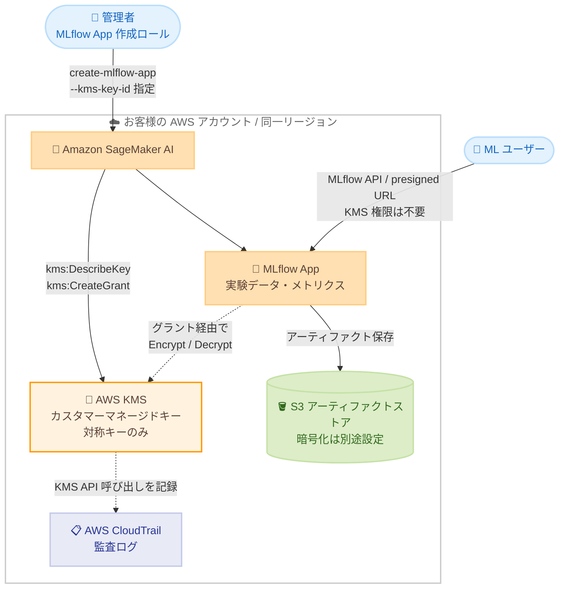

# Amazon SageMaker MLflow - カスタマーマネージドキー (CMK) による暗号化サポート

**リリース日**: 2026 年 8 月 24 日
**サービス**: Amazon SageMaker AI (SageMaker MLflow)
**機能**: MLflow App のカスタマーマネージド KMS キーによるサーバーサイド暗号化

📊 [このアップデートのインフォグラフィックを見る](https://takech9203.github.io/aws-news-summary/20260824-sagemaker-mlflow-custom-keys.html)

## 概要

Amazon SageMaker MLflow が、AWS Key Management Service (KMS) のカスタマーマネージドキー (CMK) によるデータ暗号化をサポートしました。これにより、MLflow App が管理する実験データ (実験メタデータ、メトリクス、パラメータなど) を、お客様自身が作成・所有・管理する KMS キーで暗号化できるようになります。

これまで MLflow App のデータは AWS 所有キーによるサーバーサイド暗号化のみでしたが、今回のアップデートにより、厳格なセキュリティ・コンプライアンス要件を持つ組織が、暗号化キーのライフサイクル (キーポリシーの管理、ローテーション、無効化、削除スケジュールなど) を自組織で完全に制御できるようになりました。また、AWS CloudTrail との統合により、KMS キーに対するすべてのアクセスを追跡し、セキュリティ監査に活用できます。

本機能は、MLflow App が利用可能なすべての AWS リージョンで一般提供 (GA) されています。金融、医療、公共部門など、データ暗号化キーの自己管理が求められる規制業界の ML チームにとって重要なアップデートです。

**アップデート前の課題**

- 以前は MLflow App のデータ暗号化に AWS 所有キーしか使用できず、暗号化キーをお客様側で制御できなかった
- キーポリシーの設定、キーマテリアルのローテーション、キーの無効化・削除といったキー管理操作が実行できなかった
- 暗号化キーの使用状況を CloudTrail で監査することができず、コンプライアンス要件 (キーの自己管理・監査証跡) を満たせないケースがあった

**アップデート後の改善**

- MLflow App 作成時に `--kms-key-id` パラメータで CMK を指定し、SageMaker が管理する MLflow App のデータを自組織のキーで暗号化できるようになった
- キーポリシーの確立・維持、IAM ポリシーとグラントの管理、キーマテリアルのローテーション、タグ付け、エイリアス作成、削除スケジュールなど、暗号化レイヤーを完全に制御できるようになった
- CloudTrail に記録される KMS イベント (`CreateGrant`、`Encrypt`、`Decrypt` など) により、データアクセスをセキュリティ監査目的で追跡できるようになった

## アーキテクチャ図



MLflow App 作成時に SageMaker が KMS へグラントを作成し、以降はそのグラント経由でデータの暗号化・復号が行われます。ユーザーが MLflow App にアクセスする際に KMS 権限は不要で、KMS API 呼び出しはすべて CloudTrail に記録されます。

## サービスアップデートの詳細

### 主要機能

1. **カスタマーマネージドキーによるサーバーサイド暗号化**
   - デフォルトの AWS 所有キーに代えて、お客様が作成・所有・管理する対称 KMS キーで MLflow App のデータを暗号化可能
   - `create-mlflow-app` の `--kms-key-id` パラメータで作成時に指定 (省略時は AWS 所有キーを使用)
   - キーポリシーの確立・維持、ローテーション、無効化、削除スケジュール、タグ・エイリアス管理など、暗号化レイヤーの完全な制御が可能

2. **KMS グラントによる透過的なキー利用**
   - MLflow App 作成時に SageMaker が `CreateGrant` リクエストを KMS に送信し、お客様に代わってグラントを作成
   - MLflow App 削除時にはグラントが自動的にリタイアされる
   - グラントはいつでも取り消し可能 (取り消し後、SageMaker はメンテナンスなど以降のキー操作を実行できなくなる)
   - MLflow App の利用 (MLflow API や presigned URL によるアクセス) 時にユーザー側の KMS 権限は不要

3. **CloudTrail 統合による監査**
   - MLflow App による KMS キーの使用がすべて CloudTrail に記録され、セキュリティ監査のためのデータアクセス追跡が可能
   - App 作成時: `DescribeKey`、`CreateGrant` が記録
   - プロビジョニング・稼働中: `GenerateDataKeyWithoutPlaintext`、`Encrypt`、`Decrypt` が記録
   - App 削除時: `RetireGrant` が記録

## 技術仕様

### 暗号化仕様

| 項目 | 詳細 |
|------|------|
| デフォルト暗号化 | AWS 所有キーによるサーバーサイド暗号化 |
| オプション | 対称カスタマーマネージド KMS キー |
| キーの配置要件 | MLflow App と同一の AWS アカウントおよび同一リージョン内で作成 |
| キータイプ | 対称キーのみサポート (非対称キーは不可) |
| 指定タイミング | MLflow App 作成時のみ (作成後の変更・切り替えは不可) |
| 暗号化対象 | SageMaker が MLflow App のために管理するデータ |
| 暗号化対象外 | お客様所有の S3 アーティファクトストア (S3 バケット側で別途デフォルト暗号化を設定) |
| 暗号化コンテキスト | カスタム暗号化コンテキストは設定されない (`kms:EncryptionContext` 条件キーによる絞り込みは不可) |
| 監査 | CloudTrail に KMS API 呼び出しを記録 |

### API 変更履歴

| 日付 | サービス | 変更内容 |
|------|----------|----------|
| 2026/08/20 | [Amazon SageMaker Service](https://awsapichanges.com/archive/changes/648ecf-api.sagemaker.html) | 5 updated api methods - `CreateMlflowApp` および `DescribeMlflowApp` API に CMK サポートを追加 (同リリースには `CreatePartnerApp` / `UpdatePartnerApp` への IAM Identity Center サポート追加も含む) |

### キーポリシー (管理者用の例)

MLflow App を作成する管理者ロールには、`kms:CreateGrant` と `kms:DescribeKey` の許可が必要です。

```json
{
    "Sid": "AllowMLflowAppAdministratorAccess",
    "Effect": "Allow",
    "Principal": {
        "AWS": "arn:aws:iam::111122223333:role/mlflow-app-admin-role"
    },
    "Action": [
        "kms:CreateGrant",
        "kms:DescribeKey"
    ],
    "Resource": "*",
    "Condition": {
        "StringEquals": {
            "kms:ViaService": "sagemaker.region.amazonaws.com"
        },
        "ForAllValues:StringEquals": {
            "kms:GrantOperations": [
                "CreateGrant",
                "Decrypt",
                "DescribeKey",
                "Encrypt",
                "GenerateDataKey",
                "GenerateDataKeyWithoutPlaintext",
                "ReEncryptFrom",
                "ReEncryptTo",
                "RetireGrant"
            ]
        }
    }
}
```

- `kms:ViaService`: キーの使用を特定リージョンの SageMaker 経由のリクエストに限定し、他のプリンシパルやサービスによる直接利用を防止
- `kms:GrantOperations`: SageMaker が作成するグラントに含められる操作を、データの暗号化・復号に必要な操作のみに制限
- MLflow App を利用するだけのユーザーには KMS 権限は一切不要

## 設定方法

### 前提条件

1. MLflow App と同一の AWS アカウント・同一リージョンに対称 KMS キー (CMK) を作成済みであること
2. CMK のキーポリシーで、MLflow App 作成ロールに `kms:CreateGrant` と `kms:DescribeKey` を許可していること
3. MLflow App 用の実行ロールと S3 アーティファクトストア用バケットを準備済みであること

### 手順

#### ステップ 1: 対称カスタマーマネージドキーの作成

```bash
aws kms create-key \
  --description "CMK for SageMaker MLflow App" \
  --key-spec SYMMETRIC_DEFAULT \
  --key-usage ENCRYPT_DECRYPT \
  --region ap-northeast-1
```

MLflow App の暗号化に使用する対称 KMS キーを作成します。作成後、前述の管理者用ポリシーステートメントをキーポリシーに追加します。

#### ステップ 2: CMK を指定して MLflow App を作成

```bash
aws sagemaker create-mlflow-app \
  --name my-mlflow-app \
  --artifact-store-uri s3://my-mlflow-artifacts-bucket \
  --role-arn arn:aws:iam::111122223333:role/mlflow-execution-role \
  --kms-key-id arn:aws:kms:ap-northeast-1:111122223333:key/1234abcd-12ab-34cd-56ef-1234567890ab \
  --region ap-northeast-1
```

`--kms-key-id` パラメータに CMK を指定して MLflow App を作成します。このとき SageMaker がお客様に代わって `DescribeKey` によるキー検証と `CreateGrant` によるグラント作成を実行します。このパラメータを省略すると AWS 所有キーが使用されます。

#### ステップ 3: S3 アーティファクトストアの暗号化を設定

```bash
aws s3api put-bucket-encryption \
  --bucket my-mlflow-artifacts-bucket \
  --server-side-encryption-configuration '{
    "Rules": [{
      "ApplyServerSideEncryptionByDefault": {
        "SSEAlgorithm": "aws:kms",
        "KMSMasterKeyID": "arn:aws:kms:ap-northeast-1:111122223333:key/1234abcd-12ab-34cd-56ef-1234567890ab"
      }
    }]
  }'
```

CMK が暗号化するのは SageMaker が管理する MLflow App のデータのみで、お客様所有の S3 アーティファクトストアは対象外です。アーティファクトも CMK で暗号化する場合は、S3 バケットのデフォルト暗号化を設定します。

#### ステップ 4: CloudTrail で KMS イベントを確認

```bash
aws cloudtrail lookup-events \
  --lookup-attributes AttributeKey=EventName,AttributeValue=CreateGrant \
  --region ap-northeast-1
```

MLflow App による KMS キーの使用状況 (`DescribeKey`、`CreateGrant`、`Encrypt`、`Decrypt`、`GenerateDataKeyWithoutPlaintext`、`RetireGrant`) を CloudTrail で確認し、監査証跡として活用します。稼働中の暗号化・復号リクエストはグラント経由で AWS サービスが実行するため、`userIdentity` には IAM プリンシパルではなく AWS サービスが記録されます。

## メリット

### ビジネス面

- **コンプライアンス対応**: 暗号化キーの自己管理が求められる規制業界 (金融、医療、公共部門など) のセキュリティ・コンプライアンス要件を満たしやすくなる
- **監査証跡の確保**: CloudTrail によりキー使用のすべてのイベントが記録され、監査人への説明責任を果たせる
- **データ主権の強化**: キーの無効化や削除スケジュールにより、必要に応じてデータへのアクセスを組織側で遮断できる

### 技術面

- **完全なキーライフサイクル管理**: キーポリシー、IAM ポリシーとグラント、ローテーション、タグ、エイリアス、削除スケジュールを自組織で制御可能
- **ユーザー体験への影響なし**: MLflow App の利用時 (MLflow API、presigned URL) に KMS 権限が不要なため、既存ユーザーのポリシー変更は不要
- **最小権限の実装が容易**: `kms:ViaService` と `kms:GrantOperations` の条件キーにより、キーの用途を SageMaker MLflow に厳密に限定できる

## デメリット・制約事項

### 制限事項

- CMK は MLflow App と同一の AWS アカウントおよび同一リージョン内で作成する必要がある (クロスアカウント・クロスリージョンキーは不可)
- 対称 KMS キーのみサポートされ、非対称キーは使用できない
- CMK は MLflow App の作成時にのみ指定でき、作成後の変更は不可 (AWS 所有キーと CMK の切り替え、別の CMK への差し替えも不可。変更するには App を削除して再作成が必要)
- CMK が暗号化するのは SageMaker が管理する MLflow App のデータのみで、お客様所有の S3 アーティファクトストアの暗号化は別途設定が必要
- カスタム暗号化コンテキストが設定されないため、`kms:EncryptionContext` 条件キーによるアクセス制御はできない

### 考慮すべき点

- キーを無効化または削除スケジュールに設定してキーが永続的に利用不能になると、保存データを復号できなくなり MLflow App は回復不能になる
- グラントの取り消しは実行中の MLflow App を即座に停止しないが、以降のメンテナンスなどキーを必要とする操作が実行できなくなる
- CMK の利用には AWS KMS の料金 (キー保管料と API リクエスト料金) が別途発生する

## ユースケース

### ユースケース 1: 金融機関における ML 実験基盤のコンプライアンス対応

**シナリオ**: 金融機関の ML チームが SageMaker MLflow で実験管理を行っているが、社内セキュリティ基準により、すべての保存データを自社管理の暗号化キーで保護し、キー使用の監査証跡を残すことが義務付けられている。

**実装例**:
```bash
# 監査要件に対応した CMK で MLflow App を作成
aws sagemaker create-mlflow-app \
  --name compliance-mlflow-app \
  --artifact-store-uri s3://fin-ml-artifacts \
  --role-arn arn:aws:iam::111122223333:role/fin-mlflow-role \
  --kms-key-id alias/fin-ml-cmk
```

**効果**: 実験データが自社管理キーで暗号化され、CloudTrail の監査ログと合わせて社内・外部監査の要件を満たせる。

### ユースケース 2: プロジェクト終了時のデータアクセス遮断

**シナリオ**: 機密性の高い PoC プロジェクトで MLflow を使用しており、プロジェクト終了後は実験データへのアクセスを確実に遮断したい。

**実装例**:
```bash
# MLflow App を削除し、グラントをリタイアさせる
aws sagemaker delete-mlflow-app --name poc-mlflow-app

# 不要になった CMK の削除をスケジュール
aws kms schedule-key-deletion \
  --key-id 1234abcd-12ab-34cd-56ef-1234567890ab \
  --pending-window-in-days 30
```

**効果**: キーの削除により暗号化されたデータの復号が不可能になり、データライフサイクル管理を暗号レベルで担保できる。

### ユースケース 3: 最小権限のキーポリシー設計による統制強化

**シナリオ**: セキュリティチームが、ML 基盤用の CMK が SageMaker MLflow 以外の用途で使用されないよう統制したい。

**実装例**:
```json
{
    "Condition": {
        "StringEquals": {
            "kms:ViaService": "sagemaker.ap-northeast-1.amazonaws.com"
        },
        "ForAllValues:StringEquals": {
            "kms:GrantOperations": [
                "CreateGrant", "Decrypt", "DescribeKey", "Encrypt",
                "GenerateDataKey", "GenerateDataKeyWithoutPlaintext",
                "ReEncryptFrom", "ReEncryptTo", "RetireGrant"
            ]
        }
    }
}
```

**効果**: キーの使用を東京リージョンの SageMaker 経由のリクエストに限定し、グラントに含められる操作も必要最小限に制限することで、キーの目的外利用を防止できる。

## 料金

MLflow App の CMK サポート自体に追加料金はありません。ただし、カスタマーマネージドキーの利用には AWS KMS の標準料金が適用されます。

### 料金例 (米国東部リージョンの場合の目安)

| 項目 | 料金 (概算) |
|------|------------|
| カスタマーマネージドキーの保管 | 1 キーあたり月額 1 USD |
| KMS API リクエスト | 10,000 リクエストあたり 0.03 USD (毎月 20,000 リクエストの無料枠あり) |

最新の料金は [AWS KMS 料金ページ](https://aws.amazon.com/kms/pricing/) を参照してください。

## 利用可能リージョン

MLflow App が利用可能なすべての AWS リージョンで一般提供 (GA) されています。対応リージョンの一覧は [SageMaker MLflow ドキュメント](https://docs.aws.amazon.com/sagemaker/latest/dg/mlflow.html#mlflow-regions) を参照してください。

## 関連サービス・機能

- **AWS Key Management Service (KMS)**: CMK の作成・管理、グラントによるアクセス制御、キーローテーションを提供する暗号化キー管理サービス
- **AWS CloudTrail**: MLflow App による KMS API 呼び出し (`CreateGrant`、`Encrypt`、`Decrypt` など) を記録し、監査証跡を提供
- **Amazon S3**: MLflow のアーティファクトストア。CMK の暗号化対象外のため、バケット側でデフォルト暗号化 (SSE-KMS) の設定を推奨
- **Amazon SageMaker AI**: MLflow App をマネージドサービスとして提供し、実験管理・モデルレジストリと SageMaker の各機能を統合

## 参考リンク

- 📊 [インフォグラフィック](https://takech9203.github.io/aws-news-summary/20260824-sagemaker-mlflow-custom-keys.html)
- [公式発表 (What's New)](https://aws.amazon.com/about-aws/whats-new/2026/08/sagemaker-mlflow-custom-keys)
- [ドキュメント: Use AWS KMS permissions for MLflow Apps](https://docs.aws.amazon.com/sagemaker/latest/dg/mlflow-kms.html)
- [ドキュメント: SageMaker MLflow](https://docs.aws.amazon.com/sagemaker/latest/dg/mlflow.html)
- [AWS KMS 料金ページ](https://aws.amazon.com/kms/pricing/)

## まとめ

SageMaker MLflow の CMK サポートにより、ML 実験データの暗号化キーをお客様自身で管理し、CloudTrail による監査証跡と組み合わせて厳格なセキュリティ・コンプライアンス要件に対応できるようになりました。CMK は App 作成時にのみ指定可能で後から変更できないため、規制要件のある組織は新規 MLflow App 作成時のキー設計 (キーポリシー、同一アカウント・リージョンの対称キー) を事前に検討することを推奨します。あわせて、S3 アーティファクトストアの暗号化は別途設定が必要な点に注意してください。
