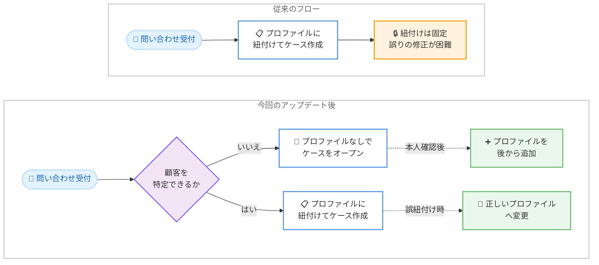

# Amazon Connect Customer (Cases) - ケースに紐付く顧客プロファイルの更新・後付け対応

**リリース日**: 2026 年 8 月 25 日
**サービス**: Amazon Connect Customer (Cases)
**機能**: ケース作成後の顧客プロファイルの変更および追加 (Flexible Profiles)

📊 [このアップデートのインフォグラフィックを見る](https://takech9203.github.io/aws-news-summary/20260825-amazon-connect-cases-flexible-profiles.html)

## 概要

Amazon Connect Customer (Cases) において、ケースに紐付けられた顧客プロファイルをケース作成後に変更したり、プロファイルが未設定のケースに後からプロファイルを追加したりできるようになりました。Cases はコンタクトセンターにおける顧客の問い合わせ (ケース) を追跡・共同対応・解決するための機能であり、顧客プロファイル (Customer Profiles) と連携して「誰の問い合わせか」を管理します。

今回のアップデートにより、誤った顧客プロファイルに紐付けてケースを作成してしまった場合でも、エージェントが正しいプロファイルに付け替えてケース履歴を正確に保つことができます。また、共有電話番号からの着信や本人確認が必要な問い合わせなど、ケース作成時点では顧客を特定できないシナリオでも、まずケースを作成しておき、顧客が特定できた時点でプロファイルを追加するという柔軟な運用が可能になります。

コンタクトセンターの管理者およびエージェントにとって、ケースと顧客データの整合性を維持しやすくなる、実務上の重要な改善です。

**アップデート前の課題**

このアップデート以前は、ケースと顧客プロファイルの紐付けが固定的でした。

- ケースを誤った顧客プロファイルに紐付けて作成した場合、後から正しいプロファイルへ付け替えることができず、ケース履歴が不正確なままになっていた
- 共有電話番号からの着信など、ケース作成時点で顧客を特定できないシナリオへの対応が難しかった
- 本人確認が完了する前に問い合わせ内容を記録したい場合でも、プロファイルの紐付けを前提としたケース作成フローに制約されていた

**アップデート後の改善**

今回のアップデートにより、ケースと顧客プロファイルの関係を柔軟に管理できるようになりました。

- ケースに紐付けられた顧客プロファイルを、ケース作成後に別のプロファイルへ変更できるようになった
- 顧客プロファイルが未設定のままケースをオープンし、顧客を特定した時点でプロファイルを後から追加できるようになった
- 誤紐付けの修正が可能になったことで、ケース履歴と顧客データの正確性を維持しやすくなった

## アーキテクチャ図



従来はケース作成時にプロファイルの紐付けが固定されていましたが、アップデート後はプロファイルなしでのケースオープン、後からのプロファイル追加、誤紐付けの修正が可能になります。

## サービスアップデートの詳細

### 主要機能

1. **ケースに紐付いた顧客プロファイルの変更**
   - ケースが誤った顧客プロファイルに紐付けられている場合、エージェントが正しいプロファイルへ付け替え可能
   - ケース履歴を正確に保ち、顧客対応の品質とデータ整合性を維持
   - クローズされていないケースはエージェントワークスペースから編集可能

2. **ケース作成後のプロファイル追加**
   - ケース作成時点で顧客を特定できない場合でも、プロファイル未設定のままケースをオープン可能
   - 共有電話番号からの着信や、本人確認が必要な問い合わせなどのシナリオに対応
   - 顧客が特定できた時点で、該当する顧客プロファイルをケースに追加

3. **Customer Profiles との連携強化**
   - Cases は Amazon Connect Customer Profiles の顧客データと連携し、ケースの `customer_id` (プロファイル ARN) で顧客を識別
   - プロファイルの付け替え・追加により、顧客単位でのケース検索や履歴参照の正確性が向上

## 技術仕様

### ケースと顧客プロファイルの関係

| 項目 | 詳細 |
|------|------|
| ケース (Case) | 顧客の問い合わせを記録し、解決までの手順・対応・結果を管理する単位 |
| 顧客プロファイル | Amazon Connect Customer Profiles で管理される顧客情報。ケースの `customer_id` フィールドにプロファイル ARN として紐付け |
| プロファイル変更 | ケース作成後に別のプロファイルへ付け替え可能 (今回のアップデート) |
| プロファイル追加 | プロファイル未設定のケースに後から追加可能 (今回のアップデート) |
| 操作場所 | エージェントワークスペースのケース編集画面 |

### API 変更履歴

今回の発表に対応する Amazon Connect Cases API の新規変更は、直近の API 変更履歴 (awsapichanges.com) では確認されていません。ケースのフィールド更新は既存の [UpdateCase API](https://docs.aws.amazon.com/cases/latest/APIReference/API_UpdateCase.html) (フィールド ID と値のペアで更新) を通じて行われ、本機能は主にエージェントワークスペースでの操作性向上として提供されます。

## 設定方法

### 前提条件

1. Amazon Connect インスタンスで Cases が有効化されていること
2. Amazon Connect Customer Profiles が有効化され、顧客プロファイルが管理されていること
3. エージェントのセキュリティプロファイルに Cases の編集権限が割り当てられていること

### 手順

#### ステップ 1: Cases の有効化と権限設定を確認する

Amazon Connect 管理者 Web サイトで Cases ドメインを有効化し、エージェントのセキュリティプロファイルに Cases 関連の権限 (ケースの表示・編集) を割り当てます。詳細は[管理者ガイド](https://docs.aws.amazon.com/connect/latest/adminguide/cases.html)を参照してください。

#### ステップ 2: エージェントワークスペースでケースを編集する

エージェントワークスペースで対象のケースを開き、[Edit] を選択して編集します。ケースが Closed ステータスの場合は、先にステータスを更新してから編集します。

#### ステップ 3: 顧客プロファイルを変更または追加する

ケース編集画面で、紐付ける顧客プロファイルを正しいものに変更するか、プロファイル未設定のケースに顧客プロファイルを追加し、[Save] で保存します。保存後、ケースは指定した顧客プロファイルに関連付けられ、顧客単位のケース履歴に反映されます。

## メリット

### ビジネス面

- **ケース履歴の正確性向上**: 誤紐付けを修正できるため、顧客ごとの対応履歴が正確になり、後続対応や監査の品質が向上する
- **初動対応の迅速化**: 顧客特定を待たずにケースを作成できるため、問い合わせ内容の記録と対応開始が早くなる
- **顧客体験の改善**: 正確な顧客コンテキストに基づいた対応により、パーソナライズされたサポートを提供できる

### 技術面

- **柔軟なケース作成フロー**: プロファイル紐付けを前提としない運用が可能になり、フローや業務プロセスの設計自由度が向上する
- **データ整合性の維持**: Customer Profiles とケースデータの関連付けを後から是正でき、CRM データの品質を保てる
- **追加開発が不要**: エージェントワークスペースの標準機能として提供され、カスタム実装なしで利用できる

## デメリット・制約事項

### 制限事項

- Closed ステータスのケースは直接編集できず、先にステータスを変更する必要がある
- ケースの編集にはセキュリティプロファイルでの適切な権限割り当てが必要
- Cases が利用可能なリージョンは 10 リージョンに限定される

### 考慮すべき点

- プロファイルの付け替えは顧客単位のケース履歴・レポートに影響するため、運用ルール (誰がいつ付け替えを行うか) を定めておくことが望ましい
- プロファイル未設定のケースを許容する場合、後から確実にプロファイルを追加する業務フローを整備しないと、顧客に紐付かないケースが蓄積する可能性がある

## ユースケース

### ユースケース 1: 誤った顧客プロファイルへの紐付け修正

**シナリオ**: エージェントが同姓同名の別顧客のプロファイルを選択してケースを作成してしまった。従来は修正できず、ケース履歴が不正確なままだった。

**実装例**:
```
1. エージェントワークスペースで対象ケースを開く
2. [Edit] を選択し、紐付ける顧客プロファイルを正しい顧客に変更
3. [Save] で保存し、ケース履歴を正しい顧客に反映
```

**効果**: 顧客ごとのケース履歴が正確になり、誤った顧客情報に基づく対応ミスを防止できる。

### ユースケース 2: 共有電話番号からの問い合わせ対応

**シナリオ**: 家族や職場で共有されている電話番号から着信があり、発信者番号だけでは問い合わせ者本人のプロファイルを特定できない。

**実装例**:
```
1. 顧客プロファイルを紐付けずにケースをオープンし、問い合わせ内容を記録
2. 会話の中で本人を特定 (氏名、会員番号などを確認)
3. 特定できた顧客プロファイルをケースに追加して保存
```

**効果**: 顧客特定を待たずに問い合わせの記録と対応を開始でき、初動が迅速になる。

### ユースケース 3: 本人確認が必要な問い合わせの記録

**シナリオ**: 契約内容の変更依頼など本人確認が必須の問い合わせで、確認が完了するまで正式に顧客と紐付けられない。

**実装例**:
```
1. 本人確認前にプロファイル未設定のケースを作成し、依頼内容を記録
2. 本人確認プロセス (書類確認、コールバックなど) を実施
3. 確認完了後、該当顧客のプロファイルをケースに追加
```

**効果**: コンプライアンス要件を守りながら、問い合わせの取りこぼしなくケース管理ができる。

## 料金

今回の発表に追加料金の記載はありません。Amazon Connect Cases の標準料金 (作成されたケース数に基づく従量課金) が適用されます。詳細は [Amazon Connect 料金ページ](https://aws.amazon.com/connect/pricing/)を参照してください。

## 利用可能リージョン

Amazon Connect Cases は以下の 10 リージョンで利用可能です。

- 米国東部 (バージニア北部)
- 米国西部 (オレゴン)
- カナダ (中部)
- 欧州 (フランクフルト)
- 欧州 (ロンドン)
- アジアパシフィック (ソウル)
- アジアパシフィック (シンガポール)
- アジアパシフィック (シドニー)
- アジアパシフィック (東京)
- アフリカ (ケープタウン)

## 関連サービス・機能

- **Amazon Connect Customer Profiles**: 顧客情報を統合管理するサービス。ケースに紐付ける顧客プロファイルの管理基盤
- **Amazon Connect エージェントワークスペース**: エージェントがケースの作成・編集・プロファイル変更を行う統合 UI
- **Amazon Connect Tasks**: ケースからフォローアップタスクを作成し、解決までの作業をルーティングする機能

## 参考リンク

- 📊 [インフォグラフィック](https://takech9203.github.io/aws-news-summary/20260825-amazon-connect-cases-flexible-profiles.html)
- [公式発表 (What's New)](https://aws.amazon.com/about-aws/whats-new/2026/08/amazon-connect-cases-flexible-profiles/)
- [Amazon Connect Cases 製品ページ](https://aws.amazon.com/products/connect/customer/cases/)
- [ドキュメント (管理者ガイド - Cases)](https://docs.aws.amazon.com/connect/latest/adminguide/cases.html)
- [ドキュメント (ケースの編集)](https://docs.aws.amazon.com/connect/latest/adminguide/cm-editcases.html)
- [料金ページ](https://aws.amazon.com/connect/pricing/)

## まとめ

Amazon Connect Customer (Cases) で、ケースに紐付く顧客プロファイルの変更と後付け追加が可能になり、誤紐付けの修正や顧客未特定時のケース作成といった実務上のニーズに対応できるようになりました。Cases を利用中のコンタクトセンターは、プロファイル付け替えの運用ルールと、未紐付けケースへのプロファイル追加フローを整備した上で、この機能の活用を検討することを推奨します。
