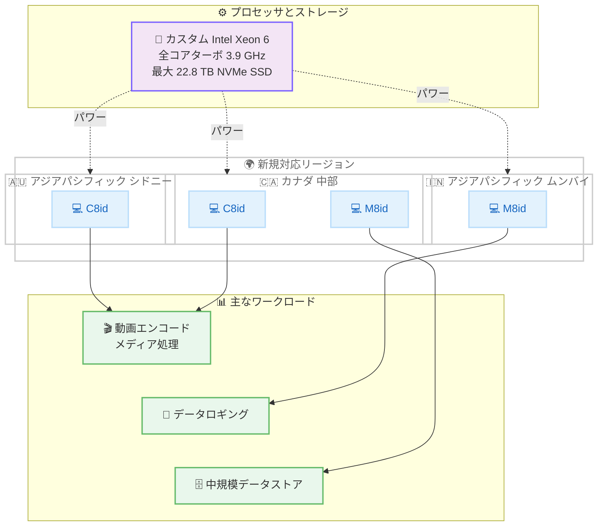

# Amazon EC2 - C8id および M8id インスタンスが追加リージョンで利用可能に

**リリース日**: 2026 年 8 月 25 日
**サービス**: Amazon EC2
**機能**: C8id, M8id インスタンスのリージョン拡大

📊 [このアップデートのインフォグラフィックを見る](https://takech9203.github.io/aws-news-summary/20260825-amazon-ec2-c8id-m8id-aws-regions.html)

## 概要

AWS は 2026 年 8 月 25 日、カスタム Intel Xeon 6 プロセッサを搭載した Amazon EC2 C8id および M8id インスタンスが、追加リージョンで利用可能になったことを発表しました。C8id インスタンスはアジアパシフィック (シドニー) およびカナダ (中部) リージョンで、M8id インスタンスはアジアパシフィック (ムンバイ) およびカナダ (中部) リージョンで新たに利用できます。

C8id および M8id インスタンスは、AWS 上でのみ利用可能なカスタム Intel Xeon 6 プロセッサを搭載し、持続的な全コアターボ周波数 3.9 GHz を実現します。前世代の第 6 世代インスタンス (C6id/M6id) と比較して、最大 43% 高いコンピューティング性能と 3.3 倍のメモリ帯域幅を提供し、vCPU 数、メモリ容量、ローカルストレージ容量はいずれも 3 倍に拡大されています。最大 22.8 TB のローカル NVMe SSD ブロックストレージを備え、I/O 集約型ワークロードに最適です。

**アップデート前の課題**

- オーストラリア、インド、カナダのユーザーは、ローカル NVMe ストレージ付きの第 8 世代 Intel インスタンスを自国に近いリージョンで利用できなかった
- データレジデンシー要件がある場合、これらの地域では前世代の C6id/M6id インスタンスなどを選択する必要があった
- 最新世代の性能を活用するには、リージョン間通信によるレイテンシー増加を許容する必要があった

**アップデート後の改善**

- C8id インスタンスがアジアパシフィック (シドニー) とカナダ (中部) で利用可能になり、オセアニアおよびカナダのコンピュート集約型ワークロードを低レイテンシーで実行可能に
- M8id インスタンスがアジアパシフィック (ムンバイ) とカナダ (中部) で利用可能になり、インドおよびカナダの汎用ワークロードで最新世代の性能を活用可能に
- 前世代比最大 43% の性能向上と 3.3 倍のメモリ帯域幅を、より多くのリージョンのデータレジデンシー要件を満たしながら利用可能に

## アーキテクチャ図



このアーキテクチャ図は、今回のリージョン拡大で C8id および M8id インスタンスが新たに利用可能になった 3 つのリージョンと、カスタム Intel Xeon 6 プロセッサが対応する主なワークロードの関係を示しています。

## サービスアップデートの詳細

### 主要機能

1. **リージョン拡大の詳細**
   - C8id: アジアパシフィック (シドニー)、カナダ (中部) リージョンに追加
   - M8id: アジアパシフィック (ムンバイ)、カナダ (中部) リージョンに追加

2. **高性能プロセッサ**
   - AWS でのみ利用可能なカスタム Intel Xeon 6 プロセッサを搭載
   - 持続的な全コアターボ周波数 3.9 GHz
   - 前世代の C6id/M6id と比較して最大 43% のコンピューティング性能向上
   - 3.3 倍のメモリ帯域幅

3. **大容量ローカルストレージ**
   - 最大 22.8 TB のローカル NVMe SSD ブロックストレージ
   - vCPU、メモリ、ローカルストレージがいずれも前世代の 3 倍
   - I/O 集約型データベースワークロードで最大 46% の性能向上
   - リアルタイムデータ分析で最大 30% 高速なクエリ結果

4. **柔軟な帯域幅設定**
   - EC2 インスタンス帯域幅重み付け設定により、ネットワーク帯域幅と EBS 帯域幅を 25% の範囲で柔軟に調整可能

5. **EFA ネットワーキング**
   - 24xlarge、48xlarge、metal-24xl、metal-48xl サイズで Elastic Fabric Adapter を利用可能

## 技術仕様

### インスタンスファミリー比較

| ファミリー | 用途 | 主なワークロード |
|-----------|------|-----------------|
| C8id | コンピュート最適化 + ローカル NVMe SSD | 動画エンコード、画像処理、メディア処理などの高速ローカルストレージを必要とするコンピュート集約型ワークロード |
| M8id | 汎用 + ローカル NVMe SSD | データロギング、メディア処理、中規模データストアなどのコンピュートとメモリのバランスが必要なワークロード |

### 性能向上の詳細

| メトリクス | 前世代比 (C6id/M6id) |
|-----------|---------------------|
| コンピューティング性能 | 最大 43% 向上 |
| メモリ帯域幅 | 3.3 倍 |
| vCPU、メモリ、ローカルストレージ容量 | 3 倍 |
| I/O 集約型データベース | 最大 46% 向上 |
| リアルタイムデータ分析クエリ | 最大 30% 高速化 |
| 帯域幅の柔軟な配分 | 25% (帯域幅重み付け設定) |

## 設定方法

### 前提条件

1. AWS アカウントと EC2 起動権限
2. 対象リージョン (シドニー、ムンバイ、カナダ中部) へのアクセス
3. 適切なサービスクォータの確認

### 手順

#### ステップ 1: 利用可能なインスタンスタイプの確認

```bash
# シドニーリージョンで利用可能な C8id インスタンスタイプを確認
aws ec2 describe-instance-types \
  --filters "Name=instance-type,Values=c8id*" \
  --region ap-southeast-2 \
  --query "InstanceTypes[].{Type:InstanceType,vCPU:VCpuInfo.DefaultVCpus,Memory:MemoryInfo.SizeInMiB}" \
  --output table
```

このコマンドは、シドニーリージョン (ap-southeast-2) で利用可能な C8id インスタンスタイプとそのスペックを表示します。

#### ステップ 2: インスタンスの起動

```bash
# ムンバイリージョンで M8id インスタンスを起動
aws ec2 run-instances \
  --instance-type m8id.4xlarge \
  --image-id ami-xxxxxxxxxxxxxxxxx \
  --subnet-id subnet-xxxxxxxxxxxxxxxxx \
  --security-group-ids sg-xxxxxxxxxxxxxxxxx \
  --key-name my-key-pair \
  --region ap-south-1
```

このコマンドは、ムンバイリージョン (ap-south-1) で M8id インスタンスを起動します。

#### ステップ 3: 帯域幅重み付け設定の確認

```bash
# インスタンスタイプが帯域幅の重み付け調整をサポートしているか確認
aws ec2 describe-instance-types \
  --instance-types c8id.24xlarge \
  --query 'InstanceTypes[0].NetworkInfo.BandwidthWeightingSupport' \
  --region ca-central-1
```

インスタンスタイプが EC2 インスタンス帯域幅重み付け設定をサポートしているか確認します。ネットワークまたは EBS の帯域幅を 25% の範囲で優先配分できます。

#### ステップ 4: 購入オプションの選択

C8id および M8id インスタンスは、以下の購入オプションで利用できます。

- **Savings Plans**: 1 年または 3 年のコミットメントで割引
- **オンデマンドインスタンス**: 使用した分だけ支払い
- **スポットインスタンス**: 未使用の EC2 容量を大幅な割引で利用

## メリット

### ビジネス面

- **低レイテンシーでの提供**: オーストラリア、インド、カナダの国内ユーザー向けワークロードを、地理的に近いリージョンで低レイテンシーに実行可能
- **データレジデンシー対応**: 各国のデータ所在地要件を満たしながら、最新世代の高性能インスタンスを利用可能
- **コスト効率の向上**: 前世代比最大 43% の性能向上により、少ないインスタンス数で同等以上のパフォーマンスを実現可能
- **柔軟な購入オプション**: Savings Plans、オンデマンド、スポットインスタンスに対応

### 技術面

- **高い I/O 性能**: 最大 22.8 TB のローカル NVMe SSD ストレージによる低レイテンシーなブロックレベルアクセス
- **大幅なメモリ帯域幅向上**: 前世代比 3.3 倍のメモリ帯域幅により、データ処理の高速化を実現
- **帯域幅の柔軟な配分**: 帯域幅重み付け設定により、ネットワークと EBS の帯域幅を 25% の範囲でワークロードに合わせて調整可能
- **EFA 対応**: 24xlarge 以上の対象サイズで EFA を利用でき、ノード間通信が多い分散ワークロードにも対応

## デメリット・制約事項

### 制限事項

- 今回の発表対象は C8id と M8id のみで、追加されるリージョンもファミリーごとに異なる (シドニーは C8id のみ、ムンバイは M8id のみ)
- EFA は 24xlarge、48xlarge、metal-24xl、metal-48xl の各サイズに限定される
- 前世代インスタンスからの移行には AMI やドライバの互換性確認が必要

### 考慮すべき点

- ローカル NVMe SSD はインスタンスストレージ (エフェメラルストレージ) のため、インスタンス停止時にデータが失われる。永続的なデータ保存には Amazon EBS との併用が必要
- ワークロード特性 (コンピュート集約型か汎用か) に応じて C8id と M8id を適切に選択する必要がある
- スポットインスタンスを利用する場合は中断リスクを考慮した設計が必要

## ユースケース

### ユースケース 1: シドニーリージョンでの動画エンコード基盤

**シナリオ**: オーストラリアのメディア企業が、大量の動画コンテンツのエンコードとトランスコードを国内リージョンで高速に処理したい。

**実装例**:
```bash
# シドニーリージョンで C8id インスタンスを起動
aws ec2 run-instances \
  --instance-type c8id.8xlarge \
  --image-id ami-xxxxxxxxxxxxxxxxx \
  --subnet-id subnet-xxxxxxxxxxxxxxxxx \
  --security-group-ids sg-xxxxxxxxxxxxxxxxx \
  --key-name my-key-pair \
  --region ap-southeast-2
```

**効果**: C8id のコンピュート最適化性能とローカル NVMe SSD による高速 I/O により、中間ファイルの読み書きを含むエンコード処理全体を高速化。前世代比最大 43% の性能向上により処理時間とコストを削減。

### ユースケース 2: ムンバイリージョンでのデータロギング基盤

**シナリオ**: インドのフィンテック企業が、大量のトランザクションログを国内で収集・処理し、データレジデンシー要件を満たしながら分析基盤に供給したい。

**実装例**:
```bash
# ムンバイリージョンで M8id インスタンスを起動
aws ec2 run-instances \
  --instance-type m8id.12xlarge \
  --image-id ami-xxxxxxxxxxxxxxxxx \
  --subnet-id subnet-xxxxxxxxxxxxxxxxx \
  --security-group-ids sg-xxxxxxxxxxxxxxxxx \
  --key-name my-key-pair \
  --region ap-south-1
```

**効果**: M8id のバランスの取れたコンピュートとメモリ、ローカル NVMe SSD への高速書き込みにより、高スループットなログ収集を実現。リアルタイムデータ分析では最大 30% 高速なクエリ結果を期待できる。

### ユースケース 3: カナダ中部リージョンでの中規模データストア

**シナリオ**: カナダの企業が、国内のデータレジデンシー要件を満たしながら、I/O 集約型の中規模データベースを運用したい。

**実装例**:
```bash
# カナダ中部リージョンで M8id インスタンスを起動し、EBS 帯域幅を優先
aws ec2 run-instances \
  --instance-type m8id.16xlarge \
  --image-id ami-xxxxxxxxxxxxxxxxx \
  --subnet-id subnet-xxxxxxxxxxxxxxxxx \
  --security-group-ids sg-xxxxxxxxxxxxxxxxx \
  --key-name my-key-pair \
  --region ca-central-1
```

**効果**: I/O 集約型データベースワークロードで前世代比最大 46% の性能向上を実現。帯域幅重み付け設定で EBS 帯域幅を優先配分することで、永続ストレージへのスループットも最適化できる。

## 料金

C8id および M8id インスタンスの料金は、インスタンスタイプ、リージョン、購入オプションによって異なります。

### 購入オプション

| オプション | 特徴 |
|-----------|------|
| Savings Plans | 1 年または 3 年のコミットメントで割引 |
| オンデマンド | コミットメントなし、時間単位の課金 |
| スポットインスタンス | 未使用容量を大幅な割引で利用、中断の可能性あり |

詳細な料金については、[Amazon EC2 料金ページ](https://aws.amazon.com/ec2/pricing/) をご確認ください。

## 利用可能リージョン

今回のアップデートで新たに追加されたリージョンは以下の通りです。

| インスタンス | 新規追加リージョン |
|-------------|-------------------|
| C8id | アジアパシフィック (シドニー) - ap-southeast-2、カナダ (中部) - ca-central-1 |
| M8id | アジアパシフィック (ムンバイ) - ap-south-1、カナダ (中部) - ca-central-1 |

利用可能なリージョンの全体像は、[AWS リージョン別サービス一覧](https://aws.amazon.com/about-aws/global-infrastructure/regional-product-services/) または各インスタンスタイプのページをご確認ください。

## 関連サービス・機能

- **Amazon EBS**: 永続ストレージとの組み合わせ。帯域幅重み付け設定で EBS 帯域幅を優先配分可能
- **Elastic Fabric Adapter (EFA)**: 24xlarge 以上の対象サイズで利用可能な高性能ネットワークインターフェイス
- **AWS Nitro System**: C8id/M8id インスタンスの基盤となるハイパーバイザーテクノロジー
- **Amazon EC2 Auto Scaling**: 需要に応じた自動スケーリングによる効率的なインスタンス管理
- **AWS Compute Optimizer**: ワークロードに最適なインスタンスタイプの推奨

## 参考リンク

- 📊 [インフォグラフィック](https://takech9203.github.io/aws-news-summary/20260825-amazon-ec2-c8id-m8id-aws-regions.html)
- [公式発表 (What's New)](https://aws.amazon.com/about-aws/whats-new/2026/08/amazon-ec2-c8id-m8id-aws-regions/)
- [Amazon EC2 C8i/C8id インスタンス](https://aws.amazon.com/ec2/instance-types/c8i/)
- [Amazon EC2 M8i/M8id インスタンス](https://aws.amazon.com/ec2/instance-types/m8i/)
- [Amazon EC2 料金ページ](https://aws.amazon.com/ec2/pricing/)

## まとめ

Amazon EC2 C8id インスタンスがアジアパシフィック (シドニー) とカナダ (中部) で、M8id インスタンスがアジアパシフィック (ムンバイ) とカナダ (中部) で利用可能になりました。カスタム Intel Xeon 6 プロセッサによる前世代比最大 43% の性能向上、3.3 倍のメモリ帯域幅、最大 22.8 TB のローカル NVMe SSD ストレージを、これらの地域のデータレジデンシー要件を満たしながら活用できます。対象リージョンで C6id/M6id などの前世代インスタンスや I/O 集約型ワークロードを運用している場合は、最新世代への移行を検討してください。
