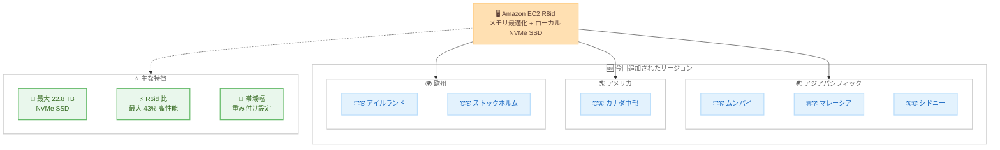

# Amazon EC2 - R8id インスタンスの提供リージョン拡大

**リリース日**: 2026 年 8 月 25 日
**サービス**: Amazon EC2 (Elastic Compute Cloud)
**機能**: Amazon EC2 R8id インスタンスの追加リージョン展開

📊 [このアップデートのインフォグラフィックを見る](https://takech9203.github.io/aws-news-summary/20260825-amazon-ec2-r8id.html)

## 概要

Amazon EC2 R8id インスタンスが、新たに 6 つのリージョンで利用可能になりました。今回追加されたのは、アジアパシフィック (ムンバイ、マレーシア、シドニー)、カナダ (中部)、欧州 (アイルランド、ストックホルム) の各リージョンです。

R8id インスタンスは、メモリ最適化インスタンスに高性能なローカル NVMe SSD ストレージを組み合わせたインスタンスタイプです。最大 22.8 TB の NVMe SSD ローカルインスタンスストレージ (R6id の 3 倍) を搭載し、R6id と比較して最大 3.3 倍のメモリ帯域幅、最大 43% 高いパフォーマンスを提供します。インメモリデータベース、リアルタイムビッグデータ分析、大規模インメモリキャッシュ、高速なローカルストレージを必要とするデータ処理アプリケーションなど、メモリ集約型ワークロードに最適です。

さらに、EC2 インスタンス帯域幅重み付け設定 (bandwidth weighting configuration) により、ネットワーク帯域幅と Amazon EBS 帯域幅の割り当てを 25% 調整できるため、ワークロードの特性に合わせた帯域幅リソースの最適化が可能です。

**アップデート前の課題**

今回の展開以前は、対象リージョンのユーザーに以下の制約がありました。

- ムンバイ、マレーシア、シドニー、カナダ中部、アイルランド、ストックホルムの各リージョンでは R8id インスタンスを利用できなかった
- これらのリージョンでは、ローカル NVMe SSD 付きメモリ最適化インスタンスとして旧世代の R6id などを使い続ける必要があった
- データレジデンシー要件により特定リージョンでの稼働が必須のワークロードは、最新世代の性能向上 (最大 43% の性能向上、3.3 倍のメモリ帯域幅) を享受できなかった

**アップデート後の改善**

今回のアップデートにより、以下が可能になりました。

- 上記 6 リージョンで R8id インスタンスを起動できるようになった
- 対象リージョンのワークロードを R6id から移行することで、最大 43% の性能向上と 3 倍のローカルストレージ容量を活用できるようになった
- 帯域幅重み付け設定により、ネットワークと EBS の帯域幅バランスをワークロードに合わせて調整できるようになった

## アーキテクチャ図



R8id インスタンスが新たに 6 リージョンに展開され、各地域のメモリ集約型ワークロードで最新世代の性能とローカル NVMe SSD ストレージを利用できるようになりました。

## サービスアップデートの詳細

### 主要機能

1. **大容量ローカル NVMe SSD ストレージ**
   - 最大 22.8 TB の NVMe SSD ローカルインスタンスストレージを搭載
   - 前世代の R6id と比較して 3 倍のストレージ容量
   - インメモリデータベースのスナップショット保存や一時データ処理など、低レイテンシーのローカルストレージを必要とするワークロードに最適

2. **メモリ帯域幅とパフォーマンスの向上**
   - R6id と比較して最大 3.3 倍のメモリ帯域幅を提供
   - R6id と比較して最大 43% 高いパフォーマンスを実現
   - R8i ファミリーは AWS 専用にカスタマイズされた Intel Xeon 6 プロセッサを搭載し、全コア持続ターボ周波数は 3.9 GHz

3. **EC2 インスタンス帯域幅重み付け設定**
   - ネットワーク帯域幅と Amazon EBS 帯域幅の割り当てを 25% 調整可能
   - ネットワーク重視または EBS 重視のワークロードに合わせて帯域幅リソースを最適化できる

4. **Elastic Fabric Adapter (EFA) 対応**
   - 24xlarge、48xlarge、metal-24xl、metal-48xl の各サイズで EFA ネットワーキングをサポート
   - ノード間通信のレイテンシーを低減し、密結合ワークロードのスケールアウトを支援

## 技術仕様

### R8id インスタンスの主な仕様

| 項目 | 詳細 |
|------|------|
| インスタンスファミリー | メモリ最適化 (R ファミリー) + ローカル NVMe SSD |
| プロセッサ | AWS 専用カスタム Intel Xeon 6 (全コア持続ターボ 3.9 GHz、R8i ファミリー共通) |
| ローカルストレージ | 最大 22.8 TB NVMe SSD (R6id の 3 倍) |
| メモリ帯域幅 | R6id 比で最大 3.3 倍 |
| パフォーマンス | R6id 比で最大 43% 向上 |
| EFA 対応サイズ | 24xlarge、48xlarge、metal-24xl、metal-48xl |
| 帯域幅重み付け | ネットワーク / EBS 帯域幅を 25% 調整可能 |
| 購入オプション | Savings Plans、オンデマンド、スポットインスタンス |

## 設定方法

### 前提条件

1. AWS アカウントを保有していること
2. 対象リージョン (ムンバイ、マレーシア、シドニー、カナダ中部、アイルランド、ストックホルムなど) を利用できること
3. R8id インスタンスタイプに対応した AMI を用意していること

### 手順

#### ステップ1: 対象リージョンで利用可能なサイズを確認

```bash
aws ec2 describe-instance-type-offerings \
  --region ap-south-1 \
  --filters "Name=instance-type,Values=r8id.*" \
  --query "InstanceTypeOfferings[].InstanceType" \
  --output table
```

ムンバイリージョン (ap-south-1) で提供されている R8id インスタンスのサイズ一覧を取得します。他のリージョンを確認する場合は `--region` を変更します。

#### ステップ2: R8id インスタンスを起動

```bash
aws ec2 run-instances \
  --region ap-south-1 \
  --instance-type r8id.4xlarge \
  --image-id ami-xxxxxxxxxxxxxxxxx \
  --key-name my-key-pair \
  --subnet-id subnet-xxxxxxxx \
  --count 1
```

ムンバイリージョンで r8id.4xlarge インスタンスを 1 台起動します。AMI ID、キーペア、サブネット ID は環境に合わせて指定します。

#### ステップ3: ローカル NVMe SSD ストレージをマウント

```bash
# インスタンスストアボリュームを確認
lsblk

# ファイルシステムを作成してマウント
sudo mkfs -t xfs /dev/nvme1n1
sudo mkdir /data
sudo mount /dev/nvme1n1 /data
```

インスタンスに接続後、ローカル NVMe SSD インスタンスストアにファイルシステムを作成してマウントします。インスタンスストアは揮発性のため、永続化が必要なデータは EBS や Amazon S3 に保存します。

## メリット

### ビジネス面

- **リージョン選択肢の拡大**: データレジデンシー要件のあるワークロードでも、インド、マレーシア、オーストラリア、カナダ、欧州の各地域で最新世代インスタンスを選択できる
- **コスト効率の向上**: R6id 比で最大 43% の性能向上により、同等ワークロードをより少ないインスタンス数で処理できる可能性がある
- **柔軟な購入オプション**: Savings Plans、オンデマンド、スポットインスタンスから、ワークロード特性に応じた調達が可能

### 技術面

- **大容量ローカルストレージ**: 最大 22.8 TB の NVMe SSD により、低レイテンシーが求められる一時データ処理やキャッシュ層を強化できる
- **メモリ帯域幅の大幅向上**: 最大 3.3 倍のメモリ帯域幅により、インメモリデータベースや分析ワークロードのスループットが向上する
- **帯域幅の柔軟な配分**: 帯域幅重み付け設定により、ネットワーク重視・EBS 重視のいずれのワークロードにも帯域幅を最適化できる

## デメリット・制約事項

### 制限事項

- EFA ネットワーキングは 24xlarge、48xlarge、metal-24xl、metal-48xl の各サイズに限定される
- ローカル NVMe SSD インスタンスストアは揮発性であり、インスタンスの停止・終了時にデータが失われる
- 東京および大阪リージョンでの提供は今回の発表には含まれていない

### 考慮すべき点

- インスタンスストア上の重要データは、EBS や Amazon S3 への定期的なバックアップが必要
- R6id など旧世代からの移行時は、アプリケーションの互換性とベンチマークによる性能検証を実施することが望ましい
- 帯域幅重み付け設定を利用する場合は、ネットワークと EBS のどちらの帯域幅を優先するか、ワークロードの I/O 特性を事前に把握しておく必要がある

## ユースケース

### ユースケース1: インメモリデータベースの地域内ホスティング

**シナリオ**: インドのユーザー向けサービスで、データレジデンシー要件によりムンバイリージョンでの稼働が必須の SAP HANA や Redis などのインメモリデータベースを運用している。

**実装例**:
```bash
aws ec2 run-instances \
  --region ap-south-1 \
  --instance-type r8id.24xlarge \
  --image-id ami-xxxxxxxxxxxxxxxxx \
  --subnet-id subnet-xxxxxxxx
```

**効果**: 最大 3.3 倍のメモリ帯域幅により、クエリスループットとレスポンスタイムが改善する。ローカル NVMe SSD をログ領域やスナップショット保存に活用し、永続化処理を高速化できる。

### ユースケース2: リアルタイムビッグデータ分析基盤

**シナリオ**: 欧州のストックホルムリージョンで Apache Spark ベースのリアルタイム分析基盤を運用しており、シャッフルデータの書き込み性能がボトルネックになっている。

**実装例**:
```bash
# Spark のローカルディレクトリを NVMe SSD 上に設定
spark-submit \
  --conf spark.local.dir=/data/spark-tmp \
  --conf spark.executor.memory=96g \
  analytics_job.py
```

**効果**: 最大 22.8 TB のローカル NVMe SSD をシャッフル領域として活用することで、ディスク I/O ボトルネックを解消し、ジョブ実行時間を短縮できる。

### ユースケース3: 帯域幅重み付けによる EBS 集約型ワークロードの最適化

**シナリオ**: カナダ中部リージョンで大規模データベースを運用しており、ネットワーク帯域幅よりも EBS 帯域幅を優先的に確保したい。

**実装例**:
```bash
aws ec2 run-instances \
  --region ca-central-1 \
  --instance-type r8id.48xlarge \
  --image-id ami-xxxxxxxxxxxxxxxxx \
  --network-performance-options "BandwidthWeighting=ebs-1"
```

**効果**: 帯域幅重み付け設定により EBS 帯域幅を 25% 引き上げ、EBS への読み書きが集中するデータベースワークロードのスループットを向上できる。

## 料金

R8id インスタンスは、以下の購入オプションで利用できます。

- **オンデマンドインスタンス**: 初期費用なしの従量課金
- **Savings Plans**: 1 年または 3 年のコミットメントによる割引
- **スポットインスタンス**: 未使用キャパシティを活用した大幅な割引

料金はリージョンおよびインスタンスサイズにより異なります。最新の料金は [Amazon EC2 料金ページ](https://aws.amazon.com/ec2/pricing/) を参照してください。

## 利用可能リージョン

今回のアップデートにより、以下の 6 リージョンで新たに利用可能になりました。

- アジアパシフィック (ムンバイ)
- アジアパシフィック (マレーシア)
- アジアパシフィック (シドニー)
- カナダ (中部)
- 欧州 (アイルランド)
- 欧州 (ストックホルム)

その他の提供リージョンは [Amazon EC2 R8id インスタンスページ](https://aws.amazon.com/ec2/instance-types/r8i/) を参照してください。

## 関連サービス・機能

- **Amazon EC2 R8i / R8i-flex インスタンス**: ローカルストレージを持たない同世代のメモリ最適化インスタンス。ローカル NVMe SSD が不要な場合の選択肢
- **Amazon EC2 R6id インスタンス**: 前世代のローカル NVMe SSD 付きメモリ最適化インスタンス。R8id への移行で最大 43% の性能向上が見込める
- **Amazon EBS**: 永続ストレージとして併用。帯域幅重み付け設定により EBS 帯域幅を優先する構成も可能
- **Elastic Fabric Adapter (EFA)**: 大規模サイズで利用可能な低レイテンシーネットワークインターフェイス。密結合ワークロードのノード間通信を高速化

## 参考リンク

- 📊 [インフォグラフィック](https://takech9203.github.io/aws-news-summary/20260825-amazon-ec2-r8id.html)
- [公式発表 (What's New)](https://aws.amazon.com/about-aws/whats-new/2026/08/amazon-ec2-r8id/)
- [Amazon EC2 R8i / R8id インスタンス](https://aws.amazon.com/ec2/instance-types/r8i/)
- [Amazon EC2 料金ページ](https://aws.amazon.com/ec2/pricing/)

## まとめ

Amazon EC2 R8id インスタンスがムンバイ、マレーシア、シドニー、カナダ中部、アイルランド、ストックホルムの 6 リージョンに拡大され、各地域のメモリ集約型ワークロードで最新世代の性能と最大 22.8 TB のローカル NVMe SSD を利用できるようになりました。対象リージョンで R6id などの旧世代インスタンスを利用中の場合は、最大 43% の性能向上が見込めるため、ベンチマークによる検証のうえで R8id への移行を検討することを推奨します。
