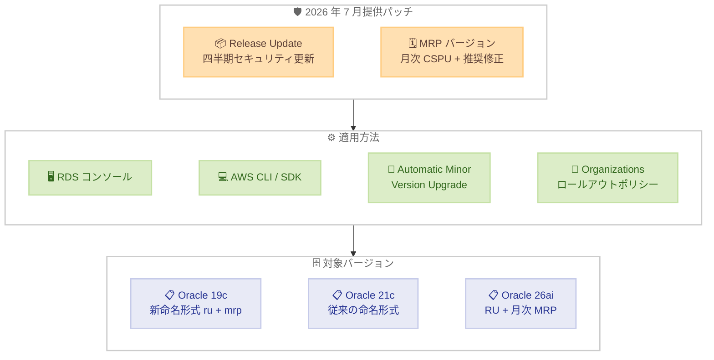

# Amazon RDS for Oracle - 2026 年 7 月 Release Update サポート

**リリース日**: 2026 年 8 月 25 日
**サービス**: Amazon RDS for Oracle
**機能**: Oracle 2026 年 7 月 Release Update (RU) のサポート

📊 [このアップデートのインフォグラフィックを見る](https://takech9203.github.io/aws-news-summary/20260825-amazon-rds-oracle-july-2026-release-update.html)

## 概要

Amazon RDS for Oracle が Oracle 2026 年 7 月 Release Update (RU) をサポートした。今回の RU は Oracle Database 19c、21c、26ai の 3 バージョンで利用可能であり、Oracle データベース製品向けのセキュリティ更新が含まれているため、AWS は 2026 年 7 月 RU へのアップグレードを推奨している。

今回のリリースからの重要な変更点として、Oracle Database 19c における RU の命名形式が `<version>.ru-<YYYY-MM>.mrp-<YYYY-MM>.r<N>` に変更された。例えば、Oracle Database 19c 向けの 2026 年 7 月四半期 RU は `19.0.0.0.ru-2026-07.mrp-2026-07.r1` という名称になる。また、Oracle が Oracle Database 19c および 26ai 向けに月次の Critical Security Patch Update (CSPU) をリリースした場合、Amazon RDS は CSPU と Oracle 推奨の追加修正をバンドルした MRP (Monthly Recommended Patch) バージョンとして提供する。Oracle Database 21c の RU は従来の命名形式を維持する。

**アップデート前の課題**

- 以前の RU バージョンでは 2026 年 7 月時点の最新セキュリティ脆弱性に対応できていなかった
- 四半期ごとの RU の間に公開されるセキュリティ修正を迅速に適用する標準的な仕組みが限定的だった
- 手動でのパッチ適用は運用負荷が高く、環境間で適用状況にばらつきが生じやすかった

**アップデート後の改善**

- Oracle Database 19c、21c、26ai の 3 バージョンで 2026 年 7 月時点の最新セキュリティパッチを RDS コンソール、SDK、CLI から適用可能になった
- 月次 CSPU が MRP バージョンとして提供されるようになり、四半期 RU を待たずにセキュリティ修正を適用できる体系が整った
- Automatic Minor Version Upgrade と AWS Organizations のアップグレードロールアウトポリシーを組み合わせ、非本番環境で検証してから本番環境へ自動適用する段階的なパッチ運用が可能

## アーキテクチャ図



2026 年 7 月 RU と月次 MRP バージョンを、コンソール、CLI、自動アップグレード、Organizations ロールアウトポリシーを通じて Oracle 19c / 21c / 26ai インスタンスに適用するフローを示している。

## サービスアップデートの詳細

### 主要機能

1. **2026 年 7 月 Release Update (RU) のサポート**
   - Oracle データベース製品向けのセキュリティ更新を含む
   - Oracle Database 19c、21c、26ai の 3 バージョンで利用可能
   - AWS は最新の RU へのアップグレードを推奨

2. **Oracle Database 19c の RU 命名形式の変更**
   - 2026 年 7 月リリースから、19c の RU 命名形式が `<version>.ru-<YYYY-MM>.mrp-<YYYY-MM>.r<N>` に変更
   - 2026 年 7 月四半期 RU のエンジンバージョンは `19.0.0.0.ru-2026-07.mrp-2026-07.r1`
   - Oracle Database 21c の RU は従来の命名形式を維持

3. **月次 Critical Security Patch Update (CSPU) の MRP 提供**
   - Oracle が Oracle Database 19c および 26ai 向けに月次 CSPU をリリースした場合、Amazon RDS は CSPU と Oracle 推奨の追加修正をバンドルした MRP バージョンとして提供
   - 四半期 RU の間もセキュリティ修正を継続的に適用可能

4. **段階的ロールアウトポリシー**
   - AWS Organizations のアップグレードロールアウトポリシーを使用して自動マイナーバージョンアップグレードを段階的に適用可能
   - 非本番環境へ自動適用して検証した後、同じ更新を本番環境へ自動適用するワークフローを実現

## 技術仕様

### サポート対象バージョンと命名形式

| Oracle バージョン | 2026 年 7 月 RU | 命名形式 | 月次 CSPU の MRP 提供 |
|-------------------|:---------------:|----------|:---------------------:|
| Oracle 19c | 対応 | `19.0.0.0.ru-2026-07.mrp-2026-07.r1` (新形式) | 対応 |
| Oracle 21c | 対応 | 従来形式を維持 | 非対応 |
| Oracle 26ai | 対応 | RU 形式 | 対応 |

### 適用方法

| 項目 | 詳細 |
|------|------|
| 手動適用 | RDS マネジメントコンソール、AWS SDK、AWS CLI |
| 自動適用 | Automatic Minor Version Upgrade (メンテナンスウィンドウ中に適用) |
| 段階的適用 | AWS Organizations アップグレードロールアウトポリシー |

## 設定方法

### 前提条件

1. Amazon RDS for Oracle インスタンスが稼働していること
2. Oracle Database 19c、21c、または 26ai を使用していること
3. RDS インスタンスへの変更権限 (IAM) を有していること

### 手順

#### ステップ 1: 利用可能なエンジンバージョンの確認 (AWS CLI)

```bash
aws rds describe-db-engine-versions \
  --engine oracle-ee \
  --query "DBEngineVersions[].EngineVersion" \
  --output table
```

Oracle Enterprise Edition で利用可能なエンジンバージョンの一覧を取得し、2026 年 7 月 RU のバージョン文字列を確認する。

#### ステップ 2: Release Update の適用 (AWS CLI)

```bash
aws rds modify-db-instance \
  --db-instance-identifier my-oracle-instance \
  --engine-version 19.0.0.0.ru-2026-07.mrp-2026-07.r1 \
  --apply-immediately
```

Oracle 19c インスタンスに 2026 年 7 月の Release Update を即時適用する。`--no-apply-immediately` に変更すると次のメンテナンスウィンドウで適用される。

#### ステップ 3: Automatic Minor Version Upgrade の有効化

```bash
aws rds modify-db-instance \
  --db-instance-identifier my-oracle-instance \
  --auto-minor-version-upgrade \
  --apply-immediately
```

今後の RU や MRP がメンテナンスウィンドウ中に自動的に適用されるように設定する。

#### ステップ 4: AWS Organizations ロールアウトポリシーの活用

AWS Organizations のアップグレードロールアウトポリシーを設定すると、自動マイナーバージョンアップグレードを組織内で段階的に展開できる。非本番アカウントの環境へ先に適用して検証した後、同じ更新を本番アカウントの環境へ自動適用する運用が可能になる。詳細は [Amazon RDS for Oracle ドキュメント](https://docs.aws.amazon.com/AmazonRDS/latest/UserGuide/USER_UpgradeDBInstance.Oracle.Minor.html#oracle-minor-version-upgrade-rollout) を参照。

## メリット

### ビジネス面

- **セキュリティコンプライアンスの維持**: 最新のセキュリティパッチを適用することで、規制要件やセキュリティポリシーへの準拠を維持できる
- **運用コストの削減**: 自動アップグレード機能と段階的ロールアウトにより、手動パッチ適用の作業負荷を軽減できる
- **リスクの低減**: 月次 MRP の提供により、四半期 RU を待たずに重大なセキュリティ修正を適用でき、脆弱性の暴露期間を短縮できる

### 技術面

- **3 バージョン同時サポート**: Oracle 19c、21c、26ai のいずれを利用していても最新のセキュリティ更新を適用可能
- **パッチ体系の明確化**: 新しい命名形式により、適用済みの RU と MRP の時期がエンジンバージョン文字列から判別しやすくなった
- **柔軟なデプロイメント**: 即時適用、メンテナンスウィンドウ適用、自動適用、組織全体での段階的適用から選択可能

## デメリット・制約事項

### 制限事項

- パッチ適用時にインスタンスの再起動が発生するため、短時間のダウンタイムが必要
- 月次 CSPU の MRP 提供は Oracle Database 19c および 26ai が対象であり、21c は対象外
- Oracle Database 21c は Oracle のサポートポリシー上イノベーションリリースであるため、長期運用には 19c または 26ai の利用を検討する必要がある

### 考慮すべき点

- 19c の RU 命名形式が変更されたため、エンジンバージョンを指定する IaC テンプレートや運用スクリプトの更新が必要になる場合がある
- パッチ適用前にスナップショットを取得し、ロールバック計画を策定することを推奨
- 段階的ロールアウトを使用する場合、AWS Organizations の設定が必要

## ユースケース

### ユースケース 1: セキュリティコンプライアンス対応

**シナリオ**: 金融機関で Oracle 19c を使用しており、四半期ごとのセキュリティパッチ適用が規制要件として求められている。

**実装例**:
```bash
# 非本番環境で先に適用して検証
aws rds modify-db-instance \
  --db-instance-identifier oracle-staging \
  --engine-version 19.0.0.0.ru-2026-07.mrp-2026-07.r1 \
  --apply-immediately

# 検証後、本番環境にメンテナンスウィンドウで適用
aws rds modify-db-instance \
  --db-instance-identifier oracle-production \
  --engine-version 19.0.0.0.ru-2026-07.mrp-2026-07.r1 \
  --no-apply-immediately
```

**効果**: 規制要件を満たしつつ、段階的な適用により本番環境のリスクを最小化できる。

### ユースケース 2: 組織全体でのパッチ適用の自動化

**シナリオ**: 複数の AWS アカウントで多数の RDS for Oracle インスタンスを運用しており、パッチ適用の統制と自動化を両立したい。

**実装例**:
```bash
# 各インスタンスで自動マイナーバージョンアップグレードを有効化
aws rds modify-db-instance \
  --db-instance-identifier oracle-app01 \
  --auto-minor-version-upgrade

# AWS Organizations のアップグレードロールアウトポリシーで
# 非本番アカウント → 本番アカウントの順に段階適用を設定
```

**効果**: 非本番環境での検証後に本番環境へ同じ更新が自動適用され、組織全体で一貫したパッチレベルを維持できる。

### ユースケース 3: Oracle 26ai 環境の最新セキュリティ維持

**シナリオ**: 新規システムで Oracle Database 26ai を採用しており、月次のセキュリティ修正を迅速に取り込みたい。

**実装例**:
```bash
# 自動マイナーバージョンアップグレードを有効化し、
# 月次 MRP をメンテナンスウィンドウで自動適用
aws rds modify-db-instance \
  --db-instance-identifier oracle-26ai-app \
  --auto-minor-version-upgrade \
  --preferred-maintenance-window sun:17:00-sun:18:00
```

**効果**: 四半期 RU に加えて月次 CSPU ベースの MRP が自動適用され、脆弱性への暴露期間を最小化できる。

## 料金

Release Update および MRP の適用自体に追加料金は発生しない。通常の Amazon RDS for Oracle インスタンスの料金のみが適用される。

| 項目 | 料金 |
|------|------|
| パッチ適用 | 無料 |
| RDS for Oracle インスタンス | 通常のインスタンス料金 |
| Oracle ライセンス | License Included または BYOL モデルに依存 |

## 利用可能リージョン

Amazon RDS for Oracle が利用可能なすべてのリージョンで利用可能。詳細は [AWS リージョン表](https://aws.amazon.com/about-aws/global-infrastructure/regional-product-services/) を参照。

## 関連サービス・機能

- **Amazon RDS Automatic Minor Version Upgrade**: メンテナンスウィンドウ中に自動的にマイナーバージョンアップグレードを適用する機能
- **AWS Organizations**: 段階的ロールアウトポリシーによるアップグレード管理に使用
- **Amazon RDS Multi-AZ**: パッチ適用時のダウンタイムを最小化するための高可用性構成

## 参考リンク

- 📊 [インフォグラフィック](https://takech9203.github.io/aws-news-summary/20260825-amazon-rds-oracle-july-2026-release-update.html)
- [公式発表 (What's New)](https://aws.amazon.com/about-aws/whats-new/2026/08/amazon-rds-oracle-july-2026-release-update/)
- [Oracle July 2026 CPU Advisory (AppendixDB)](https://www.oracle.com/security-alerts/cpujul2026.html#AppendixDB)
- [Release updates and monthly recommended patches (RDS for Oracle)](https://docs.aws.amazon.com/AmazonRDS/latest/UserGuide/USER_UpgradeDBInstance.Oracle.Minor.html#RUs-and-MRPs)
- [RDS for Oracle マイナーバージョンアップグレードロールアウト](https://docs.aws.amazon.com/AmazonRDS/latest/UserGuide/USER_UpgradeDBInstance.Oracle.Minor.html#oracle-minor-version-upgrade-rollout)
- [Amazon RDS for Oracle 製品ページ](https://aws.amazon.com/rds/oracle/)
- [料金ページ](https://aws.amazon.com/rds/oracle/pricing/)

## まとめ

Amazon RDS for Oracle が 2026 年 7 月の Release Update をサポートし、Oracle Database 19c、21c、26ai の 3 バージョンで最新のセキュリティパッチを適用できるようになった。今回から 19c の RU 命名形式が変更され、月次 CSPU が MRP バージョンとして提供される体系が導入された点は、エンジンバージョンを管理する運用スクリプトや IaC テンプレートに影響するため確認が必要である。セキュリティ更新が含まれるため速やかなアップグレードを推奨し、Automatic Minor Version Upgrade と AWS Organizations のロールアウトポリシーを活用した段階的な自動適用の導入を検討すべきである。
