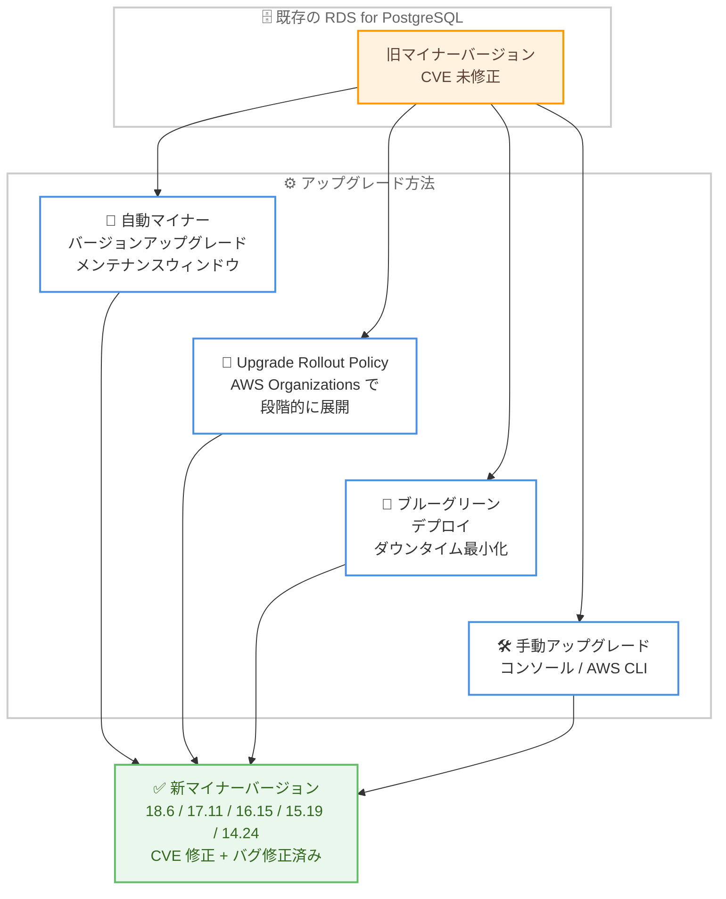

# Amazon RDS for PostgreSQL - マイナーバージョン 18.6 / 17.11 / 16.15 / 15.19 / 14.24 のサポート

**リリース日**: 2026 年 8 月 25 日
**サービス**: Amazon RDS for PostgreSQL
**機能**: PostgreSQL マイナーバージョン 18.6、17.11、16.15、15.19、14.24 のサポート

📊 [このアップデートのインフォグラフィックを見る](https://takech9203.github.io/aws-news-summary/20260825-amazon-rds-postgresql-18-6-17-11-16-15-15-19-14-24.html)

## 概要

Amazon RDS for PostgreSQL が、PostgreSQL コミュニティの最新マイナーバージョン 18.6、17.11、16.15、15.19、14.24 をサポートしました。これらのバージョンは、PostgreSQL コミュニティが 2026 年 8 月 13 日にリリースしたもので、多数の CVE (Common Vulnerabilities and Exposures) への対処と、コミュニティによるバグ修正・機能改善が含まれています。

AWS は、以前のバージョンの PostgreSQL に存在する CVE に対処するため、これらの新しいマイナーバージョンへのアップグレードを推奨しています。特に今回のコミュニティリリースは、`to_char()` のバッファオーバーラン (CVE-2026-14669、コード実行を伴う悪用が報告済み) をはじめとするセキュリティ修正を多数含む重要なリリースです。なお、コミュニティでは 18.5 はリグレッションのためリリースされておらず、18.6 には 18.4 以降の修正が含まれます。

RDS for PostgreSQL を運用しているすべてのユーザーが対象であり、メンテナンスウィンドウ内での自動マイナーバージョンアップグレード、AWS Organizations の Upgrade Rollout Policy による段階的なアップグレード、ブルーグリーンデプロイによるダウンタイム最小化など、複数のアップグレード手段が利用できます。

**アップデート前の課題**

今回のアップデート以前は、以下の課題がありました。

- 2026 年 8 月のコミュニティリリースで修正された多数の CVE (バッファオーバーラン、SQL インジェクション、メモリ開示など) が未修正のまま残っていた
- パーティションプルーニングが DEFAULT パーティションをスキップして行が欠落するなど、クエリ正確性に関わるバグが存在した
- 可視性マップのビットクリアが正しく WAL に記録されず、増分バックアップの破損やインデックスオンリースキャンの誤った結果につながる可能性があった

**アップデート後の改善**

今回のアップデートにより、以下が可能になりました。

- RDS for PostgreSQL 上で、上記の CVE 修正とバグ修正を含む最新マイナーバージョンを利用できるようになった
- 自動マイナーバージョンアップグレードを有効にしていれば、メンテナンスウィンドウ内で自動的に新バージョンへ更新できる
- AWS Organizations の Upgrade Rollout Policy を使用して、優先度の低い環境から検証しながら大規模環境へ段階的にアップグレードを展開できる

## アーキテクチャ図



旧マイナーバージョンから新バージョンへのアップグレード経路を示しています。環境の要件に応じて、自動アップグレード、段階的展開、ブルーグリーンデプロイ、手動アップグレードのいずれかを選択できます。

## サービスアップデートの詳細

### 主要機能

1. **最新マイナーバージョンのサポート**
   - PostgreSQL 18.6、17.11、16.15、15.19、14.24 が RDS for PostgreSQL で利用可能
   - PostgreSQL コミュニティが 2026 年 8 月 13 日にリリースしたバージョンに対応
   - 以前のバージョンに存在する CVE への対処と、コミュニティによるバグ修正・改善を含む

2. **自動マイナーバージョンアップグレード**
   - 自動マイナーバージョンアップグレードを有効にすると、スケジュールされたメンテナンスウィンドウ内で自動的にアップグレードが実行される
   - 個別のインスタンスごとの手動対応が不要になり、セキュリティ修正の適用漏れを防止

3. **AWS Organizations Upgrade Rollout Policy による段階的展開**
   - 組織全体でアップグレードのタイミングをフェーズ分けして展開可能
   - 優先度の低い環境 (開発・検証環境など) で先に検証し、その後にビジネスクリティカルな環境をアップグレードする運用が可能

4. **ブルーグリーンデプロイによるダウンタイム最小化**
   - Amazon RDS Blue/Green Deployments を使用してマイナーバージョンアップグレード時のダウンタイムを最小化
   - グリーン環境で新バージョンを検証した後、短時間の切り替えで本番環境を移行

## 技術仕様

### サポートされるバージョン

| メジャーバージョン | 新マイナーバージョン | 備考 |
|------|------|------|
| PostgreSQL 18 | 18.6 | 18.5 はコミュニティでリリースされず、18.4 以降の修正を含む |
| PostgreSQL 17 | 17.11 | - |
| PostgreSQL 16 | 16.15 | - |
| PostgreSQL 15 | 15.19 | - |
| PostgreSQL 14 | 14.24 | - |

### コミュニティリリースに含まれる主なセキュリティ修正

2026 年 8 月 13 日の PostgreSQL コミュニティリリースには、多数の CVE 修正が含まれています。代表的なものは以下のとおりです (詳細は [PostgreSQL 18.6 リリースノート](https://www.postgresql.org/docs/release/18.6/) を参照)。

| CVE | 内容 |
|------|------|
| CVE-2026-14669 | `to_char()` で長いタイムゾーン略称を使用した場合のバッファオーバーラン。コード実行を伴う悪用が報告済み |
| CVE-2026-6471 | 論理デコードの出力プラグインを制限する `output_plugin_libraries` パラメータを新規追加 |
| CVE-2026-16239 | `EXECUTE` / `FETCH` におけるポータル出力行型のクロスチェック不足によるメモリ開示・任意コード実行の可能性 |
| CVE-2026-15741 | `EXTRACT()` フィールド名のクォート漏れによる pg_dump 経由の SQL インジェクション |
| CVE-2026-14666 | ロール変更後にロール依存のキャッシュ済みプランが無効化されず、行レベルセキュリティの正確性に影響 |
| CVE-2026-14681 | ダイレクト SSL 接続後の GSSEncRequest 受理による pg_hba ポリシーバイパス |

### 主な非セキュリティ修正

- RANGE パーティションプルーニングが DEFAULT パーティションをスキップし、結果行が欠落する問題の修正
- 可視性マップのビットクリアが WAL に正しく記録されず、増分バックアップの破損につながる可能性がある問題の修正
- スタンバイ昇格後の UNLOGGED シーケンスの破損、空のプリペアドトランザクションの論理デコードによるレプリケーション停止の修正
- 非最終結合キーに NULL が含まれる場合のハッシュ結合の肥大化などパフォーマンス問題の修正
- tzdata 2026c への更新

### アップグレード後の推奨アクション

コミュニティリリースノートでは、アップグレード後に以下の確認が推奨されています。

- **GIN インデックス**: パラレル GIN ビルドで不正な `reltuples` が設定されている可能性があるため、該当インデックスがある場合は手動で `ANALYZE` を実行
- **btree_gist**: float 列および bit / varbit 列のインデックス再作成を検討
- **論理デコード**: サードパーティの出力プラグインを使用している場合は `output_plugin_libraries` への追加が必要

## 設定方法

### 前提条件

1. AWS アカウントと Amazon RDS for PostgreSQL インスタンスが存在すること
2. アップグレード操作に必要な IAM 権限 (`rds:ModifyDBInstance` など) があること
3. アップグレード前にスナップショットの取得を推奨

### 手順

#### ステップ 1: 利用可能なバージョンの確認

```bash
aws rds describe-db-engine-versions \
    --engine postgres \
    --engine-version 17.11 \
    --query 'DBEngineVersions[].{Engine:Engine,Version:EngineVersion}'
```

RDS for PostgreSQL で新しいマイナーバージョン (この例では 17.11) が利用可能かどうかを確認しています。

#### ステップ 2: 手動でマイナーバージョンアップグレードを実行

```bash
aws rds modify-db-instance \
    --db-instance-identifier my-postgres-instance \
    --engine-version 17.11 \
    --apply-immediately
```

対象インスタンスのエンジンバージョンを 17.11 に変更しています。`--apply-immediately` を指定すると即時適用され、指定しない場合は次回のメンテナンスウィンドウで適用されます。アップグレード中は短時間のダウンタイムが発生します。

#### ステップ 3: 自動マイナーバージョンアップグレードの有効化

```bash
aws rds modify-db-instance \
    --db-instance-identifier my-postgres-instance \
    --auto-minor-version-upgrade \
    --preferred-maintenance-window "sun:17:00-sun:18:00"
```

自動マイナーバージョンアップグレードを有効化し、メンテナンスウィンドウを設定しています。以降は RDS が指定したウィンドウ内で自動的にマイナーバージョンを更新します。

#### ステップ 4: ブルーグリーンデプロイによるアップグレード

```bash
aws rds create-blue-green-deployment \
    --blue-green-deployment-name pg-minor-upgrade \
    --source arn:aws:rds:ap-northeast-1:123456789012:db:my-postgres-instance \
    --target-engine-version 17.11
```

本番環境 (ブルー) のコピーとして新バージョンのグリーン環境を作成しています。グリーン環境で動作検証を行った後、`switchover-blue-green-deployment` コマンドで短時間の切り替えを実行できます。

## メリット

### ビジネス面

- **セキュリティリスクの低減**: コード実行を伴う悪用が報告されている CVE-2026-14669 を含む多数の脆弱性に対処でき、コンプライアンス要件への対応が容易になる
- **運用負荷の軽減**: 自動マイナーバージョンアップグレードや Upgrade Rollout Policy により、大規模環境でも計画的かつ省力的にアップグレードを展開できる
- **サービス継続性の確保**: ブルーグリーンデプロイにより、アップグレードに伴うダウンタイムを最小化できる

### 技術面

- **データ整合性の向上**: パーティションプルーニングによる行欠落や増分バックアップ破損の可能性など、正確性に関わる重要なバグが修正される
- **レプリケーションの安定化**: スタンバイ昇格後のシーケンス破損や論理デコードの問題が修正され、高可用性構成の信頼性が向上する
- **パフォーマンス改善**: ハッシュ結合の肥大化、パラレルバキュームのメモリリークなどの修正により、安定した性能が期待できる

## デメリット・制約事項

### 制限事項

- マイナーバージョンアップグレードの適用時には短時間のダウンタイム (またはブルーグリーンデプロイでの切り替え時間) が発生する
- 18.5 はコミュニティでリリースされていないため、PostgreSQL 18 系は 18.4 から 18.6 への更新となる
- 論理デコードでサードパーティの出力プラグインを使用している場合、`output_plugin_libraries` への明示的な追加が必要 (CVE-2026-6471 対応の仕様変更)

### 考慮すべき点

- アップグレード後、GIN インデックスの `reltuples` 確認や btree_gist インデックスの再作成など、コミュニティリリースノートに記載された事後アクションの実施を検討する
- 自動マイナーバージョンアップグレードを有効にしている場合、メンテナンスウィンドウのタイミングが業務影響の少ない時間帯に設定されているか確認する
- 本番環境への適用前に、開発・検証環境でアプリケーションの動作確認を行うことを推奨

## ユースケース

### ユースケース 1: セキュリティ要件の厳しい本番データベースの計画的アップグレード

**シナリオ**: 金融系サービスの本番データベースで、CVE への迅速な対処が求められるが、ダウンタイムは最小限に抑えたい。

**実装例**:
```bash
# グリーン環境を作成して検証後に切り替え
aws rds create-blue-green-deployment \
    --blue-green-deployment-name prod-pg-upgrade \
    --source arn:aws:rds:ap-northeast-1:123456789012:db:prod-postgres \
    --target-engine-version 16.15

# 検証完了後に切り替え
aws rds switchover-blue-green-deployment \
    --blue-green-deployment-identifier <deployment-id>
```

**効果**: グリーン環境で事前検証を行った上で、短時間の切り替えのみで CVE 修正済みバージョンへ移行できる。

### ユースケース 2: AWS Organizations 配下の多数の環境への段階的展開

**シナリオ**: 組織内に開発・検証・本番の多数の RDS インスタンスがあり、検証環境から順にアップグレードを展開したい。

**実装例**:
```
1. AWS Organizations で Upgrade Rollout Policy を設定
2. 優先度の低い開発・検証環境を先行フェーズに割り当て
3. 先行フェーズでの検証結果を確認後、本番環境のフェーズを実行
```

**効果**: 環境ごとの手動調整なしに、リスクを抑えた段階的なアップグレード展開を組織全体で実現できる。

### ユースケース 3: 小規模環境での自動アップグレード運用

**シナリオ**: 社内ツール用の小規模データベースで、運用工数をかけずに常に最新のマイナーバージョンを維持したい。

**実装例**:
```bash
aws rds modify-db-instance \
    --db-instance-identifier internal-tool-db \
    --auto-minor-version-upgrade \
    --preferred-maintenance-window "sat:18:00-sat:19:00"
```

**効果**: メンテナンスウィンドウ内で自動的にマイナーバージョンが更新され、セキュリティ修正の適用漏れを防止できる。

## 料金

マイナーバージョンのアップグレード自体に追加料金は発生しません。通常の Amazon RDS for PostgreSQL の料金 (インスタンス、ストレージ、I/O など) が適用されます。なお、ブルーグリーンデプロイを使用する場合は、グリーン環境の稼働中はその分のインスタンス・ストレージ料金が発生します。

料金の詳細は [Amazon RDS for PostgreSQL 料金ページ](https://aws.amazon.com/rds/postgresql/pricing/) を参照してください。

## 利用可能リージョン

リージョンごとの利用可否は [Amazon RDS for PostgreSQL 料金ページ](https://aws.amazon.com/rds/postgresql/pricing/) で確認できます。

## 関連サービス・機能

- **Amazon RDS Blue/Green Deployments**: マイナーバージョンアップグレード時のダウンタイムを最小化する切り替え機能
- **AWS Organizations**: Upgrade Rollout Policy により組織全体で段階的なアップグレード展開を実現
- **Amazon Aurora PostgreSQL**: 同じ PostgreSQL 互換のマネージドデータベース。コミュニティのマイナーバージョンに追随した更新が別途提供される

## 参考リンク

- 📊 [インフォグラフィック](https://takech9203.github.io/aws-news-summary/20260825-amazon-rds-postgresql-18-6-17-11-16-15-15-19-14-24.html)
- [公式発表 (What's New)](https://aws.amazon.com/about-aws/whats-new/2026/08/amazon-rds-postgresql-18-6-17-11-16-15-15-19-14-24/)
- [ドキュメント: RDS for PostgreSQL DB エンジンのアップグレード](https://docs.aws.amazon.com/AmazonRDS/latest/UserGuide/USER_UpgradeDBInstance.PostgreSQL.html)
- [ドキュメント: Amazon RDS Blue/Green Deployments](https://docs.aws.amazon.com/AmazonRDS/latest/UserGuide/blue-green-deployments.html)
- [PostgreSQL 18.6 リリースノート (コミュニティ)](https://www.postgresql.org/docs/release/18.6/)
- [料金ページ](https://aws.amazon.com/rds/postgresql/pricing/)

## まとめ

今回のマイナーバージョンリリースは、コード実行を伴う悪用が報告されている脆弱性を含む多数の CVE 修正と、データ整合性に関わる重要なバグ修正を含んでいます。RDS for PostgreSQL を運用しているすべての環境で、早期のアップグレード計画の策定を推奨します。ダウンタイムが許容しにくい本番環境ではブルーグリーンデプロイ、多数の環境を持つ組織では Upgrade Rollout Policy の活用を検討してください。
