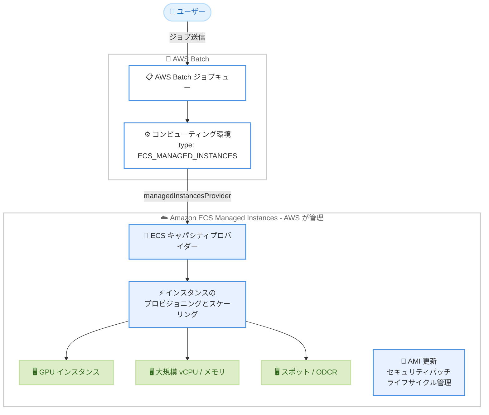

# AWS Batch - Amazon ECS Managed Instances サポート

**リリース日**: 2026 年 8 月 25 日
**サービス**: AWS Batch
**機能**: Amazon ECS Managed Instances コンピューティング環境のサポート

📊 [このアップデートのインフォグラフィックを見る](https://takech9203.github.io/aws-news-summary/20260825-aws-batch-on-ecs-managed-instances.html)

## 概要

AWS Batch が、新しいコンピューティングオプションとして Amazon ECS Managed Instances をサポートしました。これにより、GPU アクセラレーションを利用するワークロードや計算集約型のバッチワークロードを、AWS が管理するインフラストラクチャ上で実行できるようになります。AMI の更新、セキュリティパッチの適用、インスタンスのライフサイクル管理を AWS が自動的に処理するため、お客様が EC2 インフラストラクチャを自己管理する運用負担が不要になります。

Amazon ECS Managed Instances は、Fargate の運用のシンプルさと EC2 のコンピューティングの柔軟性を組み合わせたオプションです。Fargate の制限 (最大 32 vCPU、244 GiB メモリ、GPU 非対応) を超える要件を持つジョブを、Auto Scaling グループや AMI の管理なしで実行したい場合に適しています。機械学習のトレーニングやレンダリング、ゲノム解析など、GPU や大規模インスタンスを必要とするバッチ処理を運用するユーザーが主な対象です。

利用を開始するには、`CreateComputeEnvironment` API または AWS Batch マネジメントコンソールでコンピューティング環境を作成し、`managedInstancesProvider` ブロックで許可するインスタンスタイプとネットワーク設定を指定します。作成した環境をジョブキューに関連付けることで、オンデマンド、スポット、リザーブドキャパシティを使用してジョブを送信できます。

**アップデート前の課題**

このアップデート以前は、AWS Batch で GPU や特定のインスタンスタイプを使用する場合、以下の課題がありました。

- GPU インスタンスや 32 vCPU を超える大規模インスタンスは Fargate では利用できず、EC2 コンピューティング環境を選択する必要があった
- EC2 コンピューティング環境では、AMI の選定・更新、セキュリティパッチの適用、インスタンスライフサイクルの管理といった運用作業が発生していた
- 特権コンテナやホストレベルのデバイス・ボリュームを必要とするジョブは Fargate で実行できなかった

**アップデート後の改善**

今回のアップデートにより、以下が可能になりました。

- GPU インスタンス、ベアメタル、特定のインスタンスタイプ選択を含む幅広いコンピューティングの柔軟性を、インフラストラクチャ管理なしで利用可能になった
- AMI 更新、セキュリティパッチ適用、インスタンスのプロビジョニング・スケーリング・終了を AWS が自動的に処理するようになった
- オンデマンドキャパシティ予約 (ODCR)、リザーブドインスタンス、EC2 Instance Savings Plans をフルマネージドな環境で活用できるようになった

## アーキテクチャ図



AWS Batch のジョブキューに送信されたジョブは、`ECS_MANAGED_INSTANCES` タイプのコンピューティング環境を通じて Amazon ECS Managed Instances 上で実行されます。インスタンスのプロビジョニング、スケーリング、パッチ適用、終了はすべて AWS が自動的に処理します。

## サービスアップデートの詳細

### 主要機能

1. **ECS_MANAGED_INSTANCES コンピューティング環境タイプ**
   - `computeResources.type` に新しい値 `ECS_MANAGED_INSTANCES` を指定して作成する
   - Amazon ECS のキャパシティプロバイダーモデルに準拠した `managedInstancesProvider` ブロックで、ネットワーク、インスタンスプロファイル、インスタンス選択を一元的に設定する
   - Auto Scaling グループの構成、AMI の選択、インスタンスライフサイクルの管理が不要になる

2. **柔軟なインスタンス選択**
   - `instanceRequirements.allowedInstanceTypes` で特定のインスタンスタイプまたはインスタンスファミリー (例: `g5.xlarge` や `m5`) を指定できる
   - 指定しない場合は、利用可能なすべてのインスタンスタイプからジョブのリソース要件に基づいて Amazon ECS が自動選択する
   - GPU インスタンス、ベアメタル、32 vCPU / 244 GiB を超える大規模インスタンスに対応する

3. **多様な購入オプション**
   - `capacityOptionType` で `ON_DEMAND` (デフォルト) または `SPOT` を選択できる
   - `capacityReservations` でオンデマンドキャパシティ予約 (ODCR) をターゲットにでき、`RESERVATIONS_ONLY`、`RESERVATIONS_FIRST`、`RESERVATIONS_EXCLUDED` の 3 つの優先設定が利用できる
   - リザーブドインスタンスや EC2 Instance Savings Plans による割引も適用可能

4. **インフラストラクチャ最適化**
   - `infrastructureOptimization.scaleInAfter` で、アイドル状態のインスタンスを終了するまでの秒数 (0 - 3600、または -1 で無効化) を制御できる
   - `storageConfiguration` でルート EBS ボリュームサイズ、`localStorageConfiguration` でローカル NVMe SSD の利用を設定できる
   - `capacityTags` により、基盤インフラストラクチャリソースのコスト配分タグを管理できる (`batch:SetCapacityTags` 権限が必要)

## 技術仕様

### managedInstancesProvider の主要パラメータ

| 項目 | 必須 | 詳細 |
|------|------|------|
| `infrastructureRoleArn` | 必須 | Amazon ECS がユーザーに代わって EC2 インスタンスを管理するために引き受ける IAM ロールの ARN。`ecs.amazonaws.com` への信頼ポリシーが必要 |
| `instanceLaunchTemplate.ec2InstanceProfileArn` | 必須 | マネージドインスタンス用の EC2 インスタンスプロファイルの ARN。`AmazonECSInstanceRolePolicyForManagedInstances` 管理ポリシーを使用 |
| `instanceLaunchTemplate.networkConfiguration` | 必須 | インスタンスを起動する VPC サブネットとセキュリティグループ。ECS サービスエンドポイントへの外部ネットワークアクセスが必要 |
| `instanceLaunchTemplate.instanceRequirements` | 任意 | `allowedInstanceTypes` で起動を許可するインスタンスタイプ / ファミリーを制限 |
| `instanceLaunchTemplate.capacityOptionType` | 任意 | `ON_DEMAND` (デフォルト) または `SPOT` |
| `instanceLaunchTemplate.storageConfiguration` | 任意 | ルート EBS ボリュームのサイズ (GiB) |
| `instanceLaunchTemplate.monitoring` | 任意 | CloudWatch モニタリングレベル (`BASIC` / `DETAILED`) |
| `instanceLaunchTemplate.capacityReservations` | 任意 | ODCR のターゲット設定 (`reservationGroupArn`、`reservationPreference`) |
| `infrastructureOptimization.scaleInAfter` | 任意 | アイドルインスタンスの終了までの秒数 (0 - 3600、-1 で無効) |
| `propagateTags` | 任意 | キャパシティプロバイダーのタグを EC2 インスタンスに伝播 (`CAPACITY_PROVIDER` / `NONE`) |

### コンピューティングオプションの比較

| 項目 | Fargate | ECS Managed Instances | EC2 (マネージド) |
|------|---------|----------------------|------------------|
| インフラ管理 | 不要 | 不要 (AWS が管理) | 必要 (AMI、ASG など) |
| GPU サポート | 非対応 | 対応 | 対応 |
| リソース上限 | 32 vCPU / 244 GiB | EC2 インスタンスの上限まで | EC2 インスタンスの上限まで |
| 特権コンテナ / ホストデバイス | 非対応 | 対応 | 対応 |
| インスタンスタイプ指定 | 不可 | 可能 | 可能 |
| ODCR / RI / Savings Plans | 非対応 | 対応 | 対応 |
| マルチノード並列 (MNP) ジョブ | 非対応 | 非対応 | 対応 |
| カスタム AMI / 起動テンプレート | 非対応 | 非対応 | 対応 |

### API変更履歴

| 日付 | サービス | 変更内容 |
|------|----------|----------|
| 2026/08/20 | [AWS Batch](https://awsapichanges.com/archive/changes/648ecf-batch.html) | 8 updated api methods - `CreateComputeEnvironment` などに `ECS_MANAGED_INSTANCES` タイプと `managedInstancesProvider` 構造を追加 |

## 設定方法

### 前提条件

1. Amazon ECS が EC2 インスタンスを管理するためのインフラストラクチャロール (`ecs.amazonaws.com` への信頼ポリシー付き) を作成しておく。呼び出し元の IAM プリンシパルには `iam:PassRole` 権限 (`iam:PassedToService: ecs.amazonaws.com` 条件付き) が必要
2. `AmazonECSInstanceRolePolicyForManagedInstances` 管理ポリシーをアタッチした EC2 インスタンスプロファイル (`ec2.amazonaws.com` への信頼ポリシー付き) を作成しておく
3. インスタンスが ECS サービスエンドポイントと通信できる VPC サブネット (パブリック IP または NAT ゲートウェイ経由の外部アクセス) を用意しておく

### 手順

#### ステップ1: コンピューティング環境の作成

```bash
aws batch create-compute-environment \
  --compute-environment-name my-gpu-managed-instances-ce \
  --type MANAGED \
  --state ENABLED \
  --compute-resources '{
    "type": "ECS_MANAGED_INSTANCES",
    "maxvCpus": 1000,
    "managedInstancesProvider": {
      "infrastructureRoleArn": "arn:aws:iam::123456789012:role/ecsInfrastructureRole",
      "instanceLaunchTemplate": {
        "ec2InstanceProfileArn": "arn:aws:iam::123456789012:instance-profile/ecsInstanceProfile",
        "networkConfiguration": {
          "subnets": ["subnet-abcde012", "subnet-bcde012a"],
          "securityGroups": ["sg-abcde012"]
        },
        "instanceRequirements": {
          "allowedInstanceTypes": ["g5.xlarge", "g5.2xlarge", "g5.4xlarge"]
        },
        "capacityOptionType": "ON_DEMAND"
      }
    }
  }'
```

`ECS_MANAGED_INSTANCES` タイプのコンピューティング環境を作成し、GPU インスタンス (g5 ファミリー) に制限したオンデマンドキャパシティを構成しています。`maxvCpus` は環境全体でジョブが消費できる vCPU の上限です。

#### ステップ2: ジョブキューの作成と関連付け

```bash
aws batch create-job-queue \
  --job-queue-name my-managed-instances-queue \
  --state ENABLED \
  --priority 1 \
  --compute-environment-order order=1,computeEnvironment=my-gpu-managed-instances-ce
```

作成したコンピューティング環境をジョブキューに関連付けています。ジョブキューに送信されたジョブは、この環境のマネージドインスタンス上で実行されます。

#### ステップ3: ジョブの送信

```bash
aws batch submit-job \
  --job-name my-gpu-training-job \
  --job-queue my-managed-instances-queue \
  --job-definition my-gpu-job-definition
```

ジョブキューにジョブを送信しています。Amazon ECS がジョブのリソース要件に基づいてインスタンスを自動的にプロビジョニングし、ジョブ完了後にアイドルインスタンスを終了します。

## メリット

### ビジネス面

- **運用コストの削減**: AMI 更新、セキュリティパッチ適用、インスタンスライフサイクル管理を AWS に委任することで、インフラ運用にかかる人的コストを削減できる
- **コスト最適化オプションの活用**: スポットインスタンス、ODCR、リザーブドインスタンス、EC2 Instance Savings Plans をフルマネージド環境で利用でき、コミットメント割引を活かせる
- **セキュリティ体制の向上**: AWS が継続的にセキュリティパッチを適用するため、パッチ適用漏れによるリスクを低減できる

### 技術面

- **Fargate を超えるコンピューティング柔軟性**: GPU インスタンス、32 vCPU / 244 GiB 超の大規模リソース、特権コンテナ、ホストレベルのデバイス・ボリュームに対応できる
- **インスタンス選択の制御**: `allowedInstanceTypes` で使用するインスタンスタイプやファミリーを明示的に制限でき、自動選択に任せることも可能
- **既存の Batch ワークフローとの互換性**: ジョブキュー、ジョブ定義といった既存の AWS Batch の概念をそのまま利用でき、コンピューティング環境の切り替えだけで移行できる

## デメリット・制約事項

### 制限事項

- Amazon ECS をオーケストレーターとして使用するコンピューティング環境でのみ利用可能で、Amazon EKS コンピューティング環境では利用できない
- マルチノード並列 (MNP) ジョブはサポートされない (スポットインスタンスと同様)
- カスタム AMI、起動テンプレート、`minvCpus` によるウォームプール、`allocationStrategy` などの EC2 コンピューティング環境向けパラメータは指定できない
- 作成後にコンピューティング環境タイプ、`capacityOptionType` (オンデマンド / スポットの切り替え)、`fipsEnabled` は変更できない

### 考慮すべき点

- `maxvCpus` は実行中ジョブが要求する vCPU 合計で評価されるため、マルチテナントなインスタンス割り当てにより、実際にプロビジョニングされるインスタンスの vCPU 容量が `maxvCpus` を超える場合がある
- インスタンスは ECS サービスエンドポイントへの外部ネットワークアクセスが必要なため、プライベートサブネットでは NAT ゲートウェイなどの経路設計が必要になる
- ホストレベルの完全な分離が必要な場合は、タスクごとに専用のカーネルランタイム環境を持つ Fargate の方が適している

## ユースケース

### ユースケース1: 機械学習モデルのバッチトレーニング

**シナリオ**: GPU を使用した機械学習モデルのトレーニングジョブを定期実行しているが、GPU 対応 AMI の更新やドライバー管理などの運用負担を減らしたい。

**実装例**:
```json
"instanceRequirements": {
  "allowedInstanceTypes": ["g5", "g6"]
},
"capacityOptionType": "ON_DEMAND"
```

**効果**: GPU インスタンスの AMI 更新やパッチ適用を AWS に任せながら、必要な GPU ファミリーだけを使用したトレーニングを実行できます。

### ユースケース2: スポットインスタンスによるコスト重視の大規模処理

**シナリオ**: 耐障害性のあるゲノム解析やシミュレーションを大量に実行しており、インフラ管理なしでスポットインスタンスのコスト削減効果を得たい。

**実装例**:
```json
"instanceRequirements": {
  "allowedInstanceTypes": ["m5.large", "m5.xlarge", "m6i.large", "m6i.xlarge"]
},
"capacityOptionType": "SPOT",
"storageConfiguration": { "storageSizeGiB": 100 }
```

**効果**: スポットキャパシティによる大幅なコスト削減を、Auto Scaling グループやスポットフリートの管理なしで実現できます。

### ユースケース3: キャパシティ予約を利用した確実なジョブ実行

**シナリオ**: 月次の決算処理など、期限が厳格なバッチジョブのために、確実にキャパシティを確保したい。

**実装例**:
```json
"capacityReservations": {
  "reservationGroupArn": "arn:aws:resource-groups:ap-northeast-1:123456789012:group/my-odcr-group",
  "reservationPreference": "RESERVATIONS_FIRST"
}
```

**効果**: オンデマンドキャパシティ予約を優先的に使用し、不足時はオンデマンドにフォールバックすることで、期限厳守のジョブ実行と予約キャパシティの有効活用を両立できます。

## 料金

AWS Batch 自体には追加料金はなく、ジョブの実行に使用するリソースに対して課金されます。Amazon ECS Managed Instances を使用する場合、起動される EC2 インスタンスの料金に加えて、Amazon ECS Managed Instances の管理料金が発生します。詳細は Amazon ECS の料金ページを確認してください。

- EC2 インスタンス料金: オンデマンド、スポット、リザーブドインスタンス、Savings Plans の割引が適用可能
- ECS Managed Instances 管理料金: AWS がインスタンスのプロビジョニング、パッチ適用、ライフサイクル管理を行うことに対する料金

## 利用可能リージョン

AWS Batch が利用可能なすべての AWS リージョンでサポートされています (東京・大阪リージョンを含む)。詳細は [AWS リージョン別サービス一覧](https://aws.amazon.com/about-aws/global-infrastructure/regional-product-services/) を参照してください。

## 関連サービス・機能

- **Amazon ECS Managed Instances**: 本アップデートの基盤となる機能。Amazon ECS がユーザーに代わって EC2 インスタンスのプロビジョニング、スケーリング、パッチ適用、終了を管理する
- **AWS Fargate**: サーバーレスコンテナ実行環境。32 vCPU / 244 GiB 以内で GPU 不要のジョブには引き続き最もシンプルな選択肢
- **Amazon EC2 オンデマンドキャパシティ予約 (ODCR)**: `capacityReservations` 設定でターゲット指定でき、確実なキャパシティ確保に利用できる
- **Amazon CloudWatch**: `monitoring` 設定で `DETAILED` モニタリングを有効化でき、インスタンスの詳細メトリクスを取得できる

## 参考リンク

- 📊 [インフォグラフィック](https://takech9203.github.io/aws-news-summary/20260825-aws-batch-on-ecs-managed-instances.html)
- [公式発表 (What's New)](https://aws.amazon.com/about-aws/whats-new/2026/08/aws-batch-on-ecs-managed-instances/)
- [ドキュメント: Amazon ECS Managed Instances compute environments](https://docs.aws.amazon.com/batch/latest/userguide/ecs_managed_instances.html)
- [ドキュメント: When to use Amazon ECS Managed Instances](https://docs.aws.amazon.com/batch/latest/userguide/when-to-use-ecs-managed-instances.html)
- [料金ページ (Amazon ECS)](https://aws.amazon.com/ecs/pricing/)
- [料金ページ (AWS Batch)](https://aws.amazon.com/batch/pricing/)

## まとめ

AWS Batch の Amazon ECS Managed Instances サポートにより、GPU や大規模インスタンスを必要とするバッチワークロードを、AMI 管理やパッチ適用の運用負担なしで実行できるようになりました。現在 EC2 コンピューティング環境で AMI や Auto Scaling グループを自己管理しているワークロード、または Fargate の制限により実行できなかった GPU ジョブがある場合は、`ECS_MANAGED_INSTANCES` タイプのコンピューティング環境への移行を検討することを推奨します。
