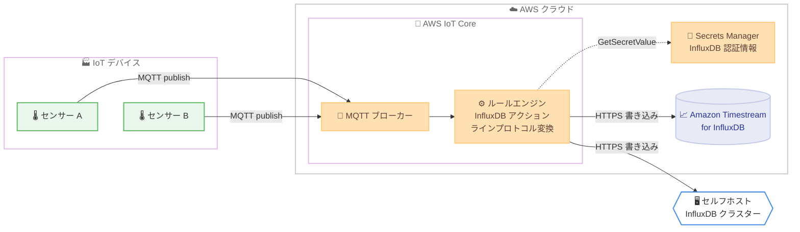

# AWS IoT Core - InfluxDB ルールアクションによる時系列データのネイティブルーティング

**リリース日**: 2026 年 8 月 25 日
**サービス**: AWS IoT Core
**機能**: InfluxDB ルールアクション (時系列データのネイティブルーティング)

📊 [このアップデートのインフォグラフィックを見る](https://takech9203.github.io/aws-news-summary/20260825-aws-iot-core-influxdb.html)

## 概要

AWS IoT Core が、IoT デバイスからの時系列データを InfluxDB データベースへ直接送信できる InfluxDB ルールアクションのサポートを発表しました。デバイス側のカスタムコードや中間のクラウドサービスを介することなく、IoT Core のルールエンジンがメッセージを InfluxDB のラインプロトコル形式へ自動変換し、Amazon Timestream for InfluxDB のマネージドクラスターまたはセルフホストの InfluxDB クラスターへ書き込みます。

このアップデートは、産業機器のテレメトリ監視、科学機器のデータ収集、リアルタイムのオペレーション分析など、高頻度の時系列データを扱うユーザーに大きな価値をもたらします。デバイス側バッチング (クライアントサイド) とサーバー側バッチングの 2 つのバッチングモードがサポートされており、コストとスループットの最適化が可能です。

**アップデート前の課題**

これまで IoT デバイスのデータを InfluxDB へ取り込むには、追加の実装や中間サービスが必要でした。

- デバイス側に InfluxDB クライアントを組み込むカスタムコードの開発・保守が必要だった
- IoT Core から InfluxDB へ書き込むために、Lambda 関数や Kinesis などの中間サービスを構築・運用する必要があった
- JSON からラインプロトコルへの変換ロジックを自前で実装する必要があり、データ型変換やエスケープ処理の考慮が煩雑だった

**アップデート後の改善**

今回のアップデートにより、ルールエンジンだけで InfluxDB への取り込みが完結します。

- ルールアクションの設定のみで、MQTT メッセージを InfluxDB へ直接書き込めるようになった
- JSON からラインプロトコルへの変換 (データ型変換、エスケープ処理を含む) が自動化された
- クライアントサイド / サーバーサイドの 2 つのバッチングモードにより、書き込みコストとスループットを最適化できるようになった
- 配列ペイロードの各要素に対して個別の値を解決できる「要素単位の置換テンプレート」(`@{expression}`) が利用可能になった

## アーキテクチャ図



IoT デバイスが MQTT で送信した時系列データを、IoT Core ルールエンジンの InfluxDB アクションがラインプロトコルへ自動変換し、Secrets Manager の認証情報を使用して Amazon Timestream for InfluxDB またはセルフホスト InfluxDB へ HTTPS で書き込みます。

## サービスアップデートの詳細

### 主要機能

1. **ラインプロトコルへの自動変換**
   - ルールの SQL クエリ結果 (JSON) を InfluxDB ラインプロトコル形式へ自動変換
   - JSON の整数・浮動小数点・真偽値・文字列などを適切なラインプロトコル型へマッピング (例: `42` → `42i`、`true` → `t`)
   - フィールドキーやタグ値に含まれるカンマ・等号・スペースは自動エスケープ

2. **2 つのバッチングモード**
   - **クライアントサイドバッチング**: デバイスが JSON 配列として事前バッチしたペイロードを 1 つの MQTT メッセージで送信。配列の各要素が 1 つのポイントとして 1 回の書き込みリクエストにまとめられる (追加設定不要)
   - **サーバーサイドバッチング**: ルールエンジンが複数の受信メッセージを `batchConfig` の設定 (最大ポイント数、最大保持時間、最大バイト数) に従って結合してから書き込み。両モードの併用も可能

3. **柔軟な宛先指定**
   - Amazon Timestream for InfluxDB のマネージドクラスターと、セルフホストの InfluxDB クラスターの両方に対応
   - InfluxDB V2 と V3 の両バージョンをサポート
   - `CreateTopicRuleDestination` API で作成する「InfluxDB アクション宛先」により、エンドポイント所有権を事前検証

4. **要素単位の置換テンプレート**
   - 新しい `@{expression}` 構文により、JSON 配列ペイロードの各要素から値を解決可能
   - 要素ごとに異なるテーブル (measurement) へルーティングしたり、要素固有のタグを付与したりできる
   - 従来のメッセージスコープの `${expression}` と使い分けが可能

## 技術仕様

### InfluxDB アクション宛先のパラメータ

| パラメータ | 必須 | 説明 |
|------|------|------|
| `endpoint` | はい | InfluxDB インスタンスの HTTPS エンドポイント URL。対応ポート: 443、8086、8181、8443 |
| `influxDBVersion` | はい | InfluxDB のバージョン。有効値: `V2`、`V3` |
| `secretId` | はい | InfluxDB トークンを格納する Secrets Manager シークレットの名前または ARN |
| `secretType` | いいえ | シークレット値のタイプ。有効値: `SecretString`、`SecretBinary` |
| `secretKey` | いいえ | シークレット JSON 内で認証トークンを含むキー (複数キーの JSON の場合のみ必須) |

### ルールアクションの主要パラメータ

| パラメータ | 置換テンプレート | 説明 |
|------|------|------|
| `destinationArn` | 不可 | InfluxDB アクション宛先の ARN |
| `roleArn` | 不可 | Secrets Manager へのアクセスを許可する IAM ロールの ARN |
| `databaseName` | 不可 | 書き込み先データベース名 (V2 では Bucket、V3 では Database) |
| `tableName` | 可 | 書き込み先テーブル名 (V2 では Measurement、V3 では Table)。`@{...}` も使用可 |
| `organization` | 不可 | InfluxDB 組織名 (V2 で必須、V3 では無視) |
| `tags` | 可 | 各ポイントに付与するタグのマップ。値には `@{...}` も使用可 |
| `timestampUnit` | 不可 | タイムスタンプの精度。有効値: `s`、`ms`、`us`、`ns` (デフォルト: `ms`) |
| `batchConfig` | - | サーバーサイドバッチング設定 (任意) |

### サーバーサイドバッチング設定 (`batchConfig`)

| 項目 | 有効範囲 | 説明 |
|------|------|------|
| `maxBatchSize` | 1〜500 | バッチあたりの最大ポイント数 |
| `maxBatchOpenMs` | 5〜1,000 | バッチを保持する最大時間 (ミリ秒) |
| `maxBatchSizeBytes` | 100〜131,072 | フラッシュ前の最大合計サイズ (バイト) |
| `batchAcrossTopics` | true / false | 異なるトピックのメッセージをまたいでバッチするか (デフォルト: false) |

### API変更履歴

| 日付 | サービス | 変更内容 |
|------|----------|----------|
| 2026/08/25 | [AWS IoT](https://awsapichanges.com/archive/changes/f60d73-iot.html) | 6 updated api methods - IoT Rules Engine に InfluxDB アクションを追加。IoT センサーやアプリケーションからのメッセージを InfluxDB へ送信可能に |

### IAM ロールの権限設定

ルールアクション用の IAM ロールには、InfluxDB 認証情報を格納するシークレットへの `secretsmanager:GetSecretValue` 権限が必要です。

```json
{
  "Version": "2012-10-17",
  "Statement": [
    {
      "Effect": "Allow",
      "Action": "secretsmanager:GetSecretValue",
      "Resource": "arn:aws:secretsmanager:us-west-2:111122223333:secret:my-influxdb-secret-a1b2c3"
    }
  ]
}
```

## 設定方法

### 前提条件

1. InfluxDB インスタンス (Amazon Timestream for InfluxDB またはセルフホスト) が AWS IoT Core から HTTPS で到達可能であること
2. InfluxDB の認証情報 (API トークン) が AWS Secrets Manager に格納されていること (Timestream for InfluxDB V3 ではクラスター作成時に自動プロビジョニング)
3. AWS IoT が引き受け可能な IAM ロール (シークレットの `GetSecretValue` 権限付き) が作成済みであること
4. メッセージペイロードの各オブジェクトに、整数の Unix エポック値を持つ `timestamp` キー (大文字小文字を区別) が含まれていること
5. ペイロードが JSON 形式であること (バイナリや Protobuf の場合はルール SQL の `decode()` 関数で変換)

### 手順

#### ステップ1: InfluxDB アクション宛先の作成

```bash
aws iot create-topic-rule-destination \
  --destination-configuration '{
    "influxDBConfiguration": {
      "endpoint": "https://my-instance.timestream-influxdb.us-west-2.amazonaws.com:8086",
      "influxDBVersion": "V2",
      "secretId": "arn:aws:secretsmanager:us-west-2:111122223333:secret:my-influxdb-credentials-AbCdEf"
    }
  }'
```

InfluxDB インスタンスのエンドポイント、バージョン、認証情報を指定してアクション宛先を作成します。作成時に AWS IoT Core が指定された認証情報でエンドポイントの所有権を検証し (V2 では `/api/v2/me`、V3 ではデータベース一覧 API を呼び出し)、成功すると宛先のステータスが `ENABLED` になります。

#### ステップ2: InfluxDB アクション付きトピックルールの作成

```bash
aws iot create-topic-rule \
  --rule-name "TelemetryToInfluxDB" \
  --topic-rule-payload '{
    "sql": "SELECT * FROM '\''devices/+/telemetry'\''",
    "ruleDisabled": false,
    "awsIotSqlVersion": "2016-03-23",
    "actions": [
      {
        "influxDB": {
          "destinationArn": "arn:aws:iot:us-west-2:111122223333:ruledestination/influxdb/a1b2c3d4",
          "roleArn": "arn:aws:iam::111122223333:role/iot-influxdb-role",
          "organization": "my-org",
          "databaseName": "sensor_data",
          "tableName": "device_metrics",
          "tags": {
            "device_id": "${clientid()}",
            "location": "building-a"
          },
          "timestampUnit": "ms"
        }
      }
    ]
  }'
```

`devices/+/telemetry` トピックに発行されたメッセージを、`sensor_data` データベースの `device_metrics` テーブルへ書き込むルールを作成します。`tags` にはクライアント ID などの置換テンプレートを利用でき、タグはクエリ性能向上のためにインデックス化されます。

#### ステップ3: デバイスからのデータ発行と確認

デバイスから以下のようなペイロードを発行すると、ラインプロトコルに変換されて InfluxDB に書き込まれます。

```json
{
  "timestamp": 1700000000000,
  "temperature": 23.5,
  "humidity": 60.1,
  "pressure": 1013.25,
  "battery_level": 87
}
```

変換後のラインプロトコル出力は次のとおりです。`timestamp` キーはポイントのタイムスタンプとして使用され、タグやテーブル名に参照されなかった残りの属性がフィールドになります。

```text
device_metrics,device_id=myDevice123,location=building-a temperature=23.5,humidity=60.1,pressure=1013.25,battery_level=87i 1700000000000
```

## メリット

### ビジネス面

- **開発・運用コストの削減**: デバイス側のカスタムコードや Lambda などの中間サービスが不要になり、構築・保守の工数を削減できる
- **市場投入の高速化**: ルール設定のみで時系列データパイプラインが完成するため、IoT 分析ソリューションを迅速に立ち上げられる
- **書き込みコストの最適化**: バッチングにより書き込みリクエスト数とメータリング対象のペイロードサイズを抑制できる (課金は送信ペイロードサイズの 5 KiB 単位)

### 技術面

- **フルマネージドな形式変換**: JSON からラインプロトコルへの型変換・エスケープ・タグのソートが自動化され、実装ミスのリスクがない
- **柔軟なルーティング**: 要素単位の置換テンプレート `@{...}` により、1 つの配列ペイロードから複数のテーブルへポイントを振り分けられる
- **堅牢なエラーハンドリング**: 503 エラーはエクスポネンシャルバックオフで再試行、401 エラーではトークンを再読込して 1 回再試行。回復不能なエラーはエラーアクションへ連携され、InfluxDB 自体をエラーアクションとして使用することも可能

## デメリット・制約事項

### 制限事項

- ペイロードの各オブジェクトに `timestamp` キー (整数の Unix エポック値) が必須。`ts` や `time` などのエイリアスは使用不可
- JSON 形式のペイロードのみ処理可能 (バイナリ / Protobuf はルール SQL の `decode()` で事前変換が必要)
- `databaseName` は置換テンプレート非対応。データベースごとにルールアクションを分ける必要がある
- タグとフィールドの合計カラム数は最大 250
- `@{...}` はフィールド参照のみ対応 (関数不可)、1 つの値に 1 マーカーのみ、`${...}` との混在不可
- 対応する送信先ポートは 443、8443、8086、8181 のみ (HTTPS 必須、HTTP 非対応)

### 考慮すべき点

- バッチ内のいずれかのポイントでフィールド型の競合が発生すると、バッチ全体の書き込みが失敗する (部分コミットなし)
- サーバーサイドバッチングでは複数メッセージのポイントが交錯し、発行順と書き込み順が一致しない場合がある。同一ミリ秒内の last-write-wins 重複排除など、書き込み順序に依存するアプリケーションでは注意が必要
- ラインプロトコル変換に失敗したメッセージもメータリング (課金) の対象となる
- Amazon Timestream ルールアクションから移行する場合、`dimensions` パラメータは InfluxDB アクションのタグに、クエリ結果の属性はフィールドに対応する

## ユースケース

### ユースケース1: 科学機器の高頻度テレメトリ収集

**シナリオ**: ライフサイエンス企業が、ミリ秒粒度で数千件のテレメトリを生成する科学機器のデータを InfluxDB で直接監視したい。

**実装例**:
```json
[
  {"measurement_type": "temperature", "sensor_id": "sensor-42", "timestamp": 1700000000000000000, "value": 23.5},
  {"measurement_type": "humidity", "sensor_id": "sensor-42", "timestamp": 1700000001000000000, "value": 60.1}
]
```
機器側で読み取り値を JSON 配列にバッチして発行し (クライアントサイドバッチング)、`timestampUnit` に `ns` を指定して高精度タイムスタンプを保持します。

**効果**: 中間サービスなしでミリ秒〜ナノ秒粒度の大量データを 1 回の書き込みリクエストに集約し、リアルタイム監視を実現できる。

### ユースケース2: マルチセンサーデータのテーブル別ルーティング

**シナリオ**: スマートビルディングで温度・湿度・気圧など複数種類のセンサーデータを 1 つのペイロードで送信し、種類ごとに別テーブルへ格納したい。

**実装例**:
```json
{
  "influxDB": {
    "destinationArn": "arn:aws:iot:us-west-2:111122223333:ruledestination/influxdb/abc123",
    "roleArn": "arn:aws:iam::111122223333:role/iot-influxdb-role",
    "databaseName": "sensor_data",
    "tableName": "@{measurement_type}",
    "tags": { "room": "@{room}" },
    "timestampUnit": "ms"
  }
}
```

**効果**: 要素単位の置換テンプレートにより、単一のルールアクションで各データポイントを適切なテーブルへ自動振り分けでき、ルールの数と管理コストを削減できる。

### ユースケース3: 多数の低頻度デバイスからのコスト効率的な取り込み

**シナリオ**: 工場内の数千台のセンサーがそれぞれ 1 件ずつメッセージを発行する環境で、InfluxDB への書き込みリクエスト数を抑えたい。

**実装例**:
```json
"batchConfig": {
  "maxBatchSize": 100,
  "maxBatchOpenMs": 500,
  "maxBatchSizeBytes": 65536,
  "batchAcrossTopics": true
}
```

**効果**: サーバーサイドバッチングにより複数デバイス・複数トピックのメッセージを 1 回の書き込みに集約し、スループット向上とコスト最適化を両立できる。

## 料金

What's New の発表には具体的な料金の記載はありません。ドキュメントによると、InfluxDB アクションは送信ペイロードサイズに基づき 5 KiB 単位でメータリングされます。また、ラインプロトコル変換の失敗もメータリングの対象です。このほか、AWS IoT Core のメッセージングおよびルールエンジンの標準料金、Amazon Timestream for InfluxDB を使用する場合はそのインスタンス料金が適用されます。詳細は [AWS IoT Core 料金ページ](https://aws.amazon.com/iot-core/pricing/) を参照してください。

## 利用可能リージョン

Amazon Timestream for InfluxDB が利用可能なすべての AWS グローバルリージョンで利用できます。

## 関連サービス・機能

- **Amazon Timestream for InfluxDB**: マネージドな InfluxDB クラスターを提供。本アクションの主要な書き込み先であり、V3 ではクラスター作成時に認証情報のシークレットが自動プロビジョニングされる
- **AWS Secrets Manager**: InfluxDB の認証トークンを安全に格納。ルールアクションは実行時に `GetSecretValue` で認証情報を取得する
- **AWS IoT Rules Engine**: MQTT メッセージの SQL ベースのフィルタリング・変換を担い、Timestream、Kinesis、S3 など多数のアクションと組み合わせ可能
- **Amazon Timestream ルールアクション**: 既存の Timestream (LiveAnalytics) 向けアクション。InfluxDB アクションへの移行時は `dimensions` がタグに対応する

## 参考リンク

- 📊 [インフォグラフィック](https://takech9203.github.io/aws-news-summary/20260825-aws-iot-core-influxdb.html)
- [公式発表 (What's New)](https://aws.amazon.com/about-aws/whats-new/2026/08/aws-iot-core-influxdb/)
- [ドキュメント: InfluxDB ルールアクション](https://docs.aws.amazon.com/iot/latest/developerguide/influxdb-rule-action.html)
- [ドキュメント: Amazon Timestream for InfluxDB](https://docs.aws.amazon.com/timestream/latest/developerguide/influxdb3.html)
- [API 変更履歴 (awsapichanges.com)](https://awsapichanges.com/archive/changes/f60d73-iot.html)
- [料金ページ (AWS IoT Core)](https://aws.amazon.com/iot-core/pricing/)

## まとめ

AWS IoT Core の InfluxDB ルールアクションにより、デバイス側コードや中間サービスなしで時系列データを InfluxDB へ直接ルーティングできるようになりました。ラインプロトコルへの自動変換、2 つのバッチングモード、要素単位の置換テンプレートにより、IoT 時系列パイプラインの構築が大幅に簡素化されます。現在 Lambda や Kinesis 経由で InfluxDB へデータを取り込んでいる場合は、本アクションへの移行によるアーキテクチャの簡素化とコスト削減の検討を推奨します。
