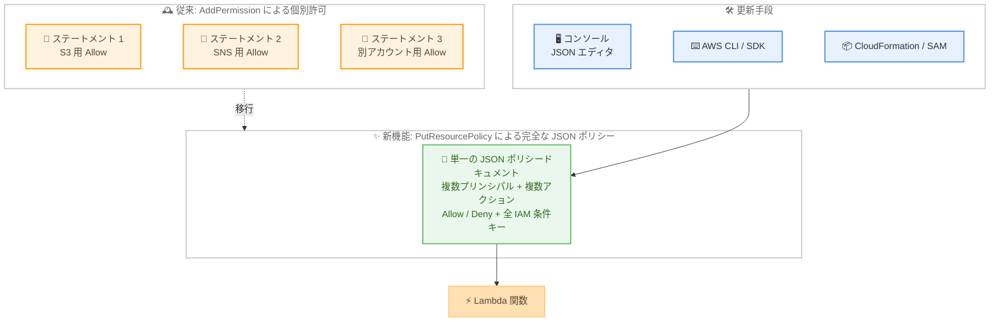

# AWS Lambda - 完全な IAM リソースベースポリシーのサポート

**リリース日**: 2026 年 8 月 25 日
**サービス**: AWS Lambda
**機能**: 完全な IAM リソースベースポリシー (Full JSON Resource-Based Policies)

📊 [このアップデートのインフォグラフィックを見る](https://takech9203.github.io/aws-news-summary/20260825-aws-lambda-full-iam-resource-based-policies.html)

## 概要

AWS Lambda 関数が完全な IAM リソースベースポリシーに対応しました。プラットフォーム管理者やセキュリティチームは、IAM の全機能を活用して Lambda 関数へのきめ細かなアクセス許可を定義できるようになります。新しい `PutResourcePolicy` API を使用することで、複数のプリンシパルとアクションに対する許可を 1 つの JSON ポリシードキュメントとして定義でき、IAM グローバル条件キーの全範囲を利用できます。

従来、Lambda 関数のリソースベースポリシーは `AddPermission` API によりプリンシパルごとに個別のステートメントを追加する方式のみがサポートされており、利用できる条件キーも限定されていました。今回のアップデートにより、S3 バケットポリシーや SQS キューポリシーと同様に、完全な JSON ドキュメントとしてポリシーを作成・取得・更新・削除できるようになり、マルチアカウント環境や多数の関数を管理するチームの権限管理が大幅に効率化されます。

ポリシーの更新は、AWS Lambda コンソールの JSON エディタ、AWS CLI、AWS SDK に加え、AWS CloudFormation や AWS SAM などの IaC ツールからも一括で実行できます。

**アップデート前の課題**

- 以前は `AddPermission` API でプリンシパルごとに個別の Allow ステートメントを追加する必要があり、大規模な権限管理には柔軟性が不足していた
- 個別許可で利用できる条件キーは `aws:SourceArn`、`aws:SourceAccount`、`aws:PrincipalOrgID` の限られたセットのみだった
- 明示的な `Deny` ステートメントを定義できず、規制要件で求められる明示的拒否のパターンを表現できなかった
- 複数のサービスやアカウントからの呼び出しを許可する場合、多数のステートメントを個別に管理する必要があった

**アップデート後の改善**

- 完全な JSON ポリシードキュメントとして、複数のプリンシパルとアクションを含む複数ステートメントを一括で定義できるようになった
- IAM グローバル条件キーの全範囲 (送信元 IP、プリンシパルタグ、`aws:PrincipalOrgPaths` など) を利用したきめ細かなアクセス制御が可能になった
- 明示的な `Deny` ステートメントを作成でき、最小権限アクセスや規制要件への対応が容易になった
- コンソールの JSON エディタ、CLI、SDK、CloudFormation / SAM などの IaC ツールでポリシーを一括更新できるようになった

## アーキテクチャ図



従来はプリンシパルごとに個別のステートメントを追加する必要がありましたが、今回のアップデートにより、複数のプリンシパルと条件を含む完全な JSON ポリシーを単一ドキュメントとして管理し、コンソール・CLI・IaC ツールから一括で適用できるようになりました。

## サービスアップデートの詳細

### 主要機能

1. **完全な JSON ポリシードキュメントのサポート**
   - `PutResourcePolicy` API で完全な JSON リソースベースポリシーを関数、バージョン、エイリアスに適用可能
   - 1 つのポリシー内に複数のステートメント、複数のプリンシパル (AWS サービス、IAM ロール / ユーザー、AWS アカウント)、複数のアクションを定義可能
   - 明示的な `Deny` ステートメントを作成可能

2. **IAM グローバル条件キーの全範囲をサポート**
   - 従来の個別許可では `aws:SourceArn`、`aws:SourceAccount`、`aws:PrincipalOrgID` のみだったが、IAM グローバル条件キー全体が利用可能に
   - 送信元 IP (`aws:SourceIp`)、プリンシパルタグ、`aws:PrincipalOrgPaths` などによるきめ細かな制御が可能
   - AWS Organizations の組織や OU 単位でのアクセス制御を、アカウントを列挙せずに実現

3. **ポリシーのライフサイクル管理 API**
   - `PutResourcePolicy`: ポリシーの作成・置換 (RevisionId による楽観的ロックに対応)
   - `GetResourcePolicy`: 現在のポリシーと RevisionId の取得
   - `DeleteResourcePolicy`: ポリシー全体の削除
   - 既存の `AddPermission` / `RemovePermission` / `GetPolicy` も引き続き利用可能

4. **多様な更新手段**
   - Lambda コンソールの JSON ポリシーエディタで直接編集可能
   - AWS CLI / AWS SDK からプログラマティックに管理可能
   - AWS CloudFormation や AWS SAM などの IaC ツールで複数関数のポリシーを一括更新可能

## 技術仕様

### 2 つの権限追加方式の比較

| 項目 | 完全な JSON ポリシー (新) | 個別許可 (従来) |
|------|---------------------------|-----------------|
| API | `PutResourcePolicy` | `AddPermission` |
| ステートメント | 複数ステートメントを一括定義 | 単一の Allow ステートメントを追加 |
| Effect | `Allow` と明示的な `Deny` | `Allow` のみ |
| 条件キー | IAM グローバル条件キーの全範囲 | `aws:SourceArn`、`aws:SourceAccount`、`aws:PrincipalOrgID` のみ |
| プリンシパル | 複数プリンシパルを 1 ステートメントで指定可能 | 1 ステートメントにつき 1 プリンシパル |
| ポリシーサイズ上限 | 20 KB | - |
| 更新動作 | 既存ポリシー全体を置換 | 既存ポリシーにステートメントを追加 |

### 必要な IAM 権限

| API アクション | 必要な権限 |
|----------------|-----------|
| `PutResourcePolicy` | `lambda:PutResourcePolicy`、`lambda:AddPermission`、`lambda:RemovePermission` |
| `GetResourcePolicy` | `lambda:GetResourcePolicy`、`lambda:GetPolicy` |
| `DeleteResourcePolicy` | `lambda:DeleteResourcePolicy`、`lambda:RemovePermission` |

### API変更履歴

| 日付 | サービス | 変更内容 |
|------|----------|----------|
| 2026/08/20 | [lambda](https://awsapichanges.com/archive/changes/648ecf-lambda.html) | 3 new api methods - `PutResourcePolicy`、`GetResourcePolicy`、`DeleteResourcePolicy` の追加。関数のリソースベースポリシーを完全な JSON ドキュメントとして作成・取得・更新・削除可能に |

### ポリシー例: S3 への許可と明示的拒否の組み合わせ

```json
{
    "Version": "2012-10-17",
    "Statement": [
        {
            "Sid": "allow-s3",
            "Effect": "Allow",
            "Principal": {
                "Service": "s3.amazonaws.com"
            },
            "Action": "lambda:InvokeFunction",
            "Resource": "arn:aws:lambda:us-east-2:111122223333:function:my-function",
            "Condition": {
                "StringEquals": {
                    "aws:SourceAccount": "111122223333"
                }
            }
        },
        {
            "Sid": "deny-s3-bucket",
            "Effect": "Deny",
            "Principal": {
                "Service": "s3.amazonaws.com"
            },
            "Action": "lambda:InvokeFunction",
            "Resource": [
                "arn:aws:lambda:us-east-2:111122223333:function:my-function",
                "arn:aws:lambda:us-east-2:111122223333:function:my-function:*"
            ],
            "Condition": {
                "ArnLike": {
                    "aws:SourceArn": "arn:aws:s3:::amzn-s3-demo-bucket"
                }
            }
        }
    ]
}
```

アカウント内のすべての S3 バケットからの関数呼び出しを許可しつつ、特定のバケットのみを明示的に拒否する例です。従来の個別許可では明示的な `Deny` を表現できませんでした。

## 設定方法

### 前提条件

1. 対象の Lambda 関数が存在すること
2. 操作するプリンシパルに `lambda:PutResourcePolicy`、`lambda:AddPermission`、`lambda:RemovePermission` などの必要な IAM 権限が付与されていること
3. AWS CLI を使用する場合、最新バージョンにアップデートされていること

### 手順

#### ステップ1: 既存ポリシーの確認

```bash
aws lambda get-resource-policy \
  --resource-arn arn:aws:lambda:us-east-2:123456789012:function:my-function
```

関数に現在アタッチされているリソースベースポリシーと `RevisionId` を取得します。`PutResourcePolicy` は既存ポリシー全体を置換するため、`AddPermission` で追加した既存の許可を上書きしないよう、必ず事前に現在のポリシーを確認します。

#### ステップ2: JSON ポリシーファイルの作成

```bash
cat > policy.json << 'EOF'
{
    "Version": "2012-10-17",
    "Statement": [
        {
            "Sid": "org-access",
            "Effect": "Allow",
            "Action": "lambda:InvokeFunction",
            "Principal": "*",
            "Resource": "arn:aws:lambda:us-east-2:123456789012:function:my-function",
            "Condition": {
                "StringEquals": {
                    "aws:PrincipalOrgID": "o-a1b2c3d4e5f"
                }
            }
        }
    ]
}
EOF
```

適用する完全な JSON ポリシーをローカルファイルとして作成します。この例では、AWS Organizations の組織 ID を条件に、組織内のすべてのアカウントに関数の呼び出しを許可しています。

#### ステップ3: ポリシーの適用

```bash
aws lambda put-resource-policy \
  --resource-arn arn:aws:lambda:us-east-2:123456789012:function:my-function \
  --policy file://policy.json \
  --revision-id a1b2c3d4-5678-90ab-cdef-EXAMPLE11111
```

作成した JSON ポリシーを関数に適用します。`--revision-id` にステップ 1 で取得した値を指定することで、最新バージョンのポリシーを更新していることを保証できます (古い RevisionId を指定した場合、更新は拒否されます)。`--resource-arn` には関数のバージョンやエイリアスの ARN も指定可能です。

#### ステップ4: ポリシーの削除 (必要な場合)

```bash
aws lambda delete-resource-policy \
  --resource-arn arn:aws:lambda:us-east-2:123456789012:function:my-function
```

関数にアタッチされたリソースベースポリシー全体を削除します。個別のステートメントのみを削除する場合は、従来どおり `remove-permission` コマンドを使用します。

## メリット

### ビジネス面

- **権限管理の運用効率化**: 多数の関数やマルチアカウント環境において、プリンシパルごとの個別許可管理から単一ポリシードキュメントによる一元管理へ移行でき、運用コストを削減できる
- **コンプライアンス対応の強化**: 明示的な `Deny` ステートメントにより、規制要件で求められる明示的拒否のパターンを実装でき、監査対応が容易になる
- **追加料金なし**: 本機能は追加料金なしで利用でき、既存の権限設定を変更せずに段階的に移行できる

### 技術面

- **きめ細かなアクセス制御**: IAM グローバル条件キーの全範囲 (送信元 IP、プリンシパルタグ、組織パスなど) を利用した高度なアクセス制御が可能
- **他の AWS サービスとの一貫性**: S3 バケットポリシーや SQS キューポリシーと同様の完全な JSON ポリシーモデルとなり、学習コストと管理パターンが統一される
- **IaC との親和性**: CloudFormation や SAM でポリシー全体を宣言的に管理でき、コードレビューや変更追跡が容易になる
- **安全な更新機構**: `RevisionId` による楽観的ロックにより、複数の管理者による同時更新時の意図しない上書きを防止できる

## デメリット・制約事項

### 制限事項

- JSON リソースベースポリシーの最大サイズは 20 KB
- `PutResourcePolicy` は既存のリソースベースポリシー全体を置換するため、`AddPermission` で追加済みの許可は上書きされる
- リソースベースポリシーで許可できるのは、Lambda がサポートする API アクション (`Invoke`、`CreateAlias`、`GetFunction` など) に限られる

### 考慮すべき点

- `PutResourcePolicy` の適用前に `GetResourcePolicy` で既存ポリシーを取得し、必要なステートメントをマージした上で適用する運用手順の整備が必要
- `PutResourcePolicy` の使用には `lambda:PutResourcePolicy` に加えて `lambda:AddPermission` と `lambda:RemovePermission` の権限も必要なため、管理者用 IAM ポリシーの見直しが必要になる場合がある
- `AddPermission` で作成された既存ポリシーは変更なしで引き続き動作するため、即時の移行は不要だが、AWS は完全な JSON ポリシーの利用を推奨している
- `put-resource-policy` の後に `add-permission` を呼び出すと、新しいステートメントが既存の JSON ポリシーに追記される点に注意が必要

## ユースケース

### ユースケース1: 組織単位でのクロスアカウントアクセス許可

**シナリオ**: 共通処理を提供する Lambda 関数を、AWS Organizations 配下の全アカウントから呼び出せるようにしたい。従来はアカウントごとに `AddPermission` を実行する必要があり、アカウント追加のたびに更新が発生していた。

**実装例**:
```json
{
    "Version": "2012-10-17",
    "Statement": [
        {
            "Sid": "org-access",
            "Effect": "Allow",
            "Action": "lambda:InvokeFunction",
            "Principal": "*",
            "Resource": "arn:aws:lambda:us-east-2:111122223333:function:shared-function",
            "Condition": {
                "StringEquals": {
                    "aws:PrincipalOrgID": "o-a1b2c3d4e5f"
                }
            }
        }
    ]
}
```

**効果**: アカウントを個別に列挙せず組織 ID のみで許可を定義でき、アカウントの追加・削除時にポリシー更新が不要になる。`aws:PrincipalOrgPaths` を使えば特定の OU 配下のみに絞ることも可能。

### ユースケース2: 送信元 IP による管理操作の制限

**シナリオ**: 本番環境の Lambda 関数のエイリアス操作を、社内ネットワークの特定 IP アドレスからアクセスする特定の IAM ロールのみに制限したい。

**実装例**:
```json
{
    "Version": "2012-10-17",
    "Statement": [
        {
            "Sid": "allow-roles",
            "Effect": "Allow",
            "Action": "lambda:CreateAlias",
            "Principal": {
                "AWS": [
                    "arn:aws:iam::444455556666:role/deploy-role",
                    "arn:aws:iam::444455556666:role/ops-role"
                ]
            },
            "Resource": "arn:aws:lambda:us-east-2:111122223333:function:prod-function",
            "Condition": {
                "IpAddress": {
                    "aws:SourceIp": "192.0.2.0/24"
                }
            }
        }
    ]
}
```

**効果**: 従来の個別許可では利用できなかった `aws:SourceIp` 条件キーにより、ネットワーク境界とアイデンティティの両面から管理操作を保護できる。複数の IAM ロールを 1 つのステートメントで指定でき、ポリシーの見通しも向上する。

### ユースケース3: 複数サービスからの呼び出し許可の一元管理

**シナリオ**: 1 つの Lambda 関数を S3、SNS、EventBridge など複数の AWS サービスから呼び出しており、従来は個別許可のステートメントが多数積み重なって管理が煩雑になっていた。

**実装例**:
```bash
# 複数サービスの許可をまとめた policy.json を一括適用
aws lambda put-resource-policy \
  --resource-arn arn:aws:lambda:us-east-2:111122223333:function:event-handler \
  --policy file://policy.json

# CloudFormation / SAM テンプレートでの一括管理にも対応
```

**効果**: 複数サービスからの呼び出し許可を単一の JSON ドキュメントとして管理でき、IaC テンプレートに組み込むことでコードレビューと変更追跡が可能になる。特定のバケットのみ明示的に拒否するなどの例外制御も同一ポリシー内で表現できる。

## 料金

追加料金なしで利用できます。AWS Lambda の標準料金 (リクエスト数と実行時間に基づく課金) のみが適用されます。

## 利用可能リージョン

すべての AWS 商用リージョンで利用可能です。最新のリージョン別提供状況は [AWS リージョン別サービス一覧](https://aws.amazon.com/about-aws/global-infrastructure/regional-product-services/) を参照してください。

## 関連サービス・機能

- **AWS IAM**: リソースベースポリシーの JSON ポリシー要素と条件キーは IAM の仕様に準拠。IAM グローバル条件キーの全範囲が利用可能になった
- **AWS Organizations**: `aws:PrincipalOrgID` や `aws:PrincipalOrgPaths` 条件キーと組み合わせることで、組織・OU 単位のアクセス制御を実現
- **AWS CloudFormation / AWS SAM**: IaC テンプレートによる複数関数のリソースベースポリシーの一括管理に対応
- **Amazon S3 / Amazon SQS**: これらのサービスでは以前から完全な JSON リソースポリシーがサポートされており、今回のアップデートで Lambda も同様の管理モデルに統一された

## 参考リンク

- 📊 [インフォグラフィック](https://takech9203.github.io/aws-news-summary/20260825-aws-lambda-full-iam-resource-based-policies.html)
- [公式発表 (What's New)](https://aws.amazon.com/about-aws/whats-new/2026/08/aws-lambda-full-iam-resource-based-policies/)
- [Lambda のリソースベースポリシー (開発者ガイド)](https://docs.aws.amazon.com/lambda/latest/dg/access-control-resource-based.html)
- [IAM リソースベースポリシーの概要](https://docs.aws.amazon.com/IAM/latest/UserGuide/access_controlling.html#access_controlling-resources)
- [IAM グローバル条件キーリファレンス](https://docs.aws.amazon.com/IAM/latest/UserGuide/reference_policies_condition-keys.html)
- [PutResourcePolicy API リファレンス](https://docs.aws.amazon.com/lambda/latest/api/API_PutResourcePolicy.html)
- [AWS Lambda 料金](https://aws.amazon.com/lambda/pricing/)

## まとめ

AWS Lambda が完全な IAM リソースベースポリシーに対応したことで、複数プリンシパル・複数アクションの一括定義、明示的な `Deny`、IAM 条件キーの全範囲を活用したきめ細かなアクセス制御が可能になりました。S3 や SQS と同様のポリシーモデルに統一されたため、マルチアカウント環境で Lambda を運用しているチームは、既存の `AddPermission` ベースの許可から `PutResourcePolicy` による完全な JSON ポリシー管理への段階的な移行を検討することを推奨します。移行の際は、`PutResourcePolicy` が既存ポリシーを置換する点に注意し、必ず `GetResourcePolicy` で現状を確認してから適用してください。
